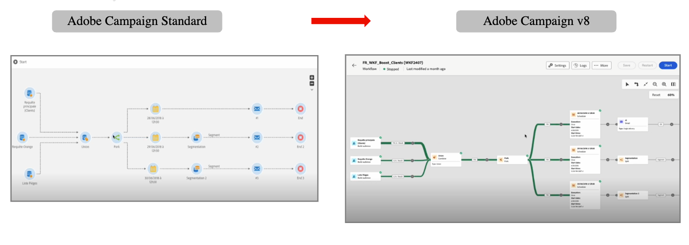

# Aan de slag voor marketers {#acs-gs-marketers}

Deze handleiding geeft een overzicht van de belangrijkste functies van Campaign v8, voor marketers die van Campaign Standard overstappen op Campaign v8.

U hebt toegang tot Adobe Campaign v8 via de clientconsole of de webgebruikersinterface. Met de webinterface kunt u belangrijke marketingacties maken, beheren en uitvoeren. De nieuwe Adobe Campaign Web-interface biedt een moderne en intuïtieve gebruikerservaring om het ontwerpen en leveren van marketingcampagnes te vereenvoudigen. Meer informatie vindt u in deze sectie. [Meer informatie](../../v8/get-started/user-interface.md).

Met de migratie worden al uw gegevens uit Campaign Standard geïmporteerd in Campaign v8, zodat u een soepele overgang hebt met minimale onderbreking van uw huidige bewerkingen.

U kunt uw bestaande aanmeldingsgegevens blijven gebruiken om u aan te melden en verbinding te maken met uw nieuwe Adobe Campaign v8-exemplaar. Nadat u zich hebt aangemeld, kunt u al uw profielen en workflows vinden die worden gemigreerd, zodat u aan uw campagnes kunt blijven werken.

Het belangrijkste verschil is in de gebruikersinterface. Onder een vergelijking van het zelfde werkschema in de 2 interfaces:

{zoomable="yes"}

>[!NOTE]
> De gebruikersinterfaceversies van het Web van Adobe Campaign werken op een ononderbroken leveringsmodel, dat voor een scalable, gefaseerde benadering van eigenschapplaatsing toestaat. Gelieve te controleren de [ Nota&#39;s van de Versie ](../../v8/rn/release-notes.md) regelmatig voor de recentste updates.

## De webgebruikersinterface van de campagne ontdekken {#acs-gs-marketers-ui}

In de video hieronder, leer om tot het Web van de Campagne toegang te hebben en te navigeren gebruikersinterface en hoe te om de inventarislijsten aan te passen.

>[!VIDEO](https://video.tv.adobe.com/v/3427278?quality=12&learn=on){transcript=true}

Raadpleeg de onderstaande documentatie voor meer informatie:

1. [De gebruikersinterface van het Web van de Campagne ontdekken](../../v8/get-started/user-interface.md)

1. [Lijsten zoeken en filteren](../../v8/get-started/list-filters.md)

## Profielen en soorten publiek maken en beheren {#acs-gs-marketers-profiles-and-audiences}

De algemene concepten voor het maken en beheren van profielen en soorten publiek in Campaign v8 zijn dezelfde als in Adobe Campaign Standard. Leer hoe te met profielen en publiek in [ te beginnen deze sectie ](../../v8/audience/gs-audiences-recipients.md).

Hieronder vindt u enkele handige koppelingen waarmee u kunt beginnen.

### Profielen beheren {#acs-gs-marketers-profiles}

In Adobe Campaign is een profiel een record die is opgeslagen in de database en die fungeert als een sleutelcomponent om een publiek te maken voor leveringen en om aanpassingsgegevens toe te voegen aan uw inhoud.

1. Leer om tot profielen toegang te hebben, te beheren en te onderzoeken gebruikend het Web van de Campagne gebruikersinterface in deze video:

   >[!VIDEO](https://video.tv.adobe.com/v/3427293?quality=12&learn=on){transcript=true}

   Leer meer in [ worden begonnen met de documentatie van Profielen ](../../v8/audience/about-recipients.md).

1. Leer om testprofielen ](../../v8/audience/test-profiles.md) in Campagne v8 te creëren en te beheren.[

### Soorten publiek beheren {#acs-gs-marketers-audiences}

Soorten publiek zijn groepen profielen met vergelijkbare gedragingen en/of kenmerken. Deze verzameling personen kan worden gegenereerd, geselecteerd of geladen. Als het publiek eenmaal is gemaakt, kan het worden gebruikt als doelgroep voor uw leveringen.

Leer om publiek te bouwen en te beheren, hoe te om publiek voor een levering te selecteren, en controlegroepen te bepalen, in deze video:

>[!VIDEO](https://video.tv.adobe.com/v/3425861?quality=12&learn=on){transcript=true}

Verwijs naar [ worden begonnen met Soorten publiek ](../../v8/audience/manage-audience.md){target="_blank"} voor meer informatie.

Zoals in Campaign Standard, kunt u een controlegroep aan uw levering toevoegen. U kunt een controlegroep bepalen vermijden verzendend berichten naar een gedeelte van uw publiek, en post-levering gedrag met het belangrijkste doel vergelijken. Met deze optie kunt u de impact van uw campagne meten.
Leer hoe te [ om een controlegroep ](../../v8/audience/control-group.md){target="_blank"} te plaatsen.

>[!AVAILABILITY]
>
>* Alle publiek dat via de activiteit van de Vraag van het Campaign Standard wordt gecreeerd wordt omgezet in vooraf bepaald filter in Campagne v8 tijdens overgang. Campagne v8 ondersteunt ook de zoekactie.
>
>* Lees publiek wordt omgezet in de activiteit van de Vraag met [ vooraf bepaalde filter ](../../v8/query/build-query.md)
>
>* Met het vooraf gedefinieerde filter hebt u alleen de nieuwste waarde na de migratie van het publiek naar Campagne v8.
>
>* Bestandstypen in Campaign Standard worden gemigreerd als List-type zonder afmetingen.

### Lidmaatschappen beheren {#acs-gs-marketers-sub}

U kunt uw services, zoals nieuwsbrieven, beheren en maken en de abonnementen op of het afmelden van deze services controleren. De belangrijkste stappen zijn globaal hetzelfde als in Campaign Standard. Meer informatie vindt u op de volgende pagina&#39;s:

<table style="table-layout:fixed"><tr style="border: 0;">
<td>

<a href="https://experienceleague.adobe.com/en/docs/campaign-web/v8/audiences/work-with-services/manage-services"><strong> creeer de abonnementsdiensten </strong></a>

</td>
<td>

<a href="https://experienceleague.adobe.com/en/docs/campaign-web/v8/audiences/work-with-services/manage-subscribers"><strong> beheer abonnees <strong></strong></a>

</td>
<td>

<a href="https://experienceleague.adobe.com/en/docs/campaign-web/v8/msg/send-to-subscribers"><strong> verzendt berichten naar de abonnees van de dienst </strong></a>

</td>
</tr>
</table>

## Punten, programma&#39;s en campagnes gebruiken {#acs-gs-marketers-plans}

Met Adobe Campaign v8 kunt u uw maphiërarchie configureren voor marketingplannen en -programma&#39;s. De mogelijkheden voor plannen, programma&#39;s en campagnes zijn vergelijkbaar met de campagnestandaard en met Campagne v8.

Leer meer in de [ documentatie van Plannen en van programma&#39;s ](../../v8/administration/plans-programs.md).

Hieronder vindt u nuttige koppelingen waarmee u kunt beginnen. Wijzigingen die van invloed kunnen zijn op uw gebruikerservaring, worden gemarkeerd in de opmerkingen bij Beschikbaarheid.

### Een campagne maken {#acs-gs-marketers-campaign}

Met Adobe Campaign kunt u uw gerichte marketinginitiatieven eenvoudig organiseren met behulp van de ingebouwde mogelijkheden voor campagnemanagement. Met de mogelijkheid om een planning te definiëren, kunt u de duur en het tijdstip van uw campagnes zodanig plannen dat deze in overeenstemming zijn met strategische doelstellingen en de betrokkenheid van het publiek maximaliseren.

Volg de onderstaande documentatie voor meer informatie over campagnes:

1. [Aan de slag met campagnes](../../v8/campaigns/gs-campaigns.md)
1. [Toegang tot en beheer uw campagnes](../../v8/campaigns/manage-campaigns.md)
1. [Uw eerste campagne maken](../../v8/campaigns/create-campaigns.md)

### Een workflow maken {#acs-gs-marketers-wf}

De werkschemagebruikersinterface is volledig opnieuw voorgesteld in het gebruikersinterface van het Web van de Campagne om gebruik, configuratie, uitvoering, en het oplossen van problemen te vergemakkelijken. Zoals u reeds in Campaign Standard, met werkschema&#39;s ervaart, kunt u de volledige waaier van processen en taken organiseren, de snelheid en de schaal van elk aspect van uw marketing campagnes verbeteren, van het creëren van segmenten en het voorbereiden van berichten aan levering. Bovendien kunt u uw kanalen synchroon maken met één gebruiksvriendelijke interface voor het organiseren van campagnes.

Begrijp hoe werkstromen werken en hoe te om een het richten werkschema in deze video tot stand te brengen:

>[!VIDEO](https://video.tv.adobe.com/v/3425873?quality=12&learn=on){transcript=true}

Krijg meer details met de [ documentatie van de Werkstroom ](../../v8/workflows/gs-workflows.md).

De gebruikersinterface van het Web van Adobe Campaign kenmerkt een vraagmodel in werkschema&#39;s die het proces van het filtreren van het gegevensbestand vereenvoudigen dat op diverse criteria wordt gebaseerd. [ Leer meer over de vraagmodelaar ](../../v8/query/query-modeler-overview.md)

Om het doel en de functionaliteit van elke activiteit binnen uw werkschema te begrijpen, verkend de gedetailleerde informatie beschikbaar op [ werkschemaactiviteiten ](../../v8/workflows/activities/about-activities.md)

Maximaliseer de efficiency van uw werkschema door de [ Grafieken en beperkingen voor werkschema&#39;s ](../../v8/get-started/guardrails.md) te herzien.

>[!AVAILABILITY]
>
>* De uitvoerings [ geschiedenis en de logboeken van het werkschema ](../../v8/workflows/start-monitor-workflows.md#logs-tasks) zijn beschikbaar in Adobe Campaign v8.
>
>* Historische logboeken voor werkstromen die op uw instantie van het Campaign Standard worden uitgevoerd worden niet gemigreerd naar Campagne v8.
>
>* De organisatorische eenheden worden in kaart gebracht aan concept omslag voor afbeelding en het verzekeren van gelijkaardige toegangsbeheer.
>

## Leveringen maken en beheren {#acs-gs-marketers-deliveries}

Met het Gebruikersinterface van het Web van de Campagne, als teller, kunt u standalone leveringen van het **Leveringen** verlaten menu tot stand brengen, of leveringen in de context van een werkschema, inbegrepen of niet in een campagne tot stand brengen. De belangrijkste stappen worden gericht op uw vorige ervaring in Campaign Standard. Leer hoe te om een levering in de volgende sectie tot stand te brengen: [ de verwezenlijking van de Levering en beheersdocumentatie ](../../v8/msg/gs-deliveries.md).

Nuttige koppelingen:

* **de malplaatjes van de Levering** - voor een versneld en verbeterd ontwerpproces, kunt u leveringsmalplaatjes tot stand brengen om gemakkelijk douaneinhoud en montages over uw campagnes te hergebruiken. Deze functionaliteit laat u toe om de creatieve blik en het gevoel te standaardiseren, om sneller te zijn in het uitvoeren van en het lanceren van campagnes/leer meer in het [ malplaatje van de Levering ](../../v8/msg/delivery-template.md) pagina.

* **montages van de Levering** - de montages van de Levering zijn technische leveringsparameters die in het leveringsmalplaatje worden bepaald. Deze kunnen voor elke levering worden overbelast. Deze instellingen zijn beschikbaar via de knop Instellingen die beschikbaar is wanneer u een levering of een leveringssjabloon bewerkt. Leer meer in de [ montages van de Levering ](../../v8/advanced-settings/delivery-settings.md) sectie.

* **Dynamische inhoud** - de dynamische inhoudsmogelijkheden van het Web van Adobe Campaign staan u toe om uw inhoud aan te passen die op de informatie wordt gebaseerd u over uw ontvangers hebt verzameld. Door dynamische inhoud te gebruiken, zorgt u ervoor dat uw marketing inspanningen relevanter zijn, vermijdend marketing ongewenste of onnodige producten of de diensten. Leer meer in de [ Dynamische inhoud ](../../v8/personalization/gs-personalization.md) sectie.

* **Test en proeven** - Zodra uw leveringsinhoud is bepaald, kunt u profielen en testprofielen gebruiken om het te voorproef en te testen alvorens het bericht te verzenden. Deze stap is van cruciaal belang om ervoor te zorgen dat deze accuraat is, maar ook vrij van fouten in zowel de inhoud als de personalisatie-instellingen. Zie [ Voorproef en test ](../../v8/preview-test/preview-test.md).

* **Plannend** - u kunt de datum en de nauwkeurige tijd plaatsen om uw berichten te verzenden. Door de meest geschikte tijd voor uw marketingbericht te kiezen, kunt u de open tarieven maximaliseren.

   * Leer hoe te [ een stand-alone levering ](../../v8/msg/gs-deliveries.md#gs-schedule) plannen
   * Leer hoe te [ een levering in een werkschema ](../../v8/monitor/schedule-sending.md#schedule-a-delivery-in-a-campaign-workflow) plannen

* **ADD aanbiedingen** - u kunt aanbiedingen aan uw leveringen in het gebruikersinterface van het Web van Adobe Campaign toevoegen. Deze aanbiedingen zijn beschikbaar in het linkermenu Aanbiedingen, dat u toegang biedt tot de lijst met aanbiedingen.  Leer hoe te [ aanbiedingen aan uw berichten ](../../v8/msg/offers.md) toevoegen

>[!AVAILABILITY]
>
>* De leveringen in ontwerpstaat of eindstaat zijn gemigreerd.
>
>* Leveringen met een van de volgende status zijn gemigreerd naar Adobe Campaign v8, maar moeten opnieuw worden voorbereid: Bezig / Bezig / Geannuleerd / Opnieuw in uitvoering / Voorbereidingsfout.
>
>* Leveringen met een van de volgende status zijn gemigreerd als geannuleerde leveringen: Voor Geannuleerd/Opnieuw uitgevoerd.
>
>* Koppelingen bijhouden, URL-koppelingen voor spiegelpagina&#39;s en koppelingen voor abonnementen/abonnementen werken op dezelfde manier als in Campaign Standard.
>
>Zie ook de volgende secties: [ het Volgen en de Controle ](https://experienceleague.adobe.com/en/docs/campaign/campaign-v8/analytics/tracking) {target="_blank"}, [ het Branden ](https://experienceleague.adobe.com/en/docs/experience-cloud/campaign/branding/branding-gs) {target="_blank"} in Adobe Campaign.

### E-maillevering {#acs-gs-marketers-email}

Leer hoe u een geheel nieuwe e-maillevering maakt, het publiek definieert, de inhoud ontwerpt, voorvertoning simuleert en een proefdruk van deze video verzendt:

>[!VIDEO](https://video.tv.adobe.com/v/3425866?quality=12&learn=on){transcript=true}

Leer hoe te om uw eerste gerichte e-mail in te creëren [ creeer uw eerste e-maildocumentatie ](../../v8/email/create-email.md)

In Campagne v8 zijn de gedetailleerde stappen voor het maken, testen en verzenden van een e-maillevering vergelijkbaar met die in Campaign Standard.

1. **Ontwerp en bepaal inhoud**

   De Campagne v8 E-mailontwerper is vergelijkbaar met de campagne die beschikbaar is in Campaign Standard. Als herinnering, Campaign Standard [ erfenis e-mailredacteur werd afgekeurd ](https://experienceleague.adobe.com/en/docs/campaign-standard/using/release-notes/deprecated-features#deprecated-features) {target="_blank"} een paar jaar geleden. U had al moeten overstappen op Campagne-mail Designer om uw e-mailinhoud te maken en aan te passen.

   Begrijp hoe u door de Designer-e-mail kunt navigeren. In de volgende video ziet u hoe u een geheel nieuwe e-mail kunt structureren en ontwerpen, hoe u uw e-mail kunt personaliseren en testen:

   >[!VIDEO](https://video.tv.adobe.com/v/3425867?quality=12&learn=on){transcript=true}

   Met de e-mailtoepassing Designer kunt u fascinerende, individueel aangepaste e-mails maken via een intuïtieve drag-and-drop interface. Leer meer in de [ documentatie van Designer E-mail ](../../v8/email/get-started-email-designer.md)

   Leer hoe u een e-mail maakt door HTML te uploaden, hoe u deze compatibel maakt met de e-mail-Designer en hoe u deze kunt converteren naar een sjabloon in deze video:

   >[!VIDEO](https://video.tv.adobe.com/v/3427633?quality=12&learn=on){transcript=true}

   Een inhoudsfragment is een herbruikbare component waarnaar in een of meer berichten kan worden verwezen. Leer meer over [ fragmenten van de Inhoud ](../../v8/content/fragments.md) om de verwezenlijking van uw e-maillevering te vereenvoudigen.

   Voor een versneld en verbeterd ontwerpproces kunt u zelfstandige sjablonen maken om aangepaste inhoud in Adobe Campaign eenvoudig te hergebruiken. Zie [ E-mailmalplaatjes ](../../v8/email/create-email-templates.md) creëren

1. **Voorproef en test**

   In deze video ziet u hoe u een voorbeeld kunt weergeven van de inhoud en de persoonlijke weergave van e-mailberichten, testleveringen (proefdrukken) kunt verzenden en de rendering van e-mailberichten kunt controleren bij populaire desktops, mobiele en webclients:

   >[!VIDEO](https://video.tv.adobe.com/v/3425862?quality=12&learn=on){transcript=true}

1. **verzend e-mail en controlelogboeken**

   Wanneer u de inhoud, het publiek en het programma hebt gedefinieerd, kunt u de e-maillevering voorbereiden. Meer informatie vindt u in de volgende secties:

   * [Een e-mail voorbereiden en verzenden](../../v8/monitor/prepare-send.md)
   * [Leveringslogboeken controleren](../../v8/monitor/delivery-logs.md)

### Sms-levering {#acs-gs-marketers-sms}

De levering van SMS verstrekt een praktische en efficiënte manier om tekstberichten naar de mobiele apparaten van uw klanten te verzenden. Met deze functie kunt u op tekst gebaseerde berichten maken, personaliseren en voorvertonen voor effectieve communicatie.

In Campaign v8 zijn de gedetailleerde stappen voor het maken, testen en verzenden van een SMS-levering vergelijkbaar met Campaign Standard.

<table style="table-layout:fixed"><tr style="border: 0;">
<td>

<a href="https://experienceleague.adobe.com/en/docs/campaign-web/v8/msg/sms/create-sms"><strong> creeer een levering van SMS </strong>

</td>
<td>

<a href="https://experienceleague.adobe.com/en/docs/campaign-web/v8/msg/sms/content-sms"><strong> Ontwerp en levering van SMS <strong></strong></a>

</td>
<td>

<a href="https://experienceleague.adobe.com/en/docs/campaign-web/v8/msg/sms/send-sms"><strong> Voorproef en verzend een levering van SMS </strong></a>

</td>
</tr></table>

### Pushmeldingen {#acs-gs-marketers-push}

Pushberichten zijn essentieel voor het bereiken van een mobiele app-gebruiker, zelfs als deze uw app niet actief gebruikt. Zij dienen diverse doeleinden zoals het verstrekken van updates, het drijven van specifieke acties, en het op de hoogte brengen van overeenkomsten.

In Campagne v8 zijn de gedetailleerde stappen voor het maken, testen en verzenden van een pushmelding vergelijkbaar met die in het Campaign Standard.

<table style="table-layout:fixed"><tr style="border: 0;">
<td>

<a href="https://experienceleague.adobe.com/en/docs/campaign-web/v8/msg/push/create-push"><strong> creeer een duplevering </strong>

</td>
<td>

<a href="https://experienceleague.adobe.com/en/docs/campaign-web/v8/msg/push/content-push"><strong> Ontwerp een duplevering <strong></strong></a>

</td>
<td>

<a href="https://experienceleague.adobe.com/en/docs/campaign-web/v8/msg/push/send-push"><strong> Voorproef en verzend een duwlevering </strong></a>

</tr></table>

>[!AVAILABILITY]
>
>* Adobe Campaign v8 ondersteunt zowel Android als iOS Push Channel. Maak verbinding met uw Adobe Campaign Transition Manager voor het overstappen van bestaande workflows en leveringen met Push Channel. Leer meer op [ Opstelling van het Kanaal ](https://experienceleague.adobe.com/en/docs/campaign/campaign-v8/send/push/push-data-collection) {target="_blank"}.
>
>* Merk op dat SDK V4 voor mobiele toepassingen [ verouderd in Campaign Standard ](https://experienceleague.adobe.com/en/docs/campaign-standard/using/release-notes/deprecated-features#deprecated-features) was {target="_blank"} een paar jaar geleden. U had al moeten overgaan op SDK van Adobe Experience Platform, die het zelfde in Campaign v8 wordt gebruikt.
> 

### Direct mail {#acs-gs-marketers-direct-mail}

Directe post is een off-line kanaal dat u toestaat om dossiers aan massa te veroorzaken die gepersonaliseerde brieven aan uw klanten zoals postcards, vliegers, of catalogi leveren. Bij het maken van een directe postbestelling genereert Adobe Campaign automatisch een extractiebestand dat alle doelprofielen en geselecteerde gegevens bevat, zoals postadressen en profielkenmerken.

In Campagne v8 zijn de gedetailleerde stappen voor het maken, testen en verzenden van een directe postbezorging vergelijkbaar met die in Campaign Standard.

1. [Direct-maillevering maken](../../v8/direct-mail/create-direct-mail.md)
1. [ bepaalt het extractiedossier ](../../v8/direct-mail/content-direct-mail.md)
1. [Voorvertonen en verzenden](../../v8/direct-mail/send-direct-mail.md)

### Kanaal in app {#acs-gs-marketers-in-app}

Het kanaal in de app is niet beschikbaar in Campagne v8. Als u meldingen in de app moet verzenden, neemt u contact op met uw vertegenwoordiger van de Adobe.

## Landingspagina&#39;s maken en beheren {#acs-gs-marketers-lp}

De Adobe Campaign v8-webgebruikersinterface wordt geleverd met een nieuwe gebruikerservaring voor het landen van pagina&#39;s. Met campagnes kunt u bestemmingspagina&#39;s maken, ontwerpen en delen. Met bestemmingspagina&#39;s kunt u uw gebruikers naar onlineformulieren sturen waar zij hun gegevens kunnen bijwerken, uw communicatie kunnen in- of uitschakelen of zich op een specifieke service zoals een nieuwsbrief kunnen abonneren.

Als gebruiker van het Campaign Standard die naar Campaign v8 overgaat, zijn uw bestaande landingspagina&#39;s gemigreerd naar de gebruikersinterface van het Web van de Campagne. U kunt tot de zelfde waaier van mogelijkheden toegang hebben.

Meer informatie over bestemmingspagina&#39;s vindt u in de volgende secties:

<table style="table-layout:fixed"><tr style="border: 0;">
<td>

<a href="https://experienceleague.adobe.com/en/docs/campaign-web/v8/landing-pages/create-lp"><strong> creeer het landen pagina's </strong>

</td>
<td>

<a href="https://experienceleague.adobe.com/en/docs/campaign-web/v8/landing-pages/lp-content"><strong> Ontwerpen die pagina's </strong></a> landen

</td>
<td>

<a href="https://experienceleague.adobe.com/en/docs/campaign-web/v8/landing-pages/lp-templates"><strong> Werk met het landen paginasjablonen </strong></a>

</td>
</tr></table>

## Rapportage {#acs-gs-marketers-reporting}

Adobe Campaign verstrekt een reeks [ rapporterend hulpmiddelen ](https://experienceleague.adobe.com/en/docs/campaign/campaign-v8/analytics/reports/gs-reporting) {target="_blank"}. Als beheerder, kunt u rapporten tot stand brengen en vormen om met andere gebruikers van de Campagne te delen.

De Adobe Campaign-suite met rapportagetools biedt waardevolle inzichten in de effectiviteit van uw marketingactiviteiten, zodat u uw campagnes kunt optimaliseren voor maximale impact. Leer meer in de [ Rapporterende documentatie ](../../v8/reporting/gs-reports.md).

Bovendien is, in overeenstemming met de ervaring van Adobe Campaign Standard, de Dynamic Reporting beschikbaar voor u in Campagne v8, voor uw e-mailleveringen. Het verstrekt volledig klantgerichte en real-time rapporten om de invloed van uw marketing activiteiten te meten. Het voegt toegang tot profielgegevens toe, toelatend demografische analyse door profieldimensies zoals geslacht, stad en leeftijd naast functionele e-mailcampagnegegevens zoals opent en klikt. Leer meer in de [ Dynamische het melden documentatie ](https://experienceleague.adobe.com/en/docs/experience-cloud/campaign/reporting/get-started-reporting) {target="_blank"}

>[!AVAILABILITY]
>
>* [ Dynamische rapportering ](https://experienceleague.adobe.com/en/docs/experience-cloud/campaign/reporting/get-started-reporting) {target="_blank"} kan voor het melden van e-mailleveringen, campagne met e-mailleveringen en transactionele berichten worden gebruikt. Er is ook demografische analyse per profieldimensie beschikbaar.
>
> * [ het gebruikersinterface melden van het Web van Adobe Campaign ](../../v8/reporting/campaign-reports.md) is ook beschikbaar voor alle gebruikersovergang van Adobe Campaign Standard aan Adobe Campaign v8.

Adobe Campaign biedt drie verschillende rapporten:

<table style="table-layout:fixed"><tr style="border: 0;">
<td>

<a href="https://experienceleague.adobe.com/en/docs/campaign-web/v8/reports/campaign-report/campaign-reports"><strong> de rapporten van de Campagne </strong></a>

Geef gedetailleerde informatie over de prestaties, effectiviteit en resultaten van uw afzonderlijke leveringen, zodat u een uitgebreid overzicht krijgt.

</td>
<td>

<a href="https://experienceleague.adobe.com/en/docs/campaign-web/v8/reports/delivery-report/delivery-reports"><strong>Leveringsrapporten</strong>

Biedt een grondige analyse van de prestaties van elke levering, per kanaal: succespercentages, betrokkenheid van het publiek en andere essentiële maatstaven. Hiermee kunt u de algehele doeltreffendheid en impact van uw campagne evalueren.

</td>
<td>

<a href="https://experienceleague.adobe.com/en/docs/campaign-web/v8/reports/global-report/global-reports"><strong> Algemene rapporten </strong></a>

Bied een geconsolideerde algemene samenvatting van verkeers- en betrokkenheidsmetriek aan voor elk kanaal binnen uw instantie Campagne. Deze rapporten bestaan uit verschillende widgets, die elk een duidelijk perspectief bieden op uw campagne of leveringsprestaties.

</td>
</tr>
</table>
