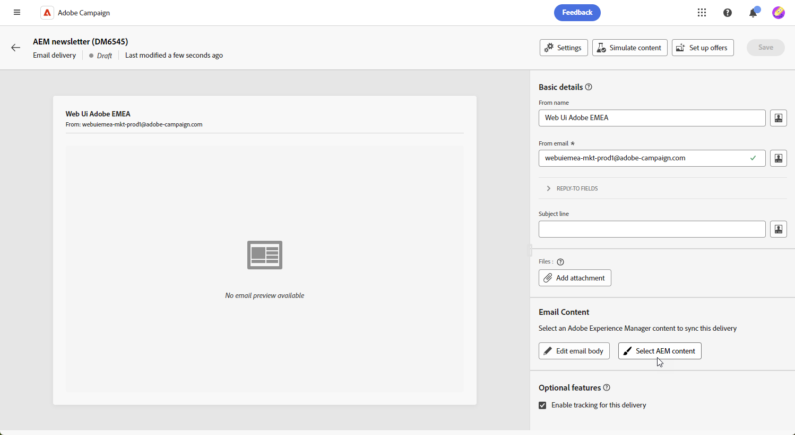

# Van Campaign Standard naar v8 {#ac-acs}

Welkom bij Adobe Campaign v8!

Deze naslaggids is ontworpen voor u als een gebruiker die van Campaign Standard overschakelt naar Campaign v8. Het helpt u zich met uw nieuwe milieu van de Campagne vertrouwd te maken en u door de stappen te lopen die worden vereist om aan de slag te gaan voor uw rol.

1. Begin door [ te leren wat op Adobe Campaign v8 ](#new) nieuw is.

1. Daarna begrijp [ de ervaringsverschillen tussen Adobe Campaign Standard en Adobe Campaign v8 volgens uw rol ](#experiences).

## Nieuwe functies {#new}

Bekijk een glimp van de nieuwste verbeteringen in de Adobe Campaign Web-gebruikersinterface op deze pagina. Voor een uitvoerige lijst van zeer belangrijke mogelijkheden en versie werkt eigenschappen bij, controleer [ deze sectie ](../../v8/rn/whats-new.md).

### Verbeteringen met campagne v8 {#ac-enhancements}

Belangrijke verbeteringen die beschikbaar zijn bij Adobe Campaign v8 worden hieronder weergegeven.

* **Gebruikersinterface van het Web**

  Adobe Campaign v8 biedt zowel een clientconsole als een gebruikersinterface voor het web, en biedt verschillende gebruikersvoorkeuren en -behoeften. De clientconsole biedt een krachtige ervaring met bureaubladtoepassingen, terwijl de webgebruikersinterface intuïtief en toegankelijk is, waardoor deze een ideale keuze is voor marketers die vertrouwd zijn met Adobe Campaign Standard.

  De webgebruikersinterface heeft veel gelijkenissen met Adobe Campaign Standard, hoewel sommige terminologie anders kan zijn.

  U kunt [ meer over het Gebruikersinterface van het Web van Adobe Campaign hier ](../../v8/campaign-web-home.md) leren.

  {zoomable="yes"}

  Alle nieuwe mogelijkheden en verbeteringen worden vermeld in de [ Nota&#39;s van de Versie ](../../v8/rn/release-notes.md). De gebruikersinterfaceversies van het Web van Adobe Campaign werken op een ononderbroken leveringsmodel dat voor een scalable, gefaseerde benadering van eigenschapplaatsing toestaat. Deze releaseopmerkingen worden daarom meerdere keren per maand bijgewerkt. Controleer ze regelmatig.

* **Prestaties**

  Adobe Campaign v8 profiteert van geavanceerde databasetechnologieën op cloudschaal, wat resulteert in aanzienlijk betere prestaties en efficiëntie. Deze herontworpen architectuur biedt verschillende belangrijke voordelen:

   * *Schaal*: Het systeem steunt nu een aanzienlijke verhoging in verwerkingsmogelijkheden, met batch verwerkingproductie die tot **20 miljoen verrichtingen per uur** bereikt. Met deze nieuwe architectuur, kunnen zelfs de hogere profielen met voorspelbare prestaties worden beheerd.
   * *Snelheid*: Het systeem is verbeterd voor om het even welke marketing activiteit: segmentatie, leveringsvoorbereiding, of productie voor transactionele berichten die nu **1 miljoen per uur** is.

  De volledig beheerde wolkendiensten verstrekt gebruiker van:

   * Realtime gegevensexploratie: Onmiddellijk toegang tot en analyse van gegevens voor snelle inzichten en beter geïnformeerde besluitvorming.

   * Snel publiek opbouwen: maak binnen enkele minuten gemakkelijk een doelpubliek voor efficiëntere campagnesegment.

  Over het algemeen biedt de robuuste architectuur van Adobe Campaign v8 een krachtige basis voor het beheren van uitgebreide en complexe marketingcampagnes met verbeterde snelheid en efficiëntie.

### Nieuwe functies in Adobe Campaign v8 {#ac-new-features}

Als Campaign Standard-gebruiker die overschakelt naar Adobe Campaign v8, beschikt u nu over de volgende functies:

* **Rijke duw**

  Adobe Campaign v8 biedt de mogelijkheid om uitgebreide pushberichten te verzenden, die de aandacht van gebruikers kunnen trekken en hen kunnen aanmoedigen om actie te ondernemen. Deze meldingen kunnen verschillende elementen bevatten, zoals tekst, afbeeldingen, knoppen, aftellingstijden, geluiden, enzovoort.

  {zoomable="yes"}

  Adobe Campaign v8 biedt diverse sjablonen waarmee u complexe meldingen, zoals carrousels of timers, kunt ontwerpen en aanpassen, zodat u deze meldingen eenvoudiger kunt maken.

  U kunt uw meldingen op maat maken op basis van het systeem van de klant:

   * Voor [ Android ](../../v8/push/rich-push.md) malplaatjes

   * Voor [ iOS ](../../v8/push/rich-push.md) malplaatjes

  Pushmeldingen zijn een cruciaal hulpmiddel voor het engageren van gebruikers van mobiele apps, zodat u ze ook kunt bereiken wanneer ze uw app niet actief gebruiken.

* **Adobe Experience Manager as a Cloud Service**

  Adobe Campaign v8 is naadloos geïntegreerd met Adobe Experience Manager as a Cloud Service, waardoor u uw klanten meer mogelijkheden biedt om persoonlijke en inhoudrijke ervaringen te bieden. Deze native integratie stroomlijnt het inhoudsbeheer en maakt gebruik van robuuste Adobe Experience Manager-mogelijkheden om uw marketinginspanningen te optimaliseren.

  Hier volgen de belangrijkste functies die door deze integratie worden ingeschakeld:

   * *Beheer van Activa*: Binnen Adobe Campaign v8, verstrekt de e-mailontwerper een plukker om tot activa toegang te hebben en te beheren. Deze functie vereenvoudigt de integratie van elementen van Adobe Experience Manager in uw levering, waardoor contentbeheer efficiënter wordt. [ Leer meer over het beheer van Activa ](../../v8/integrations/aem-assets.md)

     {zoomable="yes"}

   * *E-mailmalplaatjeinvoer*: Adobe Campaign v8 laat u toe om e-mailmalplaatjes van Adobe Experience Manager direct in Campagne te doorbladeren en in te voeren. [ Leer meer over de invoer van het E-mailmalplaatje ](../../v8/integrations/aem-content.md)

     {zoomable="yes"}

  Adobe Experience Manager as a Cloud Service biedt cloudinemotionele flexibiliteit, zodat u uw tijd voor waarde kunt versnellen en zich kunt aanpassen aan veranderende bedrijfsbehoeften. Deze integratie verbetert niet alleen uw mogelijkheden voor contentbeheer, maar stelt u ook in staat om meer persoonlijke en boeiende ervaringen aan uw klanten te bieden op alle aanraakpunten.

* **AI Medewerker**

  Met Campaign AI Assistant kunt u marketingcampagnes op verschillende kanalen, zoals e-mail, SMS en Push, intuïtief, eenvoudig en probleemloos maken en tegelijk tijd besparen, de efficiëntie verbeteren en betere resultaten behalen.

  {zoomable="yes"}

  In de AI-assistent wordt een revolutie teweeggebracht in de manier waarop u professionele en merkconsistente inhoud maakt op verschillende kanalen. Met geavanceerde GenAI-modellen en een goed begrip van uw merkrichtlijnen genereert AI Assistant automatisch persoonlijke, aantrekkelijke en effectieve inhoud op basis van het marketingdoel, met inhoud die is geoptimaliseerd voor stijlen, lay-outs, kleurtinten en nog veel meer met een merk.

  AI Assistant maakt het maken en uitvoeren van marketingcampagnes intuïtief, eenvoudig en probleemloos terwijl u tijd bespaart, de efficiëntie verbetert en betere resultaten behaalt.

  {zoomable="yes"}

  Het verstrekt varianten van e-mailmalplaatjes en produceert en regenereert beelden. Leer meer over AI Medewerker in [ deze sectie ](../../v8/email/generative-content.md). Adobe Campaign v8 heeft AI hulp beschikbaar voor [ E-mail ](../../v8/email/generative-content.md), [ SMS ](../../v8/email/generative-sms.md), en [ Duw ](../../v8/email/generative-push.md).

* **Verbeterde infrastructuur van SMS - SMS v2.0**

  De eenvoud en het gemak van het gebruik van SMS maken het een zeer waardevol communicatiekanaal naast zijn robuustheid en ongeëvenaarde verenigbaarheid over miljarden terminals.

  Adobe Campaign v8 wordt geleverd met een nieuwe infrastructuur die de verzending van SMS verbetert. [ leer meer over nieuwe montages van SMS ](https://experienceleague.adobe.com/en/docs/campaign/campaign-v8/send/sms/sms){target="_blank"}.

* **Verbeterde infrastructuur van de Duw**

  Adobe Campaign v8 introduceert onze nieuwste Push notification service, aangedreven door een robuust raamwerk dat is gebaseerd op een moderne, geavanceerde technologie. Deze service is ontworpen om nieuwe schaalbaarheidsniveaus te ontgrendelen, zodat uw meldingen een groter publiek met naadloze efficiëntie kunnen bereiken. Met onze verbeterde infrastructuur en geoptimaliseerde processen kunt u een hogere schaal en betrouwbaarheid verwachten, zodat u uw mobiele App-gebruikers net als nooit tevoren kunt gebruiken en er verbinding mee kunt maken.

  [ Leer meer over de Verbeterde infrastructuur van de Duw ](https://experienceleague.adobe.com/en/docs/campaign/campaign-v8/send/push/push-data-collection){target="_blank"}.

## Managed Services {#ac-managed-services}

Adobe Campaign v8 is beschikbaar als een beheerde Cloud Service die proactief toezicht, tijdige waarschuwingen en servicecontrole biedt. Adobe Managed Cloud Service biedt marketers een flexibelere, veiligere en schaalbaardere oplossing voor campagnebeheer over meerdere kanalen met lage totale eigendomskosten. Het nieuwe aanbod combineert services met proactief toezicht en tijdige waarschuwing.

## Campaign Standard-mogelijkheden toegevoegd aan v8 {#ac-v8-added}

Voor een vloeiende overgang naar Campagne v8 zijn de belangrijkste Campaign Standard-mogelijkheden toegevoegd aan Campagne v8. Zij zijn gedetailleerd in [ deze documentatie ](https://experienceleague.adobe.com/docs/experience-cloud/campaign/campaign-standard-migration-home.html){target="_blank"}.

* **Dynamische Rapportering**: De dynamische Rapportering verstrekt volledig klantgerichte en real time rapporten om het effect van uw marketing activiteiten te meten. Het voegt toegang tot profielgegevens toe, toelatend demografische analyse door profieldimensies zoals geslacht, stad en leeftijd naast functionele e-mailcampagnegegevens zoals opent en klikt. [Meer informatie](https://experienceleague.adobe.com/docs/experience-cloud/campaign/reporting/get-started-reporting.html){target="_blank"}.

* **Gecentraliseerde branding**: Elk bedrijf heeft merk visuele en technische richtlijnen. Met Adobe Campaign kunt u een reeks specificaties definiëren om uw klanten een consistent merk te bieden, van logo&#39;s tot technische aspecten, zoals e-mailzender, URL of domeinen. [Meer informatie](https://experienceleague.adobe.com/docs/experience-cloud/campaign/branding/branding-gs.html)

* **Rest APIs** - als Gegigreerde gebruiker van de Stard van de Campagne, kunt u Rest APIs gebruiken om integratie voor Adobe Campaign tot stand te brengen en uw eigen ecosysteem te bouwen door Adobe Campaign met het paneel van technologieën te verbinden die u gebruikt. [Meer informatie](https://experienceleague.adobe.com/docs/experience-cloud/campaign/apis/get-started-apis.html){target="_blank"}.

* **het Aanvoeren pagina&#39;s** - Sommige verbeteringen zijn gebracht aan het Aanvoeren van de Campagne v8 pagina&#39;s om eigenschappariteit met Campaign Standard te verzekeren. Leer meer in de [ versienota&#39;s ](../../v8/rn/release-notes.md#new-24-4) en de het landen pagina [ documentatie ](../../v8/landing-pages/get-started-lp.md).

* **Visuele fragmenten** - de Visuele fragmenten zijn herbruikbare visuele componenten die in één of meerdere e-mailleveringen of in inhoudsmalplaatjes kunnen worden van verwijzingen voorzien. Wanneer u een fragment wijzigt, wordt alle inhoud die het fragment gebruikt, bijgewerkt. Met deze functionaliteit kunt u meerdere blokken met aangepaste inhoud samenstellen die marketinggebruikers kunnen gebruiken om snel inhoud van berichten samen te stellen in een verbeterd ontwerpproces. [Meer informatie](../../v8//content/use-visual-fragments.md)

## Belangrijkste verschillen tussen Campaign Standard en Campagne v8 {#experiences}

De meeste concepten zijn vergelijkbaar tussen Adobe Campaign v8 en Adobe Campaign Standard. Er zijn echter enkele verschillen, zoals hieronder beschreven.

### Wijzigingen in terminologie {#terminology-changes}

Hieronder ziet u enkele terminologische verschillen tussen Campaign Standard en Campaign v8.

* De middelen van de douane zijn **Schema&#39;s**
* De berichten worden bedoeld als **Leveringen**
* De gebruikers van het product zijn **Operatoren**
* De rollen worden gevormd met **Genoemde Rechten**
* De Groepen van de veiligheid zijn **Groepen van de Exploitant**
* De organisatorische eenheden worden beheerd door **Toestemmingen van de Omslag**

Houd er als bestaande campagnegebruiker ook rekening mee dat de naam van sommige concepten is gewijzigd en is afgestemd op de meest recente terminologienormen. Deze veranderingen zijn slechts op het gebruikersinterface van het Web van de Campagne van toepassing en niet weerspiegeld in de cliëntconsole. Deze worden hieronder samengevat.

* Ontvangers zijn nu **Profielen**. [Meer informatie](../../v8/audience/gs-audiences-recipients.md).
* De adressen van het zaad zijn nu **profielen van de Test**. [Meer informatie](../../v8/preview-test/test-deliveries.md).
* De analyse van de levering is nu de **leveringsvoorbereiding**. Wanneer u de berichtvoorbereiding moet lanceren, klik **voorbereidingen treffen** knoop. [Meer informatie](../../v8/monitor/prepare-send.md).
* De e-mailVoorproef is nu beschikbaar door de **Simulate inhoud** knoop. [Meer informatie](../../v8/preview-test/preview-test.md)
* De lijsten zijn nu **Soorten publiek**. [Meer informatie](../../v8/audience/gs-audiences-recipients.md).

## Nieuwe gebruikerservaring

Toegang tot de relevante naslaggids voor uw rol om de nieuwe gebruikerservaring met Adobe Campaign v8 te ontdekken.

<table>
<tr>
  <td>
    
    

  </td>
  <td>
  
    

  </td>
  </tr>
  <tr>
    <td>
    <a href="marketers.md">
    <strong> Marketer </strong>
    </a>
    </td>
    <td>
      <a href="admin-developers.md">
      <strong> Beheerder of Ontwikkelaar </strong>
      </a>
    </td>
  </tr>
    <td>
    <em> Manager van de Campagne, de Specialist van de Marketing van Media </em>
    </td>
    <td>
      <em> Systeembeheerder, Specialist voor technische marketing </em>
    </td>
  <tr>
    <td>
    <b> Zeer belangrijke taken/verantwoordelijkheden omvatten:</b>
    </td>
      <td>
    <b> Zeer belangrijke taken/verantwoordelijkheden omvatten:</b>
    </td>
  </tr>
  <tr>
    <td>
      <li>Marketingscampagnes maken
      <li>Workflows ontwerpen
      <li>Campagnes testen en uitvoeren
      <li>Multikanaalcampagnes implementeren
      <li>Campagnes optimaliseren
      <li>Geautomatiseerde campagnes optimaliseren
    </td>
    <td>
        <li>Toegangsbeheer
        <li>Systeemconfiguratie
        <li>Systeemaanpassing
    </td>
</tr>
</table>

<!--
## Deprecated items

Adobe constantly evaluates product capabilities to identify older features that should be replaced with more modern alternatives to improve overall customer value, always under careful consideration of backward compatibility.

Please refer to [this documentation for information on deprecated items](https://experienceleague.adobe.com/en/docs/campaign-standard/using/release-notes/deprecated-features).-->
