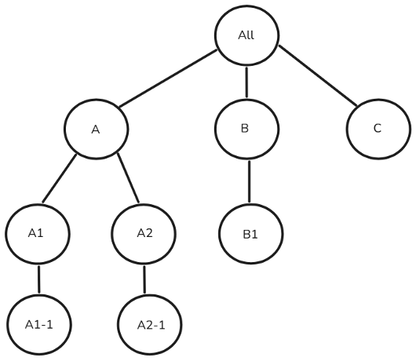

# Toegangsbeheer van gebruikers van Campaign Standard naar Campagne v8 {#user-management-acs}

Zowel Adobe Campaign Standard als Adobe Campaign v8 stellen gebruikers in staat machtigingen voor verschillende gebruikers/operatoren te definiëren en te beheren. Deze toestemmingen bestaan uit specifieke rechten die gebruikers toegang tot diverse eigenschappen van het product verlenen. Nochtans, gebruiken de twee producten verschillende benaderingen en implementaties voor het beheren van gebruikerstoegang.

De volgende concepten worden gebruikt in Adobe Campaign Standard en Campagne v8 om tot beheer van gebruikerstoegang te komen:

| Campaign Standard | Campaign v8 |
|---------|----------|
| Gebruiker | Operator |
| Rol | Benoemd rechts |
| Beveiligingsgroep | Operator Group |
| Organisatorische eenheid | Mapmachtiging |

## Migratiebenadering van de groep van de Veiligheid aan de groep van de Exploitant

>[!IMPORTANT]
>
>De mogelijkheden van deze rollen/Benoemde rechten kunnen in implementatie variëren, wat machtigingsproblemen kan veroorzaken (bijvoorbeeld verhoging van bevoegdheden of functieonderbrekingen). Wij adviseren gebruikers om deze afbeeldingen na de overgang te herzien om behoorlijk toegangsbeheer te verzekeren. [ leer meer over toestemmingen ](https://experienceleague.adobe.com/en/docs/campaign/campaign-v8/admin/permissions/manage-permissions)

De onderstaande tabel geeft een overzicht van de migratiebenadering voor gebruikersrolgroepen bij de overgang van Adobe Campaign Standard naar Campagne v8. In Campaign Standard, wordt de groep van de a **Veiligheid**, die als **wordt bedoeld groep van de Exploitant** in Campagne v8, gebruikt om een reeks rollen aan een gebruiker toe te wijzen. Terwijl sommige veiligheidsgroepen/exploitantgroepen uit-van-de-doos beschikbaar zijn, kunnen de gebruikers nieuwe groepen tot stand brengen of bestaande te wijzigen indien nodig.

| | **Campaign Standard** | **Campaign v8** |
|---------|----------|---------|
| **Terminologie**  | Beveiligingsgroep | Operator Group |

In zowel Adobe Campaign Standard als Campagne v8, **de groepen van de Veiligheid** en **groepen van de Exploitant** worden in kaart gebracht aan de profielen van het Product in de console Admin. Als u de groep van de a **Veiligheid** of **Exploitant** aan een gebruiker wilt toewijzen, kunt u het overeenkomstige **profiel van het Product** in de console Admin verbinden. Deze koppeling wordt gesynchroniseerd wanneer de gebruiker zich aanmeldt. [ leer meer over het profiel van het Product ](https://experienceleague.adobe.com/en/docs/campaign/campaign-v8/admin/permissions/manage-permissions)

| **de groep van de Veiligheid van Campaign Standard** | **de groep van de Exploitant van de Campagne v8** |
|----------|---------|
| Beheerders | Beheerders |
| Afleveringstoezichthouders | Beheerders |
| Workflowsupervisors | Workflowsupervisors  |

## Migratiebenadering van gebruikersrollen naar benoemde rechten

>[!IMPORTANT]
>
>Tijdens migratie van Adobe Campaign Standard aan Campagne v8, zullen de gebruikers met de **rol van het 0} Model van Gegevens maar niet** Beleid **automatisch** toegang van het Beleid **krijgen, aangezien de schemaverwezenlijking in Campagne v8 beleidsrechten vereist.** Om dit te verhinderen, verwijder hun **rol van het 0} Model van Gegevens {vóór migratie.**

In Adobe Campaign Standard, wordt de termijn **rol van de Gebruiker** bedoeld als **Genoemd recht** in Campagne v8. De lijst beschrijft hieronder de terminologie die voor **wordt gebruikt Genoemde rechten** in Campagne v8 die aan **gebruikersrollen** in Campaign Standard beantwoordt.

| **de rol van de Gebruiker van Campaign Standard** | **Campagne v8 Genoemd recht** | **Beschrijving**  |
|----------|---------|---------|
| Beheer | Beheer | De gebruiker met het recht van het Beleid heeft volledige toegang tot de instantie. |
| Gegevensmodel  | Beheer | Recht om publicaties te leiden en douanemiddelen tot stand te brengen. Functionaliteit voor het maken van schema&#39;s is beschikbaar voor Admin in Campaign v8.  |
| Leverbaarheid  | Administratie  | Recht om eerder geanalyseerde leveringen goed te keuren.  |
| Exporteren | Exporteren | Recht op het exporteren van gegevens.  |
| Bestandstoegang  | Toegang tot bestanden  | Recht om eerder geanalyseerde leveringen goed te keuren.  |
| Generieke import  | Importeren  | Recht op het importeren van generieke gegevens |
| Leveringen voorbereiden | Leveringen voorbereiden | Recht om leveringen te maken, te wijzigen, voor te bereiden en te verwijderen.  |
| SQL-scriptuitvoering | SQL-scriptuitvoering | Recht om het even welk SQL bevel direct op het gegevensbestand uit te voeren. |
| Leveringen starten  | Leveringen starten  | Recht om eerder geanalyseerde leveringen goed te keuren.  |
| Uitvoering systeemopdracht | Uitvoering van programma | Recht om systeembevelen op de server uit te voeren. |
| Workflow | Workflow | Recht om de uitvoering van workflows te beheren: starten, stoppen, pauzeren, enz. |

## Migratieaanpak van de organisatie-eenheid

>[!IMPORTANT]
>
>De organisatorische eenheden in Adobe Campaign Standard zonder **allen (allen)** als directe of indirecte ouder zullen niet gemigreerd worden naar Campagne v8.
> 
>De gebruikers in veelvoudige veiligheidsgroepen worden toegewezen de organisatorische eenheid van de hoogst-rangschikkende veiligheidsgroep. Als meerdere groepen parallelle eenheden op hoofdniveau hebben, selecteert het systeem de organisatorische eenheid voor de gebruiker in Campaign Standard en heeft de gebruiker alleen toegang tot de door het systeem geselecteerde organisatorische eenheid en de onderliggende elementen. In Campagne v8 na migratie, zou de gebruiker toegang tot **alle toegewezen organisatorische eenheden en hun kinderen** hebben, potentieel het stijgen voorrechten. U voorkomt dit door gebruikers niet toe te wijzen aan beveiligingsgroepen met parallelle organisatorische eenheden. Leer meer over [ parallelle organisatorische eenheidstaak ](#parallel-assignments).

In Adobe Campaign Standard, wordt de **eenheid van de Organisatie** in kaart gebracht aan het bestaande **de hiërarchiemodel van de Omslag** in Campagne v8 om gelijkaardige toegangscontrole te handhaven. [ Leer meer over omslagbeheer ](https://experienceleague.adobe.com/en/docs/campaign/campaign-v8/admin/permissions/folder-permissions)

| | **Campaign Standard** | **Campaign v8** |
|---------|----------|---------|
| **Terminologie**  | Organisatorische eenheid | Map |

### Informatie over toewijzing van parallelle organisatorische eenheden {#parallel-assignments}

Een parallelle organisatorische eenheidstoewijzing komt voor wanneer een gebruiker toegang tot veelvoudige eenheden (die via veiligheidsgroepen worden toegewezen) heeft die in afzonderlijke takken van de hiërarchie zonder het hebben van toegang tot een gemeenschappelijke ouder org eenheid bestaan. Hierdoor ontstaat een beveiligingsrisico tijdens de migratie.

Neem bijvoorbeeld de volgende hiërarchie van de organisatie:

{width="50%" zoomable="yes"}

Een toewijzing zonder parallelle organisatorische eenheden zou er als volgt uitzien:

{width="50%" zoomable="yes"}

Hier, heeft de gebruiker toegang tot organisatorische eenheden A, A1, en A2-1, allen verbonden onder de ouder org eenheid A. De gebruiker heeft toegang tot alles onder A.

De volgende toewijzing bevat parallelle organisatorische eenheden:

{width="50%" zoomable="yes"}

De gebruiker heeft toegang tot A1-1, A2 en A2-1, die in afzonderlijke takken zonder gemeenschappelijke toegewezen ouder bestaan.

**implicaties van de Veiligheid**

* In Campaign Standard selecteert het systeem één organisatorische eenheid op het hoogste niveau (A1-1 of A2) voor de gebruiker, die toegang tot enkel die eenheid en zijn kinderen beperkt.
* Na migratie naar Campagne V8 krijgt de gebruiker toegang tot bronnen in alle toegewezen organisatorische eenheden en hun kinderen.

**Resolutie**

De parallelle organisatorische eenheidstoewijzing kan worden opgelost door ervoor te zorgen alle organisatorische eenheden die aan een gebruiker worden toegewezen onder één enkele, gemeenschappelijke oudereenheid vallen die ook aan de gebruiker wordt toegewezen.

Hieronder worden enkele manieren genoemd om dit te bereiken:

1. Toegang tot meerdere vertakkingen verwijderen: toegang tot meerdere parallelle vertakkingen intrekken en ervoor zorgen dat alle toegang onder één bovenliggende vertakking valt.
1. Wijs een gemeenschappelijke ouder toe: De toegang van de subsidie tot een aangewezen gemeenschappelijke ouder org eenheid die alle noodzakelijke toegangspunten omvat.
1. Herstructureer de hiërarchie: wijzig de structuur van de org-eenheid om alle benodigde toegang onder één vertakking te plaatsen.

In het bovenstaande voorbeeld waarin een gebruiker toegang heeft tot A1-1, A2 en A2-1, zijn de volgende specifieke stappen voor de resolutie:

1. Toegang tot meerdere vertakkingen verwijderen:

   1. de toegang tot A1-1 intrekken, waarbij alleen toegang tot A2 (dat A2-1 omvat) overblijft, of
   1. De toegang tot A2 en A2-1 intrekken, waarbij alleen toegang tot A1-1 blijft

1. Een algemeen bovenliggend element toewijzen:

   1. toegang verlenen tot org-eenheid A, die de gemeenschappelijke ouder is van zowel A1-1 als A2, of
   1. Toegang verlenen aan iedereen, die de hele hiërarchie bestrijkt

1. De hiërarchie herstructureren:

   1. A1-1 onder A2 verplaatsen, of
   1. A2 en A2-1 onder A1-1 verplaatsen

## Migratiebenadering van het programma

In Campagne v8, **Programma&#39;s** worden vertegenwoordigd als **Omslagen**. Met Campagne v8 kunnen mappen worden gemaakt en is de toegang tot deze mappen beperkt.

Door **Groepen** en **Genoemde rechten** te gebruiken, **de Exploitanten** kunnen toegang tot specifieke **Omslagen** binnen de navigatiehiërarchie, met de capaciteit worden verleend om gelezen toe te wijzen, te schrijven en toestemmingen te schrappen. [ Leer meer over omslagbeheer ](https://experienceleague.adobe.com/en/docs/campaign/campaign-v8/admin/permissions/folder-permissions)

Aangezien a **Programma** als a **Omslag** in Campagne v8 wordt behandeld, kan zijn toegang op de zelfde manier zoals een andere omslag worden beheerd. Na de migratie kunnen Campaign Standard-beheerders de volgende stappen uitvoeren:

1. Klik in de verkenner met de rechtermuisknop op een willekeurige map en selecteer **[!UICONTROL Properties...]** .

1. Ga naar het tabblad **[!UICONTROL Security]**.

1. Wijzig de toestemmingen van de exploitantgroep volgens het gewenste toegangsmodel. 

## Productprofieltoewijzing voor toegang tot REST API&#39;s 

Om tot transactie APIs van de uitvoeringsinstantie in Campagne v8 toegang te hebben, wordt een nieuw **profiel van het Product** vereist, naast de **Beheerder** en **het productprofielen van het Centrum van het Bericht**. Dit nieuwe **profiel van het Product** zal aan bestaande of vooraf gecreëerde technische rekeningen in Campaign Standard worden toegevoegd.

Na migratie, zouden de gebruikers van Campaign Standard hun **afbeeldingen van het Profiel van het Product** moeten herzien en het aangewezen **Profiel van het Product** toewijzen als zij niet hun **Technische rekeningen** aan het **Profiel van het Product van de Beheerder** wensen te verbinden. Voor toekomstige integratie, adviseren wij het gebruiken van Campagne v8 **identiteitskaart van de Huurder** in **REST URL** in plaats van vorige Campaign Standard **identiteitskaart van de Huurder**.

## Migratie van toegang tot ingebouwde campagnebronnen voor Campaign Standard-operatoren

Operatoren die vanuit Campaign Standard zijn gemigreerd, hebben leestoegang tot specifieke ingebouwde bronnen in Campaign v8.

## Niet-gemigreerde veiligheidsgroepen en rollen {#non-migrated-groups-roles}

Hieronder ziet u een lijst met Campaign Standard-rollen die niet zijn overgebracht:

* Standaard-releaseaccount 

* Berichten centreren 

Hieronder vindt u een lijst met toewijzingen voor Campaign Standard-beveiligingsgroepen die niet zijn overgezet.

* Berichtencentrum

* Message Center Push Agents

* Adobe Experience Manager-toepassingsmanagers

* Account terugbetalen

>[!NOTE]
>
>Aangepaste rollen die zijn gemaakt en toegewezen aan gebruikers in Adobe Campaign Standard, worden niet gemigreerd naar Adobe Campaign v8.
