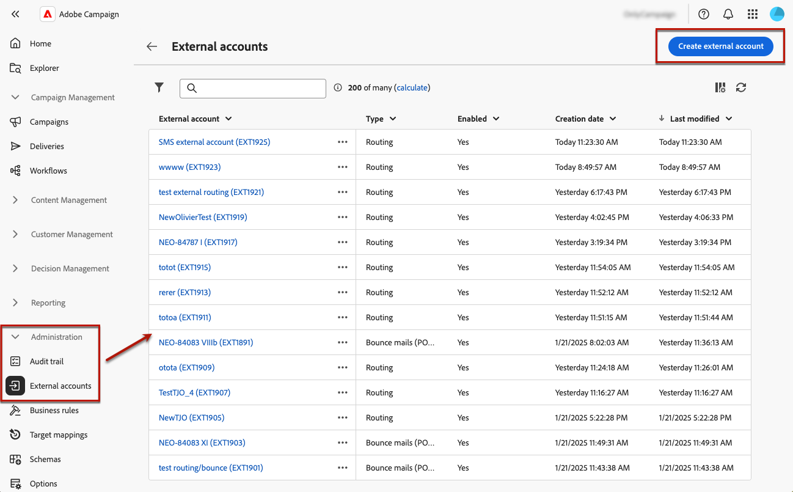

# Een externe account maken {#create-external-account}

Volg de onderstaande stappen om een nieuwe externe account te maken. De specifieke configuratie-instellingen zijn afhankelijk van het type externe account dat u maakt.

1. Selecteer **[!UICONTROL External accounts]** onder **[!UICONTROL Administration]** in het menu voor het linkerdeelvenster.

1. Klik op **[!UICONTROL Create external account]**.

   

1. Voer uw **[!UICONTROL Label]** in en selecteer de externe account **[!UICONTROL Type]** .

   * [Typen die specifiek zijn voor campagnes](external-account.md)
   * [Integratie van Adobe-oplossingen](integration-external-account.md)
   * [Overdrachtsgegevens](transfer-external-account.md)
   * [Externe database](external-account-database.md)

   

1. Klik op **[!UICONTROL Create]**.

1. Wijzig in de vervolgkeuzelijst **[!UICONTROL Additional options]** het pad **[!UICONTROL Internal name]** of **[!UICONTROL Folder]** , indien nodig.

   

1. Schakel de optie **[!UICONTROL Exported automatically in packages]** in om automatisch gegevens te exporteren die door deze externe account worden beheerd. <!--Exported where??-->

   

1. Configureer in de sectie **[!UICONTROL Details]** de toegang tot de account door referenties op te geven op basis van het gekozen externe accounttype. [Meer informatie](#bounce)

1. Klik op **[!UICONTROL Test connection]** om te controleren of de configuratie juist is.

1. Dupliceer of verwijder uw externe account vanuit het menu **[!UICONTROL More...]** .

   

1. Klik op **[!UICONTROL Save]** als de configuratie is voltooid.
