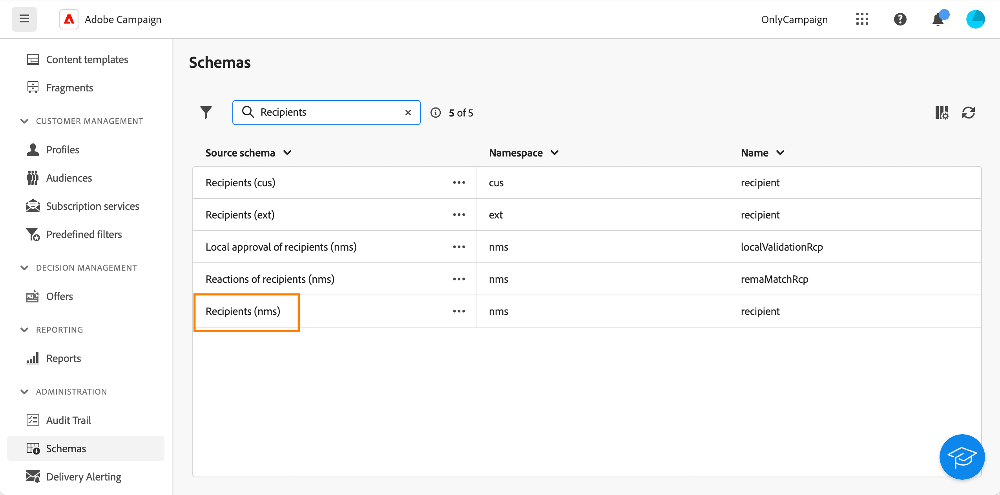

# Aangepaste velden configureren {#custom-fields}

>[!CONTEXTUALHELP]
>id="acw_homepage_welcome_rn4"
>title="Aangepaste velden"
>abstract="Aangepaste velden zijn aanvullende kenmerken die via de Adobe Campaign-console aan de out-of-the-box-schema&#39;s worden toegevoegd. Zij zijn nu beschikbaar in het gebruikersinterface van het Web."
>additional-url="https://experienceleague.adobe.com/docs/campaign-web/v8/release-notes/release-notes.html" text="Zie opmerkingen bij releases"

Aangepaste velden zijn aanvullende kenmerken die via de Adobe Campaign-console aan de out-of-the-box-schema&#39;s worden toegevoegd. Meer informatie in het dialoogvenster [Adobe Campaign v8-documentatie](https://experienceleague.adobe.com/docs/campaign/campaign-v8/developer/shemas-forms/extend-schema.html){target="_blank"}

Deze aangepaste velden worden op verschillende schermen weergegeven, bijvoorbeeld de details van een profiel of een testprofiel.

In de webgebruikersinterface kunt u geen aangepaste velden maken, maar kunt u de manier wijzigen waarop ze worden weergegeven. Wijzigingen zijn van toepassing op alle campagnegebruikers.

>[!NOTE]
>
>U moet beheerdersrechten hebben om aangepaste velden te kunnen wijzigen.

Aangepaste velden zijn beschikbaar in de volgende schema&#39;s:

* Ontvangers (nms)
* Campagnes (nms)
* Leveringen (nms)
* Zaadadressen (nms)

Voer de volgende stappen uit om aangepaste velden te configureren:

1. Onder **Administratie**, klikt u op **Schemas**.

   {zoomable="yes"}

1. Zoek het gewenste schema, bijvoorbeeld het **Ontvangers (nms)** schema.

   {zoomable="yes"}

1. Klik op de knop **Meer handelingen** en selecteert u **Aangepaste details bewerken**.

   {zoomable="yes"}

   De **Aangepaste details bewerken** worden alle aangepaste velden en het type weergegeven.

   {zoomable="yes"}

   In dit scherm kunt u de volgende handelingen uitvoeren:

   * Wijzig de volgorde van de verschillende velden met de pijl-omhoog en -omlaag.
   * verplicht maken van het veld: de **Verplicht** doos.
   * het veld zichtbaar maken of verbergen: klik op de knop **Zichtbaar** knop.
   * een zichtbaarheidsvoorwaarde toevoegen: klik op de knop **Zichtbaar indien** en uw xtk-expressie schrijven met de beschikbare xtk-functies.

1. Navigeer naar het scherm waarop het aangepaste veld wordt weergegeven. In ons voorbeeld is dit het scherm met profieldetails.

   {zoomable="yes"}
