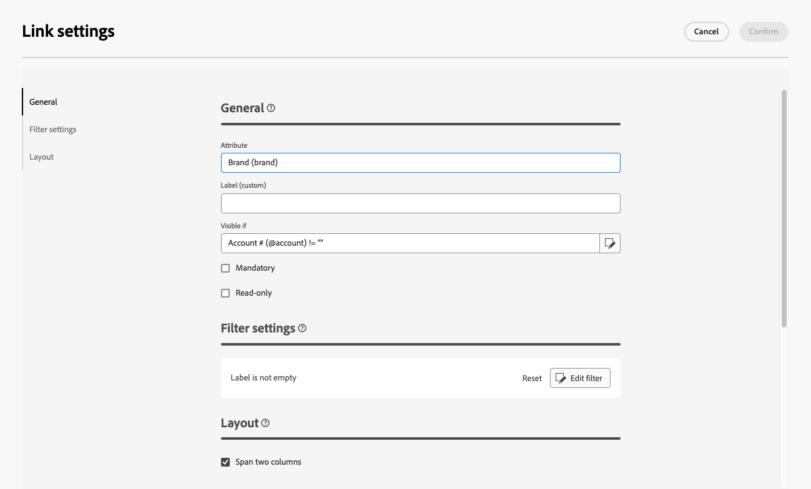

# Aangepaste velden configureren {#custom-fields}

>[!CONTEXTUALHELP]
>id="acw_schema_editcustomfields"
>title="Aangepaste details bewerken"
>abstract="Alle aangepaste velden die worden weergegeven in de interface voor de geselecteerde schemaweergave. U kunt de volgorde wijzigen waarin ze in de interface worden weergegeven met de pijl-omhoog en -omlaag en velden in subsecties groeperen door scheidingstekens toe te voegen. Als u een aangepast veld wilt verwijderen of instellingen zoals zichtbaarheidsvoorwaarden wilt bewerken, klikt u op de knop voor weglatingsteken."

>[!CONTEXTUALHELP]
>id="acw_schema_editcustomfields_settings_general"
>title="Algemeen"
>abstract="Definieer de algemene instellingen van het aangepaste veld. Als er geen label is opgegeven, wordt het label dat in het schema is gedefinieerd, weergegeven. Gebruik **Zichtbaar als** gebied om een voorwaarde te bepalen gebruikend een xtk uitdrukking die controleert wanneer het gebied wordt getoond. U kunt het veld ook als verplicht of alleen-lezen markeren in de interface."

>[!CONTEXTUALHELP]
>id="acw_schema_editcustomfields_settings_link"
>title="Koppelingseigenschappen"
>abstract="Gebruik de vraagmodeler om regels voor de vertoning van een verbinding-type douanegebied te specificeren. Beperk bijvoorbeeld lijstwaarden op basis van invoer van een ander veld."

>[!CONTEXTUALHELP]
>id="acw_schema_editcustomfields_settings_layout"
>title="Layout"
>abstract="Standaard worden aangepaste velden in de interface in twee kolommen weergegeven. Schakel deze optie in om het aangepaste veld over de volledige breedte van het scherm weer te geven in plaats van over twee kolommen."

>[!CONTEXTUALHELP]
>id="acw_schema_editcustomfields_separatorproperties"
>title="Eigenschappen van Scheidingsteken"
>abstract="Geef de naam op die in de interface voor de subsectie moet worden weergegeven."

<!-- NOT USED IN THE UI?-->

>[!CONTEXTUALHELP]
>id="acw_schema_editcustomfields_settings"
>title="Kenmerkinstellingen"
>abstract="Kenmerkinstellingen"

Aangepaste velden zijn aanvullende kenmerken die via de Adobe Campaign-console aan out-of-the-box-schema&#39;s worden toegevoegd. Zij staan u toe om schema&#39;s aan te passen door nieuwe attributen aan de behoeften van uw organisatie te omvatten. Leer hoe te om een schema in de [ Adobe Campaign v8 documentatie ](https://experienceleague.adobe.com/docs/campaign/campaign-v8/developer/shemas-forms/extend-schema.html) uit te breiden {target="_blank"}.

De gebieden van de douane kunnen in diverse schermen, zoals profieldetails in de interface van het Web van de Campagne worden getoond. Beheerders kunnen bepalen welke velden zichtbaar zijn en hoe ze worden weergegeven. Deze wijzigingen gelden voor alle campagnegebruikers.

>[!NOTE]
>
>U moet beheerdersrechten hebben om aangepaste velden te kunnen beheren.

De gebieden van de douane zijn beschikbaar voor de volgende schema&#39;s:

* Campagnes (nms)
* Abonnementen (nms)
* Programma&#39;s (nms)
* Ontvangers (nms)
* Zaadadressen (nms)
* Leveringen (nms)

## Aangepaste velden toevoegen aan de interface {#add}

Ga als volgt te werk om aangepaste velden in de interface weer te geven:

1. Blader naar het menu **[!UICONTROL Schemas]** in het navigatievenster aan de linkerkant en zoek het gewenste schema.

   Gebruik het filter **[!UICONTROL Editable]** in het venster Filters om schema&#39;s snel te identificeren met aangepaste velden.

   

1. Selecteer de schemanaam in de lijst om het te openen. Er wordt een gedetailleerde schemaweergave weergegeven. [ leer meer op schemadetails ](../administration/schemas.md). Klik op de knop **[!UICONTROL Edit custom detail]** om aangepaste velden te openen. In dit voorbeeld worden velden toegevoegd voor het schema **[!UICONTROL Recipients]** .

   

1. De lijst met aangepaste velden die in de interface voor het schema wordt weergegeven. Hier is het veld &quot;CRM-id&quot; zichtbaar in het detailscherm van het profiel en is het als verplicht gemarkeerd.

   | Configuratie van aangepaste velden | Renderen in de interface |
   |  ---  |  ---  |
   | {zoomable="yes"} | {zoomable="yes"} |

1. Als u een aangepast veld aan de interface wilt toevoegen, klikt u op de knop voor ovaal en kiest u een van de volgende opties:

   * **[!UICONTROL Select custom fields]**: selecteer een of meerdere aangepaste velden die u wilt weergeven in de interface.
   * **[!UICONTROL Fill automatically the list of custom fields]**: voeg alle aangepaste velden die voor het schema zijn gedefinieerd, toe aan de interface.

   

1. Nadat aangepaste velden zijn toegevoegd, kunt u:

   * **herordent gebieden**: Gebruik omhoog en onderaan pijlen.
   * **maak gebieden verplicht**: Selecteer **Verplicht** checkbox.
   * **geeft gebiedsmontages** uit: Klik de ellipsieknoop en kies **[!UICONTROL Edit]**. [Meer informatie](#settings)
   * **de gebieden van de Schrapping**: Klik de ellipsknoop en kies **[!UICONTROL Delete]**.
   * **organiseer gebieden in sub-secties in de interface**: Klik de elliptische knoop naast omhoog en onderaan pijlen en kies **[!UICONTROL Add separator]**. [Meer informatie](#separator)

## Aangepaste velden configureren {#settings}

Als u specifieke instellingen voor elk aangepast veld wilt configureren, klikt u op de knop voor de ovaal naast het gewenste veld en selecteert u **[!UICONTROL Edit]** .

Beschikbare instellingen zijn:

* **[!UICONTROL Attribute]**: De naam van het aangepaste veld.
* **[!UICONTROL Label (custom)]**: Het label dat in de interface moet worden weergegeven. Als er geen label is opgegeven, wordt het label dat in het schema is gedefinieerd, weergegeven.
* **[!UICONTROL Visible if]**: Definieer een voorwaarde met een xtk-expressie die bepaalt wanneer het veld wordt weergegeven. Verberg dit veld bijvoorbeeld als een ander veld leeg is.
* **[!UICONTROL Mandatory]**: maak het veld verplicht in de interface.
* **[!UICONTROL Read-only]**: maak het veld alleen-lezen in de interface. Gebruikers kunnen de waarde van het veld niet bewerken.
* **[!UICONTROL Filter settings]** (voor koppelingstype velden): gebruik de querymodelfunctie om regels op te geven voor de weergave van een aangepast veld van het type koppeling. Beperk bijvoorbeeld lijstwaarden op basis van invoer van een ander veld.

  U kunt ook met de syntaxis `$(<field-name>)` verwijzen naar de waarde die in uw eigen omstandigheden in andere velden is ingevoerd. Op deze manier kunt u verwijzen naar de huidige waarde van een veld zoals dat in het formulier is ingevoerd, zelfs als het nog niet in de database is opgeslagen.

  In het onderstaande voorbeeld controleert de voorwaarde of de waarde van het veld @ref overeenkomt met de waarde die is ingevoerd in het veld @refCom. Als u daarentegen `@refCom` in plaats van `$(@refCom)` gebruikt, verwijst u naar de waarde van het veld @ref zoals dit in de database bestaat.

  +++Voorbeeld

  

+++

* **[!UICONTROL Span two columns]**: Standaard worden aangepaste velden in de interface weergegeven in twee kolommen. Schakel deze optie in om het aangepaste veld over de volledige breedte van het scherm weer te geven in plaats van over twee kolommen.

## Aangepaste velden in subsecties ordenen {#separator}

In de gebruikersinterface van het Web Campagne kunt u scheidingstekens toevoegen om aangepaste velden in de interface te groeperen voor betere leesbaarheid. Voer hiertoe de volgende stappen uit:

1. Klik op de knop met de ellips naast de pijlen omhoog en omlaag en selecteer **[!UICONTROL Add separator]** .

1. Er wordt een nieuwe regel met het scheidingsteken toegevoegd aan de lijst. Klik op de knop voor ovaal en kies **[!UICONTROL Edit]** om de subsectie een naam te geven.

1. Gebruik de pijlen omhoog en omlaag om het scheidingsteken naar de gewenste locatie te verplaatsen. Velden die onder het scheidingsteken worden weergegeven, worden erin gegroepeerd.

   In dit voorbeeld worden de velden &quot;Geïnteresseerde verzamelingen&quot; en &quot;Merk&quot; gegroepeerd in een subsectie &quot;Verzameling&quot;.

   | Configuratie van aangepaste velden | Renderen in de interface |
   |  ---  |  ---  |
   | {zoomable="yes"} tonen | {zoomable="yes"} |