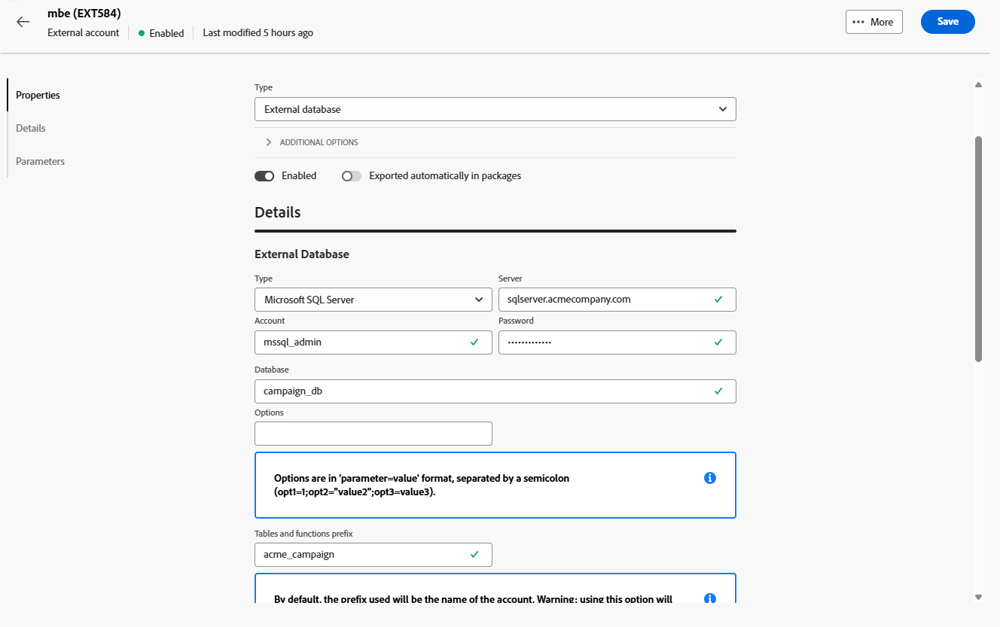

# Externe databaseaccounts {#external-accounts}

Gebruik een extern databasetype om Adobe Campaign te verbinden met een externe database.

De configuratie-instellingen voor de externe account variëren afhankelijk van de database-engine waarmee u verbinding maakt. Gedetailleerde instructies voor elke ondersteunde database vindt u in de volgende secties.

## Amazon Redshift

Met de externe Amazon Redshift-account kunt u uw Campagne-instantie verbinden met uw Amazon Redshift-externe database.

In Adobe Campaign Web User Interface, vorm uw Amazon Redshift externe rekening.

1. [&#x200B; creeer uw externe rekening &#x200B;](external-account.md) en selecteer **[!UICONTROL External database]** als externe rekening **[!UICONTROL Type]** en Amazon opnieuw schuiven als **[!UICONTROL Provider type]**.

1. Klik op **[!UICONTROL Create]**.

1. Als u de **[!UICONTROL Amazon Redshift]** externe account wilt configureren, vult u de volgende velden in:

   * **[!UICONTROL Type]**: Amazon Redshift

   * **[!UICONTROL Server]**: voer de DNS-naam van uw Redshift-server in.

   * **[!UICONTROL Account]**: geef de gebruikersnaam op die voor verificatie wordt gebruikt.

   * **[!UICONTROL Password]**: voer het wachtwoord in dat aan de gebruikersaccount is gekoppeld.

   * **[!UICONTROL Database]**: geef de naam van de database op als deze nog niet is gedefinieerd in de DSN. Laat dit veld leeg als de database in de DSN is opgenomen.

   * **[!UICONTROL Working schema]**: voer de schemanaam in waar Adobe Campaign zal werken.

   * **[!UICONTROL Options]**: voeg eventueel geavanceerde configuratieopties toe die nodig zijn voor de omgeving.

   * **[!UICONTROL Time zone]**: selecteer of voer de tijdzone van de server in om nauwkeurige op tijd-gebaseerde verrichtingen te verzekeren.

   

1. Nadat u de verbinding hebt ingesteld, maakt u de Adobe Campaign SQL-functies in de externe Redshift-database. Zodra deze functies beschikbaar zijn, klikt u op **[!UICONTROL Deploy functions]** om deze te activeren.

1. Koppel uw **[!UICONTROL Storage account]** om de prestaties te optimaliseren en snellere processen voor het laden van gegevens tussen Adobe Campaign en Amazon Redshift mogelijk te maken.

1. Voer uw **[!UICONTROL Account role]** in die de machtigingen bepaalt die Adobe Campaign gebruikt bij interactie met uw Redshift-omgeving.

## Amazon Redshift (verouderd)

Met de externe Amazon Redshift-account (verouderd) kunt u uw Campagne-instantie verbinden met uw Amazon Redshift-externe database.

In Adobe Campaign Web User Interface, vorm uw Amazon Redshift (erfenis) externe rekening.

1. [&#x200B; creeer uw externe rekening &#x200B;](external-account.md) en selecteer **[!UICONTROL External database]** als externe rekening **[!UICONTROL Type]** en Amazon Redshift (erfenis) zoals **[!UICONTROL Provider type]**.

1. Klik op **[!UICONTROL Create]**.

1. Als u de **[!UICONTROL Amazon Redshift (legacy)]** externe account wilt configureren, vult u de volgende velden in:

   * **[!UICONTROL Type]**: Amazon Redshift (verouderd)

   * **[!UICONTROL Server]**: voer de DNS-naam van uw Redshift-server in.

   * **[!UICONTROL Account]**: geef de gebruikersnaam op die voor verificatie wordt gebruikt.

   * **[!UICONTROL Password]**: voer het wachtwoord in dat aan de gebruikersaccount is gekoppeld.

   * **[!UICONTROL Database]**: geef de naam van de database op als deze nog niet is gedefinieerd in de DSN. Laat dit veld leeg als de database in de DSN is opgenomen.

   * **[!UICONTROL Working schema]**: voer de schemanaam in waar Adobe Campaign zal werken.

   * **[!UICONTROL Time zone]**: selecteer of voer de tijdzone van de server in om nauwkeurige op tijd-gebaseerde verrichtingen te verzekeren.

   

1. Nadat u de verbinding hebt ingesteld, maakt u de Adobe Campaign SQL-functies in de externe Redshift-database. Zodra deze functies beschikbaar zijn, klikt u op **[!UICONTROL Deploy functions]** om deze te activeren.

## Azure Synapse Analytics

Met de externe account van Azure Synapse Analytics kunt u uw Campagne-instantie verbinden met uw Azure Synapse-database.

Configureer in Adobe Campaign Web User Interface uw externe account voor Azure Synapse Analytics.

1. [&#x200B; creeer uw externe rekening &#x200B;](external-account.md) en selecteer **[!UICONTROL External database]** als externe rekening **[!UICONTROL Type]** en Amazon opnieuw schuiven als **[!UICONTROL Provider type]**.

1. Klik op **[!UICONTROL Create]**.

1. Als u de **[!UICONTROL Azure Synapse Analytics]** externe account wilt configureren, vult u de volgende velden in:

   * **[!UICONTROL Type]**: Azure Synapse Analytics

   * **[!UICONTROL Server]**: voer de URL van de Azure Synapse-server in.

   * **[!UICONTROL Account]**: geef de gebruikersnaam op die moet worden geverifieerd bij de Synapse-database.

   * **[!UICONTROL Password]**: voer het wachtwoord in dat aan het account is gekoppeld.

   * **[!UICONTROL Database]**: geef de doeldatabase op waarmee Adobe Campaign verbinding moet maken.

   * **[!UICONTROL Tables and functions prefix]**: Deze wordt standaard ingesteld op de accountnaam. U kunt dit aanpassen als u liever een ander voorvoegsel gebruikt voor het identificeren van aan campagnes gerelateerde objecten.

   * **[!UICONTROL Options]**: voeg eventueel geavanceerde configuratieopties toe die nodig zijn voor de omgeving.

   * **[!UICONTROL Time zone]**: selecteer of voer de tijdzone van de server in om nauwkeurige op tijd-gebaseerde verrichtingen te verzekeren.

   

1. U kunt de optie **[!UICONTROL Use a work tablespace for tables]** inschakelen en vervolgens de **[!UICONTROL Tablespace of tables]** opgeven waar de werktabellen worden opgeslagen.

1. Schakel indien nodig de optie **[!UICONTROL Use a work tablespace for indexes]** in en geef vervolgens de waarde **[!UICONTROL Indexes tablespace]** op.

   

1. Nadat u de verbinding hebt ingesteld, maakt u de Adobe Campaign SQL-functies in uw externe Azure Synapse Analytics-database. Zodra deze functies beschikbaar zijn, klikt u op **[!UICONTROL Deploy functions]** om deze te activeren.

## Databricks

De externe rekening van Databases staat u toe om uw instantie van de Campagne met uw gegevensbestand van Gegevensbestanden te verbinden externe.

In Adobe Campaign Web User Interface, vorm uw Gegevensbestanden externe rekening.

1. [&#x200B; creeer uw externe rekening &#x200B;](external-account.md) en selecteer **[!UICONTROL External database]** als externe rekening **[!UICONTROL Type]** en Gegevensbestanden zoals **[!UICONTROL Provider type]**.

1. Klik op **[!UICONTROL Create]**.

1. Als u de **[!UICONTROL Databricks]** externe account wilt configureren, vult u de volgende velden in:

   * **[!UICONTROL Type]**: databases

   * **[!UICONTROL Server]**: ga de DNS naam van uw server van Gegevensbestanden in.

   * **[!UICONTROL Account]**: Geef de gebruikersnaam op van de database die voor verificatie wordt gebruikt.

   * **[!UICONTROL Password]**: voer het wachtwoord in dat aan de gebruikersaccount is gekoppeld.

   * **[!UICONTROL Catalog]**: geef de catalogus op die u wilt gebruiken.

   * **[!UICONTROL Working schema]**: voer de naam in van het schema waarin Adobe Campaign de werkobjecten maakt en beheert.

   * **[!UICONTROL Options]**: voeg eventueel geavanceerde configuratieopties toe die nodig zijn voor de omgeving.

   

1. Nadat u de verbinding hebt ingesteld, maakt u de Adobe Campaign SQL-functies in de database van externe databases. Zodra deze functies beschikbaar zijn, klikt u op **[!UICONTROL Deploy functions]** om deze te activeren.

1. Koppel uw **[!UICONTROL Storage account]** om de prestaties te optimaliseren en snellere processen voor het laden van gegevens tussen Adobe Campaign en Databases mogelijk te maken.

## Google BigQuery

Met de externe Google BigQuery-account kunt u uw Campagne-instantie verbinden met uw externe Google BigQuery-database.

Configureer in Adobe Campaign Web User Interface uw Google BigQuery-externe account.

1. [&#x200B; creeer uw externe rekening &#x200B;](external-account.md) en selecteer **[!UICONTROL External database]** als externe rekening **[!UICONTROL Type]** en Google BigQuery als **[!UICONTROL Provider type]**.

1. Klik op **[!UICONTROL Create]**.

1. Als u de **[!UICONTROL Google BigQuery]** externe account wilt configureren, vult u de volgende velden in:

   * **[!UICONTROL Type]**: Google BigQuery

   * **[!UICONTROL Account]**: voer de gebruikersnaam- of serviceaccount in die Adobe Campaign gebruikt om verbinding te maken met BigQuery.

   * **[!UICONTROL Login file upload method]**: Geef aan hoe u de sleutel voor het serviceaccount wilt opgeven door het hoofdbestandspad handmatig in te voeren of door het sleutelbestand rechtstreeks naar de server te uploaden.

   * **[!UICONTROL Server]**: Als u de optie voor handmatig invoeren selecteert, geeft u de URL van de server op.

   * **[!UICONTROL Project]**: geef de Google Cloud-project-id op die is gekoppeld aan uw BigQuery-instantie.

   * **[!UICONTROL Dataset]**: ga de naam van de dataset in waar Adobe Campaign gegevens zal opslaan en vragen.

   * **[!UICONTROL Options]**: voeg eventueel geavanceerde configuratieopties toe die nodig zijn voor de omgeving.

   

1. Plak onder **[!UICONTROL Parameters]** de inhoud van het JSON-bestand met de sleutel van de serviceaccount om Adobe Campaign te verifiëren met Google BigQuery.

1. Nadat u de verbinding hebt ingesteld, maakt u de Adobe Campaign SQL-functies in uw externe Google BigQuery-database. Zodra deze functies beschikbaar zijn, klikt u op **[!UICONTROL Deploy functions]** om deze te activeren.

1. Als uw milieu volmachtstoegang om met de server vereist te verbinden BigQuery, vorm de volmachtsmontages.

   Begin door uw volmachtstype te selecteren: http, http_no_tunnel, socks4, of socks5.

1. Vul de volgende gebieden van de volmachtsconfiguratie in om veilige toegang te vestigen:

   * **[!UICONTROL Proxy Host]**: Het adres van de proxyserver.
   * **[!UICONTROL Proxy Port]**: de poort die door de proxyserver wordt gebruikt.
   * **[!UICONTROL Proxy UID]**: De gebruikersnaam voor verificatie met de proxyserver, indien vereist.
   * **[!UICONTROL Proxy Host]**: Het wachtwoord voor de Proxy UID (indien van toepassing).

   

## Microsoft SQL Server

Met de externe Microsoft SQL Server-account kunt u uw Campagne-instantie verbinden met uw externe Microsoft SQL Server-database.

In Adobe Campaign Web User Interface, vorm uw externe rekening van de Server van Microsoft SQL.

1. [&#x200B; creeer uw externe rekening &#x200B;](external-account.md) en selecteer **[!UICONTROL External database]** als externe rekening **[!UICONTROL Type]** en de Server van Microsoft SQL als **[!UICONTROL Provider type]**.

1. Klik op **[!UICONTROL Create]**.

1. Als u de **[!UICONTROL Microsoft SQL Server]** externe account wilt configureren, vult u de volgende velden in:

   * **[!UICONTROL Type]**: Microsoft SQL Server

   * **[!UICONTROL Server]**: ga de DNS naam van uw Server van Microsoft SQL in.

   * **[!UICONTROL Account]**: geef de Microsoft SQL Server-gebruikersnaam op die voor verificatie wordt gebruikt.

   * **[!UICONTROL Password]**: voer het wachtwoord in dat aan de gebruikersaccount is gekoppeld.

   * **[!UICONTROL Database]**: geef de naam van de database op als deze nog niet is gedefinieerd in de DSN. Laat dit veld leeg als de database in de DSN is opgenomen.

   * **[!UICONTROL Options]**: voeg eventueel geavanceerde configuratieopties toe die nodig zijn voor de omgeving.

   * **[!UICONTROL Tables and functions prefix]**: Deze wordt standaard ingesteld op de accountnaam. U kunt dit aanpassen als u liever een ander voorvoegsel gebruikt voor het identificeren van aan campagnes gerelateerde objecten.

   * **[!UICONTROL Time zone]**: selecteer of voer de tijdzone van de server in om nauwkeurige op tijd-gebaseerde verrichtingen te verzekeren.

   

1. U kunt de optie **[!UICONTROL Use a work tablespace for tables]** inschakelen en vervolgens de **[!UICONTROL Tablespace of tables]** opgeven waar de werktabellen worden opgeslagen.

1. Schakel indien nodig de optie **[!UICONTROL Use a work tablespace for indexes]** in en geef vervolgens de waarde **[!UICONTROL Indexes tablespace]** op.

1. Nadat u de verbinding hebt ingesteld, maakt u de Adobe Campaign SQL-functies in uw externe Microsoft SQL Server-database. Zodra deze functies beschikbaar zijn, klikt u op **[!UICONTROL Deploy functions]** om deze te activeren.

## MySQL

Met de externe MySQL-account kunt u uw Campagne-instantie verbinden met uw externe MySQL-database.
Configureer uw MySQL-externe account in de Adobe Campaign Web User Interface.

1. [&#x200B; creeer uw externe rekening &#x200B;](external-account.md) en selecteer **[!UICONTROL External database]** als externe rekening **[!UICONTROL Type]** en MySQL als **[!UICONTROL Provider type]**.

1. Klik op **[!UICONTROL Create]**.

1. Als u de **[!UICONTROL MySQL]** externe account wilt configureren, vult u de volgende velden in:

   * **[!UICONTROL Type]**: MySQL

   * **[!UICONTROL Server]**: ga de DNS naam van uw server MySQL in.

   * **[!UICONTROL Account]**: Geef de MySQL-gebruikersnaam op die voor verificatie wordt gebruikt.

   * **[!UICONTROL Password]**: voer het wachtwoord in dat aan de gebruikersaccount is gekoppeld.

   * **[!UICONTROL Database]**: geef de naam van de database op als deze nog niet is gedefinieerd in de DSN. Laat dit veld leeg als de database in de DSN is opgenomen.

   * **[!UICONTROL Time zone]**: selecteer of voer de tijdzone van de server in om nauwkeurige op tijd-gebaseerde verrichtingen te verzekeren.

   

1. U kunt de optie **[!UICONTROL Use a work tablespace for tables]** inschakelen en vervolgens de **[!UICONTROL Tablespace of tables]** opgeven waar de werktabellen worden opgeslagen.

1. Schakel indien nodig de optie **[!UICONTROL Use a work tablespace for indexes]** in en geef vervolgens de waarde **[!UICONTROL Indexes tablespace]** op.

1. Nadat u de verbinding hebt ingesteld, maakt u de Adobe Campaign SQL-functies in uw externe MySQL-database. Zodra deze functies beschikbaar zijn, klikt u op **[!UICONTROL Deploy functions]** om deze te activeren.

## Netezza

Met de externe Netezza-account kunt u uw Campagne-instantie verbinden met uw externe Netezza-database.

Configureer uw Netezza-externe account in de Adobe Campaign Web User Interface.

1. [&#x200B; creeer uw externe rekening &#x200B;](external-account.md) en selecteer **[!UICONTROL External database]** als externe rekening **[!UICONTROL Type]** en Netezza als **[!UICONTROL Provider type]**.

1. Klik op **[!UICONTROL Create]**.

1. Als u de **[!UICONTROL Netezza]** externe account wilt configureren, vult u de volgende velden in:

   * **[!UICONTROL Type]**: Netezza

   * **[!UICONTROL Server]**: voer de DNS-naam van uw Netezza-server in.

   * **[!UICONTROL Account]**: geef de Netezza-gebruikersnaam op die voor verificatie wordt gebruikt.

   * **[!UICONTROL Password]**: voer het wachtwoord in dat aan de gebruikersaccount is gekoppeld.

   * **[!UICONTROL Database]**: geef de naam van de database op als deze nog niet is gedefinieerd in de DSN. Laat dit veld leeg als de database in de DSN is opgenomen.

   * **[!UICONTROL Time zone]**: selecteer of voer de tijdzone van de server in om nauwkeurige op tijd-gebaseerde verrichtingen te verzekeren.

   

1. U kunt de optie **[!UICONTROL Use a work tablespace for tables]** inschakelen en vervolgens de **[!UICONTROL Tablespace of tables]** opgeven waar de werktabellen worden opgeslagen.

1. Schakel indien nodig de optie **[!UICONTROL Use a work tablespace for indexes]** in en geef vervolgens de waarde **[!UICONTROL Indexes tablespace]** op.

1. Nadat u de verbinding hebt ingesteld, maakt u de Adobe Campaign SQL-functies in uw externe Netezza-database. Zodra deze functies beschikbaar zijn, klikt u op **[!UICONTROL Deploy functions]** om deze te activeren.

## ODBC (Sybase ASE, Sybase IQ)

Met de externe ODBC-account (Sybase ASE, Sybase IQ) kunt u uw Campagne-instantie verbinden met uw externe ODBC-database (Sybase ASE, Sybase IQ).
In Adobe Campaign Web User Interface, vorm uw ODBC (Sybase ASE, Sybase IQ) externe rekening.

1. [&#x200B; creeer uw externe rekening &#x200B;](external-account.md) en selecteer **[!UICONTROL External database]** als externe rekening **[!UICONTROL Type]** en ODBC (Sybase ASE, Sybase IQ) als **[!UICONTROL Provider type]**.

1. Klik op **[!UICONTROL Create]**.

1. Als u de **[!UICONTROL ODBC (Sybase ASE, Sybase IQ)]** externe account wilt configureren, vult u de volgende velden in:

   * **[!UICONTROL Type]**: ODBC (Sybase ASE, Sybase IQ)

   * **[!UICONTROL Server]**: voer de DNS-naam in van uw ODBC-server (Sybase ASE, Sybase IQ).

   * **[!UICONTROL Account]**: geef de ODBC (Sybase ASE, Sybase IQ) servergebruikersnaam op die voor verificatie wordt gebruikt.

   * **[!UICONTROL Password]**: voer het wachtwoord in dat aan de gebruikersaccount is gekoppeld.

   * **[!UICONTROL Database]**: geef de naam van de database op als deze nog niet is gedefinieerd in de DSN. Laat dit veld leeg als de database in de DSN is opgenomen.

   * **[!UICONTROL Options]**: voeg eventueel geavanceerde configuratieopties toe die nodig zijn voor de omgeving.

   * **[!UICONTROL Mass insert tool]**: geef het volledige pad op naar het uitvoerbare bestand van het gereedschap voor massainvoeging.

   * **[!UICONTROL Time zone]**: selecteer of voer de tijdzone van de server in om nauwkeurige op tijd-gebaseerde verrichtingen te verzekeren.

   

1. U kunt de optie **[!UICONTROL Use a work tablespace for tables]** inschakelen en vervolgens de **[!UICONTROL Tablespace of tables]** opgeven waar de werktabellen worden opgeslagen.

1. Schakel indien nodig de optie **[!UICONTROL Use a work tablespace for indexes]** in en geef vervolgens de waarde **[!UICONTROL Indexes tablespace]** op.

1. Nadat u de verbinding hebt ingesteld, maakt u de Adobe Campaign SQL-functies in uw externe ODBC-database. Zodra deze functies beschikbaar zijn, klikt u op **[!UICONTROL Deploy functions]** om deze te activeren.

## HTTP-relais naar externe database

Het relais van HTTP aan verre gegevensbestand externe rekening staat u toe om uw instantie van de Campagne met uw relais van HTTP aan verre gegevensbestand externe gegevensbestand te verbinden.

In de Gebruikersinterface van het Web van Adobe Campaign, vorm uw HTTP relais aan verre gegevensbestand externe rekening.

1. [&#x200B; creeer uw externe rekening &#x200B;](external-account.md) en selecteer **[!UICONTROL External database]** als externe rekening **[!UICONTROL Type]** en Amazon opnieuw schuiven als **[!UICONTROL Provider type]**.

1. Klik op **[!UICONTROL Create]**.

1. Als u de **[!UICONTROL HTTP relay to remote database]** externe account wilt configureren, vult u de volgende velden in:

   * **[!UICONTROL Type]**: HTTP-relais naar externe database

   * **[!UICONTROL Server]**: voer de volledige URL in van de HTTP relay-server die verbinding maakt met uw externe database.

   * **[!UICONTROL Account]**: geef de gebruikersnaam op die wordt gebruikt voor verificatie met de HTTP relay-server.

   * **[!UICONTROL Password]**: voer het wachtwoord in dat aan dit account is gekoppeld.

   * **[!UICONTROL Datasource]**: geef de doeldatabase op waarmee Adobe Campaign verbinding moet maken via het relais.

   * **[!UICONTROL Options]**: voeg eventueel geavanceerde configuratieopties toe die nodig zijn voor de omgeving.

   

1. U kunt de optie **[!UICONTROL Use a work tablespace for tables]** inschakelen en vervolgens de **[!UICONTROL Tablespace of tables]** opgeven waar de werktabellen worden opgeslagen.

1. Schakel indien nodig de optie **[!UICONTROL Use a work tablespace for indexes]** in en geef vervolgens de waarde **[!UICONTROL Indexes tablespace]** op.

1. Nadat u de verbinding hebt ingesteld, maakt u de Adobe Campaign SQL-functies in uw externe HTTP-relais naar een externe database. Zodra deze functies beschikbaar zijn, klikt u op **[!UICONTROL Deploy functions]** om deze te activeren.

## Oracle

Met de externe Oracle-account kunt u uw Campagne-instantie verbinden met uw externe Oracle-database.
Configureer uw Oracle-externe account in de Adobe Campaign Web User Interface.

1. [&#x200B; creeer uw externe rekening &#x200B;](external-account.md) en selecteer **[!UICONTROL External database]** als externe rekening **[!UICONTROL Type]** en Oracle als **[!UICONTROL Provider type]**.

1. Klik op **[!UICONTROL Create]**.

1. Als u de **[!UICONTROL Oracle]** externe account wilt configureren, vult u de volgende velden in:

   * **[!UICONTROL Type]**: Oracle

   * **[!UICONTROL Server]**: voer de DNS-naam van uw Oracle-server in.

   * **[!UICONTROL Account]**: geef de Oracle-gebruikersnaam op die voor verificatie wordt gebruikt.

   * **[!UICONTROL Password]**: voer het wachtwoord in dat aan de gebruikersaccount is gekoppeld.

   * **[!UICONTROL Time zone]**: selecteer of voer de tijdzone van de server in om nauwkeurige op tijd-gebaseerde verrichtingen te verzekeren.

   

1. U kunt de optie **[!UICONTROL Use a work tablespace for tables]** inschakelen en vervolgens de **[!UICONTROL Tablespace of tables]** opgeven waar de werktabellen worden opgeslagen.

1. Schakel indien nodig de optie **[!UICONTROL Use a work tablespace for indexes]** in en geef vervolgens de waarde **[!UICONTROL Indexes tablespace]** op.

1. Nadat u de verbinding hebt ingesteld, maakt u de Adobe Campaign SQL-functies in uw externe Oracle-database. Zodra deze functies beschikbaar zijn, klikt u op **[!UICONTROL Deploy functions]** om deze te activeren.

## PostgreSQL

Met de externe PostgreSQL-account kunt u uw Campagne-instantie verbinden met uw externe PostSQL-database.
Configureer in Adobe Campaign Web User Interface uw PostgreSQL-externe account.

1. [&#x200B; creeer uw externe rekening &#x200B;](external-account.md) en selecteer **[!UICONTROL External database]** als externe rekening **[!UICONTROL Type]** en PostgreSQL als **[!UICONTROL Provider type]**.

1. Klik op **[!UICONTROL Create]**.

1. Als u de **[!UICONTROL PostgreSQL]** externe account wilt configureren, vult u de volgende velden in:

   * **[!UICONTROL Type]**: PostgreSQL

   * **[!UICONTROL Server]**: ga de DNS naam van uw server PostgreSQL in.

   * **[!UICONTROL Account]**: Geef de gebruikersnaam op die voor verificatie wordt gebruikt.

   * **[!UICONTROL Password]**: voer het wachtwoord in dat aan de gebruikersaccount is gekoppeld.

   * **[!UICONTROL Database]**: geef de naam van de database op als deze nog niet is gedefinieerd in de DSN. Laat dit veld leeg als de database in de DSN is opgenomen.

   * **[!UICONTROL Working schema]**: voer de naam in van het schema waarin Adobe Campaign de werkobjecten maakt en beheert.

   * **[!UICONTROL Time zone]**: selecteer of voer de tijdzone van de server in om nauwkeurige op tijd-gebaseerde verrichtingen te verzekeren.

   

1. U kunt de optie **[!UICONTROL Use a work tablespace for tables]** inschakelen en vervolgens de **[!UICONTROL Tablespace of tables]** opgeven waar de werktabellen worden opgeslagen.

1. Schakel indien nodig de optie **[!UICONTROL Use a work tablespace for indexes]** in en geef vervolgens de waarde **[!UICONTROL Indexes tablespace]** op.

1. Nadat u de verbinding hebt ingesteld, maakt u de Adobe Campaign SQL-functies in uw externe PostSQL-database. Zodra deze functies beschikbaar zijn, klikt u op **[!UICONTROL Deploy functions]** om deze te activeren.

## SAP HANA

Met de externe SAP HANA-account kunt u uw Campagne-instantie verbinden met uw externe SAP HANA-database.

Configureer uw SAP HANA-externe account in de Adobe Campaign Web User Interface.

1. [&#x200B; creeer uw externe rekening &#x200B;](external-account.md) en selecteer **[!UICONTROL External database]** als externe rekening **[!UICONTROL Type]** en SAP HANA als **[!UICONTROL Provider type]**.

1. Klik op **[!UICONTROL Create]**.

1. Als u de **[!UICONTROL SAP HANA]** externe account wilt configureren, vult u de volgende velden in:

   * **[!UICONTROL Type]**: SAP HANA

   * **[!UICONTROL Server]**: voer de DNS-naam van uw SAP HANA-server in.

   * **[!UICONTROL Account]**: geef de SAP HANA-gebruikersnaam op die voor verificatie wordt gebruikt.

   * **[!UICONTROL Password]**: voer het wachtwoord in dat aan de gebruikersaccount is gekoppeld.

   * **[!UICONTROL Options]**: voeg eventueel geavanceerde configuratieopties toe die nodig zijn voor de omgeving.

   * **[!UICONTROL Working schema]**: voer de naam in van het schema waarin Adobe Campaign de werkobjecten maakt en beheert.

   * **[!UICONTROL Time zone]**: selecteer of voer de tijdzone van de server in om nauwkeurige op tijd-gebaseerde verrichtingen te verzekeren.

   

1. U kunt de optie **[!UICONTROL Use a work tablespace for tables]** inschakelen en vervolgens de **[!UICONTROL Tablespace of tables]** opgeven waar de werktabellen worden opgeslagen.

1. Schakel indien nodig de optie **[!UICONTROL Use a work tablespace for indexes]** in en geef vervolgens de waarde **[!UICONTROL Indexes tablespace]** op.

1. Nadat u de verbinding hebt ingesteld, maakt u de Adobe Campaign SQL-functies in uw externe SAP HANA-database. Zodra deze functies beschikbaar zijn, klikt u op **[!UICONTROL Deploy functions]** om deze te activeren.

## Snowflake

Met de externe Snowflake-account kunt u uw Campagne-instantie verbinden met uw externe Snowflake-database.

Configureer uw Snowflake-externe account in de Adobe Campaign Web User Interface.

1. [&#x200B; creeer uw externe rekening &#x200B;](external-account.md) en selecteer **[!UICONTROL External database]** als externe rekening **[!UICONTROL Type]** en Snowflake als **[!UICONTROL Provider type]**.

1. Klik op **[!UICONTROL Create]**.

1. Als u de **[!UICONTROL Snowflake]** externe account wilt configureren, vult u de volgende velden in:

   * **[!UICONTROL Type]**: Snowflake

   * **[!UICONTROL Server]**: voer de DNS-naam van uw Snowflake-server in.

   * **[!UICONTROL Account]**: geef de Snowflake-gebruikersnaam op die voor verificatie wordt gebruikt.

   * **[!UICONTROL Password]**: voer het wachtwoord in dat aan de gebruikersaccount is gekoppeld.

   * **[!UICONTROL Database]**: geef de naam van de database op als deze nog niet is gedefinieerd in de DSN. Laat dit veld leeg als de database in de DSN is opgenomen.

   * **[!UICONTROL Working schema]**: voer de naam in van het schema waarin Adobe Campaign de werkobjecten maakt en beheert.

   * **[!UICONTROL Options]**: voeg eventueel geavanceerde configuratieopties toe die nodig zijn voor de omgeving.

   * **[!UICONTROL Time zone]**: selecteer of voer de tijdzone van de server in om nauwkeurige op tijd-gebaseerde verrichtingen te verzekeren.

   

1. Nadat u de verbinding hebt ingesteld, maakt u de Adobe Campaign SQL-functies in uw externe Snowflake-database. Zodra deze functies beschikbaar zijn, klikt u op **[!UICONTROL Deploy functions]** om deze te activeren.

1. Als u sleutelpaarverificatie gebruikt, voert u in het menu **[!UICONTROL keypair.auth]** de vereiste waarden in voor:

   * **[!UICONTROL Password]**: De wachtwoordzin die de persoonlijke sleutel beveiligt, indien van toepassing.

   * **[!UICONTROL Private key]**: De persoonlijke sleutel die wordt gebruikt voor verificatie van de Snowflake-account.

## Teradata

Met de externe Teradata-account kunt u uw Campagne-instantie verbinden met uw externe Teradata-database.

Configureer uw Teradata-externe account in de Adobe Campaign Web User Interface.

1. [&#x200B; creeer uw externe rekening &#x200B;](external-account.md) en selecteer **[!UICONTROL External database]** als externe rekening **[!UICONTROL Type]** en Teradata als **[!UICONTROL Provider type]**.

1. Klik op **[!UICONTROL Create]**.

1. Als u de **[!UICONTROL Teradata]** externe account wilt configureren, vult u de volgende velden in:

   * **[!UICONTROL Type]**: Teradata

   * **[!UICONTROL Server]**: voer de DNS-naam van uw Teradata-server in.

   * **[!UICONTROL Account]**: geef de Teradata-gebruikersnaam op die voor verificatie wordt gebruikt.

   * **[!UICONTROL Password]**: voer het wachtwoord in dat aan de gebruikersaccount is gekoppeld.

   * **[!UICONTROL Database]**: geef de naam van de database op als deze nog niet is gedefinieerd in de DSN. Laat dit veld leeg als de database in de DSN is opgenomen.

   * **[!UICONTROL Options]**: voeg eventueel geavanceerde configuratieopties toe die nodig zijn voor de omgeving.

   * **[!UICONTROL Time zone]**: selecteer of voer de tijdzone van de server in om nauwkeurige op tijd-gebaseerde verrichtingen te verzekeren.

   

1. U kunt de optie **[!UICONTROL Use a work tablespace for tables]** inschakelen en vervolgens de **[!UICONTROL Tablespace of tables]** opgeven waar de werktabellen worden opgeslagen.

1. Schakel indien nodig de optie **[!UICONTROL Use a work tablespace for indexes]** in en geef vervolgens de waarde **[!UICONTROL Indexes tablespace]** op.

1. Nadat u de verbinding hebt ingesteld, maakt u de Adobe Campaign SQL-functies in uw externe Teradata-database. Zodra deze functies beschikbaar zijn, klikt u op **[!UICONTROL Deploy functions]** om deze te activeren.

1. Voer zo nodig uw **[!UICONTROL PostConnect Script]** in als u wilt dat een script automatisch wordt uitgevoerd nadat een verbinding tot stand is gebracht. Schakel de optie **[!UICONTROL Run every time]** in als u wilt dat het script elke keer wordt uitgevoerd.

## Vertica Analytics

Configureer uw Vertica Analytics-externe account in de Adobe Campaign Web User Interface.

1. [&#x200B; creeer uw externe rekening &#x200B;](external-account.md) en selecteer **[!UICONTROL External database]** als externe rekening **[!UICONTROL Type]** en Vertica Analytics als **[!UICONTROL Provider type]**.

1. Klik op **[!UICONTROL Create]**.

1. Als u de **[!UICONTROL Vertica Analytics]** externe account wilt configureren, vult u de volgende velden in:

   * **[!UICONTROL Type]**: Vertica Analytics

   * **[!UICONTROL Server]**: voer de DNS-naam van uw Vertica Analytics-server in.

   * **[!UICONTROL Account]**: geef de Vertica Analytics-gebruikersnaam op die voor verificatie wordt gebruikt.

   * **[!UICONTROL Password]**: voer het wachtwoord in dat aan de gebruikersaccount is gekoppeld.

   * **[!UICONTROL Database]**: geef de naam van de database op als deze nog niet is gedefinieerd in de DSN. Laat dit veld leeg als de database in de DSN is opgenomen.

   * **[!UICONTROL Working schema]**: voer de naam in van het schema waarin Adobe Campaign de werkobjecten maakt en beheert.

   * **[!UICONTROL Options]**: voeg eventueel geavanceerde configuratieopties toe die nodig zijn voor de omgeving.

   * **[!UICONTROL Time zone]**: selecteer of voer de tijdzone van de server in om nauwkeurige op tijd-gebaseerde verrichtingen te verzekeren.

   

1. Nadat u de verbinding hebt ingesteld, maakt u de Adobe Campaign SQL-functies in uw externe Vertica Analytics-database. Zodra deze functies beschikbaar zijn, klikt u op **[!UICONTROL Deploy functions]** om deze te activeren.

## Microsoft Fabric {#fabric}

Met de externe Microsoft Fabric-account kunt u uw Campagne-instantie verbinden met uw externe Microsoft Fabric-database.

Configureer in Adobe Campaign Web User Interface uw Microsoft Fabric-externe account.

1. [&#x200B; creeer uw externe rekening &#x200B;](external-account.md) en selecteer **[!UICONTROL External database]** als externe rekening **[!UICONTROL Type]** en de Stof van Microsoft zoals **[!UICONTROL Provider type]**.

1. Klik op **[!UICONTROL Create]**.

1. Als u de **[!UICONTROL Microsoft Fabric]** externe account wilt configureren, vult u de volgende velden in:

   * **[!UICONTROL Type]**: Microsoft Fabric

   * **[!UICONTROL Server]**: voer de DNS-naam van uw Microsoft Fabric-server in.

   * **[!UICONTROL Account]**: geef de Microsoft Fabric-gebruikersnaam (of servicepprincipal) op die voor verificatie wordt gebruikt.

   * **[!UICONTROL Password]**: voer het wachtwoord of geheim in dat aan het account is gekoppeld.

   * **[!UICONTROL Options]**: voeg eventueel geavanceerde configuratieopties toe die nodig zijn voor de omgeving.

   

1. Nadat u de verbinding hebt ingesteld, maakt u de Adobe Campaign SQL-functies in de externe Redshift-database. Zodra deze functies beschikbaar zijn, klikt u op **[!UICONTROL Deploy functions]** om deze te activeren.

1. Koppel uw **[!UICONTROL Storage account]** om de prestaties te optimaliseren en snellere processen voor het laden van gegevens tussen Adobe Campaign en Microsoft Fabric mogelijk te maken.

1. Voer uw **[!UICONTROL Account role]** in die de machtigingen bepaalt die Adobe Campaign gebruikt bij interactie met uw Redshift-omgeving.
