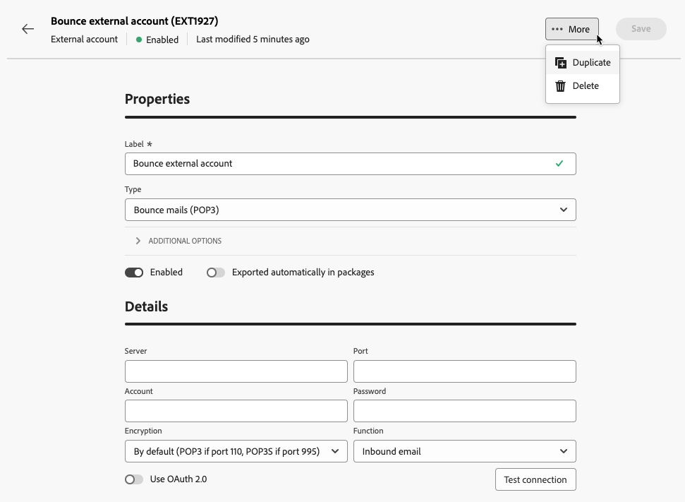

# Externe accounts beheren {#external-accounts}

>[!CONTEXTUALHELP]
>id="acw_homepage_welcome_rn3"
>title="Authoring externe account"
>abstract="Als beheerder van de Campagne, kunt u opstelling nieuwe verbindingen met externe systemen van het gebruikersinterface van het Web van de Campagne nu. U kunt ook bestaande externe accounts weergeven, bijwerken en beheren."
>additional-url="https://experienceleague.adobe.com/docs/campaign-web/v8/release-notes/release-notes.html" text="Zie opmerkingen bij releases"

Adobe Campaign bevat vooraf geconfigureerde externe accounts die eenvoudig kunnen worden geïntegreerd met verschillende systemen. Als u verbinding wilt maken met extra platforms of verbindingen wilt aanpassen aan uw workflow, maakt u nieuwe externe accounts met de webgebruikersinterface. Dit zorgt voor naadloze gegevensoverdracht.

## Een externe account maken {#create-ext-account}

Voer de onderstaande stappen uit om een nieuwe externe account te maken. Gedetailleerde instellingen zijn afhankelijk van het type externe account. [Meer informatie](#campaign-specific)

1. Selecteer **[!UICONTROL External accounts]** onder **[!UICONTROL Administration]** in het menu voor het linkerdeelvenster.

1. Klik op **[!UICONTROL Create external account]**.

   

1. Voer uw **[!UICONTROL Label]** in en selecteer de externe account **[!UICONTROL Type]** .

   >[!NOTE]
   >
   >De montages voor campagne-specifieke types zijn gedetailleerd in [ deze sectie ](#campaign-specific).

   

1. Klik op **[!UICONTROL Create]**.

1. Wijzig in de vervolgkeuzelijst **[!UICONTROL Additional options]** het pad **[!UICONTROL Internal name]** of **[!UICONTROL Folder]** , indien nodig.

   

1. Schakel de optie **[!UICONTROL Exported automatically in packages]** in om automatisch gegevens te exporteren die door deze externe account worden beheerd. <!--Exported where??-->

   

1. Configureer in de sectie **[!UICONTROL Details]** de toegang tot de account door referenties op te geven op basis van het gekozen externe accounttype. [Meer informatie](#bounce)

1. Klik op **[!UICONTROL Test connection]** om te controleren of de configuratie juist is.

1. Dupliceer of verwijder uw externe account vanuit het menu **[!UICONTROL More...]** .

   

1. Klik op **[!UICONTROL Save]** als de configuratie is voltooid.

## Campagne-specifieke externe rekeningen {#campaign-specific}

Afhankelijk van het geselecteerde externe accounttype voert u de onderstaande stappen uit om de accountinstellingen te configureren.

### Stuitberichten (POP3) {#bounce}

Met de externe account Bounce mails wordt de externe POP3-account opgegeven die wordt gebruikt om verbinding te maken met de e-mailservice. Alle servers die voor POP3 toegang worden gevormd kunnen terugkeerpost ontvangen.

Als u de **[!UICONTROL Bounce mails (POP3)]** externe account wilt configureren, vult u de volgende velden in:

* **[!UICONTROL Server]** - URL van de POP3-server.

* **[!UICONTROL Port]** - POP3-poortnummer (standaardpoort is 110).

* **[!UICONTROL Account]** - Naam van de gebruiker.

* **[!UICONTROL Password]** - Wachtwoord voor gebruikersaccount.

* **[!UICONTROL Encryption]** - Type gekozen codering, inclusief:
   * Standaard (POP3 als poort 110, POP3S als poort 995).
   * POP3 die overschakelt naar SSL na het verzenden van een STARTTLS.
   * POP3 niet-beveiligd (standaard poort 110).
   * POP3 beveiligd boven SSL (standaard poort 995).

* **[!UICONTROL Function]** - Selecteer **[!UICONTROL Inbound email]** om het account voor het ontvangen van inkomende e-mails te configureren of **[!UICONTROL SOAP router]** om SOAP-aanvragen af te handelen.

>[!IMPORTANT]
>
>Voordat u uw POP3-externe account configureert met Microsoft OAuth 2.0, moet u uw toepassing eerst registreren in de Azure-portal. Raadpleeg [deze pagina](https://learn.microsoft.com/en-us/entra/identity-platform/quickstart-register-app){target=_blank} voor meer informatie.

Als u een POP3-extern wilt configureren met Microsoft OAuth 2.0, schakelt u de optie Microsoft OAuth 2.0 in en vult u de volgende velden in:

* **[!UICONTROL Azure Tenant]**

  Azure ID (of Directory (huurder) ID) vindt u in de keuzelijst Essentiële elementen van het overzicht van uw toepassing in het Azure-portaal.

* **[!UICONTROL Azure Client ID]**

  Client ID (of Application (client)-id) vindt u in de keuzelijst Essentiële elementen van het overzicht van de toepassing in het Azure-portaal.

* **[!UICONTROL Azure Client Secret]**

  Identiteitskaart van het geheim van de cliënt kan in de geheimkolom van de Cliënt van het Certificaten &amp; geheimen menu van uw toepassing in het Azure portaal worden gevonden.

* **[!UICONTROL Azure Redirect URL]**

  De omleiding URL kan in het menu van de Authentificatie van uw toepassing in het Azure portaal worden gevonden. Deze moet eindigen met de volgende syntaxis nl/jsp/oauth.jsp, bijvoorbeeld `https://redirect.adobe.net/nl/jsp/oauth.jsp` .

De toegang van Internet is nodig voor opstelling en om de knoop van de Verbinding van de Test in de cliëntconsole te gebruiken. Na installatie kan het InMail-proces zonder internet communiceren met Microsoft-servers.

Nadat u de verschillende referenties hebt ingevoerd, kunt u op Setup klikken om de configuratie van uw externe account te voltooien.

### Routering {#routing}

Volg onderstaande stappen om een specifieke externe account voor externe leveringen te configureren.

1. Maak een externe account. [Meer informatie](../administration/external-account.md#create-ext-account)

1. Selecteer het type **[!UICONTROL Routing]** .

   {zoomable="yes"}

1. Selecteer het gewenste kanaal en klik op **[!UICONTROL Create]** .

1. In de sectie voor de externe account **[!UICONTROL Details]** is **[!UICONTROL External]** standaard geselecteerd als de **[!UICONTROL Delivery mode]** .

   {zoomable="yes"}

   >[!NOTE]
   >
   >Momenteel is **[!UICONTROL External]** de enige beschikbare modus.

1. Als u het proces na de uitvoering van de levering wilt afhandelen, dient u dit uit te besteden aan een workflow voor nabewerking. Creeer een werkschema met een [ Externe signaal ](../workflows/activities/external-signal.md) activiteit en selecteer het van het **[!UICONTROL Post-processing]** gebied.

   {zoomable="yes"}

1. Bewerk in het veld **[!UICONTROL Activity]** de naam van de activiteit van de nabewerkingsworkflow die in de logboeken wordt weergegeven. <!--you can edit the name of the activity that will be created if you add an external or bulk delivery to a workflow-->

### Uitvoeringsinstantie {#instance-exec}

Als u een gesegmenteerde architectuur hebt, identificeer de uitvoeringsinstanties verbonden aan de controleinstantie en vestigt verbindingen tussen hen. De transactionele berichtmalplaatjes worden opgesteld op de uitvoeringsinstantie.

U configureert als volgt de externe account van **[!UICONTROL Execution instance]** :

* **[!UICONTROL URL]** - URL van de server waarop de uitvoeringsinstantie is geïnstalleerd.

* **[!UICONTROL Account]** - Naam van de rekening, die de Agent van het Centrum van het Bericht zoals bepaald in de exploitantomslag aanpast.

* **[!UICONTROL Password]** - Wachtwoord van de account zoals gedefinieerd in de operatormap.

* **[!UICONTROL Method]** - Kies tussen de webservice of FDA (Federated Data Access).

  Selecteer voor FDA uw FDA-account. Merk op dat de verbinding van de campagne aan externe systemen tot geavanceerde gebruikers en slechts beschikbaar bij de cliëntconsole wordt beperkt. [Meer informatie](https://experienceleague.adobe.com/en/docs/campaign/campaign-v8/connect/fda#_blank)

* **[!UICONTROL Create archiving workflow]** - Voor elke uitvoeringsinstantie die in het Berichtencentrum wordt geregistreerd, ongeacht of u één of meerdere instanties hebt, creeer een afzonderlijke archiveringswerkstroom voor elke externe rekening verbonden aan de uitvoeringsinstantie.

## Externe accounts bij integratie van Adobe-oplossingen

### Adobe Experience Cloud

Als u verbinding wilt maken met de Adobe Campaign-console via een Adobe ID, moet u de externe Adobe Experience Cloud-account (MAC) configureren.

* **[!UICONTROL IMS server]**

  URL van uw IMS-server. Zorg ervoor zowel stadium als de productie instanties aan het zelfde IMS productieeindpunt richten.

* **[!UICONTROL IMS scope]**

  De hier gedefinieerde bereiken moeten een subset zijn van de gebieden die door IMS zijn ingericht.

* **[!UICONTROL IMS client identifier]**

  ID van uw IMS-client.

* **[!UICONTROL IMS client secret]**

  Credentials van het geheim van de IMS-client.

* **[!UICONTROL Callback server]**

  Toegang tot URL van je Adobe Campaign-instantie.

* **[!UICONTROL IMS organization ID]**

  Id van uw organisatie. Om uw organisatieidentiteitskaart te vinden, verwijs naar [ deze pagina ](https://experienceleague.adobe.com/docs/core-services/interface/administration/organizations.html?lang=nl){target=_blank}.

* **[!UICONTROL Association mask]**

  Syntaxis waarmee configuratienamen in Enterprise-dashboard kunnen worden gesynchroniseerd met de groepen in Adobe Campaign.

* **[!UICONTROL Server]**

  URL van je Adobe Experience Cloud-exemplaar.

* **[!UICONTROL Tenant]**

  Naam van je Adobe Experience Cloud Tenant.

## Externe accounts voor gegevensoverdracht

### Amazon Simple Storage Service (S3) {#amazon-simple-storage-service--s3--external-account}

De Amazon Simple Storage Service (S3)-connector kan worden gebruikt voor het importeren of exporteren van gegevens naar Adobe Campaign. Deze kan worden ingesteld in een workflowactiviteit. Raadpleeg [deze pagina](https://experienceleague.adobe.com/en/docs/campaign-web/v8/wf/design-workflows/transfer-file){target=_blank} voor meer informatie.

Wanneer u dit nieuwe externe account instelt, moet u de volgende data opgeven:

* **[!UICONTROL AWS S3 Account Server]**

  URL van uw server, zou het als volgt moeten worden gevuld:

  `  <S3bucket name>.s3.amazonaws.com/<s3object path>`

* **[!UICONTROL AWS access key ID]**

  Om te weten waar te om uw de toegangs belangrijkste identiteitskaart van AWS te vinden, verwijs naar deze [ pagina ](https://docs.aws.amazon.com/general/latest/gr/aws-sec-cred-types.html#access-keys-and-secret-access-keys).

* **[!UICONTROL Secret access key to AWS]**

  Om te weten waar te om uw geheime toegangstoets aan AWS te vinden, verwijs naar deze [ pagina ](https://aws.amazon.com/fr/blogs/security/wheres-my-secret-access-key/).

* **[!UICONTROL AWS Region]**

  Om meer op het gebied van AWS te leren, verwijs naar deze [ pagina ](https://aws.amazon.com/about-aws/global-infrastructure/regions_az/).

* Met het selectievakje **[!UICONTROL Use server side encryption]** kunt u het bestand opslaan in de modus S3-versleuteling.

Leren waar te om toegangs zeer belangrijke identiteitskaart en geheime toegangssleutel te vinden, verwijs naar de diensten van het Web van Amazon [ documentatie ](https://docs.aws.amazon.com/general/latest/gr/aws-sec-cred-types.html#access-keys-and-secret-access-keys).

### Azure Blob Storage {#azure-blob-external-account}

De **[!UICONTROL Azure Blob Storage]** -externe account kan worden gebruikt om gegevens te importeren of te exporteren naar Adobe Campaign via een **[!UICONTROL Transfer file]** -workflowactiviteit. Raadpleeg [deze sectie](https://experienceleague.adobe.com/en/docs/campaign-web/v8/wf/design-workflows/transfer-file){target=_blank} voor meer informatie.

Als u **[!UICONTROL Azure external account]** wilt configureren om te werken met Adobe Campaign, moet u de volgende gegevens opgeven:

* **[!UICONTROL Server]**

  URL van uw Azure Blob-opslagserver.

* **[!UICONTROL Encryption]**

  Type gekozen codering tussen **[!UICONTROL None]** of **[!UICONTROL SSL]** .

* **[!UICONTROL Access key]**

  Om te weten waar te om uw **[!UICONTROL Access key]** te vinden, verwijs naar deze [ pagina ](https://docs.microsoft.com/en-us/azure/storage/common/storage-account-keys-manage?tabs=azure-portal).

## Hadoop

Met de externe Hadoop-account kunt u uw Campagne-instantie verbinden met uw externe Hadoop-database. U kunt meer over Hadoop in [ Campagne V7 consoledocumentatie ](https://experienceleague.adobe.com/en/docs/campaign-classic/using/installing-campaign-classic/accessing-external-database/configure-fda/config-databases/configure-fda-hadoop){target=_blank} leren.

* **[!UICONTROL Server]**

  URL van uw Hadoop-opslagserver.

* **[!UICONTROL Account]**

  Naam van uw Hadoop-serveraccount.
