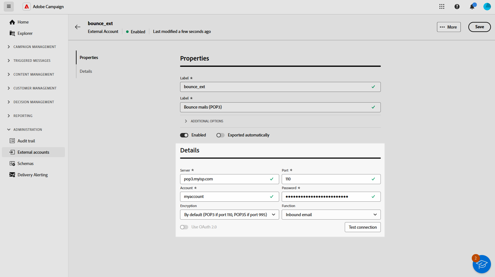
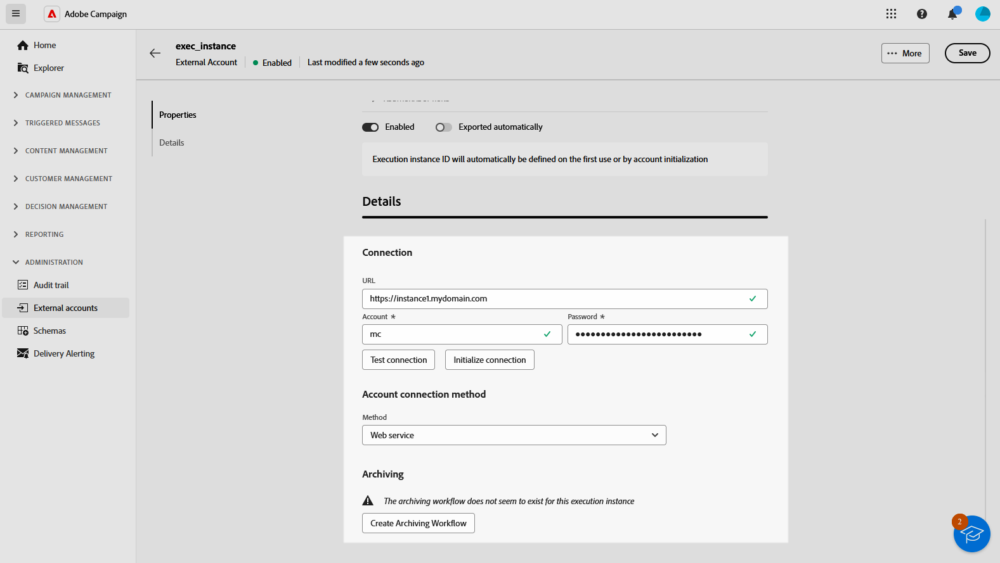

# Campagne-specifieke externe rekeningen {#external-account}

Voer de onderstaande stappen uit om de accountinstellingen te configureren op basis van het type externe account dat u hebt geselecteerd.

## Stuitberichten (POP3) {#bounce}

Met de externe account Bounce mails wordt de externe POP3-account opgegeven die wordt gebruikt om verbinding te maken met de e-mailservice. Alle servers die voor POP3 toegang worden gevormd kunnen terugkeerpost ontvangen.

Als u de **[!UICONTROL Bounce mails (POP3)]** externe account wilt configureren, vult u de volgende velden in:

* **[!UICONTROL Server]** - URL van de POP3-server.

* **[!UICONTROL Port]** - POP3-poortnummer (standaardpoort is 110).

* **[!UICONTROL Account]** - Naam van de gebruiker.

* **[!UICONTROL Password]** - Wachtwoord voor gebruikersaccount.

* **[!UICONTROL Encryption]** - Type gekozen codering, inclusief:
   * Standaard (POP3 als poort 110, POP3S als poort 995).
   * POP3 die overschakelt naar SSL na het verzenden van een STARTTLS.
   * POP3 niet-beveiligd (standaard poort 110).
   * POP3 beveiligd boven SSL (standaard poort 995).

* **[!UICONTROL Function]** - Selecteer **[!UICONTROL Inbound email]** om het account voor het ontvangen van inkomende e-mails te configureren of **[!UICONTROL SOAP router]** om SOAP-aanvragen af te handelen.

>[!IMPORTANT]
>
>Voordat u uw POP3-externe account configureert met Microsoft OAuth 2.0, moet u uw toepassing eerst registreren in de Azure-portal. Raadpleeg [deze pagina](https://learn.microsoft.com/en-us/entra/identity-platform/quickstart-register-app){target=_blank} voor meer informatie.

Als u een POP3-extern wilt configureren met Microsoft OAuth 2.0, schakelt u de optie Microsoft OAuth 2.0 in en vult u de volgende velden in:

* **[!UICONTROL Azure Tenant]**

  Azure ID (of Directory (huurder) ID) vindt u in de keuzelijst Essentiële elementen van het overzicht van uw toepassing in het Azure-portaal.

* **[!UICONTROL Azure Client ID]**

  Client ID (of Application (client)-id) vindt u in de keuzelijst Essentiële elementen van het overzicht van de toepassing in het Azure-portaal.

* **[!UICONTROL Azure Client Secret]**

  Identiteitskaart van het geheim van de cliënt kan in de geheimkolom van de Cliënt van het Certificaten &amp; geheimen menu van uw toepassing in het Azure portaal worden gevonden.

* **[!UICONTROL Azure Redirect URL]**

  De omleiding URL kan in het menu van de Authentificatie van uw toepassing in het Azure portaal worden gevonden. Deze moet eindigen met de volgende syntaxis nl/jsp/oauth.jsp, bijvoorbeeld `https://redirect.adobe.net/nl/jsp/oauth.jsp` .

De toegang van Internet is nodig voor opstelling en om de knoop van de Verbinding van de Test in de cliëntconsole te gebruiken. Na installatie kan het InMail-proces zonder internet communiceren met Microsoft-servers.

Nadat u de verschillende referenties hebt ingevoerd, kunt u op Setup klikken om de configuratie van uw externe account te voltooien.

## Routering {#routing}

Volg onderstaande stappen om een specifieke externe account voor externe leveringen te configureren.

1. Maak een externe account. [Meer informatie](create-external-account.md)

1. Selecteer het type **[!UICONTROL Routing]** .

   {zoomable="yes"}

1. Selecteer het gewenste kanaal en klik op **[!UICONTROL Create]** .

1. In de sectie voor de externe account **[!UICONTROL Details]** is **[!UICONTROL External]** standaard geselecteerd als de **[!UICONTROL Delivery mode]** .

   {zoomable="yes"}

   >[!NOTE]
   >
   >Momenteel is **[!UICONTROL External]** de enige beschikbare modus.

1. Als u het proces na de uitvoering van de levering wilt afhandelen, dient u dit uit te besteden aan een workflow voor nabewerking. Creeer een werkschema met een [&#x200B; Externe signaal &#x200B;](../workflows/activities/external-signal.md) activiteit en selecteer het van het **[!UICONTROL Post-processing]** gebied.

   {zoomable="yes"}

1. Bewerk in het veld **[!UICONTROL Activity]** de naam van de activiteit van de nabewerkingsworkflow die in de logboeken wordt weergegeven. <!--you can edit the name of the activity that will be created if you add an external or bulk delivery to a workflow-->

## Uitvoeringsinstantie {#instance-exec}

Als u een gesegmenteerde architectuur hebt, identificeer de uitvoeringsinstanties verbonden aan de controleinstantie en vestigt verbindingen tussen hen. De transactionele berichtmalplaatjes worden opgesteld op de uitvoeringsinstantie.

U configureert als volgt de externe account van **[!UICONTROL Execution instance]** :

* **[!UICONTROL URL]** - URL van de server waarop de uitvoeringsinstantie is geïnstalleerd.

* **[!UICONTROL Account]** - Naam van de rekening, die de Agent van het Centrum van het Bericht zoals bepaald in de exploitantomslag aanpast.

* **[!UICONTROL Password]** - Wachtwoord van de account zoals gedefinieerd in de operatormap.

* **[!UICONTROL Method]** - Kies tussen de webservice of FDA (Federated Data Access).

  Selecteer voor FDA uw FDA-account. Merk op dat de verbinding van de campagne aan externe systemen tot geavanceerde gebruikers en slechts beschikbaar bij de cliëntconsole wordt beperkt. [Meer informatie](https://experienceleague.adobe.com/nl/docs/campaign/campaign-v8/connect/fda#_blank)

* **[!UICONTROL Create archiving workflow]** - Voor elke uitvoeringsinstantie die in het Berichtencentrum wordt geregistreerd, ongeacht of u één of meerdere instanties hebt, creeer een afzonderlijke archiveringswerkstroom voor elke externe rekening verbonden aan de uitvoeringsinstantie.
