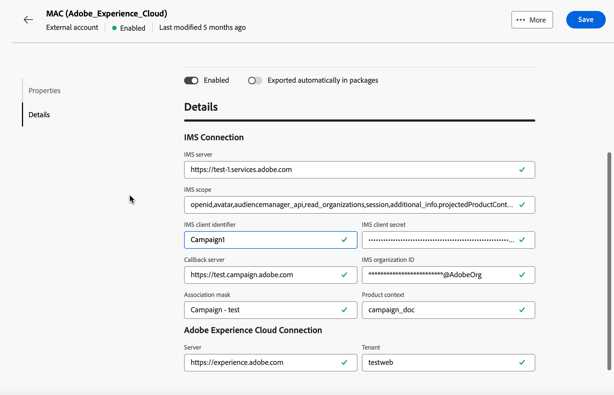

# Externe accounts bij integratie van Adobe-oplossingen {#integration-external-account}

Afhankelijk van het type externe account voor Adobe Solution Integration dat u hebt geselecteerd, volgt u de onderstaande stappen om de verbinding- en accountinstellingen te configureren voor naadloze integratie met Adobe-services.

## Adobe Experience Cloud

Als u verbinding wilt maken met de Adobe Campaign-console via een Adobe ID, moet u de externe Adobe Experience Cloud-account (MAC) configureren.

Als u de **[!UICONTROL Adobe Experience Cloud]** externe account wilt configureren, vult u de volgende velden in:

* **[!UICONTROL IMS server]**

  URL van uw IMS-server. Zorg ervoor zowel stadium als de productie instanties aan het zelfde IMS productieeindpunt richten.

* **[!UICONTROL IMS scope]**

  De hier gedefinieerde bereiken moeten een subset zijn van de gebieden die door IMS zijn ingericht.

* **[!UICONTROL IMS client identifier]**

  ID van uw IMS-client.

* **[!UICONTROL IMS client secret]**

  Credentials van het geheim van de IMS-client.

* **[!UICONTROL Callback server]**

  Toegang tot URL van je Adobe Campaign-instantie.

* **[!UICONTROL IMS organization ID]**

  Id van uw organisatie. Om uw organisatieidentiteitskaart te vinden, verwijs naar [ deze pagina ](https://experienceleague.adobe.com/docs/core-services/interface/administration/organizations.html?lang=nl){target=_blank}.

* **[!UICONTROL Association mask]**

  Syntaxis waarmee configuratienamen in Enterprise-dashboard kunnen worden gesynchroniseerd met de groepen in Adobe Campaign.

* **[!UICONTROL Server]**

  URL van je Adobe Experience Cloud-exemplaar.

* **[!UICONTROL Tenant]**

  Naam van je Adobe Experience Cloud Tenant.
