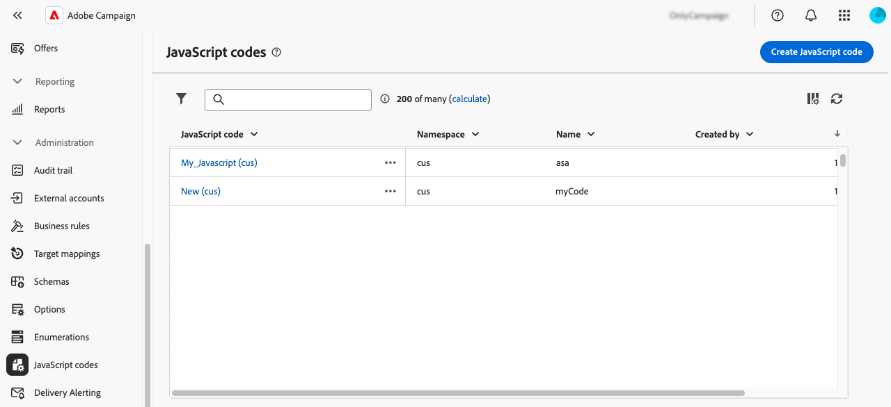

# Werken met JavaScript-codes {#javascript-codes}

>[!CONTEXTUALHELP]
>id="acw_javascript_codes_list"
>title="JavaScript-codes"
>abstract="JavaScript-codes"

>[!CONTEXTUALHELP]
>id="acw_javascript_codes_create"
>title="JavaScript-code maken"
>abstract="JavaScript-code maken"

## Informatie over JavaScript-codes {#about}

Met JavaScript-codes kunt u herbruikbare functies maken die in verschillende workflows kunnen worden gebruikt, net als in een bibliotheek. Deze functies worden opgeslagen in het menu **[!UICONTROL Administration]** > **[!UICONTROL JavaScript codes]** in het linkernavigatievenster.



In de lijst met JavaScript-codes kunt u:

* **dupliceer of schrap een code**: Klik de elliptische knoop en selecteer de gewenste actie.
* **wijzig een code**: Klik de naam van een code om zijn eigenschappen te openen. Breng de wijzigingen aan en sla deze op.
* **creeer een nieuwe code van JavaScript**: Klik de **[!UICONTROL Create JavaScript code]** knoop.

>[!NOTE]
>
>Hoewel de locatie van het menu met JavaScript-codes verschilt tussen de Adobe Campaign-console en de webgebruikersinterface, is de lijst identiek en werkt deze als een spiegel.

## Een JavaScript-code maken {#create}

Ga als volgt te werk om een JavaScript-code te maken:

1. Navigeer naar het menu **[!UICONTROL JavaScript codes]** en klik op de knop **[!UICONTROL Create JavaScript code]** .

1. Definieer de eigenschappen van de code:

   * **[!UICONTROL Namespace]**: geef de naamruimte op die relevant is voor uw aangepaste bronnen. Standaard is de naamruimte &#39;cus&#39;, maar deze kan variëren, afhankelijk van uw implementatie.
   * **[!UICONTROL Name]**: De unieke id die moet worden gebruikt om naar de code te verwijzen.
   * **[!UICONTROL Label]**: Het beschrijvende label dat in de lijst met JavaScript-codes moet worden weergegeven.

   

   >[!NOTE]
   >
   >Nadat de velden **[!UICONTROL Namespace]** en **[!UICONTROL Name]** zijn gemaakt, kunnen deze niet meer worden gewijzigd. Als u wijzigingen wilt aanbrengen, dupliceert u de code en werkt u deze zo nodig bij.
   >
   >In de Campagne console, verschijnt de de codenaam van JavaScript als aaneenschakeling van deze twee gebieden.

1. Klik op de knop **[!UICONTROL Create code]** om de JavaScript-code te definiëren. Het linkerdeelvenster bevat twee menu&#39;s waarmee u vooraf gedefinieerde functies kunt gebruiken die betrekking hebben op de voorwaarden en datumnotatie.

   

1. Klik op **[!UICONTROL Confirm]** om de code op te slaan.

1. Klik op **[!UICONTROL Create]** wanneer uw JavaScript-code gereed is.  De JavaScript-code is nu beschikbaar voor workflows.

## JavaScript-code uit een workflow gebruiken {#workflow}

### JavaScript-codebibliotheken laden {#library}

U kunt in workflows naar JavaScript-codes verwijzen om te voorkomen dat code voor herhalende taken opnieuw wordt geschreven. Als u deze codes wilt gebruiken, moet u eerst de bijbehorende bibliotheek laden in het initialisatiescript van de workflow. Hierdoor kunt u alle bibliotheken laden die de functies bevatten die u in uw workflow wilt gebruiken.

Ga als volgt te werk om een bibliotheek te laden:

1. Open een workflow en klik op de knop **[!UICONTROL Settings]** .
1. Ga naar de sectie **[!UICONTROL Initialization script]** en klik op **[!UICONTROL Create code]** .

   

1. Gebruik de onderstaande syntaxis in de code om een bibliotheek te laden:

   ```
   loadLibrary("/<namespace>/<name>")
   ```

   * Vervang `<namespace>` door de naamruimte die is opgegeven tijdens het maken van de JavaScript-code.
   * Vervang `<name>` door de naam van de JavaScript-code.

1. Klik op **[!UICONTROL Confirm]** en sla de instellingen op.

### Referentiefuncties in workflows {#reference}

Nadat de JavaScript-bibliotheek is geladen, kunt u rechtstreeks in de workflow verwijzen naar de functies die in de JavaScript-code zijn gedefinieerd, meestal met een **[!UICONTROL JavaScript code]** -activiteit.


