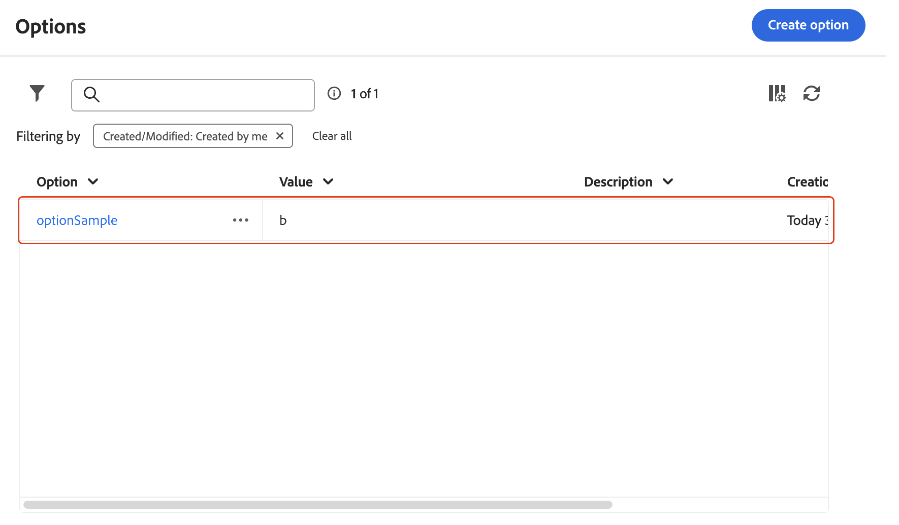

# [!DNL Campaign] -opties configureren {#options}

>[!CONTEXTUALHELP]
>id="acw_options_list"
>title="Opties"
>abstract="Opties"

>[!CONTEXTUALHELP]
>id="acw_options_create"
>title="Maken, optie"
>abstract="Maken, optie"

Adobe Campaign Web omvat technische opties die u toestaan om de toepassing meer specifiek te vormen. Sommige van deze opties zijn ingebouwd, terwijl andere indien nodig handmatig kunnen worden toegevoegd.

>[!IMPORTANT]\
>Ingebouwde opties zijn vooraf geconfigureerd en mogen alleen door gevorderde gebruikers worden gewijzigd. Neem contact op met uw Adobe-vertegenwoordiger als u vragen of verzoeken hebt.

## Opties voor Access Campaign {#access}

U kunt opties kiezen in het menu **[!UICONTROL Administration]** / **[!UICONTROL Options]** . Gebruik het filterdeelvenster om de lijst te versmallen en snel de gewenste optie te zoeken.

\
[ lijst van Opties die in het Beleid/menu van Opties wordt getoond ]

>[!NOTE]\
>Hoewel de locatie van het optiemenu verschilt tussen de Adobe Campaign-console en de webgebruikersinterface, is de lijst identiek en werkt deze als een spiegel. Voor meer details over de beschikbare opties, verwijs naar de lijst van opties in [ de documentatie van de Campagne v7 ](https://experienceleague.adobe.com/en/docs/campaign-classic/using/installing-campaign-classic/appendices/configuring-campaign-options) {target="_blank"}.

In de lijst met opties kunt u:

* **dupliceer of schrap een optie**: Klik de elliptische knoop en selecteer de gewenste actie.
* **wijzig een optie**: Klik de naam van de optie om zijn eigenschappen te openen. Breng de wijzigingen aan en sla deze op.
* **creeer een douaneoptie**: Klik de **[!UICONTROL Create option]** knoop.

## Een optie maken {#create}

Met de Adobe Campaign Web-gebruikersinterface kunt u aangepaste opties maken die aan uw vereisten voldoen. Dit is vooral handig wanneer u met **[!UICONTROL JavaScript code]** -workflowactiviteiten werkt om tussentijdse gegevens op te slaan.

Een optie maken:

1. Open de lijst met opties en klik op **[!UICONTROL Create option]** .
1. Voer een naam voor de optie in, selecteer het type en stel de gewenste waarde in.
1. Klik op **[!UICONTROL Create]** om de optie te maken.

De opties kunnen als tijdelijke opslag voor gegevens dienst doen, die de volgende voordelen aanbieden:

* Getypte waarden: de opties ondersteunen specifieke gegevenstypen, zoals datums, gehele getallen, tekenreeksen, enzovoort.
* Flexibiliteit: de opties staan gebruikers toe om gegevens efficiënt op te slaan en terug te winnen zonder de overheadkosten van het beheren van gegevensbestandlijsten.

In het onderstaande voorbeeld wordt een aangepaste optie met de naam `sampleOption` gemaakt met de beginwaarde &quot;a&quot;. Een **[!UICONTROL JavaScript code]** -activiteit in een workflow wijzigt de waarde van deze optie en slaat deze op in een variabele. De bijgewerkte waarde wordt weergegeven in de logboeken van de workflow en weergegeven in het menu **[!UICONTROL Options]** .

1. Maak de optie.

    toont

1. Configureer een **[!UICONTROL JavaScript code]** -activiteit en start de workflow.

   

1. Voer de workflow uit om de bijgewerkte waarde in de logboeken van de workflow te bekijken.

   

1. De bijgewerkte waarde wordt nu weergegeven in het menu **[!UICONTROL Options]** .

   