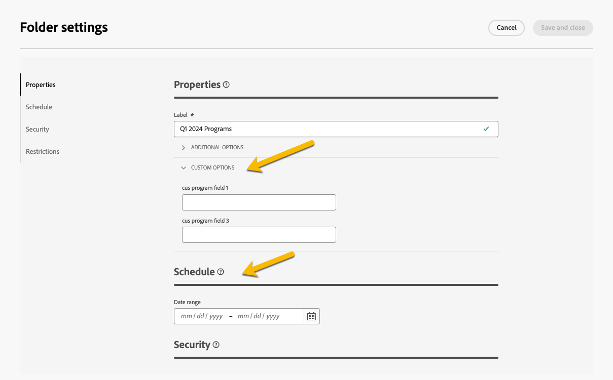

# Abonnementen en programma&#39;s {#plan-and-programs}

>[!CONTEXTUALHELP]
>id="acw_homepage_welcome_rn2"
>title="Abonnementen en programma&#39;s"
>abstract="U kunt uw omslaghiërarchie voor marketing plannen en programma&#39;s in het gebruikersinterface van het Web van de Campagne nu vormen."
>additional-url="https://experienceleague.adobe.com/docs/campaign-web/v8/release-notes/release-notes.html" text="Zie opmerkingen bij releases"

Met Adobe Campaign kunt u uw maphiërarchie configureren voor marketingplannen en -programma&#39;s.

Om ze beter te organiseren, raadt de Adobe de volgende hiërarchie aan: Plan `>` Programma&#39;s `>` Campagnes

* A **plan** kan meerdere programma&#39;s bevatten. In het voorstel worden strategische doelstellingen voor een bepaalde periode vastgesteld.
* A **programma** kunnen andere programma&#39;s bevatten, alsmede campagnes, workflows en landingspagina&#39;s.
* A **campagne** kan leveringen, workflows en bestemmingspagina&#39;s bevatten.

## Een abonnement maken en configureren {#create-plan}

Als u een plan wilt maken, moet u een map maken met het mappstype **[!UICONTROL Plan]** [Meer informatie over het maken van een map](create-manage-folder.md).

{zoomable="yes"}

Ga naar de **[!UICONTROL Folder settings]** van uw plan om het te beheren.

{zoomable="yes"}

U kunt **[!UICONTROL Custom options]** en om de planningsdatum van uw abonnement in te stellen.

{zoomable="yes"}

Om het  **[!UICONTROL Custom options]**:

1. Bladeren naar de **[!UICONTROL Schemas]**
1. Kies de optie **[!UICONTROL Editable]** schema&#39;s in de filters
1. Klik op het pictogram van **[!UICONTROL Edit custom details]**

{zoomable="yes"}

U kunt ze configureren:

{zoomable="yes"}

## Een programma maken en configureren

Een programma maken in uw abonnement ([Meer informatie over het maken van een abonnement](#create-plan)), moet u in uw plan zijn en een omslag met het omslagtype creëren **[!UICONTROL Program]** [Meer informatie over het maken van een map](create-manage-folder.md).

{zoomable="yes"}

Ga naar de **[!UICONTROL Folder settings]** van uw programma om het te beheren.

{zoomable="yes"}

U kunt **[!UICONTROL Custom options]** en om de planningsdatum van uw programma in te stellen.

{zoomable="yes"}

Om het  **[!UICONTROL Custom options]**:

1. Bladeren naar de **[!UICONTROL Schemas]**
1. Kies de optie **[!UICONTROL Editable]** schema&#39;s in de filters
1. Klik op het pictogram van **[!UICONTROL Edit custom details]**

{zoomable="yes"}

U kunt hen vormen:

{zoomable="yes"}

## Een campagne koppelen aan een programma

U kunt een campagne op twee manieren koppelen aan een programma:

### Way #1: U hebt al een programma en wilt een campagne opzetten die eraan gekoppeld is

Als u een nieuwe campagne wilt koppelen aan uw programma, maakt u de campagne rechtstreeks in het programma:

{zoomable="yes"}

De **[!UICONTROL Folder]** de instellingen worden automatisch met het pad naar uw programma gearchiveerd.

{zoomable="yes"}

### Way #2: U hebt al een bestaande campagne en wilt deze koppelen aan een bestaand programma

Ga naar de **[!UICONTROL Settings]** knop van de campagne die u aan uw programma wilt koppelen:

{zoomable="yes"}

In haar **[!UICONTROL Properties]** klikt u op de knop **[!UICONTROL Folder]** in het deelvenster **[!UICONTROL Folder]** om uw **[!UICONTROL Program]** map.

{zoomable="yes"}

Selecteer uw **[!UICONTROL Program]** en klik op **[!UICONTROL Confirm]** en vervolgens aan **[!UICONTROL Save and Close]** knop.

{zoomable="yes"}

Uw campagne wordt nu vermeld in uw programma:

{zoomable="yes"}
