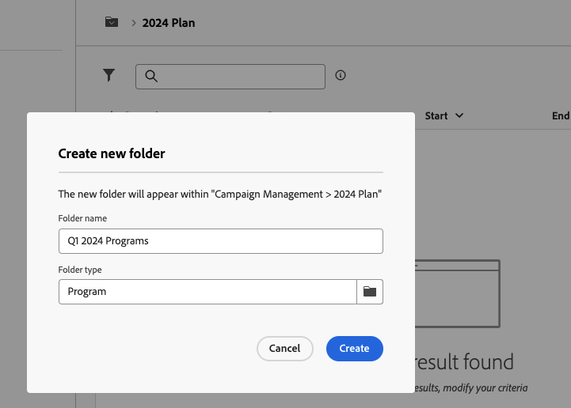
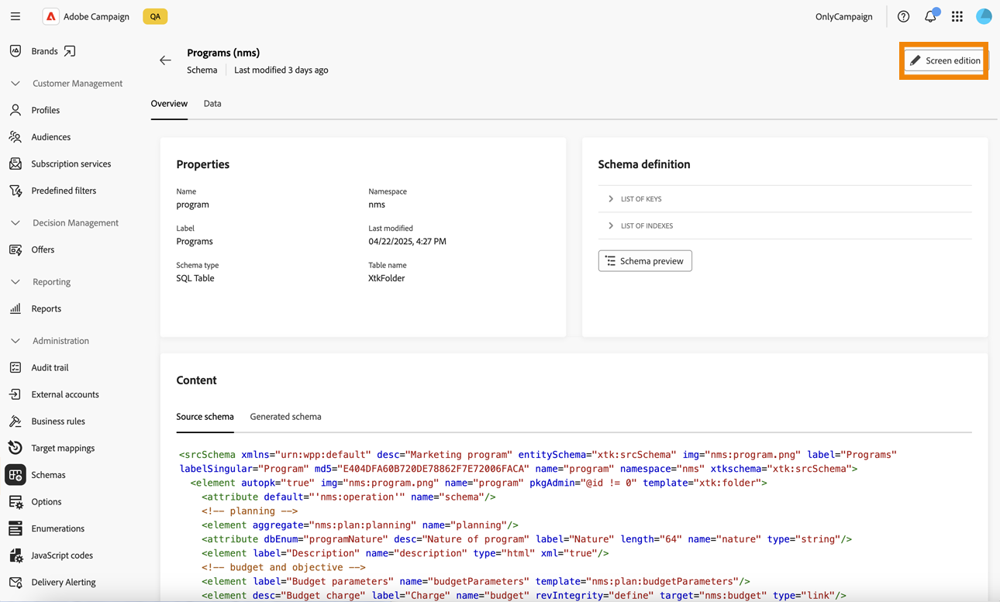

# Abonnementen en programma&#39;s {#plan-and-programs}

Met Adobe Campaign kunt u uw maphiërarchie configureren voor marketingplannen en -programma&#39;s.

Voor een betere organisatie van deze componenten raadt Adobe de volgende hiërarchie aan: `>` Programma&#39;s plannen `>` .

* A **plan** kan veelvoudige programma&#39;s bevatten. In het voorstel worden strategische doelstellingen voor een specifieke periode vastgesteld.
* A **programma** kan andere programma&#39;s evenals campagnes, werkschema&#39;s, en landende pagina&#39;s bevatten.
* A **campagne** kan leveringen, werkschema&#39;s, en landende pagina&#39;s bevatten.

## Een abonnement maken en configureren {#create-plan}

Als u een abonnement wilt maken, maakt u een map met het maptype **[!UICONTROL Plan]** . [ Leer meer over het creëren van een omslag ](../get-started/work-with-folders.md)

{zoomable="yes"}

Ga naar de **[!UICONTROL Folder settings]** van uw plan om het te beheren.

{zoomable="yes"}

Definieer **[!UICONTROL Custom options]** en stel de planningsdatum van uw abonnement in.

{zoomable="yes"}

U kunt als volgt de **[!UICONTROL Custom options]** beheren:

1. Blader naar **[!UICONTROL Schemas]** .
1. Kies de schema&#39;s **[!UICONTROL Editable]** in de filters.
1. Klik op het schema.

{zoomable="yes"}

1. Klik op de knop **[!UICONTROL Screen edition]**.

   {zoomable="yes"}

Configureer de aangepaste opties:

{zoomable="yes"}

## Een programma maken en configureren

Om een programma in uw plan ([ te creëren Leer meer over het creëren van een plan ](#create-plan)), navigeer aan uw plan en creeer een omslag met het omslagtype **[!UICONTROL Program]**. [ Leer meer over het creëren van een omslag ](../get-started/work-with-folders.md).

{zoomable="yes"} tonen

Ga naar de **[!UICONTROL Folder settings]** van uw programma om het te beheren.

{zoomable="yes"}

Definieer **[!UICONTROL Custom options]** en stel de planningsdatum van uw programma in.

{zoomable="yes"}

U kunt als volgt de **[!UICONTROL Custom options]** beheren:

1. Blader naar **[!UICONTROL Schemas]** .
1. Kies de schema&#39;s **[!UICONTROL Editable]** in de filters.
1. Klik op het schema.

{zoomable="yes"}

1. Klik op de knop **[!UICONTROL Screen edition]**.

   {zoomable="yes"}

Configureer de aangepaste opties:

{zoomable="yes"}

## Een campagne koppelen aan een programma

U kunt een campagne op twee manieren koppelen aan een programma:

### Way #1: U hebt al een programma en wilt een campagne opzetten die eraan gekoppeld is

Als u een nieuwe campagne wilt koppelen aan uw programma, maakt u de campagne rechtstreeks in het programma.

{zoomable="yes"}

De instellingen van **[!UICONTROL Folder]** worden automatisch gevuld met het pad naar uw programma.

{zoomable="yes"}

### Way #2: U hebt al een bestaande campagne en wilt deze koppelen aan een bestaand programma

Ga naar de knop **[!UICONTROL Settings]** van de campagne die u aan uw programma wilt koppelen.

{zoomable="yes"}

Klik in de **[!UICONTROL Properties]** -map op het pictogram **[!UICONTROL Folder]** in de **[!UICONTROL Folder]** -instellingen om de **[!UICONTROL Program]** -map te kiezen.

{zoomable="yes"}

Selecteer de map **[!UICONTROL Program]** , klik op de knop **[!UICONTROL Confirm]** en klik vervolgens op de knop **[!UICONTROL Save and Close]** .

{zoomable="yes"}

Uw campagne wordt nu vermeld in uw programma.

{zoomable="yes"} wordt vermeld