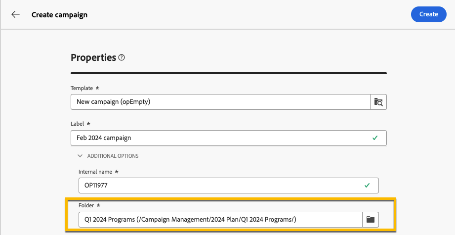

# Abonnementen en programma&#39;s {#plan-and-programs}

>[!CONTEXTUALHELP]
>id="acw_homepage_welcome_rn3"
>title="Abonnementen en programma&#39;s"
>abstract="U kunt uw omslaghiërarchie voor marketing plannen en programma&#39;s in het gebruikersinterface van het Web van de Campagne nu vormen."
>additional-url="https://experienceleague.adobe.com/docs/campaign-web/v8/release-notes/release-notes.html" text="Zie opmerkingen bij releases"

Met Adobe Campaign kunt u uw maphiërarchie configureren voor marketingplannen en -programma&#39;s.

Voor een betere organisatie van de programma&#39;s raadt de Adobe de volgende hiërarchie aan: `>` Programma&#39;s plannen `>`

* A **plan** kan veelvoudige programma&#39;s bevatten. In het voorstel worden strategische doelstellingen voor een bepaalde periode vastgesteld.
* A **programma** kan andere programma&#39;s evenals campagnes, werkschema&#39;s en landende pagina&#39;s bevatten.
* A **campagne** kan leveringen, werkschema&#39;s en landende pagina&#39;s bevatten.

## Een abonnement maken en configureren {#create-plan}

Om een plan tot stand te brengen, moet u een omslag met het omslagtype **[!UICONTROL Plan]** [ tot stand brengen meer over het creëren van een omslag ](../get-started/work-with-folders.md) leren.

{zoomable="yes"}

Ga naar de **[!UICONTROL Folder settings]** van uw plan om het te beheren.

{zoomable="yes"}

U kunt **[!UICONTROL Custom options]** definiëren en de planningsdatum van uw abonnement instellen.

{zoomable="yes"}

U kunt als volgt de **[!UICONTROL Custom options]** beheren:

1. Bladeren naar de **[!UICONTROL Schemas]**
1. Kies de **[!UICONTROL Editable]** schema&#39;s in de filters
1. Klik op het pictogram van **[!UICONTROL Edit custom details]**

{zoomable="yes"}

U kunt ze configureren:

{zoomable="yes"}

## Een programma maken en configureren

Om een programma in uw plan ([ te creëren Leer meer over het creëren van een plan ](#create-plan)), moet u in uw plan zijn en een omslag met het omslagtype **[!UICONTROL Program]** tot stand brengen [ Leer meer over het creëren van een omslag ](../get-started/work-with-folders.md).

{zoomable="yes"}

Ga naar de **[!UICONTROL Folder settings]** van uw programma om het te beheren.

{zoomable="yes"}

U kunt **[!UICONTROL Custom options]** definiëren en de planningsdatum van uw programma instellen.

{zoomable="yes"}

U kunt als volgt de **[!UICONTROL Custom options]** beheren:

1. Bladeren naar de **[!UICONTROL Schemas]**
1. Kies de **[!UICONTROL Editable]** schema&#39;s in de filters
1. Klik op het pictogram van **[!UICONTROL Edit custom details]**

{zoomable="yes"}

U kunt ze configureren:

{zoomable="yes"}

## Een campagne koppelen aan een programma

U kunt een campagne op twee manieren koppelen aan een programma:

### Way #1: U hebt al een programma en wilt een campagne opzetten die eraan gekoppeld is

Als u een nieuwe campagne wilt koppelen aan uw programma, maakt u de campagne rechtstreeks in het programma:

{zoomable="yes"}

De **[!UICONTROL Folder]** -instellingen worden automatisch ingevuld met het pad naar uw programma.

{zoomable="yes"}

### Way #2: U hebt al een bestaande campagne en wilt deze koppelen aan een bestaand programma

Ga naar de knop **[!UICONTROL Settings]** van de campagne die u aan uw programma wilt koppelen:

{zoomable="yes"}

Klik in de **[!UICONTROL Properties]** ervan op het pictogram **[!UICONTROL Folder]** in de **[!UICONTROL Folder]** -instellingen om de **[!UICONTROL Program]** -map te kiezen.

{zoomable="yes"}

Selecteer de map **[!UICONTROL Program]** en klik op de knop **[!UICONTROL Confirm]** en vervolgens op de knop **[!UICONTROL Save and Close]** .

{zoomable="yes"}

Uw campagne wordt nu vermeld in uw programma:

{zoomable="yes"}
