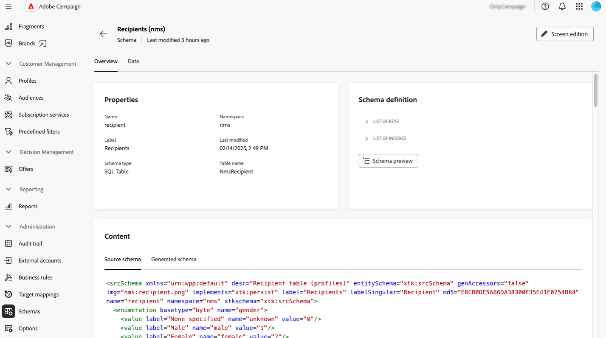

# Werken met schema&#39;s {#schemas}

>[!CONTEXTUALHELP]
>id="acw_schema"
>title="Schemas"
>abstract="**[!DNL Adobe Campaign]** gebruikt op XML gebaseerde schema&#39;s om de fysieke en logische structuur van gegevens binnen de toepassing te bepalen. Van dit scherm, kunt u alle bestaande schema&#39;s bekijken en tot de details van een schema toegang hebben door zijn naam in de lijst te selecteren. Er zijn filters beschikbaar waarmee u de lijst kunt verfijnen, zoals alleen bewerkbare schema&#39;s weergeven."

## Over schema&#39;s {#about}

**[!DNL Adobe Campaign]** gebruikt op XML gebaseerde schema&#39;s om de fysieke en logische structuur van gegevens binnen de toepassing te bepalen. Een schema is een XML-document dat is gekoppeld aan een databasetabel die het volgende definieert:

* De SQL-tabelstructuur, inclusief tabelnaam, velden en relaties.
* De XML-gegevensstructuur, inclusief elementen, kenmerken, hiërarchie, typen, standaardwaarden en labels.

Schema&#39;s spelen een sleutelrol in:

* Toepassingsgegevens toewijzen aan databasetabellen.
* Relaties tussen gegevensobjecten definiëren.
* De structuur en eigenschappen van elk veld opgeven.

Elke entiteit in Adobe Campaign heeft een speciaal schema, dat zorgt voor consistentie en organisatie van de gegevens.

De gedetailleerde informatie over schema&#39;s is beschikbaar in de [&#x200B; documentatie van de de consoleconsole van de Campagne &#x200B;](https://experienceleague.adobe.com/nl/docs/campaign/campaign-v8/developer/shemas-forms/schemas){target="_blank"}.

## De schema&#39;s van de toegang in het Gebruikersinterface van het Web {#access}

Schema&#39;s zijn toegankelijk via het menu **[!UICONTROL Administration]** > **[!UICONTROL Schemas]** .

Vanuit dit scherm kunt u alle bestaande schema&#39;s weergeven. Er zijn filters beschikbaar waarmee u de lijst kunt verfijnen, zoals alleen bewerkbare schema&#39;s weergeven.

Als u een schema wilt openen, selecteert u de naam ervan. Er wordt een gedetailleerde schemaweergave weergegeven.

### Overzicht van schema {#overview}

Het tabblad **[!UICONTROL Overview]** biedt een algemene weergave van het schema:

* In de sectie **[!UICONTROL Properties]** worden belangrijke gegevens weergegeven, zoals de naam van het schema, de naamruimte en de bijbehorende tabelnaam.

* In de sectie **[!UICONTROL Schema definition]** worden details weergegeven over de schemadefinitie, waaronder de primaire sleutel die wordt gebruikt voor het afstemmen van gegevens en de koppelingen naar andere tabellen.

  Klik op de knop **[!UICONTROL Schema preview]** om de verschillende velden en koppelingen waaruit het schema bestaat, weer te geven. Hierdoor kunt u de volledige structuur van een schema controleren. Als het schema is uitgebreid met aangepaste velden, kunt u alle extensies visualiseren.

* In de sectie **[!UICONTROL Content]** wordt de XML-inhoud van het schema weergegeven, zodat u kunt schakelen tussen de bron en de gegenereerde syntaxis.

### Schema-gegevens {#data}

Het tabblad **[!UICONTROL Data]** bevat informatie over de schemagegevens.

## Schermdefinitie configureren {#screen-definition}

### Aangepaste velden bewerken {#fields}

Aangepaste velden zijn aanvullende kenmerken die via de Adobe Campaign-console aan out-of-the-box-schema&#39;s worden toegevoegd. Zij staan u toe om schema&#39;s aan te passen door nieuwe attributen aan de behoeften van uw organisatie te omvatten.

De gebieden van de douane kunnen in diverse schermen, zoals profieldetails in de interface van het Web van de Campagne worden getoond. U kunt bepalen welke velden zichtbaar zijn en hoe ze in de interface worden weergegeven. Klik hiertoe op de knop **[!UICONTROL Screen edition]** in het menu **[!UICONTROL Schemas]** .

Klik op **[!UICONTROL Preview]** om de aangepaste velden in een voorbeeldscherm weer te geven.

Voor gedetailleerde informatie over hoe te om douanegebieden in een schema uit te geven, verwijs naar deze sectie: [&#x200B; vorm douanegebieden &#x200B;](../administration/custom-fields.md).

### Verzamelingslijsten toevoegen {#collection-lists}

Deze **Lijst van douanelijsten** sectie staat u toe om inzamelingsverbindingen, zoals aankopen te bepalen. De gerelateerde gegevens worden vervolgens via een specifiek tabblad in profielschermen weergegeven.

>[!NOTE]
>
>Deze mogelijkheid is momenteel alleen beschikbaar voor het schema Ontvangers.

1. Om een inzamelingslijst aan de interface toe te voegen, klik de ellipsknoop en kies **Uitgezochte douanelijsten**.

   

1. Selecteer één van de beschikbare douanelijsten, bijvoorbeeld aankopen, dan klik **bevestigen**.

   

1. Blader aan het **menu van Profielen** en filterprofielen die aankopen hebben gemaakt.

   

1. Klik op een profiel. U ziet dat het nieuwe tabblad wordt weergegeven. U kunt desgewenst meer kolommen toevoegen.

   
