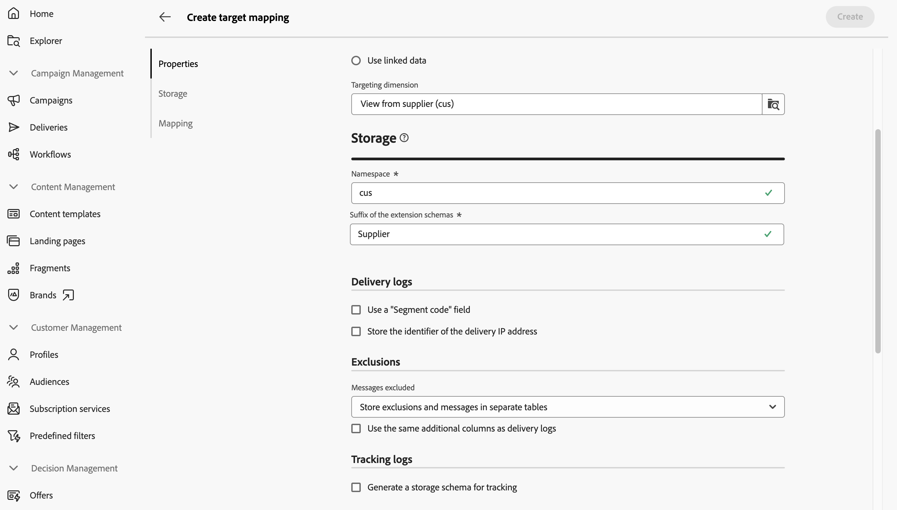

# Doeltoewijzingen beheren {#target-mappings}

>[!CONTEXTUALHELP]
>id="acw_homepage_welcome_rn5"
>title="Doeltoewijzingen"
>abstract="U kunt doeltoewijzingen in het Gebruikersinterface van het Web van de Campagne nu tot stand brengen. Doeltoewijzingen bepalen hoe verschillende leveringskanalen (e-mail, SMS, pushmeldingen) worden gekoppeld aan de gegevensvelden van een schema."
>additional-url="https://experienceleague.adobe.com/docs/campaign-web/v8/release-notes/release-notes.html" text="Zie opmerkingen bij releases"

>[!CONTEXTUALHELP]
>id="acw_targetmapping_list"
>title="Doeltoewijzingen "
>abstract="Doeltoewijzingen"

## Over doeltoewijzingen {#about}

Elk communicatiekanaal gebruikt een standaarddoelafbeelding om hun ontvangers te richten. Sjablonen voor e-mail- en SMS-verzending zijn standaard bijvoorbeeld gericht op **[!UICONTROL Recipients]** . Hun doelafbeelding gebruikt daarom de gebieden van **nms:ontvankelijke** lijst. Voor de Duw berichten, is de standaarddoelafbeelding **toepassingen van de Abonnee (nms:appSubscriptionRcp)**, die met de lijst van ontvangers verbonden is.

Doeltoewijzingen zijn toegankelijk via het menu **[!UICONTROL Administration]** > **[!UICONTROL Target mappings]** . Vanuit dit scherm hebt u toegang tot details over elke doeltoewijzing of kunt u nieuwe doeltoewijzingen maken die aan uw behoeften voldoen.

Voor meer informatie over de ingebouwde doelafbeeldingen die van Adobe Campaign worden verstrekt, verwijs naar de [ de consoledocumentatie van de Cliënt van de Campagne v8 ](https://experienceleague.adobe.com/docs/campaign/campaign-v8/audience/add-profiles/target-mappings.html){target="_blank"}.

## Doeltoewijzing maken {#create-mapping}

>[!CONTEXTUALHELP]
>id="acw_targetmapping_properties"
>title="Eigenschappen voor doeltoewijzing"
>abstract="In de sectie **[!UICONTROL Properties]** kunt u algemene instellingen definiëren voor de doeltoewijzing en de doelpopulatie."

>[!CONTEXTUALHELP]
>id="acw_targetmapping_mapping"
>title="Toewijzing doel"
>abstract="In de sectie **[!UICONTROL Mapping]** kunt u aangeven welke kenmerken van het schema van de doeltoewijzing moeten worden gebruikt voor de verschillende velden voor het bezorgadres."

>[!CONTEXTUALHELP]
>id="acw_targetmapping_denylist"
>title="Lijst van gewezen personen voor doeltoewijzing"
>abstract="Lijst van gewezen personen voor doeltoewijzing"

>[!CONTEXTUALHELP]
>id="acw_targetmapping_storage"
>title="Opslag doeltoewijzing"
>abstract="In de sectie **[!UICONTROL Storage]** kunt u aangeven waar logbestanden moeten worden opgeslagen."

Open het menu **[!UICONTROL Administration]** > **[!UICONTROL Target mappings]** om een nieuwe doeltoewijzing te maken. Klik op de knop **[!UICONTROL Create mapping]** en voer de stappen uit die in de onderstaande secties worden beschreven.

1. Voer in de sectie **[!UICONTROL Properties]** een **[!UICONTROL Label]** in voor de doeltoewijzing.

1. Vouw de sectie **[!UICONTROL Additional options]** uit om geavanceerde instellingen te definiëren, zoals de interne naam, opslagmap en beschrijving van de doeltoewijzing.

1. Selecteer de doelpopulatie. U kunt:

   * **[!UICONTROL Use the targeting dimension directly]**: selecteer de dimensie die u rechtstreeks wilt gebruiken in de lijst met beschikbare afmetingen.
   * **[!UICONTROL Use linked data]**: Begin van een het richten dimensie (bijvoorbeeld abonnementen), en schakel dan aan de het richten dimensie over die u (bijvoorbeeld ontvangers) wilt richten.

   

1. Als de geselecteerde afmeting niet reeds door een bestaande doelafbeelding wordt gebruikt, moeten de schema&#39;s om de logboeken op te slaan worden gecreeerd. Aanvullende opties zijn beschikbaar in de sectie **[!UICONTROL Storage]** . Vouw de onderstaande sectie uit voor meer informatie.

   +++Opslagopties voor nieuwe doeldimensies

   1. **[!UICONTROL Namespace]**: identificeer de naamruimte die wordt gebruikt om de logbestanden te maken.
   1. **[!UICONTROL Suffix of the extension schema]** - Geef een achtervoegsel op voor het nieuwe schema.

      In het onderstaande voorbeeld is de naam van de broadlog &#39;cusbroadlogSupplier&#39;.

      

   1. **[!UICONTROL Delivery logs]**: activeer de opties in deze sectie om de verzendende logboeken te verrijken met een gebied van de segmentcode of een gebied dat het bezorgingsIP adres bevat. Sla bijvoorbeeld een segmentcode op die tijdens de workflow wordt berekend, in de verzendende logboeken om het doel later te verfijnen. Dit staat het richten van profielen met deze specifieke segmentcode toe.

   1. **[!UICONTROL Exclusions]**: geef op hoe u de uitsluitingslogboeken wilt opslaan.

   1. **[!UICONTROL Tracking logs]**: activeer de optie **[!UICONTROL Generate a schema for tracking]** om een opslagschema te genereren voor het bijhouden van logbestanden.

+++

1. Gebruik de **[!UICONTROL Mapping]** sectie om te identificeren welke attributen van het schema van de doelafbeelding voor elk gebied van het leveringsadres te gebruiken. Selecteer voor elk veld het kenmerk dat u wilt toewijzen. U kunt ook een expressie maken om het veld te identificeren. Pas bijvoorbeeld een lagere functie toe op het adreskenmerk.

   

1. Klik op de knop **[!UICONTROL Create]** wanneer de doeltoewijzing gereed is. Het systeem leidt automatisch tot de doelafbeelding en alle verwante schema&#39;s voor de logboeken.

Nadat u de doeltoewijzing hebt gemaakt, worden twee extra secties op het scherm weergegeven:

* **[!UICONTROL Denylisting]**: In deze sectie kunt u de kenmerken van het schema van de doeltoewijzing identificeren die voor lijsten van gewezen personen moeten worden gebruikt.

   tonen

* **[!UICONTROL Storage]**: in deze sectie kunt u de tabellen identificeren die u wilt gebruiken voor het opslaan van logbestanden.

  

   * **[!UICONTROL Message schema]**: identificeert het schema dat moet worden gebruikt om de verzendende logboeken op te slaan.
   * **[!UICONTROL Messages excluded]** - Geeft aan hoe u de opslag van bezorgings- en uitsluitingslogbestanden beheert.

      * **[!UICONTROL Store exclusions and messages in the same table]**
      * **[!UICONTROL Store messages only]**: geen uitsluitingen opslaan.
      * **[!UICONTROL Store exclusions and messages in separate tables]**: selecteer het schema dat u wilt gebruiken om uitsluitingslogboeken op te slaan in het **[!UICONTROL Rejection schema]** -veld.

   * **[!UICONTROL Tracking logs]**: Kies waar u trackinglogboeken en de standaardverkeersbron wilt opslaan.
   * **[!UICONTROL Additional fields]**: geef een lijst op met extra velden die u wilt opslaan in de leveringslogboeken. In deze velden kan permanent informatie worden opgeslagen over afzonderlijke leden van het doel (bijvoorbeeld `recipient/@firstName` ) of kunnen aanvullende gegevens worden opgeslagen die tijdens de workflow zijn berekend (bijvoorbeeld `[targetData/@offeCode]` ).

     Selecteer **[!UICONTROL Add field]** om dit te doen. Identificeer de informatie die u wilt opslaan in het veld **[!UICONTROL Source]** en het kenmerk dat u wilt gebruiken in de verzendende logboeken om deze informatie op te slaan in het veld **[!UICONTROL Destination]** .

     {width="50%" zoomable="yes"}