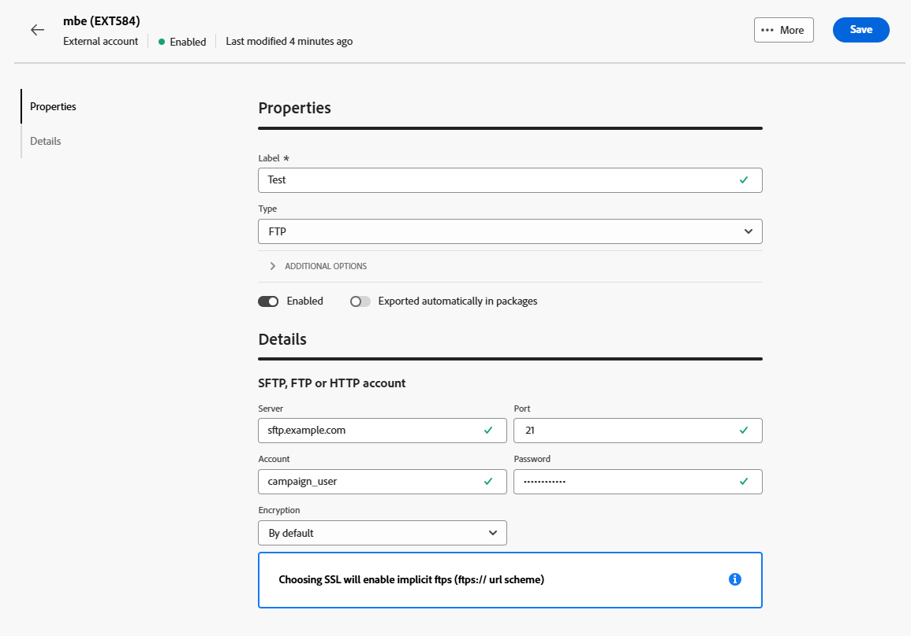

# Externe rekeningen voor gegevensoverdracht {#transfer-external-account}

## Amazon Simple Storage Service (S3) {#amazon-simple-storage-service--s3--external-account}

De Amazon Simple Storage Service (S3)-connector kan worden gebruikt voor het importeren of exporteren van gegevens naar Adobe Campaign. Deze kan worden ingesteld in een workflowactiviteit. Raadpleeg [deze pagina](https://experienceleague.adobe.com/en/docs/campaign-web/v8/wf/design-workflows/transfer-file){target=_blank} voor meer informatie.

Wanneer u dit nieuwe externe account instelt, moet u de volgende data opgeven:

* **[!UICONTROL AWS S3 Account Server]**

  URL van uw server, zou het als volgt moeten worden gevuld:

  `  <S3bucket name>.s3.amazonaws.com/<s3object path>`

* **[!UICONTROL AWS access key ID]**

  Om te weten waar te om uw de toegangs belangrijkste identiteitskaart van AWS te vinden, verwijs naar deze [ pagina ](https://docs.aws.amazon.com/general/latest/gr/aws-sec-cred-types.html#access-keys-and-secret-access-keys).

* **[!UICONTROL Secret access key to AWS]**

  Om te weten waar te om uw geheime toegangstoets aan AWS te vinden, verwijs naar deze [ pagina ](https://aws.amazon.com/fr/blogs/security/wheres-my-secret-access-key/).

* **[!UICONTROL AWS Region]**

  Om meer op het gebied van AWS te leren, verwijs naar deze [ pagina ](https://aws.amazon.com/about-aws/global-infrastructure/regions_az/).

* Met het selectievakje **[!UICONTROL Use server side encryption]** kunt u het bestand opslaan in de modus S3-versleuteling.

Leren waar te om toegangs zeer belangrijke identiteitskaart en geheime toegangssleutel te vinden, verwijs naar de diensten van het Web van Amazon [ documentatie ](https://docs.aws.amazon.com/general/latest/gr/aws-sec-cred-types.html#access-keys-and-secret-access-keys).

## Azure Blob Storage {#azure-blob-external-account}

De **[!UICONTROL Azure Blob Storage]** -externe account kan worden gebruikt om gegevens te importeren of te exporteren naar Adobe Campaign via een **[!UICONTROL Transfer file]** -workflowactiviteit. Raadpleeg [deze sectie](https://experienceleague.adobe.com/en/docs/campaign-web/v8/wf/design-workflows/transfer-file){target=_blank} voor meer informatie.

Als u **[!UICONTROL Azure external account]** wilt configureren om te werken met Adobe Campaign, moet u de volgende gegevens opgeven:

* **[!UICONTROL Server]**

  URL van uw Azure Blob-opslagserver.

* **[!UICONTROL Encryption]**

  Type gekozen codering tussen **[!UICONTROL None]** of **[!UICONTROL SSL]** .

* **[!UICONTROL Access key]**

  Om te weten waar te om uw **[!UICONTROL Access key]** te vinden, verwijs naar deze [ pagina ](https://docs.microsoft.com/en-us/azure/storage/common/storage-account-keys-manage?tabs=azure-portal).

## SFTP

Met de externe SFTP-account kunt u toegang tot een server buiten Adobe Campaign configureren en testen.

Als u de **[!UICONTROL SFTP]** externe account wilt configureren, vult u de volgende velden in:

* **[!UICONTROL Server]**

  Voer de naam of het adres van de SFTP-server in.

* **[!UICONTROL Port]**

  Geef het poortnummer van de SFTP-verbinding op. De standaardpoort is 22.

* **[!UICONTROL Account]**

  Voer de gebruikersnaam in die wordt gebruikt om verbinding te maken met de SFTP-server.

* **[!UICONTROL Password]**

  Voer het wachtwoord voor de SFTP-account in.

* **[!UICONTROL SFTP authentication type]**

  Kies de methode voor verificatie met de SFTP-server. U kunt onder andere de volgende opties kiezen:

   * **[!UICONTROL Password]** : verifiëren met het wachtwoord van de account.

   * **[!UICONTROL Public key]**: verifiëren met behulp van een SSH-sleutelpaar (persoonlijke en openbare sleutel).

Als **[!UICONTROL Public key]** -verificatie is geselecteerd, moeten de volgende velden worden ingevuld:

* **[!UICONTROL Private key file]**

  Geef het persoonlijke SSH-sleutelbestand op dat voor verificatie wordt gebruikt.

* **[!UICONTROL Public key file]**

  Geef de overeenkomstige openbare SSH-sleutel op die op de SFTP-server is geregistreerd.

* **[!UICONTROL SSH Key passphrase]**

  Voer de wachtwoordzin in om de persoonlijke sleutel te decoderen als deze is beveiligd.

## HTTP

Met de externe HTTP-account kunt u toegang tot een server buiten Adobe Campaign configureren en testen.

Als u de **[!UICONTROL HTTP]** externe account wilt configureren, vult u de volgende velden in:

* **[!UICONTROL Server]**

  Voer de naam of het adres van de HTTP-server in.

* **[!UICONTROL Port]**

  Geef het poortnummer van de HTTP-verbinding op. De standaardpoort is 80.

* **[!UICONTROL Account]**

  Voer de gebruikersnaam voor verificatie in.

* **[!UICONTROL Password]**

  Voer het wachtwoord in dat aan de gebruikersaccount is gekoppeld.

* **[!UICONTROL SFTP authentication type]**

  Selecteer het type verificatie voor de verbinding. U kunt onder andere de volgende opties kiezen:

   * Wachtwoord
   * Openbare sleutel

Als u **[!UICONTROL Public key]** -verificatie gebruikt, voert u in het menu **[!UICONTROL PublicKey Auth]** de vereiste waarden in voor:

* **[!UICONTROL Password]**: De wachtwoordzin die de persoonlijke sleutel beveiligt, indien van toepassing.

* **[!UICONTROL Private key]**: De persoonlijke sleutel die wordt gebruikt voor verificatie van de Snowflake-account.

## FTP

Met de externe FTP-account kunt u toegang tot een server buiten Adobe Campaign configureren en testen.

Als u de **[!UICONTROL FTP]** externe account wilt configureren, vult u de volgende velden in:

* **[!UICONTROL Server]**

  Voer de naam of het adres van de FTP-server in.

* **[!UICONTROL Port]**

  Geef het poortnummer van de FTP-verbinding op. De standaardpoort is 21.

* **[!UICONTROL Account]**

  Voer de gebruikersnaam voor verificatie in.

* **[!UICONTROL Password]**

  Voer het wachtwoord in dat aan de gebruikersaccount is gekoppeld.

* **[!UICONTROL Encryption]**

  Selecteer het type codering voor de verbinding. U kunt onder andere de volgende opties kiezen:

   * Standaard
   * POP3 + STARTTLS
   * POP3 niet-beveiligd
   * POP3 beveiligd