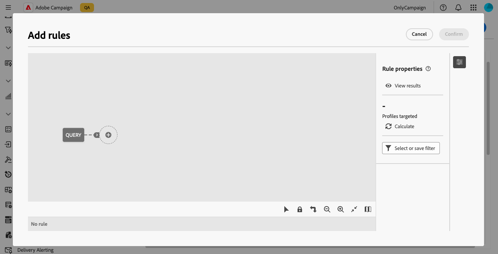

# Werken met bedrijfsregels (typologieën) {#typologies}

>[!CONTEXTUALHELP]
>id="acw_homepage_welcome_rn4"
>title="Zakelijke regels"
>abstract="U kunt nu typologieën en typologische regels maken in de Adobe Campaign Web User Interface. Met behulp van typologieën kunt u het verzenden van leveringen besturen, filteren en prioriteren."
>additional-url="https://experienceleague.adobe.com/docs/campaign-web/v8/release-notes/release-notes.html" text="Zie opmerkingen bij releases"

>[!CONTEXTUALHELP]
>id="acw_business_rules"
>title="Typologieën en typologische regels"
>abstract="Met behulp van typologieën kunt u bedrijfspraktijken voor alle leveringen standaardiseren. Een typologie is een verzameling typologische regels waarmee u het verzenden van leveringen kunt beheren, filteren en prioriteren. Profielen die voldoen aan criteria binnen een typologieregel worden tijdens de voorbereidingsfase uitgesloten van de toedieningsdoelgroepen."

>[!CONTEXTUALHELP]
>id="acw_business_rules_typology_rules_type"
>title="Filteren"
>abstract=" Twee types van typologieregels zijn beschikbaar:   **Controle** regels die berichtkwaliteit en geldigheid pre-verzenden, zoals karaktervertoning, de lengte van SMS, adresformaat, of het verkorten URL verzekeren.   **het Filtreren** regels die segmenten van het doelpubliek uitsluiten die op specifieke criteria, zoals leeftijd, plaats, land, of telefoonaantallen worden gebaseerd."

## Over typologieën

Met behulp van typologieën kunt u bedrijfspraktijken voor alle leveringen standaardiseren. A **typologie** is een inzameling van **typologieregels** die u laat controleren, filtreren, en voorrang geven aan het verzenden van leveringen. Profielen die voldoen aan criteria binnen een typologieregel worden tijdens de voorbereidingsfase uitgesloten van de toedieningsdoelgroepen.

De technologieën verzekeren uw leveringen altijd bepaalde elementen, zoals een unsubscription verbinding of een onderwerpregel, of het filtreren regels bevatten om groepen van uw voorgenomen doel, zoals abonnees, concurrenten, of niet loyaliteitklanten uit te sluiten.

Typologieën zijn toegankelijk via het menu **[!UICONTROL Administration]** > **[!UICONTROL Business rules]** . Van dit scherm, heb toegang tot alle bestaande typologieën en typologieregels, of creeer nieuwe die op uw behoeften worden gebaseerd.

>[!NOTE]
>
>In de lijst **[!UICONTROL Typology rules]** worden alle bestaande regels weergegeven die tot nu toe in de webgebruikersinterface of de clientconsole zijn gemaakt. Nochtans, slechts **Controle** en **het Filtreren** regels kunnen in het Gebruikersinterface van het Web worden gecreeerd. Als u andere typen typologische regels wilt maken, zoals de regels voor druk of capaciteit, gebruikt u de clientconsole van Campagne v8. [ Leer hoe te om typologieregels in de cliëntconsole tot stand te brengen ](https://experienceleague.adobe.com/en/docs/campaign/automation/campaign-optimization/campaign-typologies){target="_blank"}

De belangrijkste stappen om typologieën op uw berichten toe te passen zijn:

1. [ creeer een typologie ](#typology).
1. [ creeer typologieregels ](#typology-rules).
1. [ typologische regels van de Verwijzing in de typologie ](#add-rules).
1. [ pas typologie op een bericht ](#message) toe.

## Een typologie maken {#typology}

>[!CONTEXTUALHELP]
>id="acw_business_rules_typology_properties"
>title="Typologie-eigenschappen"
>abstract="Definieer de eigenschappen van de typologie en vouw de sectie **[!UICONTROL Additional options]** uit om toegang te krijgen tot geavanceerde instellingen. Gebruik het veld **[!UICONTROL IP affinity]** om IP-affiniteiten aan typologieën te koppelen. Dit staat u toe om het uitgaande verkeer beter te controleren SMTP door te bepalen welke specifieke IP adressen voor elke affiniteit kunnen worden gebruikt."

>[!CONTEXTUALHELP]
>id="acw_business_rules_typology_ip_affinity"
>title="IP-affiniteit"
>abstract="Het beheren van affiniteiten met IP adressen laat betere controle van uitgaand verkeer SMTP toe door verschillende IP adressen met elk type van verkeer afhankelijk van de typologie van zijn leveringsactie te associëren."

Voer de volgende stappen uit om een typologie te maken:

1. Navigeer naar het menu **[!UICONTROL Business rules]** en selecteer vervolgens de tab **[!UICONTROL Typology]** .

1. Klik op de knop **[!UICONTROL Create typology]** en voer een **[!UICONTROL Label]** in voor de typologie.

1. Vouw de sectie **[!UICONTROL Additional options]** uit om geavanceerde instellingen te definiëren, zoals de interne naam, opslagmap en beschrijving van de typologie.

   

   >[!NOTE]
   >
   >In het veld **[!UICONTROL IP affinity]** kunt u IP-affiniteiten aan typologieën koppelen. Dit laat betere controle van uitgaand verkeer SMTP toe door te bepalen welke specifieke IP adressen voor elke affiniteit kunnen worden gebruikt. U kunt bijvoorbeeld één affiniteit per land of subdomein gebruiken. Vervolgens kunt u één typologie per land maken en elke affiniteit koppelen aan de overeenkomstige typologie.

1. Klik op **[!UICONTROL Create]** om het maken van de typologie te bevestigen.

De typologische details worden geopend. Verwijs vanuit dit scherm rechtstreeks naar bestaande typologische regels of maak nieuwe typologische regels waarnaar u later wilt verwijzen:
* [ Leer hoe te om een typologieregel tot stand te brengen ](#add-rules)
* [Leer hoe u naar regels in een typologie kunt verwijzen](#add-rules)

## Een typologieregel maken {#typology-rule}

>[!CONTEXTUALHELP]
>id="acw_business_rules_typology_rules_properties"
>title="Eigenschappen van typologieregel"
>abstract="Bepaal de eigenschappen van de typologieregel. **de regels van de controle** verifiëren berichtkwaliteit en geldigheid vooraf verzenden, terwijl **het Filtreren** regels segmenten van het doelpubliek uitsluiten die op specifieke criteria worden gebaseerd.   u kunt de de uitvoeringsorde van de regel ook veranderen om de opeenvolging te beheren waarin de typologische regels zullen worden uitgevoerd wanneer verscheidene regels van het zelfde type tijdens de zelfde fase van de berichtverwerking worden uitgevoerd."

Er zijn twee typen typologische regels beschikbaar:

* **Controle**: Verzekert berichtkwaliteit en geldigheid pre-verzendt, zoals karaktervertoning, lengte van SMS, adresformaat, of kortere weg URL. Deze regels worden gecreeerd gebruikend een scripting interface om complexe logica voor inhoudscontroles en wijzigingen te bepalen.

* **het Filtreren**: sluit segmenten van het doelpubliek uit die op specifieke criteria, zoals leeftijd, plaats, land, of telefoonaantallen worden gebaseerd. Deze regels zijn gekoppeld aan een doelgerichte dimensie.

>[!NOTE]
>
>Momenteel, slechts **Controle** en **het Filtreren** typologische regels kunnen van het Gebruikersinterface van het Web worden gecreeerd. Als u andere soorten regels wilt maken, gebruikt u de clientconsole. [ Leer hoe te om typologieregels in de cliëntconsole tot stand te brengen ](https://experienceleague.adobe.com/en/docs/campaign/automation/campaign-optimization/campaign-typologies){target="_blank"}

Voer de volgende stappen uit om een typologieregel te maken:

1. Navigeer naar het menu **[!UICONTROL Business rules]** en selecteer vervolgens de tab **[!UICONTROL Typology rules]** .

1. Klik op de knop **[!UICONTROL Create typology rule]** en volg de onderstaande stappen.

[Typologieregel maken](assets/business-rules-create-typo.png)

### De hoofdeigenschappen van de regel definiëren {#properties}

>[!CONTEXTUALHELP]
>id="acw_business_rules_typology_rules_filtering"
>title="Filteren"
>abstract="**het Filtreren** regels sluiten segmenten van het doelpubliek uit die op specifieke criteria, zoals leeftijd, plaats, land, of telefoonaantallen worden gebaseerd. Selecteer de het richten dimensie van de typologieregel en klik de **[!UICONTROL Add rules]** knoop om tot de vraagmodeler toegang te hebben en de regel te bouwen."

>[!CONTEXTUALHELP]
>id="acw_business_rules_typology_rules_code"
>title="Code"
>abstract="**de regels van de controle** verifiëren berichtkwaliteit en geldigheid pre-verzendt, zoals karaktervertoning, lengte van SMS, adresformaat, of verkorting URL. Deze regels worden gemaakt met JavaScript-code."

Dit zijn de belangrijkste eigenschappen wanneer het creëren van een nieuwe typologieregel.

>[!BEGINTABS]

>[!TAB Controleregels]

1. Voer een **[!UICONTROL Label]** voor de regel in.

[Besturingsregel maken](assets/business-rules-create-typo1.png)

1. Vouw de sectie **[!UICONTROL Additional options]** uit om toegang te krijgen tot geavanceerde instellingen, zoals de interne naam, mapopslag en beschrijving van de regel. U kunt ook opgeven wanneer de regel moet worden toegepast en welk waarschuwingsniveau u moet gebruiken. Vouw de onderstaande secties uit voor meer informatie.

   +++Fasen:

   Geef op op welk punt van de levenscyclus van de levering de regel wordt toegepast. Selecteer de waarde in de vervolgkeuzelijst **[!UICONTROL Phase]** :

   * **[!UICONTROL At the start of targeting]**: voorkom dat de personalisatiestap wordt uitgevoerd in het geval van fouten.

   * **[!UICONTROL After targeting]**: selecteer deze fase als u het volume van het doel moet kennen om de controleregel toe te passen. De besturingsregel **[!UICONTROL Check proof size]** wordt bijvoorbeeld toegepast na elk doelwerkgebied. Deze regel verhindert berichtverpersoonlijking als er teveel proefontvangers zijn.

   * **[!UICONTROL At the start of personalization]**: selecteer deze fase als de controle de goedkeuring van berichtverpersoonlijking betreft. De personalisatie van berichten wordt uitgevoerd tijdens de analysefase.

   * **[!UICONTROL At the end of the analysis]**: Pas controles toe die volledige berichtpersonalisatie vereisen.

   +++

   +++Niveau:

   Geef het waarschuwingsniveau voor de regel op:

   * **[!UICONTROL Error]**: stop de voorbereiding van het bericht.

   * **[!UICONTROL Warning]**: geef een waarschuwing weer in de voorbereidingslogboeken.

   * **[!UICONTROL Info]**: geef informatie weer in de voorbereidingslogboeken.

   * **[!UICONTROL Verbose]**: geef informatie weer in de serverlogboeken.

   +++

1. Om de inhoud van de regel te bouwen, klik **geef code** knoop uit en ga de logica voor de regel in gebruikend JavaScript. In het onderstaande voorbeeld wordt een regel gemaakt om een waarschuwing in de logboeken weer te geven als het doel leeg is.

   

1. Klik **creëren**.

>[!TAB Regels voor filteren]

1. Voer een **[!UICONTROL Label]** voor de regel in.

[Filterregel maken](assets/business-rules-create-typo2.png)

1. Vouw de sectie **[!UICONTROL Additional options]** uit om toegang te krijgen tot geavanceerde instellingen, zoals de interne naam, mapopslag en beschrijving van de regel.

1. Om de inhoud van de regel te bouwen, selecteer het richten afmeting en klik de **[!UICONTROL Add rules]** knoop om het filtreren criteria te bepalen gebruikend de [ regelbouwer ](../query/query-modeler-overview.md).

   

1. Klik **creëren**

>[!ENDTABS]

### De aanvullende eigenschappen van de regel definiëren {#add-properties}

Nu, bepalen wij de extra parameters. In dit scherm kunt u nog steeds de eerder gedefinieerde hoofdeigenschappen wijzigen.

[Aanvullende filterregel maken](assets/business-rules-create-typo2.png)

1. Schakel de optie **[!UICONTROL Active]** uit als u niet wilt dat de regel direct na het maken actief is.

1. Definieer de regelinstellingen **[!UICONTROL Execution order]** .

   Standaard is de volgorde van de typologische regels ingesteld op 50. Pas deze waarde aan om de opeenvolging te beheren waarin de typologische regels zullen worden uitgevoerd wanneer verscheidene regels van het zelfde type tijdens de zelfde fase van de berichtverwerking worden uitgevoerd. Bijvoorbeeld, wordt een het filtreren regel met een uitvoeringsorde van 20 uitgevoerd vóór een het filtreren regel met een uitvoeringsorde van 30.

1. Selecteer een **[!UICONTROL Channel]** die u aan de regel wilt koppelen.

Uw regel is klaar om in een typologie van verwijzingen te worden voorzien om het op berichten toe te passen.

## Referentietypestvoorschriften in een typologie {#add-rules}

Ga als volgt te werk om naar een of meerdere regels in een typologie te verwijzen:

1. Navigeer naar het tabblad **[!UICONTROL Typology]** en open de typologie waar u naar de regel(s) wilt verwijzen.

1. Selecteer de tab **[!UICONTROL Typology rules]** en klik op de knop **[!UICONTROL Add rules)]** .

   

1. Selecteer een of meerdere typologische regels die u aan de typologie wilt koppelen en bevestig.

   

1. Klik op **[!UICONTROL Save]**.

U kunt nu de typologie toepassen op berichten. Zodra gedaan, zullen alle geselecteerde typologische regels worden uitgevoerd om de bepaalde controles uit te voeren.

## Typologieën toepassen op berichten {#message}

Als u een typologie wilt toepassen op een bericht- of berichtsjabloon, selecteert u de typologie in de berichtinstellingen. [ Leer hoe te om leveringsmontages ](../advanced-settings/delivery-settings.md#typology) te vormen

 toe

Na toepassing worden de typologische regels die in de typologie zijn opgenomen, uitgevoerd om de geldigheid van de levering tijdens de voorbereiding van het bericht te controleren. Profielen die voldoen aan criteria binnen een typologieregel, worden uitgesloten van het publiek dat ze levert.