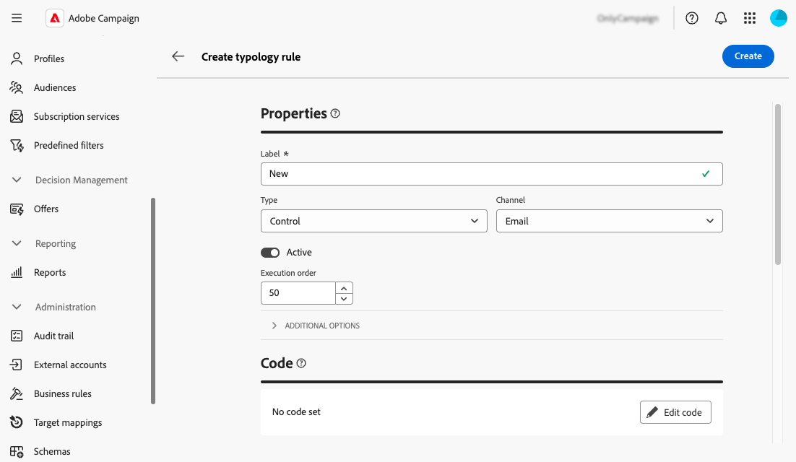

# Werken met bedrijfsregels (typologieën) {#typologies}

>[!CONTEXTUALHELP]
>id="acw_homepage_welcome_rn1"
>title="Zakelijke regels"
>abstract="U kunt nu typologieën en typologische regels maken in de Adobe Campaign Web User Interface. Met behulp van typologieën kunt u het verzenden van leveringen besturen, filteren en prioriteren."
>additional-url="https://experienceleague.adobe.com/docs/campaign-web/v8/release-notes/release-notes.html" text="Zie opmerkingen bij releases"

>[!CONTEXTUALHELP]
>id="acw_business_rules"
>title="Typologieën en typologische regels"
>abstract="Met behulp van typologieën kunt u bedrijfspraktijken standaardiseren voor alle leveringen. Een typologie is een verzameling typologische regels waarmee u het verzenden van leveringen kunt beheren, filteren en prioriteren. Profielen die voldoen aan criteria binnen een typologieregel worden bij de voorbereidingsfase uitgesloten van de toedieningsdoelgroepen."

## Over typologieën

Met behulp van typologieën kunt u bedrijfspraktijken standaardiseren voor alle leveringen. A **typologie** is een inzameling van **typologieregels** die u laat controleren, filtreren, en voorrang geven aan het verzenden van leveringen. Profielen die voldoen aan criteria binnen een typologieregel worden bij de voorbereidingsfase uitgesloten van de toedieningsdoelgroepen.

De types zorgen ervoor uw leveringen altijd bepaalde elementen (zoals een unsubscription verbinding of een onderwerpregel) of het filtreren regels bevatten om groepen van uw voorgenomen doel (zoals abonnees, concurrenten, of niet-loyaliteitklanten) uit te sluiten.

Typologieën zijn toegankelijk via het menu **[!UICONTROL Administration]** > **[!UICONTROL Business rules]** . Vanuit dit scherm hebt u toegang tot alle bestaande typologieën en typologische regels, of kunt u nieuwe maken op basis van uw behoeften.

>[!NOTE]
>
>In de lijst **[!UICONTROL Typology rules]** worden alle bestaande regels weergegeven die tot nu toe in de webgebruikersinterface of de clientconsole zijn gemaakt. Nochtans, slechts **Controle** en **het Filtreren** regels kunnen in het Gebruikersinterface van het Web worden gecreeerd. Als u andere typen typologische regels wilt maken, zoals de regels voor druk of capaciteit, gebruikt u de clientconsole van Campagne v8. [ Leer hoe te om typologieregels in de cliëntconsole tot stand te brengen ](https://experienceleague.adobe.com/en/docs/campaign/automation/campaign-optimization/campaign-typologies){target="_blank"}

De belangrijkste stappen om typologieën op uw berichten toe te passen zijn:

1. [ creeer een typologie ](#typology).
1. [ creeer typologieregels ](#typology-rules).
1. [ typologische regels van de Verwijzing in de typologie ](#add-rules).
1. [ pas typologie op een bericht ](#message) toe.

## Een typologie maken {#typology}

>[!CONTEXTUALHELP]
>id="acw_business_rules_typology_properties"
>title="Typologie-eigenschappen"
>abstract="Definieer de eigenschappen van de typologie en vouw de sectie **[!UICONTROL Additional options]** uit om toegang te krijgen tot geavanceerde instellingen. Gebruik het veld **[!UICONTROL IP affinity]** om IP-affiniteiten aan typologieën te koppelen. Dit staat u toe om het uitgaande verkeer beter te controleren SMTP, door te bepalen welke specifieke IP adressen voor elke affiniteit kunnen worden gebruikt."

>[!CONTEXTUALHELP]
>id="acw_business_rules_typology_ip_affinity"
>title="IP-affiniteit"
>abstract="Het beheren van affiniteiten met IP adressen laat betere controle van uitgaand verkeer SMTP toe door verschillende IP adressen met elk type van verkeer afhankelijk van de typologie van zijn leveringsactie te associëren."

Voer de volgende stappen uit om een typologie te maken:

1. Navigeer naar het menu **[!UICONTROL Business rules]** en selecteer vervolgens de tab **[!UICONTROL Typology]** .

1. Klik op de knop **[!UICONTROL Create typology]** en voer een **[!UICONTROL Label]** in voor de typologie.

1. Vouw de sectie **[!UICONTROL Additional options]** uit om geavanceerde instellingen te definiëren, zoals de interne naam, opslagmap en beschrijving van de typologie.

   

   >[!NOTE]
   >
   >In het veld **[!UICONTROL IP affinity]** kunt u IP-affiniteiten aan typologieën koppelen. Dit staat u toe om het uitgaande verkeer beter te controleren SMTP, door te bepalen welke specifieke IP adressen voor elke affiniteit kunnen worden gebruikt.  U kunt bijvoorbeeld één affiniteit per land of subdomein gebruiken. Vervolgens kunt u één typologie per land maken en elke affiniteit koppelen aan de overeenkomstige typologie.

1. Klik op **[!UICONTROL Create]** om het maken van de typologie te bevestigen.

De typologie opent de details. Vanuit dit scherm kunt u rechtstreeks verwijzen naar bestaande typologische regels. U kunt ook nieuwe typologieregels maken en er later in de typologie naar verwijzen op:
* [ Leer hoe te om een typologieregel tot stand te brengen ](#add-rules)
* [Leer hoe u naar regels in een typologie kunt verwijzen](#add-rules)

## Een typologieregel maken {#typology-rule}

>[!CONTEXTUALHELP]
>id="acw_business_rules_typology_rules_properties"
>title="Eigenschappen van typologieregel"
>abstract="Bepaal de eigenschappen van de typologieregel. **de regels van de controle** verifiëren berichtkwaliteit en geldigheid vooraf verzenden, terwijl **het Filtreren** regels segmenten van het doelpubliek uitsluiten die op specifieke criteria worden gebaseerd.   u kunt de de uitvoeringsorde van de regel ook veranderen om de opeenvolging te beheren waarin de typologische regels zullen worden uitgevoerd wanneer verscheidene regels van het zelfde type tijdens de zelfde fase van de berichtverwerking worden uitgevoerd."

Als u een typologieregel wilt maken, navigeert u naar het menu **[!UICONTROL Business rules]** en selecteert u de tab **[!UICONTROL Typology rules]** .

Klik op de knop **[!UICONTROL Create typology rule]** en volg de onderstaande stappen.

### De eigenschappen van de typologieregel definiëren {#properties}

Definieer de eigenschappen van de typologieregel:

1. Voer een **[!UICONTROL Label]** voor de regel in.

   

1. Selecteer de typologieregel **[!UICONTROL Type]** :

   * **Controle**: verzekert berichtkwaliteit en geldigheid pre-verzendt (b.v., karaktervertoning, de lengte van SMS, adresformaat, het verkorten URL). Zij worden gecreeerd gebruikend een scripting interface om complexe logica voor inhoudscontroles en wijzigingen te bepalen.

   * **het Filtreren** regels sluiten segmenten van het doelpubliek uit dat op specifieke criteria (b.v., leeftijd, plaats, land, telefoonaantallen) wordt gebaseerd. Deze regels zijn gekoppeld aan een doelgerichte dimensie.

   >[!NOTE]
   >
   >Voor nu, slechts **Controle** en **het Filtreren** typologische regels kunnen van het Gebruikersinterface van het Web worden gecreeerd. Als u andere soorten regels wilt maken, gebruikt u de clientconsole. [ Leer hoe te om typologieregels in de cliëntconsole tot stand te brengen ](https://experienceleague.adobe.com/en/docs/campaign/automation/campaign-optimization/campaign-typologies){target="_blank"}

1. Selecteer een **[!UICONTROL Channel]** die u aan de regel wilt koppelen.

1. Schakel de optie **[!UICONTROL Active]** uit als u niet wilt dat de regel direct na het maken actief is.

1. Definieer de regel **[!UICONTROL Execution order]** .

   Standaard is de volgorde van de typologische regels ingesteld op 50. U kunt deze waarde aanpassen om de opeenvolging te beheren waarin de typologische regels zullen worden uitgevoerd wanneer verscheidene regels van het zelfde type tijdens de zelfde fase van de berichtverwerking worden uitgevoerd. Bijvoorbeeld, wordt een het filtreren regel met een uitvoeringsorde van 20 uitgevoerd vóór een het filtreren regel met een uitvoeringsorde van 30.

1. Vouw de sectie **[!UICONTROL Additional options]** uit om toegang te krijgen tot geavanceerde instellingen, zoals de interne naam, mapopslag en beschrijving van de regel.

1. Voor controleregels, zijn twee extra regels beschikbaar in de extra opties. Met deze instructies kunt u opgeven wanneer de regel moet worden toegepast en welk waarschuwingsniveau moet worden gebruikt:

   * **[!UICONTROL Phase]**: In dit veld kunt u opgeven op welk punt van de levenscyclus van de levering de regel wordt toegepast. Selecteer de waarde die u wilt toepassen in de vervolgkeuzelijst **[!UICONTROL Phase]** . Vouw de onderstaande sectie uit voor meer informatie over de mogelijke waarden.

   +++Regelfasen voor besturing:

   **[!UICONTROL At the start of targeting]**: Om te voorkomen dat de verpersoonlijkingsstap wordt uitgevoerd in het geval van fouten, kunt u hier de besturingsregel toepassen.

   **[!UICONTROL After targeting]**: Als u het volume van het doel moet kennen om de controleregel toe te passen, selecteer deze fase. De regel voor het controleren van de grootte van de proefdrukken is bijvoorbeeld van toepassing na elk doelstadium: deze regel voorkomt de personalisatie van berichten als er te veel proefontvangers zijn.

   **[!UICONTROL At the start of personalization]**: Deze fase moet worden geselecteerd als de controle de goedkeuring van berichtverpersoonlijking betreft. De personalisatie van berichten wordt uitgevoerd tijdens de analysefase.

   **[!UICONTROL At the end of the analysis]**:Wanneer voor een controle de berichtpersonalisatie moet zijn voltooid, selecteert u deze fase.

+++

   * **[!UICONTROL Level]**: met deze opties kunt u het waarschuwingsniveau voor de regel opgeven. Vouw de onderstaande sectie uit voor meer informatie.

   +++regelniveaus voor besturing:

   **[!UICONTROL Error]**: stop de voorbereiding van het bericht.

   **[!UICONTROL Warning]**: geef een waarschuwing weer in de voorbereidingslogboeken.

   **[!UICONTROL Info]**: geef informatie weer in de voorbereidingslogboeken.

   <!--**[!UICONTROL Status]**:-->

   **[!UICONTROL Verbose]**: geef informatie weer in de serverlogboeken.

+++

### Regelinhoud samenstellen {#build}

>[!CONTEXTUALHELP]
>id="acw_business_rules_typology_rules_filtering"
>title="Filteren"
>abstract="**het Filtreren** regels sluiten segmenten van het doelpubliek uit dat op specifieke criteria (b.v., leeftijd, plaats, land, telefoonaantallen) wordt gebaseerd. Selecteer de het richten dimensie van de typologieregel en klik de **[!UICONTROL Add rules]** knoop om tot de vraagmodeler toegang te hebben en de regel te bouwen."

>[!CONTEXTUALHELP]
>id="acw_business_rules_typology_rules_code"
>title="Code"
>abstract="**de regels van de Controle** verifiëren berichtkwaliteit en geldigheid pre-verzendt (b.v., karaktervertoning, de lengte van SMS, adresformaat, verkorting URL). Ze worden gemaakt met JavaScript-code."

Zodra de eigenschappen van de typologieregel zijn bepaald, kunt u de inhoud van de regel bouwen.

* Voor **Regels van de Controle**, klik **geef code** knoop uit en ga de logica voor de regel in gebruikend JavaScript. In het onderstaande voorbeeld maken we een regel om een waarschuwing in de logboeken weer te geven als het doel leeg is.

  

* Voor **het Filtreren van regels**, selecteer de het richten afmeting en klik de **[!UICONTROL Add rules]** knoop om het filtreren criteria te bepalen gebruikend de [ vraagmodelaar ](../query/query-modeler-overview.md).

  

Wanneer uw regel klaar is, klikt u op de knop **[!UICONTROL Create]** om de typologieregel te maken. U kunt nu naar de regel verwijzen in een typologie om deze toe te passen op berichten.

## Referentietypestvoorschriften in een typologie {#add-rules}

Voer de volgende stappen uit om naar een of meerdere regels in een typologie te verwijzen:

1. Navigeer naar het tabblad **[!UICONTROL Typology]** en open de typologie waar u naar de regel(s) wilt verwijzen.

1. Selecteer de tab **[!UICONTROL Typology rules]** en klik op de knop **[!UICONTROL Add typology rule'(s)]** .

   

1. Selecteer een of meer typologische regels die u wilt koppelen aan de typologie en bevestig deze.

   

1. Klik op **[!UICONTROL Save]**.

U kunt nu de typologie toepassen op berichten. Zodra gedaan, zullen alle geselecteerde typologische regels worden uitgevoerd om de bepaalde controles uit te voeren.

## Typologieën toepassen op berichten {#message}

Om een typologie op een bericht of berichtmalplaatje toe te passen, moet u de typologie in de berichtmontages selecteren. [ Leer hoe te om leveringsmontages ](../advanced-settings/delivery-settings.md#typology) te vormen

Zodra gedaan, worden de typologische regels inbegrepen in de typologie uitgevoerd om de leveringsgeldigheid tijdens berichtvoorbereiding te controleren. Profielen die voldoen aan criteria binnen een typologieregel worden dan uitgesloten van het publiek dat ze levert.
