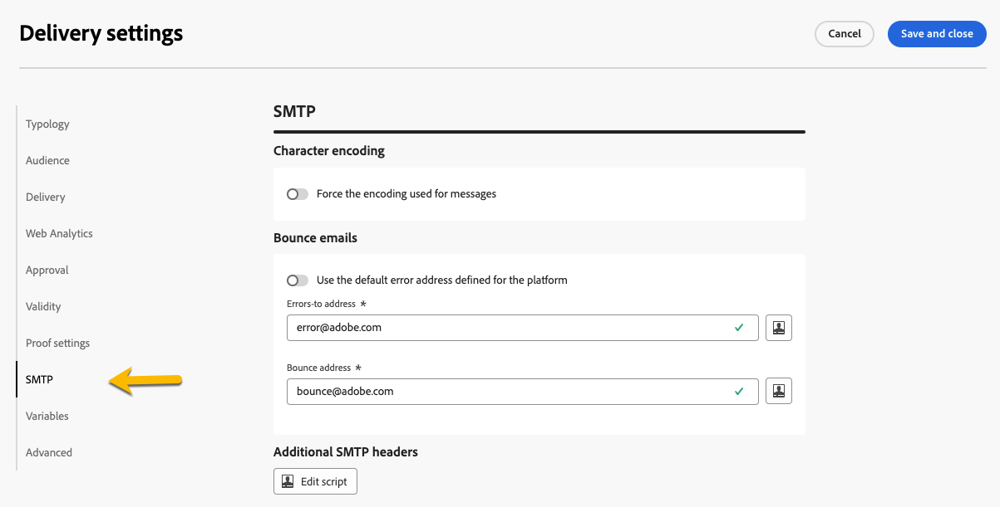

# Leveringsinstellingen configureren {#del-settings}

De montages van de levering zijn **technische leveringsparameters** die in het leveringsmalplaatje worden bepaald. Deze kunnen voor elke levering worden overbelast. Deze montages zijn beschikbaar bij de **knoop van Montages** beschikbaar wanneer het uitgeven van een levering of een leveringsmalplaatje.

>[!CAUTION]
>
>Deze instellingen worden alleen ter informatie beschreven. Sommige van hen hangen van uw configuratie en toestemmingen af. Deze mogen niet in deze versie van het product worden gewijzigd.

## Typologische instellingen {#typology}

>[!CONTEXTUALHELP]
>id="acw_email_settings_typology"
>title="Typologie"
>abstract="Met behulp van typologieën kunt u bedrijfspraktijken standaardiseren voor alle leveringen. Een typologie is een verzameling typologische regels waarmee u het verzenden van leveringen kunt beheren, filteren en prioriteren. Profielen die voldoen aan criteria binnen een typologieregel worden bij de voorbereidingsfase uitgesloten van de toedieningsdoelgroepen."

>[!CONTEXTUALHELP]
>id="acw_delivery_template_settings_typology"
>title="Typologische instellingen voor de levering"
>abstract="Met behulp van typologische regels kunt u bedrijfspraktijken standaardiseren voor alle leveringen. Een typologie is een verzameling typologische regels waarmee u het verzenden van leveringen kunt beheren, filteren en prioriteren. Profielen die voldoen aan criteria binnen een typologieregel worden bij de voorbereidingsfase uitgesloten van de toedieningsdoelgroepen."

De typologieën zijn reeksen **typologieregels** die tijdens de voorbereidingsfase worden uitgevoerd om veelvoudige het filtreren regels op een levering in één keer gemakkelijk toe te passen. Zij staan marketers toe om bedrijfspraktijken over alle leveringen te standaardiseren aangezien zij hen laten controleren, filtreren, en voorrang geven aan het verzenden van leveringen. [ leer hoe te om typologieën en typologieregels tot stand te brengen ](../administration/typologies.md)

{zoomable="yes"}

### Drukparameters {#pressure-parameters}

>[!CONTEXTUALHELP]
>id="acw_email_settings_pressure_parameters"
>title="Drukparameters voor de levering"
>abstract="Met leveringsgewichten kunt u topprioriteit-leveringen identificeren in het kader van vermoeidheidsbeheer. Berichten met het hoogste gewicht hebben prioriteit."

>[!CONTEXTUALHELP]
>id="acw_delivery_template_settings_delivery_weight"
>title="Afleveringsgewicht"
>abstract="Met leveringsgewichten kunt u topprioriteit-leveringen identificeren in het kader van drukbeheer. Berichten met het hoogste gewicht hebben prioriteit."

In deze sectie, laten de drukparameters u a **drempel** aan de beheersregels van de opstellingsvermoeidheid bepalen, die het maximumaantal berichten is dat naar één profiel over een bepaalde periode kan worden verzonden.

Zodra deze drempelwaarde is bereikt, kunnen tot het einde van de in aanmerking genomen periode geen leveringen meer plaatsvinden. Met dit proces kunt u automatisch een profiel uitsluiten van een levering als een bericht de ingestelde drempelwaarde overschrijdt. Op deze manier voorkomt u dat een profiel te vaak wordt benaderd.

Drempelwaarden kunnen constant of variabel zijn. Dit betekent dat drempelwaarden voor een bepaalde periode kunnen variëren van het ene profiel tot het andere, of zelfs voor hetzelfde profiel.

In het veld **[!UICONTROL Weight type]** zijn drie opties beschikbaar:

* **[!UICONTROL Constant]**
* **[!UICONTROL Depends on the recipient]**
* **[!UICONTROL Defined in each rule]**

Gebruik het veld **[!UICONTROL Delivery weight]** om de bezorgprioriteit te definiëren. Elke levering heeft een gewicht dat overeenkomt met het prioriteitsniveau. Standaard is het gewicht van een levering ingesteld op 5. Aan de hand van drukregels kunt u het gewicht bepalen van de leveringen waarop ze worden toegepast. U kunt het gewicht instellen of berekenen met behulp van een formule die geschikt is voor de ontvanger. U kunt bijvoorbeeld het gewicht van een levering bepalen op basis van de belangen van de ontvanger.

Gebruik het veld **[!UICONTROL Delivery mode]** om de evaluatiemodus voor het doel te selecteren.

Er zijn drie modi beschikbaar:

* **[!UICONTROL Target estimation and message personalization]**
* **[!UICONTROL Estimation and approval of the provisional target]**
* **[!UICONTROL Target evaluation]**

>[!NOTE]
>
>Het beheer van de vermoeidheid en de drukregels worden gevormd in de de cliëntconsole van de Campagne. Leer meer in [ Campagne v8 (cliëntconsole) documentatie ](https://experienceleague.adobe.com/docs/campaign/automation/campaign-optimization/pressure-rules.html){target="_blank"}.

### Capaciteitsinstellingen {#capacity-settings}

>[!CONTEXTUALHELP]
>id="acw_email_settings_capacity_settings"
>title="Capaciteitsinstellingen voor de levering"
>abstract="Alvorens berichten te leveren, gebruik capaciteitsregels om ervoor te zorgen uw organisatie de levering, de binnenkomende berichten kan verwerken die de levering, en het aantal vraag kan produceren om abonnees bijvoorbeeld te contacteren. De capaciteitsregels worden gedefinieerd in de Adobe Campaign v8-console. Selecteer in dit scherm een regel die aan het kanaal is gekoppeld."

>[!CONTEXTUALHELP]
>id="acw_delivery_template_settings_recipient_importance"
>title="Belang van de begunstigde"
>abstract="Het belang van de ontvanger is een formule die wordt gebruikt om te bepalen welke profielen worden gehouden wanneer de regels inzake capaciteitstypologie worden overschreden."

In deze sectie kunt u een capaciteitsregel selecteren die is gedefinieerd in de Adobe Campaign v8-console. Deze regel is gekoppeld aan het kanaal.

Het veld **[!UICONTROL Importance of the recipient]** is een formule die wordt gebruikt om te bepalen welke profielen worden bewaard wanneer de regels voor capaciteittypologie worden overschreden.

>[!NOTE]
>
>De typologische regels worden gevormd in de console van de Cliënt van de Campagne. Leer meer in [ Campagne v8 (cliëntconsole) documentatie ](https://experienceleague.adobe.com/docs/campaign/automation/campaign-optimization/consistency-rules.html){target="_blank"}.

## Instellingen voor publiek {#audience}

>[!CONTEXTUALHELP]
>id="acw_email_settings_audience"
>title="Instellingen voor het publiek voor de levering"
>abstract="Selecteer a **doelafbeelding** onder die beschikbaar. Doeltoewijzingen worden gedefinieerd in de Adobe Campaign v8-console. U kunt ook de uitsluitingsparameters voor de levering instellen."

In deze sectie, kunt u a **doelafbeelding** onder die beschikbaar selecteren. Doeltoewijzingen worden gedefinieerd in de Adobe Campaign v8-console. De doelafbeelding is het type gegevens dat een bewerking afhandelt. Hiermee kunt u de doelgroep definiëren: ontvangers, begunstigden van contracten, exploitanten, abonnees, enz. [ Leer meer over doelafbeeldingen ](../audience/targeting-dimensions.md).

In het veld **[!UICONTROL Exclusion]** kunt u aangeven of u profielen wilt uitsluiten die niet meer worden benaderd of die in quarantaine zijn geplaatst. [Meer informatie](https://experienceleague.adobe.com/docs/campaign/campaign-v8/send/failures/quarantines.html){target="_blank"}

## Levering {#delivery}

>[!CONTEXTUALHELP]
>id="acw_email_settings_delivery"
>title="Algemene instellingen voor levering"
>abstract="De parameters van de levering zijn technische montages die op uw levering van toepassing zijn. U kunt de bezorgings- en routinemodi wijzigen, e-mail-BCC activeren, verzenden met golven en ook de indeling van de verzonden e-mailberichten kiezen. Deze opties zijn beperkt tot deskundige gebruikers."

**[!UICONTROL Delivery]** -parameters zijn technische instellingen die van toepassing zijn op de levering.

{zoomable="yes"}

De geïntegreerde **[!UICONTROL Routing]** externe account wordt standaard verschaft. Het bevat de technische parameters die de toepassing toestaan om leveringen te verzenden.

U kunt de onderstaande **[!UICONTROL Sending]** -instellingen definiëren.

* **[!UICONTROL Delivery priority]**: Gebruik deze optie om de verzendvolgorde voor uw leveringen te wijzigen door het prioriteitsniveau in te stellen op Normaal, Hoog of Laag.

* **[!UICONTROL Message batch quantity]**: Gebruik deze optie om het aantal berichten te definiëren dat binnen hetzelfde XML-leveringspakket wordt gegroepeerd. Als de parameter op 0 wordt geplaatst, worden de berichten automatisch gegroepeerd. De pakketgrootte wordt gedefinieerd door de berekening `<delivery size>/1024` , met minimaal 8 en maximaal 256 berichten per pakket.

  >[!IMPORTANT]
  >
  >Wanneer de levering door bestaande wordt gecreeerd te dupliceren, wordt deze parameter teruggesteld.

* **[!UICONTROL Test SMTP delivery]** (e-mailkanaal): deze optie wordt gebruikt om het verzenden via SMTP te testen. De e-mail wordt verwerkt tot verbinding aan de server SMTP, maar wordt niet verzonden: voor elke ontvanger van e-mail, verbindt de Campagne met de SMTP leverancierserver, voert SMTP RCPT aan bevel uit, en sluit de verbinding vóór het bevel SMTP DATA.

* **[!UICONTROL Email BCC]** (e-mailkanaal): deze optie wordt gebruikt om e-mailberichten op een extern systeem op te slaan via BCC door gewoon een BCC-e-mailadres toe te voegen aan uw berichtdoel. Leer meer in [ Campagne v8 (cliëntconsole) documentatie ](https://experienceleague.adobe.com/docs/campaign/campaign-v8/send/emails/email-bcc.html){target="_blank"}.

Selecteer in de sectie **[!UICONTROL Wave definition]** de optie **[!UICONTROL Send using multiple waves]** om het volume dat met golven wordt verzonden geleidelijk te verhogen. Zo voorkomt u dat uw berichten als spam worden gemarkeerd of dat u het aantal berichten per dag wilt beperken. Met golven kunt u leveringen in verschillende batches verdelen in plaats van tegelijkertijd grote volumes berichten te verzenden. [Meer informatie](send-using-waves.md)

Voor e-mailberichten kunt u ook de **[!UICONTROL Mail formats]** van de verzonden berichten wijzigen, zoals hieronder beschreven.

* **[!UICONTROL Use recipient preferences]** (standaardmodus): De e-mailindeling wordt gedefinieerd op basis van de gegevens die zijn opgeslagen in het ontvangende profiel. Als een ontvanger e-mails in een bepaalde indeling wil ontvangen, is dit de verzonden indeling. Als het veld niet is ingevuld, wordt een meerdelig alternatief e-mailbericht verzonden (zie hieronder).

* **[!UICONTROL Let recipient mail client choose the most appropriate format]**: Het e-mailbericht bevat beide indelingen: tekst en HTML. Het formaat dat op ontvangst wordt getoond hangt van de configuratie van de de postsoftware van de ontvanger (multipart-alternatief) af.

  >[!IMPORTANT]
  >
  >Deze optie omvat beide versies van het document. Daarom is dit van invloed op de snelheid van levering, omdat de e-mailgrootte groter is.

* **[!UICONTROL Send all messages in text format]**: De e-mail wordt verzonden in tekstopmaak. De HTML-indeling wordt niet verzonden, maar wordt alleen voor de spiegel gebruikt wanneer de ontvanger op de e-mail klikt.

## Webanalyse {#web-analytics}

>[!CONTEXTUALHELP]
>id="acw_email_settings_webanalytics"
>title="Webanalytische instellingen voor levering"
>abstract="Selecteer een account voor webanalyse. Deze account is geconfigureerd in de Campagne Client Console. U kunt ook de tags definiëren die worden gedeeld met het analyseprogramma dat u gebruikt."

In deze sectie kunt u een account voor webanalyse selecteren. Dit account is geconfigureerd in de Campagne-clientconsole.

U kunt ook de tags definiëren die worden gedeeld met het analyseprogramma dat u gebruikt.

>[!NOTE]
>
>De mogelijkheden van de Analytics van het Web worden gevormd in de console van de Cliënt van de Campagne. Leer meer in [ Campagne v8 (cliëntconsole) documentatie ](https://experienceleague.adobe.com/docs/campaign/campaign-v8/connect/ac-aa.html#external-account-ac){target="_blank"}.

## Opnieuw {#retries}

>[!CONTEXTUALHELP]
>id="acw_delivery_template_settings_retries"
>title="Maximum aantal pogingen"
>abstract="Als een bericht mislukt als gevolg van een tijdelijke fout, worden opnieuw pogingen uitgevoerd tot het einde van de leveringsduur."

<!--Currently not visible in UI > ??-->

Voor tijdelijk niet-geleverde berichten vanwege een fout Zacht of Genegeerd wordt het automatisch opnieuw geprobeerd. Door gebrek, zijn vijf herpogingen gepland voor de eerste dag van de levering met een minimuminterval van één uur uitgespreid over de 24 uren van de dag.

## Goedkeuring (e-mailkanaal) {#approval}

>[!CONTEXTUALHELP]
>id="acw_email_settings_approval"
>title="Goedkeuringsmodus voor levering"
>abstract="Selecteer de goedkeuringsmodus. Als de waarschuwingen tijdens de leveringsvoorbereiding worden geproduceerd, kunt u de levering vormen om te bepalen al dan niet het nog zou moeten worden uitgevoerd."

>[!CONTEXTUALHELP]
>id="acw_delivery_template_settings_approval"
>title="Goedkeuringsmodus voor de leveringen"
>abstract="Selecteer de goedkeuringsmodus voor leveringen op basis van deze sjabloon. Als de waarschuwingen tijdens de leveringsvoorbereiding worden geproduceerd, kunt u de levering vormen om te bepalen al dan niet het nog zou moeten worden uitgevoerd."

Als de waarschuwingen tijdens een voorbereiding van de e-maillevering worden geproduceerd, kunt u de levering vormen om te bepalen al dan niet het nog zou moeten worden uitgevoerd. Door gebrek, moet de gebruiker het verzenden van e-mails aan het eind van de analysefase bevestigen: dit is **handmatige** bevestiging.

U kunt een andere goedkeuringsmodus in het desbetreffende veld selecteren. Beschikbare modi zijn:

* **[!UICONTROL Manual]**: Aan het einde van de analysefase moet de gebruiker de levering bevestigen om te beginnen met verzenden.
* **[!UICONTROL Semi-Automatic]**: het verzenden begint automatisch als de analysefase geen waarschuwingsberichten genereert.
* **[!UICONTROL Automatic]**: het verzenden begint automatisch aan het einde van de analysefase, ongeacht het resultaat.

## Geldigheid {#validity}

>[!CONTEXTUALHELP]
>id="acw_email_settings_validity"
>title="Geldigheid van instellingen"
>abstract="Het **gebied van de Leveringsduur** laat u de grens voor globale leveringspogingen ingaan. Dit betekent dat Adobe Campaign de berichten verzendt die op de begindatum beginnen, en dan, voor berichten die een fout slechts terugkeren, regelmatig, configureerbare herpogingen worden uitgevoerd tot de geldigheidsgrens wordt bereikt.  het **de geldigheidslimiet van Middelen** gebied wordt gebruikt voor geuploade middelen, zoals spiegel pagina of beelden. Wanneer de limiet is bereikt, zijn de bronnen niet meer beschikbaar."

>[!CONTEXTUALHELP]
>id="acw_delivery_template_settings_resources_validity"
>title="Geldigheidslimiet voor bronnen"
>abstract="Het **gebied van de geldigheidsgrens van Middelen** wordt gebruikt voor geuploade middelen, zoals de spiegelpagina of beelden. Deze bronnen gelden voor een beperkte periode: wanneer de limiet is bereikt, zijn er geen bronnen meer beschikbaar."

>[!CONTEXTUALHELP]
>id="acw_delivery_template_settings_delivery_duration"
>title="Leveringsduur"
>abstract="Het **gebied van de Leveringsduur** laat u de grens voor globale leveringspogingen ingaan. Dit betekent dat Adobe Campaign de berichten verzendt die op de begindatum beginnen, en dan, voor berichten die een fout slechts terugkeren, regelmatig, configureerbare herpogingen worden uitgevoerd tot de geldigheidsgrens wordt bereikt."

<!--
>[!CONTEXTUALHELP]
>id="acw_email_settings_resources_validity"
>title="Resources validity limit"
>abstract="The Validity limit field is used for uploaded resources, such as the mirror page or images. These resources are valid for a limited time: once the limit is reached, resources are no longer available."
-->

### Geldigheidsperiode {#validity-period}

In het veld **[!UICONTROL Delivery duration]** kunt u de limiet voor algemene leveringspogingen invoeren. Dit betekent dat Adobe Campaign de berichten verzendt die op de begindatum beginnen, en dan, voor berichten die een fout slechts terugkeren, regelmatig, configureerbare herpogingen worden uitgevoerd tot de geldigheidsgrens wordt bereikt.

U kunt ook datums opgeven. Selecteer **[!UICONTROL Explicitly set validity dates]** om dit te doen. In dit geval kunt u ook de tijd opgeven op basis van de uiterste datum voor levering en geldigheid. De huidige tijd wordt standaard gebruikt, maar u kunt deze rechtstreeks wijzigen in het invoerveld.

**[!UICONTROL Resources validity limit]** wordt gebruikt voor geüploade bronnen, voornamelijk voor de spiegelpagina en afbeeldingen. De bronnen op deze pagina zijn gedurende een beperkte tijd geldig (om schijfruimte te besparen). Na deze limiet zijn deze bronnen niet meer beschikbaar.

{zoomable="yes"}

<!--Change screenshot to be consistent with prod > not sure which version is correct-->

Leer meer over de periode van de leveringsgeldigheid in [ Campagne v8 (cliëntconsole) documentatie ](https://experienceleague.adobe.com/docs/campaign/campaign-v8/campaigns/send/failures/delivery-failures.html#validity-period){target="_blank"}.

### Paginabeheer spiegelen (e-mailkanaal) {#mirror}

De spiegelpagina is een HTML-pagina die online toegankelijk is via een webbrowser. De inhoud is identiek aan de e-mail. Standaard wordt de spiegelpagina gegenereerd als de koppeling wordt ingevoegd in de inhoud van de e-mail.

Naast de standaardmodus zijn ook de volgende opties beschikbaar:

* **[!UICONTROL Force the generation of the mirror page]**: Gebruik deze modus om de spiegelpagina te genereren, zelfs als er geen koppeling naar de spiegelpagina is ingevoegd in de e-mail.
* **[!UICONTROL Do not generate the mirror page]**: gebruik deze modus om te voorkomen dat er een spiegelpagina wordt gegenereerd, zelfs als de koppeling aanwezig is in de e-mail.
* **[!UICONTROL Generates a mirror page accessible using only the message identifier]**: Wanneer de koppeling naar de spiegelpagina niet aanwezig is in de e-mailinhoud, gebruikt u deze optie om toegang tot de inhoud van de spiegelpagina, in het venster van het leveringslogboek, vanaf de clientconsole in te schakelen.

### Tracking {#tracking}

<!--
>[!CONTEXTUALHELP]
>id="acw_email_settings_tracking_validity"
>title="Validity period"
>abstract="This option defines the duration for which the tracking is activated on the URLs."
-->

>[!CONTEXTUALHELP]
>id="acw_delivery_template_settings_tracking_validity"
>title="Geldigheidsperiode"
>abstract="De geldigheidsperiode bepaalt de duur waarvoor het volgen op bericht URLs wordt geactiveerd."

**[!UICONTROL Tracking]** -parameters worden gedefinieerd in de verwante sectie. Mogelijke opties zijn:

* **[!UICONTROL Tracking validity limit]**: Gebruik deze optie om de duur te wijzigen waarvoor de tekstspatiëring op de URL&#39;s wordt geactiveerd.
* **[!UICONTROL Substitution URL for expired URLs]**: Gebruik deze optie om een URL naar een fallback-webpagina in te voeren: deze wordt weergegeven zodra de tekstspatiëring is verlopen.

## Proefinstellingen {#test-setttings}

>[!CONTEXTUALHELP]
>id="acw_email_settings_testsettings"
>title="De proefdrukinstellingen voor de levering definiëren"
>abstract="Selecteer de uitsluitingsparameters en pas het label van de proefdrukken aan."

<!--Test to be replaced with Proof everywhere - currently not consistent within UI > changed to Proof to reflect UI here but not consistent in documentation either-->

U kunt de uitsluitingsparameters in deze sectie instellen. Beschikbare opties zijn:

* Met **[!UICONTROL Keep doubles]** kunt u meerdere leveringen toestaan aan profielen die aan verschillende doelcriteria voldoen.
* Met **[!UICONTROL Keep denylisted addresses]** kunt u voorkomen dat profielen waarop de levering niet langer gericht is, worden geactiveerd, bijvoorbeeld na een abonnement (opt-out).
* Met **[!UICONTROL Keep quarantined addresses]** kunt u profielen met een adres dat niet reageert, behouden van het doel.

U kunt ook de tabel van de proefdrukken aanpassen:

* Gebruik **[!UICONTROL Keep the delivery code for the proof]** om aan de proef de zelfde leveringscode te associëren die voor de levering wordt bepaald waarop het betrekking heeft.
* Standaard wordt het onderwerp van de proefdruk voorafgegaan door &#39;PROOF #&#39;, waarbij # het nummer van de proefdruk is. U kunt dit voorvoegsel wijzigen in het veld **[!UICONTROL Label prefix]** .

## SMS-instellingen (SMS-kanaal) {#sms-tab}

>[!CONTEXTUALHELP]
>id="acw_sms_delivery_settings"
>title="Instellingen voor SMS-verzending"
>abstract="De leveringsparameters van SMS zijn technische montages die op uw levering van SMS van toepassing zijn. U kunt het afzenderadres, de dienstparameters, transmissiemodus, en meer bepalen. Deze opties zijn beperkt tot deskundige gebruikers."

De leveringsparameters van SMS zijn technische montages die op uw levering van SMS van toepassing zijn. U kunt het afzenderadres, de dienstparameters, transmissiemodus, en meer bepalen. Deze opties zijn beperkt tot deskundige gebruikers.

* **[!UICONTROL Sender address]**

  Het veld is door de SMPP-specificatie beperkt tot 21 tekens, maar sommige providers staan mogelijk langere waarden toe. Houd er rekening mee dat in sommige landen zeer strikte beperkingen kunnen worden toegepast (lengte, inhoud, toegestane tekens, ...), zodat u mogelijk moet controleren of de inhoud die u hier plaatst, geldig is. Wees vooral voorzichtig wanneer u gepersonaliseerde velden gebruikt.

  Met dit optionele veld kunt u het verzendadres (oADC) overschrijven. Zijn inhoud wordt geplaatst in het *source_addr* gebied van SUBMIT_SM PDU.

  Hoewel dit veld in de SMPP-specificatie wordt beperkt tot 21 tekens, ondersteunen sommige providers mogelijk langere waarden. Houd er rekening mee dat bepaalde landen strenge regels opleggen aan afzenderadressen (met betrekking tot lengte, inhoud, toegestane tekens, enzovoort), dus controleer altijd of uw invoer voldoet aan de lokale vereisten. Wees extra voorzichtig wanneer u werkt met gepersonaliseerde velden.

  Als dit veld leeg blijft, wordt in plaats daarvan de waarde gebruikt van het veld Source-nummer dat in de externe account is gedefinieerd. Als beide waarden leeg zijn, zal het *source_addr* gebied leeg worden verlaten.

* **[!UICONTROL Service type]** :

  Deze parameter wordt doorgegeven aan de provider zoals hij is.

* **[!UICONTROL Service or program ID]**

  >[!NOTE]
  >
  >Het gebruik van dit veld wordt afgeraden. De facultatieve parameters SMPP, beschikbaar in de Console van de Cliënt, verstrekken een veel flexibelere implementatie.
  >
  >Dit veld kan niet gelijktijdig met optionele SMPP-parameters worden gebruikt.

  In combinatie met de instelling voor de overeenkomende externe account kunt u één optionele parameter met elke MT verzenden. In dit veld wordt het waardegedeelte van het TLV gedefinieerd.

* **[!UICONTROL Transmission mode]**

  In dit veld wordt het type SMS gedefinieerd dat wordt verzonden: of het een normaal of Flash-bericht is en of het op het mobiele apparaat of de SIM-kaart moet worden opgeslagen. Deze instelling wordt verzonden in het optionele veld dest_addr_subunit in de SUBMIT_SM PDU.

   * **de Flits** plaatst de waarde aan 1. Verzendt een flash-SMS-bericht dat direct op het scherm wordt weergegeven en niet wordt opgeslagen.
   * **Normaal** plaatst de waarde aan 0. Verzendt standaard SMS.
   * **die op mobiele** wordt bewaard plaatst de waarde aan 2. Geeft het apparaat de opdracht om het SMS in het interne geheugen op te slaan.
   * **die op terminal** wordt opgeslagen plaatst de waarde aan 3. Geeft het apparaat de opdracht het SMS op de SIM-kaart op te slaan.

* **[!UICONTROL Priority, Communication type]**

  Deze gebieden worden genegeerd door de uitgebreide schakelaar SMPP.

* **[!UICONTROL Maximum number of SMS per message]**

  Deze instelling is alleen effectief als de optie Bericht laden is uitgeschakeld (zie de instellingen voor de externe account voor meer informatie). Als het bericht meer SMS dan deze waarde vereist, wordt een fout teweeggebracht.

  Terwijl het protocol van SMS berichten toestaat om in maximaal 255 delen worden verdeeld, kunnen sommige mobiele apparaten moeite hebben om berichten met meer dan 10 delen opnieuw samen te stellen (de grens hangt van het apparatenmodel af). Voor betrouwbaarheid, is het best om berichten tot 5 delen of minder te beperken.

  Houd er rekening mee dat de berichtgrootten kunnen variëren vanwege de manier waarop persoonlijke berichten in Adobe Campaign werken. Een hoog aantal lange berichten kan resulteren in hogere verzendkosten, dus het gebruik van een verstandige beperking helpt de uitgaven te beheersen.

  Als u deze waarde instelt op 0, wordt de limiet uitgeschakeld.

## SMTP-instellingen voor e-maillevering {#smtp}

>[!CONTEXTUALHELP]
>id="acw_email_settings_smtp"
>title="SMTP-parameters"
>abstract="U kunt extra parameters SMTP aan uw e-maillevering toevoegen."

U kunt extra parameters SMTP aan uw e-maillevering toevoegen. U kunt het op het lusje SMTP van de leveringsmontages doen.

{zoomable="yes"}

### Tekencodering {#character-encoding}

In de sectie **[!UICONTROL Character encoding]** kunt u een specifieke codering instellen. De standaardcodering is UTF-8, die voor de meeste tekens werkt. Sommige e-mailproviders geven speciale tekens echter mogelijk niet correct weer als ze de standaardcodering UTF-8 niet ondersteunen.

Als u bijvoorbeeld een e-mail met Japanse tekens wilt verzenden, is het beter om een codering te gebruiken die deze tekens specifiek ondersteunt, zodat het Japanse publiek alles goed kan zien.

Hiervoor activeert u de schakeloptie **[!UICONTROL Force the encoding used for messages]** en selecteert u de juiste codering in de lijst die uw speciale tekens ondersteunt.

{zoomable="yes"}

### Bounce-e-mails {#bounce-emails}

Op het tabblad **[!UICONTROL SMTP]** van de leveringsinstellingen kunt u ook het beheer van stuiterende berichten configureren.

* **[!UICONTROL Errors-to-address]**: Als u de **[!UICONTROL Use the default error address defined for the platform]** -schakeloptie activeert, worden teruggestuurde e-mails ontvangen in het standaardfoutvak van het platform. Als u het niet activeert, kunt u een specifiek foutenadres voor uw levering bepalen.

* **[!UICONTROL Bounce address]**: U kunt ook een ander adres definiëren waarnaar de onverwerkte teruggestuurde e-mails worden doorgestuurd. Met dit adres kunt u de redenen voor het stuiteren onderzoeken wanneer e-mails niet automatisch kunnen worden gekwalificeerd door de toepassing.

Deze twee gebieden kunnen worden gepersonaliseerd zoals die in [ wordt beschreven deze sectie ](../personalization/gs-personalization.md).

{zoomable="yes"}

### Aanvullende SMTP-koppen {#smtp-headers}

U kunt **[!UICONTROL SMTP headers]** toevoegen aan uw e-maillevering op het tabblad SMTP van de leveringsinstellingen.

Het script dat in dit venster wordt ingevoerd, moet verwijzen naar één header per regel in het volgende formulier: name:value.

Waarden worden indien nodig automatisch gecodeerd.

{zoomable="yes"}

>[!IMPORTANT]
>
>Het toevoegen van een script voor het opnemen van extra SMTP-kopteksten is gereserveerd voor gevorderde gebruikers. De syntaxis van dit script moet voldoen aan de vereisten van dit type content: geen ongebruikte ruimte, geen lege regel, enz.

## Variabelen toevoegen {#variables-delivery}

>[!CONTEXTUALHELP]
>id="acw_delivery_settings_variable"
>title="Variabelen"
>abstract="U kunt variabelen aan uw levering toevoegen, die voor het volgen en verpersoonlijken nuttig kunnen zijn. Deze variabelen zijn toegankelijk vanuit zowel uw leveringsinhoud als uw workflows."

U kunt variabelen aan uw levering toevoegen, die voor het volgen en verpersoonlijken nuttig kunnen zijn. Deze variabelen zijn toegankelijk vanuit zowel uw leveringsinhoud als uw workflows. Opgeslagen variabelen worden gebruikt om waarden in te stellen die in alle berichten binnen de levering constant blijven. Zij kunnen ook in leveringsmalplaatjes worden gevormd.

Als u een variabele wilt toevoegen, bladert u naar het tabblad **[!UICONTROL Variables]** , zoals hieronder wordt weergegeven.

{zoomable="yes"}

Klik op de knop **[!UICONTROL Add Variables]** om de details van de variabele in te voeren. U kunt de waarde ervan rechtstreeks toevoegen of er een expressie voor gebruiken door het selectievakje **[!UICONTROL Value is the result of an expression]** in te schakelen. Klik vervolgens op **[!UICONTROL Confirm]** om de wijzigingen op te slaan.

{zoomable="yes"}

Leer meer over [ gebruikend variabelen voor verpersoonlijking ](../personalization/personalize.md#variables-personalization) en [ gebruikend variabelen voor dynamische inhoud ](../personalization/conditions.md#variables-conditional).