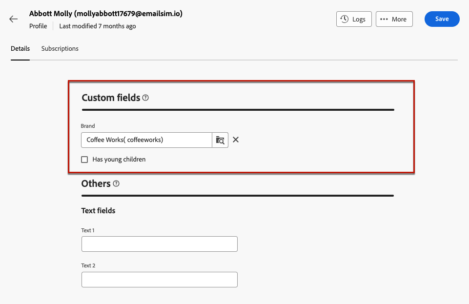

# Profielen controleren en bewerken {#profiles}

>[!CONTEXTUALHELP]
>id="acw_homepage_rn4"
>title="360-weergave van uw profielen"
>abstract="Maak nieuwe profielen en controleer deze met krachtige rapporten en gereedschappen. Open de kenmerken, interacties en logbestanden van uw profielen. Met de filteropties bladert u door de lijst met profielen, bewerkt en werkt u het profiel bij."
>additional-url="https://experienceleague.adobe.com/docs/campaign-web/v8/whats-new.html" text="Zie opmerkingen bij releases"

>[!CONTEXTUALHELP]
>id="acw_recipients_list"
>title="Profielen"
>abstract="Een profiel is een individu dat berichten ontvangt die door Adobe Campaign worden verzonden. In deze lijst kunt u op basis van uw machtigingen de details van de profielen weergeven. Gebruik de filteropties om door deze lijst te bladeren. U kunt een kleine set kenmerken van uw profielen bewerken en bijwerken."

## Aan de slag met profielen {#gs}

Een profiel in het Web van Adobe Campaign is een individu dat in het gegevensbestand wordt opgeslagen, dat als zeer belangrijke component dient aan [publiek maken](create-audience.md) voor leveringen en [personalisatie toevoegen](../personalization/personalize.md) gegevens naar uw inhoud.

Andere typen profielen worden opgeslagen in de database, zoals **[!UICONTROL Test profiles]**, die zijn ontworpen om uw leveringen te testen voordat ze naar het uiteindelijke publiek worden verzonden. [Meer informatie](test-profiles.md)

Profielen kunnen alleen via de Adobe Campaign-clientconsole worden gemaakt - [leren hoe](https://experienceleague.adobe.com/docs/campaign/campaign-v8/audience/add-profiles/create-profiles.html){target="_blank"}. Ze zijn echter toegankelijk en bewerkbaar op het Adobe Campaign Web via het **[!UICONTROL Customer management]** > **Profielen** in de linkernavigatieregel.

>[!NOTE]
>
>Afhankelijk van uw machtigingen hebt u mogelijk geen toegang tot de volledige lijst met profielen die in de database zijn opgeslagen. [Meer informatie over machtigingen](../get-started/permissions.md).

* U kunt het filter **[!UICONTROL Profiles]** lijst die het onderzoeksgebied of de filters gebruikt beschikbaar bij **Filters tonen** knop. U kunt de resultaten beperken tot een specifieke [map](../get-started/permissions.md#folders) het gebruiken van de drop-down lijst, of voegt regels toe gebruikend [querymodel](../query/query-modeler-overview.md).

  

* Als u een profiel wilt verwijderen, selecteert u de bijbehorende optie in het menu **[!UICONTROL More actions]** -menu.

* Klik op het gewenste item in de lijst als u een profiel wilt bewerken. [Meer informatie](#access)

U hebt ook toegang tot profielen via de **[!UICONTROL Explorer]** van de **[!UICONTROL Profiles & Targets]** > **[!UICONTROL Recipients]** knooppunt.

Vervolgens kunt u mappen of submappen bladeren, maken en beheren en de bijbehorende machtigingen controleren. [Leer hoe u mappen maakt](../get-started/permissions.md#folders)

Van de **[!UICONTROL Explorer]** kunt u ook filteren, verwijderen en [bewerken](#access) profielen.

## Kenmerken van profielen openen en bewerken {#access}

>[!CONTEXTUALHELP]
>id="acw_recipients_creation_details"
>title="Basisdetails"
>abstract="Deze sectie biedt inzicht in de basisdetails van het profiel. Als u gegevens wilt wijzigen, brengt u de wijzigingen rechtstreeks aan in het desbetreffende veld en klikt u op de knop **Opslaan** in de rechterbovenhoek van het scherm."

>[!CONTEXTUALHELP]
>id="acw_recipients_creation_contactinformation"
>title="Contactgegevens"
>abstract="In deze sectie vindt u informatie over de contactgegevens van het profiel. Als u gegevens wilt wijzigen, brengt u de wijzigingen rechtstreeks aan in het desbetreffende veld en klikt u op de knop **Opslaan** in de rechterbovenhoek van het scherm."

>[!CONTEXTUALHELP]
>id="acw_recipients_creation_address"
>title="Adres"
>abstract="Deze sectie biedt inzicht in het postadres van het profiel en de adreskwaliteit. Als u gegevens wilt wijzigen, brengt u de wijzigingen rechtstreeks aan in het desbetreffende veld en klikt u op de knop **Opslaan** in de rechterbovenhoek van het scherm."

>[!CONTEXTUALHELP]
>id="acw_recipients_creation_account"
>title="Accountgegevens"
>abstract="Deze sectie biedt inzicht in de accountdetails van het profiel. Als u gegevens wilt wijzigen, brengt u de wijzigingen rechtstreeks aan in het desbetreffende veld en klikt u op de knop **Opslaan** in de rechterbovenhoek van het scherm."

>[!CONTEXTUALHELP]
>id="acw_recipients_creation_nolongercontact"
>title="Ontvangers nemen geen contact meer op"
>abstract="In deze sectie vindt u inzichten in de contactvoorkeuren van het profiel. Als u gegevens wilt wijzigen, brengt u de wijzigingen rechtstreeks aan in het desbetreffende veld en klikt u op de knop **Opslaan** in de rechterbovenhoek van het scherm."

>[!CONTEXTUALHELP]
>id="acw_recipients_creation_customfields"
>title="Aangepaste velden"
>abstract="De gebieden van de douane zijn specifieke attributen die aan uw behoeften worden aangepast die voor uw instantie zijn gevormd. Als u gegevens wilt wijzigen, brengt u de wijzigingen rechtstreeks aan in het desbetreffende veld en klikt u op de knop **Opslaan** in de rechterbovenhoek van het scherm."

>[!CONTEXTUALHELP]
>id="acw_recipients_creation_othersfields"
>title="Overige"
>abstract="Deze sectie bevat aanvullende ingebouwde kenmerken. Als u gegevens wilt wijzigen, brengt u de wijzigingen rechtstreeks aan in het desbetreffende veld en klikt u op de knop **Opslaan** in de rechterbovenhoek van het scherm."

>[!CONTEXTUALHELP]
>id="acw_recipients_subscription_list"
>title="Lijst met abonnementen voor ontvangers"
>abstract="Dit tabblad bevat een lijst met alle services waarop het profiel is geabonneerd."

Voer de onderstaande stappen uit om toegang te krijgen tot de details van een profiel en deze te bewerken.

1. Bladeren naar **[!UICONTROL Customer management]** > **[!UICONTROL Profiles]** en klik op het gewenste item in het pop-upmenu **[!UICONTROL Profiles]** lijst.

   

1. De gedetailleerde informatie over het profiel wordt weergegeven.

   De **[!UICONTROL Details]** kunt u door de ingebouwde en aangepaste kenmerken van het profiel bladeren. Als u een kenmerk wilt bewerken, brengt u wijzigingen aan in het gewenste veld en klikt u op de knop **[!UICONTROL Save]** knop.

   

   1. Profielen worden standaard opgeslagen in de **[!UICONTROL Recipients]** map. U kunt dit wijzigen door naar de gewenste locatie te bladeren. [Leer hoe u met mappen werkt](../get-started/permissions.md#folders)

      

   1. In de **[!UICONTROL Contact information]** kunt u het e-mailadres en andere relevante gegevens bijwerken. Het e-mailadres wordt tussen haakjes weergegeven na het profiellabel.

      

   1. Controleer de **[!UICONTROL No longer contact]** opties en werk deze zo nodig bij. Als een van deze opties is geselecteerd, wordt het profiel op lijst van gewezen personen weergegeven. Als de ontvanger bijvoorbeeld in een nieuwsbrief op een koppeling voor niet-abonnement heeft geklikt, wordt deze informatie aan de contactgegevens toegevoegd. Deze ontvanger is niet meer gericht op de geselecteerde kanalen. [Meer informatie](https://experienceleague.adobe.com/docs/campaign/campaign-v8/send/failures/quarantines.html){target="_blank"}

      

   1. Als er **[!UICONTROL Custom fields]**, kunt u de waarden naar wens bijwerken. Aangepaste velden zijn aanvullende kenmerken die aan de **[!UICONTROL Profiles]** schema door de Adobe Campaign console. [Meer informatie](https://experienceleague.adobe.com/docs/campaign/campaign-v8/developer/shemas-forms/extend-schema.html){target="_blank"}

      

1. Klik op de knop **[!UICONTROL Subscriptions]** voor toegang tot informatie over de services waarop het profiel is geabonneerd. [Meer informatie over abonnementsservices](manage-services.md)

   

1. Klik op de knop **[!UICONTROL Logs]** in de rechterbovenhoek van het scherm om de geschiedenis van de interactie van het profiel weer te geven door logbestanden te verzenden, uit te sluiten en te volgen. [Meer informatie over leveringslogboeken](../monitor/delivery-logs.md)

   U kunt ook de voorstellen bekijken die aan het profiel in worden voorgesteld in **[!UICONTROL Propositions]** tab. [Meer weten over aanbiedingen](../msg/offers.md)

   
