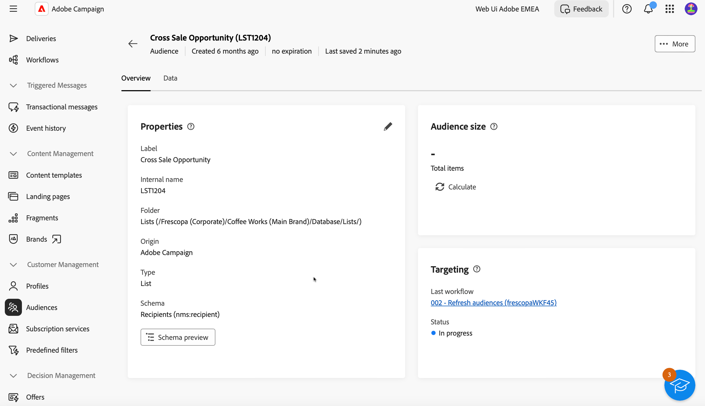

# Het publiek bewaken en beheren {#create-audiences}

De lijst met publiek beschikbaar voor gebruik in het Web van de Campagne is toegankelijk van **[!UICONTROL Audiences]** -menu.

Het publiek kan uit veelvoudige bronnen voortkomen. De **[!UICONTROL Origin]** kolommen geven aan waar een bepaald publiek is gemaakt:

* **[!UICONTROL Adobe Experience Platform:]** Dit publiek wordt gecreeerd binnen Adobe Experience Platform en is geïntegreerd in het Web van de Campagne gebruikend de Adobe Bronnen en de integratie van Doelen. Leer hoe u deze integratie instelt in [Campagne v8-documentatie (clientconsole)](https://experienceleague.adobe.com/docs/campaign/campaign-v8/connect/ac-aep/ac-aep.html)

* **[!UICONTROL Adobe Campaign]**: Deze doelgroepen zijn gemaakt met workflows voor het publiek van Campagne Web. [Leer hoe u een publiek kunt maken](create-audience.md)

*wat zijn de andere oorsprong ? Zijn ze aangepast? Waar definiëren we ze?*

*Kolom Type: niet beschikbaar in het filter, normaal? wat zijn de verschillende types, groep? list ?*

Voor meer informatie over een publiek opent u deze vanuit de lijst. De publiekseigenschappen worden weergegeven, samen met het aantal profielen dat is opgenomen in het publiek. U kunt het aantal gebruikers op elk gewenst moment vernieuwen met de opdracht **[!UICONTROL Calculate]** knop.

De **[!UICONTROL Data]** kunt u de profielen die deel uitmaken van het publiek, vizualiseren. U kunt deze weergave aanpassen door meer kolommen toe te voegen of geavanceerde filters te gebruiken om de weergegeven gegevens te verfijnen.

Om een publiek te dupliceren of te schrappen, klik **[!UICONTROL More action]** in de lijst met soorten publiek naast de naam van het publiek of in het scherm met publieksdetails.

*Wanneer u een publiek dupliceert, mag u de naam niet bij (1) houden.*
