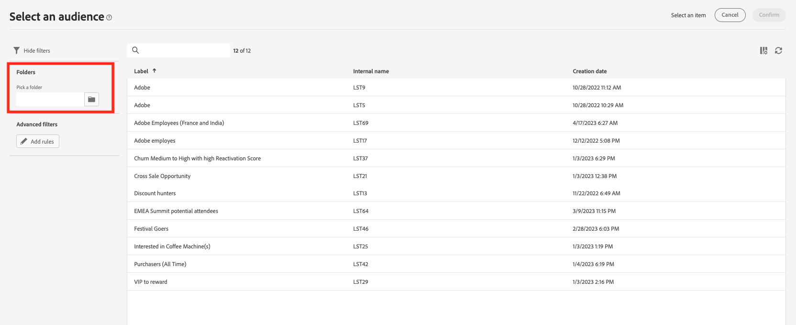

# Bestaande doelgroep selecteren {#add-audience}

>[!CONTEXTUALHELP]
>id="acw_deliveries_email_audience_select"
>title="Bestaande doelgroep selecteren"
>abstract="Blader in de lijst om een bestaand publiek te selecteren. Gebruik het pictogram Filters tonen om de lijst te filteren of selecteer een specifieke map."

In deze sectie wordt uitgelegd hoe u een bestaand publiek kunt selecteren wanneer u de doelpopulatie van een levering definieert. Wanneer u het hoofddoel van een levering definieert, kunt u ook:

* [Eenmalig publiek maken](one-time-audience.md) het gebruiken van de regelbouwer.
* [Een publiek laden vanuit een extern bestand](file-audience.md) (alleen voor e-mails).

De doelgroepen in de leveringen zijn toegankelijk via de **Publiek** links. Zij komen uit veelvoudige bronnen zoals de console van de Cliënt, de het publiekswerkschema&#39;s van het Web van de Campagne of Adobe Experience Platform voort. [Leer hoe u het publiek kunt controleren en beheren](manage-audience.md)

Volg onderstaande stappen om een bestaand publiek voor uw bericht te selecteren:

1. Van de **Publiek** sectie van de medewerker van de leveringsverwezenlijking, klik **[!UICONTROL Select audience]** en kies vervolgens

   

1. Kies **[!UICONTROL Select audience]** om een bestaand publiek te gebruiken. In dit scherm worden alle bestaande soorten publiek voor de huidige map weergegeven.

   

   Blader naar de `AEP Audiences folder` in het filtergedeelte van het scherm.

   

1. Met de filtersectie hebt u toegang tot filteropties om de lijst met doelgroepen te verfijnen. Om dit te doen, klik **Regels toevoegen** om tot de regelbouwer toegang te hebben, die u geavanceerde filters voor de lijst van publiek laat tot stand brengen. [Leer hoe u de regelbuilder gebruikt](../query/query-modeler-overview.md)

   

1. Klikken **Bevestigen** om uw publiek toe te voegen als belangrijkste doel voor levering. Zodra gedaan, kunt u het publiek nog verfijnen gebruikend de regelbouwer door te klikken **Regels bewerken** knop.

   

   U kunt ook een controlegroep instellen om het effect van uw campagnes te meten. De controlegroep ontvangt niet het bericht. Dit staat u toe om het gedrag van de bevolking te vergelijken die het bericht met het gedrag van contacten ontving die niet. [Meer informatie](control-group.md)
