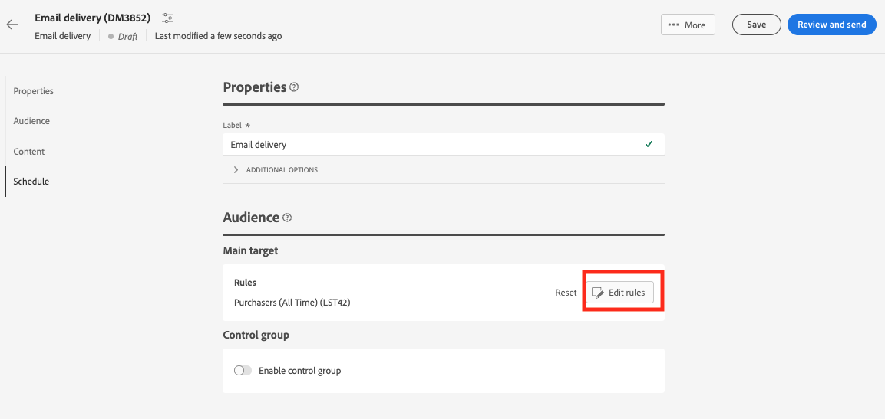

# Een Adobe Experience Platform-publiek gebruiken{#aep-audience}

De Adobe Campaign Managed Cloud Service Destination and Source connectors staan naadloze integratie tussen Adobe Campaign en Adobe Experience Platform toe.

Zodra u een publiek van Adobe Experience Platform hebt gecreeerd en het in de cliëntconsole beschikbaar is, kunt u het op de zelfde manier gebruiken zoals u voor een publiek van de Campagne zou personaliseren en berichten verzenden.

>[!NOTE]
>
>Om het publiek van Adobe Experience Platform in Campaign te gebruiken, moet u de integratie met de Bronnen en Doelen van Adobe vormen. Zie [Campagne v8 (console)-documentatie](https://experienceleague.adobe.com/docs/campaign/campaign-v8/connect/ac-aep.html){target="_blank"}.

Als u het publiek van een levering wilt selecteren, kunt u ook:

* Maak een nieuw publiek. [Meer informatie](segment-builder.md)
* Laad een publiek vanuit een extern bestand. [Meer informatie](file-audience.md)
* Gebruik een bestaand publiek van de Campagne. [Meer informatie](add-audience.md).

Volg onderstaande stappen om een Adobe Experience Platform-publiek voor uw levering te selecteren:

1. Van de **Publiek** sectie van de medewerker van de leveringsverwezenlijking, klik **[!UICONTROL Select audience]** knop.

   

1. Kies **[!UICONTROL Select audience]** om een bestaand publiek te gebruiken. Kies **Maak uw eigen**. Zie dit [sectie](segment-builder.md).

   In dit scherm worden alle bestaande soorten publiek weergegeven die zijn gedefinieerd in de Adobe Campaign-clientconsole, voor de huidige map. Blader naar de `AEP Audiences folder` in het filtergedeelte van het scherm.

   

   U kunt ook een regel definiëren om op de oorsprong van het publiek te filteren, zoals hieronder:

   

1. Kies een publiek en klik op **Selecteren**.

1. Klikken **Regels bewerken** als u uw publiek wilt verfijnen.

   

1. Gebruikend de regelbouwer, kunt u uw publiek met extra filters verrijken of door verschillende soorten publiek te combineren. Zie dit [sectie](segment-builder.md).

1. Klikken **Opslaan**.

