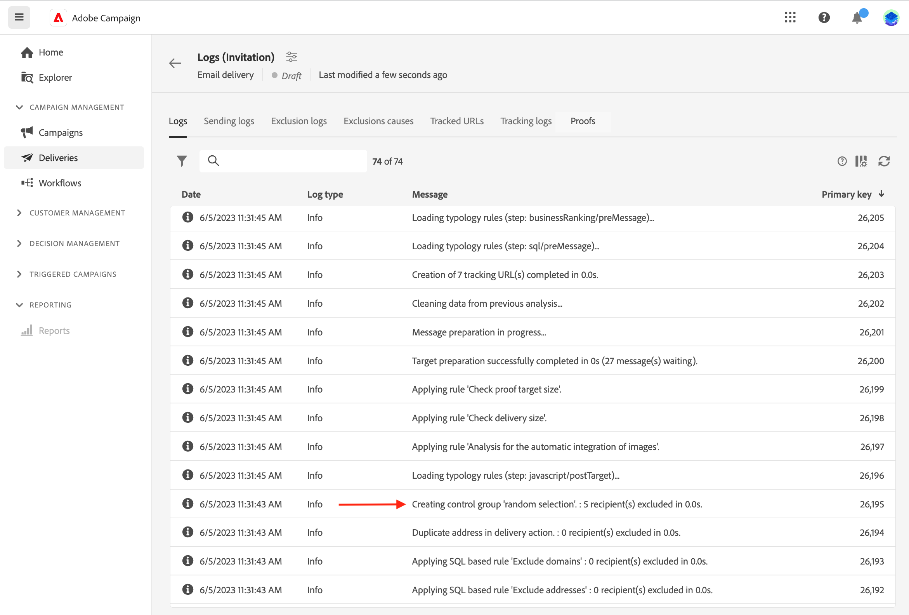

# Een controlegroep instellen {#control-group}

Een controlegroep is een subpopulatie die van de levering is uitgesloten. U kunt een controlegroep bepalen vermijden verzendend berichten naar een gedeelte van uw publiek en post-levering gedrag met het belangrijkste doel vergelijken. Met deze optie kunt u de impact van uw campagne meten.

➡️ [Ontdek deze functie in video](create-audience.md#video)

## Controlegroep inschakelen {#add-a-control-group}

Om een controlegroep toe te voegen, laat de optie toe wanneer het bepalen van het publiek van uw levering. De controlegroep kan willekeurig uit het hoofddoel worden gehaald of uit een specifieke populatie worden geselecteerd. Daarom zijn er twee belangrijke manieren om een controlegroep te bepalen:

* Extraheer een aantal profielen uit het hoofddoel.
* Sluit enkele profielen uit van een lijst of op basis van criteria die zijn gedefinieerd in een query.

U kunt beide methoden combineren bij het definiëren van een besturingsgroep.

Alle profielen die deel uitmaken van de controlegroep bij de voorbereidingsstap voor levering worden verwijderd van het hoofddoel. Ze ontvangen het bericht niet.

>[!CAUTION]
>
>U kunt geen controlegroepen gebruiken wanneer het laden van de doelbevolking [&#x200B; van een extern dossier &#x200B;](file-audience.md).

Om een controlegroep aan een levering toe te voegen, activeer de **[!UICONTROL Enable control group]** knevel van de **sectie van het Publiek** van het scherm van de leveringsverwezenlijking.

 toe

## Extraheren uit doel {#extract-target}

>[!CONTEXTUALHELP]
>id="acw_deliveries_email_controlgroup_target"
>title="Extractiemodus"
>abstract="Een controlegroep is een reeks profielen die van de levering worden uitgesloten. Als u een controlegroep wilt definiëren, kunt u kiezen of u op willekeurige wijze of op basis van een sortering een percentage of een vast aantal profielen uit de targetpopulatie wilt extraheren."

### Een controlegroep samenstellen {#build-extract-target}

Om een controlegroep te bepalen, verkies om, willekeurig of gebaseerd op een sortering, een percentage of een vast aantal profielen uit de doelpopulatie te halen. Als het toevoegen van een extra bevolking, kies de **Geen extractie** optie en selecteer de extra bevolking [&#x200B; zoals hier gedetailleerd &#x200B;](#extra-population).

Bepaal eerst hoe de profielen uit het doel worden gehaald: willekeurig of gebaseerd op het sorteren.

Onder de **groep van de Controle** sectie, kies een **wijze van de Uitwinning**:

* **Willekeurig**: Wanneer het voorbereiden van de levering, haalt Adobe Campaign willekeurig een aantal profielen uit die aan het percentage of het maximumaantal beantwoorden dat als groottelimiet wordt geplaatst.
* **die door attributen (s)** wordt gerangschikt: Deze optie sluit een reeks profielen uit die op specifieke attributen in een specifieke sorteervolgorde worden gebaseerd.

Dan, gebruik de **de grens van de Grootte** sectie om het aantal profielen te plaatsen om uit het belangrijkste doel te halen. Dit kan een onbewerkt getal zijn (bijvoorbeeld 50 profielen om uit te sluiten) of een percentage van het oorspronkelijke publiek (bijvoorbeeld 5% van het hoofddoel).

### Monster van controlegroep {#control-group-sample}

Bijvoorbeeld, om een controlegroep met de 100 jongste profielen tot stand te brengen, volg deze stappen:

1. Selecteer het **gebied van de Leeftijd** als sorterend criterium. Verlaat de **Overlopende** soortoptie.
1. Voeg het **gebied van de Datum van de Verwezenlijking 0&rbrace; &lbrace;toe.** Verandering in de **Aflopende** soortoptie.
1. Bepaal 100 als drempel in de **grens van de Grootte** sectie.

   {zoomable="yes"}

Deze 100 jongste profielen worden dan van het hoofddoel uitgesloten.

### Controleer uw controlegroep {#check-control-group}

Bekijk de logboeken om de uitgesloten profielen te controleren en te identificeren. Neem bijvoorbeeld een willekeurige uitsluiting van vijf profielen.

{zoomable="yes"}

Controleer na de voorbereiding van de levering hoe de uitsluitingen zijn toegepast:

* In het leveringsdashboard, alvorens te verzenden, controleer **om** KPI uit te sluiten.

  {zoomable="yes"} uit te sluiten

* In de leveringslogboeken, toont het lusje van Logs de uitsluitingsstap.

  {zoomable="yes"}

<!--

 * The **Exclusion logs** tab displays each profile and the related exclusion **Reason**.

    {zoomable="yes"}

-->

* De **Uitsluiting veroorzaakt** lusje toont het aantal uitgesloten profielen voor elke typologieregel.

  {zoomable="yes"}

Voor meer informatie over leveringslogboeken, verwijs naar deze [&#x200B; sectie &#x200B;](../monitor/delivery-logs.md).

## Een extra populatie toevoegen {#extra-population}

>[!CONTEXTUALHELP]
>id="acw_deliveries_email_controlgroup_extra"
>title="Extra populatie"
>abstract="Een controlegroep is een reeks profielen die van de levering worden uitgesloten. U kunt een specifieke populatie van het leveringspubliek uitsluiten door een bestaand publiek te selecteren, of door een vraag te bepalen."

Een andere manier om een controlegroep te bepalen is een specifieke bevolking in een bestaand publiek te selecteren of een vraag te bepalen.

Van de **Extra bevolking** sectie van het **de definitiescherm van de Groep van de Controle**, klik de **[!UICONTROL Select Audience]** knoop.

{zoomable="yes"}

* Om een bestaand publiek te gebruiken, klik **Uitgezochte publiek**. Lees meer in [deze sectie](add-audience.md).
* Om een nieuwe vraag te bepalen, creeer **uw eigen** en bepaal de uitsluitingscriteria gebruikend de vraagmodeler. Lees meer in [deze sectie](../query/query-modeler-overview.md).

De profielen inbegrepen in het publiek of het aanpassen van het resultaat van de vraag zijn **uitgesloten** van het leveringsdoel. Ze ontvangen geen bericht.

## De resultaten vergelijken {#control-group-results}

Zodra de levering wordt verzonden, haal de verzendende logboeken om gedrag tussen de profielen te vergelijken die niet de mededeling en het efficiënte doel ontvingen. Gebruik de leveringslogboeken om een nieuwe het richten te bouwen.

Om te zien welke profielen van het doel werden verwijderd, controleer de **Logboeken van de Levering**. Leer meer [&#x200B; in deze sectie &#x200B;](#check-control-group).