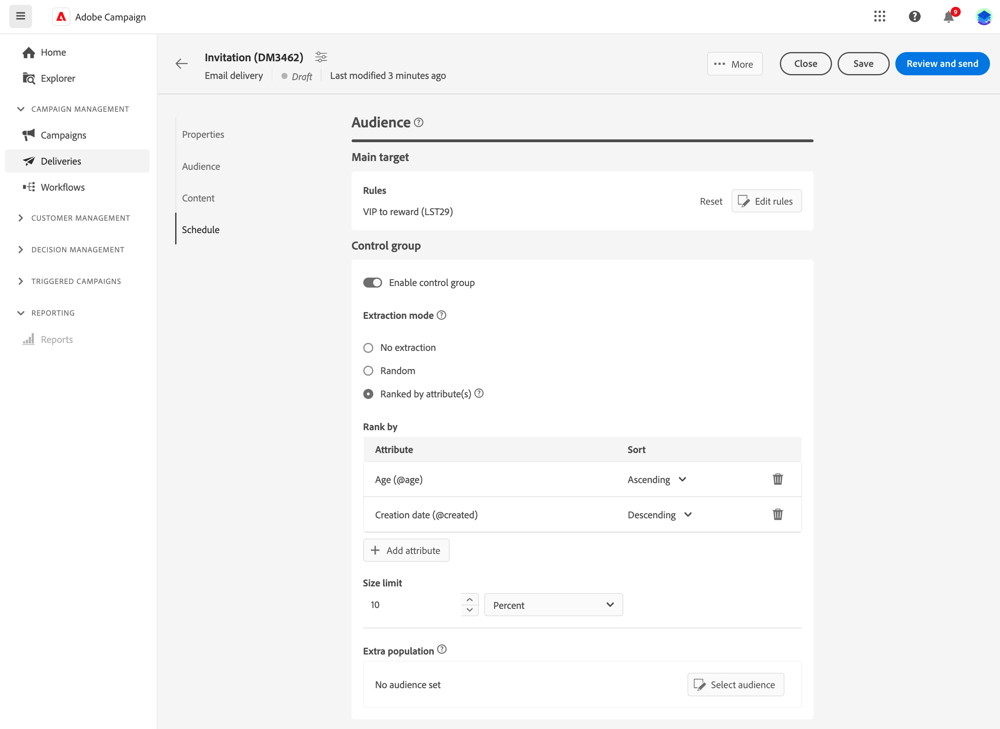
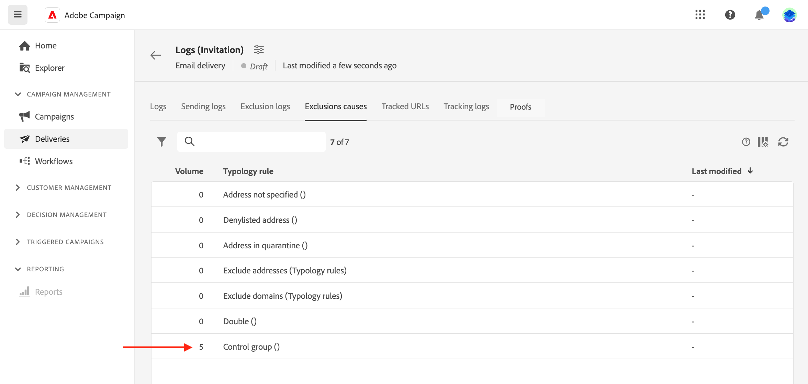

# Een controlegroep instellen {#control-group}

U kunt controlegroepen gebruiken om het verzenden van berichten naar een gedeelte van uw doelgroep te vermijden, zodat u het effect van uw campagnes kunt meten.

Om dit te doen, creeer een controlegroep wanneer het bepalen van het publiek van uw levering. Profielen worden willekeurig aan de controlegroep toegevoegd, gefilterd of niet, of gebaseerd op criteria. Vervolgens kunt u de gedragingen van de doelgroep die het bericht heeft ontvangen, vergelijken met de gedragingen van contactpersonen die niet zijn getarget.

De controlegroep kan willekeurig uit de hoofdtarget worden geëxtraheerd, en/of uit een specifieke populatie worden geselecteerd. Dit betekent dat u een controlegroep op twee manieren kunt definiëren:

* Een aantal profielen extraheren uit de hoofdtarget.
* Bepaalde profielen uitsluiten op basis van criteria die in een query zijn gedefinieerd.

Voor het definiëren van een controlegroep kunt u beide methoden gebruiken.

Alle profielen die deel uitmaken van de controlegroep bij de voorbereidingsstap voor levering worden uit de hoofdtarget verwijderd. Ze zullen het bericht niet meer ontvangen als het eenmaal is verzonden.

Om een controlegroep tot stand te brengen, klik **[!UICONTROL Set Control Group]** van de **Publiek** sectie van de medewerker van de leveringsverwezenlijking.

## Extraheren uit doel {#extract-target}

>[!CONTEXTUALHELP]
>id="acw_deliveries_email_controlgroup_target"
>title="Extraheren uit doel"
>abstract="TBC"

Als u een controlegroep wilt definiëren, kunt u kiezen of u op willekeurige wijze of op basis van een sortering een percentage of een vast aantal profielen uit de targetpopulatie wilt extraheren.

Definieer eerst hoe de profielen uit de target worden geëxtraheerd: willekeurig of op basis van een sortering.

Onder de **Extraheren uit doel** in, kiest u een **Het type Uitsluiting**:

* **Willekeurig**: bij het voorbereiden van de levering haalt Adobe Campaign willekeurig een aantal profielen op dat overeenkomt met het percentage of het maximumaantal dat u instelt als groottelimiet.

   

* **Gerangschikt op kenmerk(en)**: Met deze optie kunt u een set profielen op basis van specifieke kenmerken in een specifieke sorteervolgorde uitsluiten.

   

Definieer vervolgens de **Groottebeperking**: u moet instellen hoe u het aantal profielen dat u uit het hoofddoel extraheert, gaat beperken.

**Voorbeeld**

U kunt de logboeken bekijken om de uitgesloten profielen te controleren en te identificeren. Laten we het voorbeeld nemen van een willekeurige uitsluiting op vijf profielen.

Na de voorbereiding van de levering kunt u de uitsluitingen op de volgende schermen bekijken:

* De **Uitsluiten** KPI in het leveringsdashboard, vóór het verzenden.

   

* De **Uitsluitingslogboeken** elk profiel en de bijbehorende excusie weergeven **Reden**.

   

* De **Uitsluiting veroorzaakt** Geef het aantal uitgesloten profielen voor elke typologieregel weer.

   

Voor meer informatie over leveringslogboeken, verwijs naar dit [sectie](../monitor/delivery-logs.md).

## Extra populatie {#extra-population}

>[!CONTEXTUALHELP]
>id="acw_deliveries_email_controlgroup_extra"
>title="Extra populatie"
>abstract="TBC"

Een andere manier om een controlegroep te bepalen is een specifieke bevolking van het doel uit te sluiten gebruikend een bestaand publiek of door een vraag te bepalen.

Van de **Extra populatie** van de **Controlegroep** definitiescherm, klik **[!UICONTROL Select Audience]** knop.

* Als u een bestaand publiek wilt gebruiken, klikt u op **Doelgroep selecteren**. Zie dit [sectie](add-audience.md).

* Als u een nieuwe query wilt definiëren, selecteert u **Maak uw eigen** en definieert u de uitsluitingscriteria met behulp van de regelbouwer. Zie dit [sectie](segment-builder.md).

De profielen die zijn opgenomen in het publiek of die overeenkomen met het resultaat van de query, worden uitgesloten van het doel.