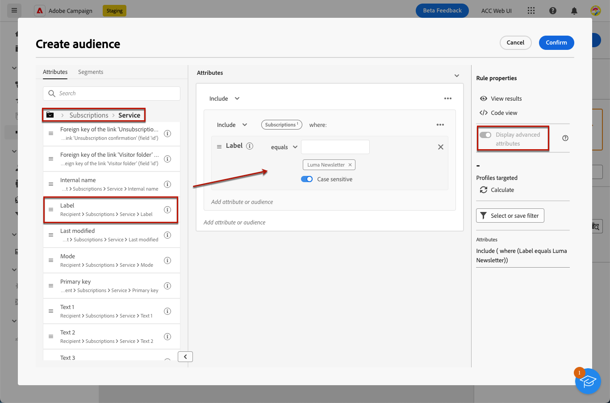

# Werken met abonnementsservices {#create-services}

>[!CONTEXTUALHELP]
>id="acw_subscriptions_list"
>title="Uw services maken en beheren"
>abstract="Gebruik Adobe Campaign om uw services, zoals nieuwsbrieven, te maken en te controleren en om de abonnementen op of het afmelden van deze services te controleren. Abonnementen gelden alleen voor verzending via e-mail en SMS."

Gebruik het Adobe Campaign-web om uw services, zoals nieuwsbrieven, te beheren en te maken en om de abonnementen op of het afmelden van deze services te controleren.

>[!NOTE]
>
>Abonnementen gelden alleen voor verzending via e-mail en SMS.

Verschillende services kunnen parallel worden gedefinieerd, bijvoorbeeld: nieuwsbrieven voor specifieke productcategorieën, thema&#39;s of gebieden van een website, abonnementen op verschillende typen waarschuwingsberichten en realtime meldingen.

Raadpleeg voor meer informatie over het beheren van abonnementen en abonnementen de [Campagne v8-documentatie (clientconsole)](https://experienceleague.adobe.com/docs/campaign/campaign-v8/audience/subscriptions.html){target="_blank"}.

## Toegang tot abonnementsservices {#access-services}

Volg onderstaande stappen om abonnementsservices die beschikbaar zijn voor uw platform te openen.

1. Bladeren naar de **[!UICONTROL Subscription services]** op de linkernavigatieregel.

   

1. De lijst met alle bestaande abonnementsservices wordt weergegeven. U kunt de services doorzoeken en filteren op het kanaal, de map of geavanceerde filters gebruiken.

   

1. Als u een bestaande service wilt bewerken, klikt u op de naam van de service.

1. U kunt elke service verwijderen of dupliceren met het pictogram met drie punten naast deze servicenaam.<!--so all subscribers are unsuibscribed - need to mention?-->

## Uw eerste abonnementenservice maken {#create-service}

>[!CONTEXTUALHELP]
>id="acw_subscriptions_list_properties"
>title="Definieer de serviceeigenschappen"
>abstract="Voer het label van de abonnementsservice in en definieer aanvullende opties, zoals een geldigheidsperiode voor de service."

>[!CONTEXTUALHELP]
>id="acw_subscriptions_list_confirm"
>title="Selecteer een bevestigingsbericht"
>abstract="Wanneer een gebruiker zich abonneert op of zich niet abonneert op een service, kunt u een bevestigingsbericht verzenden. Selecteer de sjablonen die u voor dat bericht wilt gebruiken."

Voer de onderstaande stappen uit om een abonnementenservice te maken.

1. Selecteer de knop **[!UICONTROL Create subscription service]**.

   

1. Selecteer een kanaal: **[!UICONTROL Email]** of **[!UICONTROL SMS]**.

1. In de de diensteigenschappen, ga een etiket in en bepaal extra opties zoals gewenst.

   

1. Abonnementen zijn standaard onbeperkt. U kunt de **[!UICONTROL  Unlimited validity period]** optie om een geldigheidstermijn voor de dienst te bepalen.

   In het onderstaande voorbeeld na 20 dagen:
   * Geen ontvangers kunnen zich meer op deze service abonneren.
   * Alle abonnees op deze service zullen na 20 dagen automatisch hun abonnement opzeggen. [Meer informatie](#automatic-unsubscription)

   

1. Wanneer een gebruiker zich abonneert op of zich niet abonneert op een service, kunt u een bevestigingsbericht verzenden. Selecteer de sjablonen die u voor dat bericht wilt gebruiken, afhankelijk van uw gebruiksscenario. Deze malplaatjes moeten met worden gevormd **[!UICONTROL Subscriptions]** doeltoewijzing. [Meer informatie](#create-confirmation-message)

   

1. Klik op **[!UICONTROL Save and review]**. De nieuwe dienst wordt toegevoegd aan **[!UICONTROL Subscription services]** lijst.

## Een bevestigingsbericht maken {#create-confirmation-message}

Als u bevestigingsberichten wilt verzenden naar gebruikers die zich op uw service abonneren of zich niet abonneren, moet u een leveringssjabloon maken met de **[!UICONTROL Subscriptions]** doeltoewijzing, zonder een gedefinieerd doel. Hiervoor voert u de volgende stappen uit.

1. Een leveringssjabloon maken voor de bevestiging van een abonnement. [Meer informatie](../msg/delivery-template.md)

1. Selecteer geen publiek voor deze levering. In plaats daarvan opent u de **[!UICONTROL Delivery settings]**, ga naar de [Publiek](../advanced-settings/delivery-settings.md#audience) en selecteert u de **[!UICONTROL Subscriptions]** doeltoewijzing uit de lijst.

   

   >[!NOTE]
   >
   >Als u de optie  **[!UICONTROL Subscriptions]** target mapping, ontvangen uw abonnees het bevestigingsbericht niet. Doeltoewijzingen worden gedefinieerd in de Campagne v8-console. Meer informatie over [Adobe Campaign v8-documentatie](https://experienceleague.adobe.com/docs/campaign/campaign-v8/audience/add-profiles/target-mappings.html){target="_blank"}.

1. Bewerk de inhoud van de leveringssjabloon, sla deze op en sluit deze.

   

   >[!NOTE]
   >
   >Meer informatie over leveringskanalen en hoe u een leveringsinhoud kunt definiëren in het dialoogvenster [Email channel](../email/create-email.md) en [SMS-kanaal](../sms/create-sms.md) secties.

1. Herhaal bovenstaande stappen om een leveringssjabloon te maken voor de bevestiging van het abonnement.

U kunt nu deze berichten selecteren wanneer [een abonnementenservice maken](#create-service). Gebruikers die zich abonneren op of zich niet abonneren op die service ontvangen de geselecteerde bevestigingsberichten.

## Abonnees toevoegen aan uw service {#add-subscribers}

Nadat u een service hebt gemaakt, kunt u handmatig abonnees toevoegen. Volg de onderstaande stappen.

1. Selecteer een bestaande service in het menu **[!UICONTROL Subscription services]** lijst.

1. Selecteer de **[!UICONTROL Subscribers]** en klik op **[!UICONTROL Add profiles]**.

   

1. Selecteer in de lijst de profielen die u wilt toevoegen en klik op **[!UICONTROL Confirm]**.

   

1. Klik op **[!UICONTROL Send]**.<!--if you click cancel, does it mean that no message is sent but recipients are still subscribed, or they are not subscribed? it's 2 different actions in the console)--> De geselecteerde ontvangers ontvangen het abonnement [bevestigingsbericht](#create-confirmation-message) die u hebt geselecteerd toen [de service maken](#create-service).

   

De toegevoegde profielen worden weergegeven in het dialoogvenster **[!UICONTROL Subscribers]** lijst. Ze zijn nu geabonneerd op uw service.

## Abonnees van uw service verwijderen {#remove-subscribers}

### Ontvangers handmatig afmelden {#manual-unsubscription}

Zodra u abonnees aan uw dienst toevoegt, kunt u elk van hen manueel opzeggen. Volg de onderstaande stappen.

1. Selecteer een bestaande service in het menu **[!UICONTROL Subscription services]** lijst.

1. Klik op het pictogram met drie punten naast de gewenste naam van de ontvanger en selecteer **[!UICONTROL Delete]**.

   

1. Verwijderen bevestigen en klikken **[!UICONTROL Send]**. De geselecteerde ontvanger ontvangt het abonnement [bevestigingsbericht](#create-confirmation-message) die u hebt geselecteerd toen [de service maken](#create-service).

   

De ontvanger wordt verwijderd uit de **[!UICONTROL Subscribers]** en is niet meer geabonneerd op uw service.

### Ontvangers automatisch afmelden {#automatic-unsubscription}

Een abonnementsservice kan een beperkte duur hebben. Ontvangers worden automatisch afgemeld wanneer de geldigheidsperiode verstrijkt.

Deze periode wordt opgegeven wanneer [de service maken](#create-service). Van de **[!UICONTROL Additional options]**, schakelt u de **[!UICONTROL  Unlimited validity period]** en stelt een geldigheidsperiode voor de dienst vast.

Nadat de gespecificeerde duur verloopt, worden alle abonnees automatisch geabonneerd van die dienst.

## Logboeken en rapporten van de abonnementendienst {#logs-and-reports}

Om de doeltreffendheid van uw abonnementsdiensten voor SMS en e-mailkanalen te meten, kunt u tot de logboeken en de rapporten voor een bepaalde dienst toegang hebben.

1. Selecteer een bestaande service in het menu **[!UICONTROL Subscription services]** lijst. Klikken **[!UICONTROL Calculate]** krijgen het aantal totale abonnees.

   

1. Selecteer in het servicedashboard de optie **[!UICONTROL Logs]** om de lijst van abonnees aan deze dienst te bekijken. U kunt het totale aantal abonnees controleren, de naam en het adres van elke ontvanger en wanneer zij of geabonneerd worden geabonneerd. U kunt er ook op filteren.

   

1. Selecteer in het servicedashboard de optie **[!UICONTROL Reports]**. Controleer de volgende indicatoren:

   * De **[!UICONTROL Total numbers of subscribers]** wordt weergegeven.

   * U kunt het aantal abonnementen en abonnementen over een geselecteerde periode bekijken. Gebruik de vervolgkeuzelijst om het tijdbereik te wijzigen.

     

   * De **[!UICONTROL Overall evolution of subscriptions]** in de grafiek wordt de uitsplitsing naar periode weergegeven, met inbegrip van abonnementen, abonnementen, abonnementen, de ontwikkeling van de aantallen en het loyaliteitspercentage.<!--what is Registered?-->

1. Gebruik de **[!UICONTROL Reload]** om de laatste waarden op te halen uit de uitvoering en het schema van de workflow voor bijhouden.

## Leveren aan de abonnees van een dienst

Eenmaal [een abonnementenservice gemaakt](#create-service), je kunt je abonnees richten op een levering. Volg de onderstaande stappen.

1. [Een publiek maken](../audience/create-audience.md) inclusief de abonnees van de service die u hebt gemaakt:

   * In de **[!UICONTROL Build audience]** activiteit, toon de geavanceerde attributen en selecteer **[!UICONTROL Recipient]** > **[!UICONTROL Subscriptions]** > **[!UICONTROL Service]**.

   * In dit voorbeeld selecteert u de gebruikers die zijn geabonneerd op de service met de **Luma-nieuwsbrief** label.

   

1. [Een levering maken](../msg/gs-messages.md) en selecteer het publiek dat u hierboven hebt gemaakt.

   

1. Bewerk de inhoud van het bericht naar wens en verzend de levering.

   

Uw levering wordt alleen naar de abonnees van die service verzonden.

