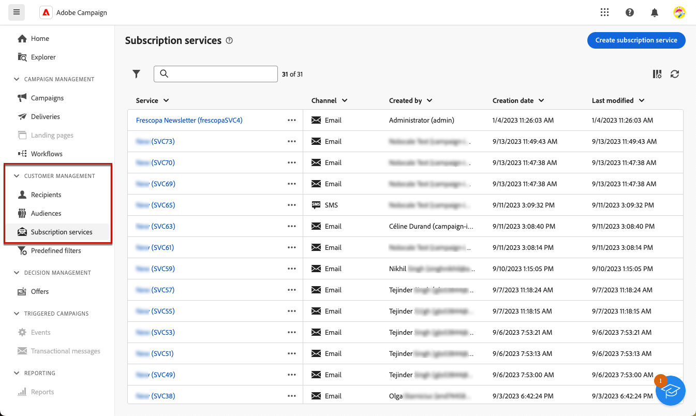

# Werken met abonnementsservices {#create-services}

>[!CONTEXTUALHELP]
>id="acw_subscriptions_list"
>title="Uw services maken en beheren"
>abstract="Gebruik Adobe Campaign om uw services, zoals nieuwsbrieven, te maken en te controleren en om de abonnementen of abonnementen op deze services te controleren. Abonnementen gelden alleen voor verzending via e-mail en SMS."

Gebruik het Adobe Campaign-web om uw services, zoals nieuwsbrieven, te beheren en te maken en om de abonnementen of abonnementen op deze services te controleren.

>[!NOTE]
>
>Abonnementen gelden alleen voor verzending via e-mail en SMS.

Verschillende services kunnen parallel worden gedefinieerd, bijvoorbeeld: nieuwsbrieven voor specifieke productcategorieën, thema&#39;s of gebieden van een website, abonnementen op verschillende typen waarschuwingsberichten en realtime meldingen.

Raadpleeg voor meer informatie over het beheren van abonnementen en abonnementen de [Campagne v8-documentatie (clientconsole)](https://experienceleague.adobe.com/docs/campaign/campaign-v8/audience/subscriptions.html){target="_blank"}.

## Toegang tot abonnementsservices {#access-services}

Blader naar de **[!UICONTROL Subscription services]** op de linkernavigatieregel.

De lijst met alle bestaande abonnementsservices wordt weergegeven. U kunt de services doorzoeken en filteren op het kanaal, de map of geavanceerde filters gebruiken.

Als u een bestaande service wilt bewerken, klikt u op de naam van de service.

## Uw eerste abonnementenservice maken {#create-service}

>[!CONTEXTUALHELP]
>id="acw_subscriptions_list_properties"
>title="Definieer de serviceeigenschappen"
>abstract="Voer het label van de abonnementsservice in en definieer aanvullende opties, zoals een geldigheidsperiode voor de service."

>[!CONTEXTUALHELP]
>id="acw_subscriptions_list_confirm"
>title="Selecteer een bevestigingsbericht"
>abstract="Wanneer een gebruiker zich abonneert op of zich niet abonneert op een service, kunt u een bevestigingsbericht verzenden. Selecteer de sjablonen die u voor dat bericht wilt gebruiken."

Voer de volgende stappen uit om een abonnementenservice te maken:

1. Selecteer de knop **[!UICONTROL Create subscription service]**.

   

1. Selecteer een kanaal: **[!UICONTROL Email]** of **[!UICONTROL SMS]**.

1. In de de diensteigenschappen, ga een etiket in en bepaal extra opties zoals gewenst.

   

1. Abonnementen zijn standaard onbeperkt. U kunt de **[!UICONTROL  Unlimited validity period]** optie om een geldigheidstermijn voor de dienst te bepalen. <!--The duration can be specified in days or months.TBC-->

   

1. Wanneer een gebruiker zich abonneert op of zich niet abonneert op een service, kunt u een bevestigingsbericht verzenden. Selecteer de sjablonen die u voor dat bericht wilt gebruiken, afhankelijk van uw gebruiksscenario.

   

1. Klik op **[!UICONTROL Save]**. De nieuwe dienst wordt toegevoegd aan **[!UICONTROL Subscription services]** lijst.

<!--
## Reporting

You can measure the effectiveness of your subscription services for SMS and email channels.

1. Select an existing service from the **[!UICONTROL Subscription services]** list.

1. From the service dashboard, click More > Reports?

1. Check the following indicators:

* Total numbers of subscribers

* Area graph with subscriptions and unsubscriptions. Use the dropwdown to change the time range. (24h, 48h, 1 week, 2 weeks, 1 month, 6 months)

* The breakdown by period. including subs, unsub, evolution in numbers and % and loyalty.
* Last updated / Next refresh time: these values are retrieved from the execution and schedule of the tracking workflow
-->

