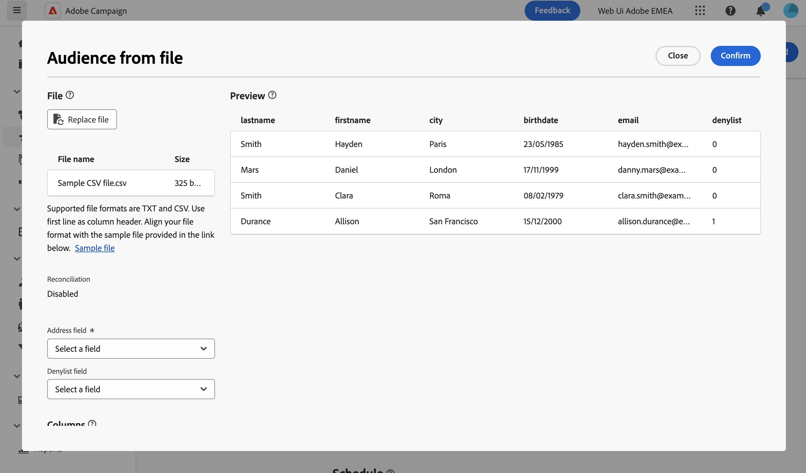

# Een e-mailpubliek laden vanuit een bestand {#audience-from-file}

>[!CONTEXTUALHELP]
>id="acw_audience_fromfile_select"
>title="Bestandselectie"
>abstract="Selecteer het lokale bestand dat u wilt uploaden. Ondersteunde indelingen zijn TXT en CSV. Lijn de bestandsindeling uit met het voorbeeldbestand dat hieronder is gekoppeld."

>[!CONTEXTUALHELP]
>id="acw_audience_fromfile_columns"
>title="Kolomdefinitie"
>abstract="Controleer de indeling van de kolommen in het externe bestand."

>[!CONTEXTUALHELP]
>id="acw_audience_fromfile_formatting"
>title="Parameters opmaken"
>abstract="Geef op hoe het externe bestand wordt opgemaakt om ervoor te zorgen dat de gegevens correct worden geïmporteerd."

>[!CONTEXTUALHELP]
>id="acw_audience_fromfile_preview"
>title="Een voorbeeld van uw bestand bekijken"
>abstract="Controleer de voorvertoning van de kolommen van het externe bestand. Dit scherm toont slechts tot 30 verslagen."

Met de Adobe Campaign Web User Interface kunt u profielen die zijn opgeslagen in een extern bestand als doel instellen. Zodra de profielen worden geladen, zijn alle gebieden van het inputdossier beschikbaar voor gebruik om uw levering [ te personaliseren Leer hoe te om uw inhoud ](../personalization/personalize.md) te personaliseren.

Profielen uit het invoerbestand worden niet toegevoegd aan de database. Ze worden geladen en zijn alleen beschikbaar voor deze specifieke zelfstandige e-maillevering.

>[!NOTE]
>
>Op deze pagina wordt beschreven hoe u externe profielen uit een bestand kunt laden wanneer u een zelfstandige e-maillevering maakt. Om gegevens van een dossier in de context van een werkschema te laden, verwijs naar [ deze pagina ](../workflows/activities/load-file.md).

## Lees hier meer {#must-read}

* Dit vermogen is beschikbaar voor **e-mailleveringen** slechts.
* Ondersteunde bestandsindelingen zijn: tekst (TXT) en door komma&#39;s gescheiden waarden (CSV).
* U kunt niet [ controlegroepen ](control-group.md) gebruiken wanneer het laden van de doelbevolking van een extern dossier.

## Het invoerbestand selecteren en configureren {#upload}

Voer de volgende stappen uit om profielen te kiezen uit een bestand in uw e-mails:

1. Open een bestaande e-maillevering, of [ creeer een nieuwe e-maillevering ](../email/create-email.md).
1. In de **sectie van het publiek 0} {, klik de** Uitgezochte publiek **knoop, dan kies** Uitgezocht van dossier **.**

   {zoomable="yes"}

1. Selecteer het lokale bestand dat u wilt laden. Het dossierformaat moet zich met het [ steekproefdossier ](#sample-file) richten.
1. In het centrale gedeelte van het scherm kunt u bekijken en controleren hoe gegevens worden toegewezen.

   

1. Specificeer de kolom die het e-mailadres van de **drop-down lijst van het Gebied van het Adres** bevat. U kunt ook de kolom lijst van gewezen personen selecteren als het invoerbestand dergelijke gegevens bevat.
1. Pas de kolominstellingen aan en definieer hoe de gegevens worden opgemaakt met de beschikbare opties.
1. Klik **bevestigen** zodra de montages correct zijn.

Voeg bij het maken van de inhoud van het bericht personalisatie toe door velden uit het invoerbestand te gebruiken. [ Leer hoe te om inhoud ](../personalization/personalize.md) te personaliseren

{zoomable="yes"}

## Voorbeeldbestand {#sample-file}

>[!CONTEXTUALHELP]
>id="acw_audience_fromfile_samplefile"
>title="Een publiek uit een bestand laden"
>abstract="Ondersteunde bestandsindelingen zijn TXT en CSV. Eerste regel gebruiken als kolomkop. Lijn de bestandsindeling uit met het voorbeeldbestand in de onderstaande koppeling."

Wanneer u een extern bestand laadt naar doelprofielen in uw leveringen, moet u ervoor zorgen dat het invoerbestand overeenkomt met de onderstaande aanbevelingen:

* Ondersteunde indelingen zijn TXT en CSV.
* De eerste regel in het bestand is de kolomkop.
* Lijn de bestandsindeling uit met het onderstaande voorbeeldbestand:

  ```javascript
  {
  lastname,firstname,city,birthdate,email,denylist
  Smith,Hayden,Paris,23/05/1985,hayden.smith@example.com,0
  Mars,Daniel,London,17/11/1999,danny.mars@example.com,0
  Smith,Clara,Roma,08/02/1979,clara.smith@example.com,0
  Durance,Allison,San Francisco,15/12/2000,allison.durance@example.com,1
  }
  ```

## Uw e-mail voorvertonen en testen {#test}

Met Campagne Web kunt u proefdrukken weergeven en verzenden wanneer u een publiek gebruikt dat vanuit een bestand is geüpload. Ga als volgt te werk om dit te doen:

1. Klik op de **[!UICONTROL Simulate content button]** in het bewerkingsscherm voor de leveringsinhoud en klik op de knop **[!UICONTROL Add test profile(s)]** .

1. De profielen in de geüploade bestandsweergave. Selecteer de profielen die u wilt gebruiken om een voorvertoning van uw inhoud weer te geven en klik op **[!UICONTROL Select]** .

1. Een voorvertoning van de leveringsinhoud wordt weergegeven in het rechterdeelvenster van het scherm. Gepersonaliseerde elementen worden vervangen door de gegevens van het profiel dat in het linkerdeelvenster is geselecteerd. [ Leer meer op de voorproef van de leveringsinhoud ](../preview-test/preview-content.md)

   {zoomable="yes"}

1. Als u proefdrukken wilt verzenden, klikt u op de knop **[!UICONTROL Send proof]** .

1. Klik op de knop **[!UICONTROL Upload proof profiles]** en selecteer het .txt- of .csv-bestand dat de proefdrukontvangers bevat.

   >[!CAUTION]
   >
   >Zorg ervoor dat de bestandsindeling overeenkomt met de indeling die wordt gebruikt voor het uploaden van uw publiek. Bij indelingsfouten wordt een waarschuwing weergegeven.

1. Wanneer de proefdrukprofielen zijn toegevoegd en u klaar bent om de proefdrukken te verzenden, klikt u op de knop **[!UICONTROL Send proof]** en bevestigt u de verzending.

   {zoomable="yes"}

1. U kunt de verzending van de proefdruk op elk gewenst moment controleren met de knop **[!UICONTROL View proofs]** . [ Leer meer op proeven die ](../preview-test/test-deliveries.md#access-test-deliveries) controleren