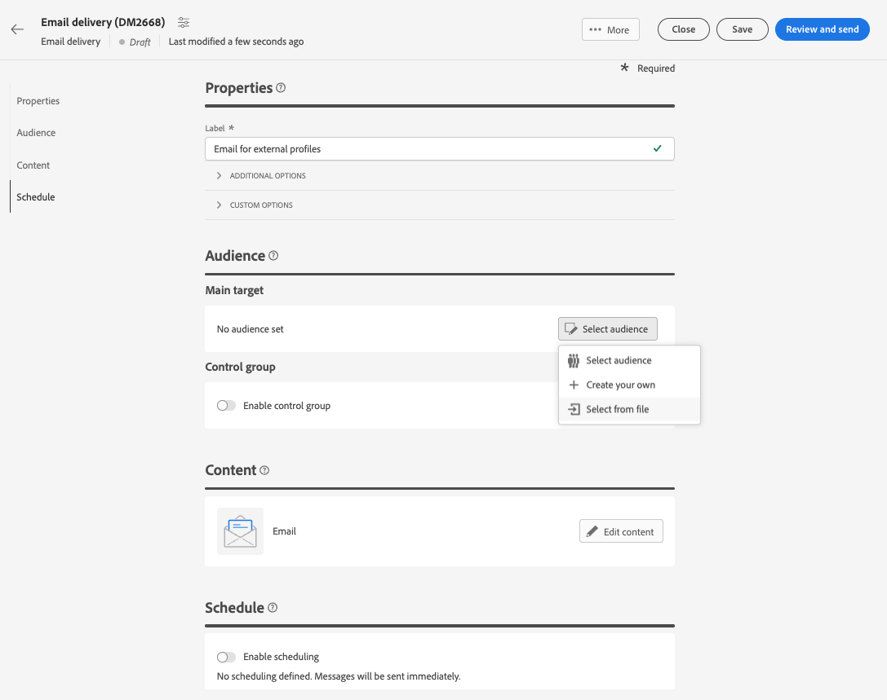

# Doelontvangers uit een bestand {#audience-from-file}

U kunt contactpersonen uploaden vanuit een extern bestand. Deze mogelijkheid is alleen beschikbaar voor e-mailleveringen.Ondersteunde indelingen zijn: tekstbestand (TXT) of een bestand met door komma&#39;s gescheiden waarden (CSV). Zij zullen dan aan het gegevensbestand worden toegevoegd.

>[!NOTE]
>
>U kunt een importworkflow maken om meerdere profielen toe te voegen of bij te werken.  Meer informatie


Voer de volgende stappen uit als u profielen rechtstreeks vanuit de interface wilt richten op een lokaal bestand:

1. Klik in het venster Maken van de e-maillevering op de knop **Doelgroep selecteren** en selecteert u de **Selecteren uit bestand** optie.

   

1. Selecteer het lokale bestand dat u wilt uploaden.
1. Geef een voorvertoning weer van hoe gegevens worden toegewezen in het centrale gedeelte van het scherm.
1. Kies de kolom die het e-mailadres bevat in het menu **Adresveld** vervolgkeuzelijst.
1. Pas de kolominstellingen aan en maak gegevens op van de beschikbare opties.
1. Klikken **Bevestigen** als de instellingen correct zijn.

Wanneer u de inhoud van het bericht maakt en aanpast, kunt u velden uit het invoerbestand selecteren in de Persoonlijke editor.


## Voorbeeldbestand {#sample-file}

>[!CONTEXTUALHELP]
>id="acw_audience_fromfile_samplefile"
>title="Voorbeeldbestand"
>abstract="Ondersteunde bestandsindelingen: txt, csv. Eerste regel gebruiken als kolomkop."


```json
{
lastname,firstname,city,birthdate,email,denylist
Smith,Hayden,Paris,23/05/1985,hayden.smith@example.com,0
Mars,Daniel,London,17/11/1999,dannymars@example.com,0
Smith,Clara,Roma,08/02/1979,clara.smith@example.com,0
Durance,Allison,San Francisco,15/12/2000,allison.durance@example.com,1
}
```
