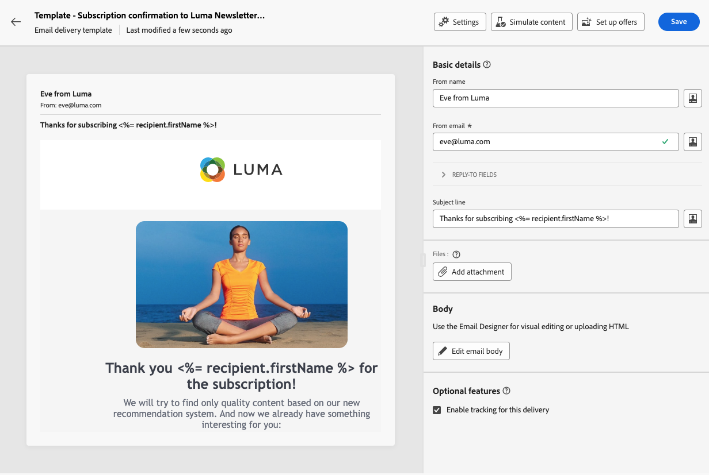

# Abonnementsservices maken en beheren {#manage-services}

>[!CONTEXTUALHELP]
>id="acw_subscriptions_list"
>title="Services maken en beheren"
>abstract="Gebruik Adobe Campaign om uw services, zoals nieuwsbrieven, te maken en te controleren en om de abonnementen op of het afmelden van deze services te controleren. Abonnementen gelden alleen voor verzending via e-mail en SMS."

Gebruik Adobe Campaign Web om uw services, zoals nieuwsbrieven, te beheren en te maken en om de abonnementen op of het afmelden van deze services te controleren.

Verschillende services kunnen parallel worden gedefinieerd, bijvoorbeeld: nieuwsbrieven voor specifieke productcategorieën, thema&#39;s of gebieden van een website, abonnementen op verschillende typen waarschuwingsberichten en realtime meldingen.

>[!NOTE]
>
>Abonnementen gelden alleen voor verzending via e-mail en SMS.

## Toegang tot abonnementsservices {#access-services}

Volg onderstaande stappen om abonnementsservices die beschikbaar zijn voor uw platform te openen.

1. Bladeren naar de **[!UICONTROL Subscription services]** op de linkernavigatieregel.

   {zoomable=&quot;yes&quot;}

1. De lijst met alle bestaande abonnementsservices wordt weergegeven. U kunt de services doorzoeken en filteren op het kanaal, de map of u kunt regels toevoegen met de opdracht [querymodel](../query/query-modeler-overview.md).

   {zoomable=&quot;yes&quot;}

1. Als u een bestaande service wilt bewerken, klikt u op de naam van de service.

1. U kunt elke service verwijderen of dupliceren met het pictogram met drie punten naast de servicenaam.<!--so all subscribers are unsubscribed - need to mention?-->

## Uw eerste abonnementenservice maken {#create-service}

>[!CONTEXTUALHELP]
>id="acw_subscriptions_list_properties"
>title="De service-eigenschappen definiëren"
>abstract="Voer het label van de abonnementsservice in en definieer aanvullende opties, zoals een geldigheidsperiode voor de service."

>[!CONTEXTUALHELP]
>id="acw_subscriptions_list_confirm"
>title="Selecteer een bevestigingsbericht"
>abstract="Wanneer een gebruiker zich abonneert op of zich niet abonneert op een service, kunt u een bevestigingsbericht verzenden. Selecteer de sjablonen die u voor dat bericht wilt gebruiken."

Voer de onderstaande stappen uit om een abonnementenservice te maken.

1. Selecteer de knop **[!UICONTROL Create subscription service]**.

   {zoomable=&quot;yes&quot;}

1. Selecteer een kanaal: **[!UICONTROL Email]** of **[!UICONTROL SMS]**.

1. Voer in de service-eigenschappen een label in en definieer **[!UICONTROL Additional options]** zoals gewenst.

   {zoomable=&quot;yes&quot;}

1. Standaard worden services opgeslagen in de **[!UICONTROL Services and Subscriptions]** map. U kunt dit wijzigen door naar de gewenste locatie te bladeren. [Leer hoe u met mappen werkt](../get-started/permissions.md#folders)

1. Abonnementen zijn standaard onbeperkt.

   U kunt de **[!UICONTROL Unlimited validity period]** optie om een geldigheidstermijn voor de dienst te bepalen. Na afloop van de geldigheidsperiode:
   * Geen profiel kan zich meer abonneren op deze service
   * Alle abonnees op deze service worden automatisch afgemeld

   {zoomable=&quot;yes&quot;}

1. Wanneer een gebruiker zich abonneert op of zich niet abonneert op een service, kunt u een bevestigingsbericht verzenden. Selecteer de sjablonen die u voor dat bericht wilt gebruiken, afhankelijk van uw gebruiksscenario. Deze malplaatjes moeten met worden gevormd **[!UICONTROL Subscriptions]** doeltoewijzing. [Meer informatie](#create-confirmation-message)

   {zoomable=&quot;yes&quot;}

1. Klik op **[!UICONTROL Save and review]**. De nieuwe dienst wordt toegevoegd aan **[!UICONTROL Subscription services]** lijst.

U kunt nu het volgende:

* Abonnees toevoegen aan deze service en abonnementsprofielen opzeggen. [Meer informatie](../msg/send-to-subscribers.md)

* Verzend berichten naar de abonnees van deze dienst. [Meer informatie](../msg/send-to-subscribers.md)

## Een bevestigingsbericht maken {#create-confirmation-message}

>[!CONTEXTUALHELP]
>id="acw_subscriptions_delivery_template"
>title="De leveringssjabloon voor abonnementen selecteren"
>abstract="Als u bevestigingsberichten wilt verzenden aan gebruikers die zich op uw service abonneren, moet u een specifieke leveringssjabloon selecteren op basis van de **[!UICONTROL Subscriptions]** doeltoewijzing, zonder een gedefinieerd doel."

>[!CONTEXTUALHELP]
>id="acw_unsubscriptions_delivery_template"
>title="Selecteer de leveringssjabloon voor abonnementen"
>abstract="Als u bevestigingsberichten wilt verzenden naar gebruikers die zich niet meer abonneren op uw service, moet u een specifieke leveringssjabloon selecteren op basis van de **[!UICONTROL Subscriptions]** doeltoewijzing, zonder een gedefinieerd doel."

Als u bevestigingsberichten wilt verzenden naar gebruikers die zich op uw service abonneren of zich niet abonneren, moet u een leveringssjabloon maken met de **[!UICONTROL Subscriptions]** doeltoewijzing, zonder een gedefinieerd doel. Hiervoor voert u de volgende stappen uit:

1. Een leveringssjabloon maken voor de bevestiging van een abonnement. [Leer hoe u een sjabloon maakt](../msg/delivery-template.md)

1. Selecteer geen publiek voor deze levering. In plaats daarvan opent u de levering **[!UICONTROL Settings]**, ga naar de [Publiek](../advanced-settings/delivery-settings.md#audience) en selecteert u de **[!UICONTROL Subscriptions]** doeltoewijzing uit de lijst.

   {zoomable=&quot;yes&quot;}

   >[!NOTE]
   >
   >Als u de optie  **[!UICONTROL Subscriptions]** target mapping, ontvangen uw abonnees het bevestigingsbericht niet. Meer informatie over doeltoewijzingen in [deze sectie](../audience/targeting-dimensions.md) .

1. Bewerk de inhoud van de leveringssjabloon, sla deze op en sluit deze.

   {zoomable=&quot;yes&quot;}

   >[!NOTE]
   >
   >Meer informatie over leveringskanalen en hoe u een leveringsinhoud kunt definiëren in het dialoogvenster [Email channel](../email/create-email.md) en [SMS-kanaal](../sms/create-sms.md) secties.

1. Herhaal bovenstaande stappen om een leveringssjabloon te maken voor de bevestiging van het abonnement.

U kunt nu deze berichten selecteren wanneer [een abonnementenservice maken](#create-service). Gebruikers die zich abonneren op of zich niet abonneren op die service ontvangen de geselecteerde bevestigingsberichten.

## Abonnementenservices bewaken {#logs-and-reports}

>[!CONTEXTUALHELP]
>id="acw_subscriptions_totalnumber_subscribers"
>title="Aantal abonnees"
>abstract="Klikken **Berekenen** krijgen het totale aantal abonnees voor deze dienst."

>[!CONTEXTUALHELP]
>id="acw_subscriptions_totalnumber_subscribers_report"
>title="Totaal aantal abonnees"
>abstract="De belangrijkste Indicator van Prestaties (KPI) verstrekt een uitvoerige mening van de abonneebasis, die het totale aantal individuen toont die aan deze dienst hebben ingetekend."

>[!CONTEXTUALHELP]
>id="acw_subscriptions_overtheperiod_subscribers"
>title="Aantal abonnementen voor de periode"
>abstract="Gebruik de vervolgkeuzelijst om het tijdbereik te wijzigen en het aantal abonnementen en abonnementen over de geselecteerde periode weer te geven."

>[!CONTEXTUALHELP]
>id="acw_subscriptions_overallevolution_subscribers"
>title="Algemene ontwikkeling van abonnementen"
>abstract="Deze grafiek toont de uitsplitsing naar periode, met inbegrip van abonnementen, abonnementen, abonnementen, de ontwikkeling in aantallen en het loyaliteitspercentage."

Om de doeltreffendheid van uw abonnementsdiensten voor SMS en e-mailkanalen te meten, kunt u tot de logboeken en de rapporten voor een bepaalde dienst toegang hebben.

1. Selecteer een bestaande service in het menu **[!UICONTROL Subscription services]** lijst. Klikken **[!UICONTROL Calculate]** krijgen het totale aantal abonnees.

   {zoomable=&quot;yes&quot;}

1. Selecteer in het servicedashboard de optie **[!UICONTROL Logs]** om de lijst van abonnees aan deze dienst te bekijken.

   U kunt het totale aantal abonnees, de naam en het adres van elke ontvanger controleren, en wanneer zij of geabonneerd worden geabonneerd. U kunt er ook op filteren.

   {zoomable=&quot;yes&quot;}

1. Selecteer in het servicedashboard de optie **[!UICONTROL Reports]**. Controleer de volgende indicatoren:

   * De **[!UICONTROL Total numbers of subscribers]** wordt weergegeven.

   * U kunt het aantal abonnementen en abonnementen over een geselecteerde periode bekijken. Gebruik de vervolgkeuzelijst om het tijdbereik te wijzigen.

     {zoomable=&quot;yes&quot;}

   * De **[!UICONTROL Overall evolution of subscriptions]** in de grafiek wordt de uitsplitsing naar periode weergegeven, met inbegrip van abonnementen, abonnementen, abonnementen, de ontwikkeling van de aantallen en het loyaliteitspercentage.<!--what is Registered?-->

1. Gebruik de **[!UICONTROL Reload]** om de laatste waarden op te halen uit de uitvoering en het schema van de workflow voor bijhouden.
