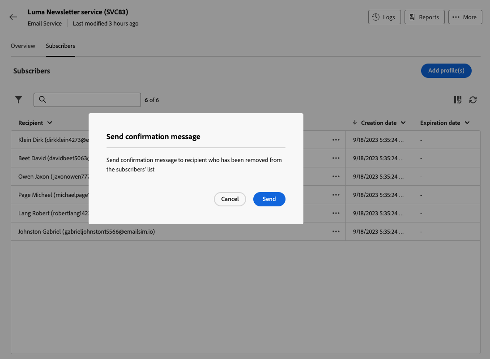

# De abonnees van een service beheren {#manage-subscribers}

Eenmaal [een service gemaakt](manage-services.md#create-service), kunt u abonnees toevoegen, ontvangers afmelden, en berichten naar de abonnees van die dienst verzenden.

Abonneenbeheer wordt in deze pagina beschreven. Als u wilt leren hoe u berichten naar uw abonnees kunt verzenden, raadpleegt u [deze sectie](../msg/send-to-subscribers.md).

## Abonnees toevoegen aan uw service {#add-subscribers}

Voer de onderstaande stappen uit om uw abonnees handmatig toe te voegen.

1. Selecteer een bestaande service in het menu **[!UICONTROL Subscription services]** lijst.

1. Selecteer de **[!UICONTROL Subscribers]** en klik op **[!UICONTROL Add profiles]**.

   

1. Selecteer in de lijst de profielen die u wilt toevoegen en klik op **[!UICONTROL Confirm]**.

   

1. Klik op **[!UICONTROL Send]**.<!--if you click cancel, does it mean that no message is sent but recipients are still subscribed, or they are not subscribed? it's 2 different actions in the console)--> De geselecteerde ontvangers ontvangen het abonnement [bevestigingsbericht](manage-services.md#create-confirmation-message) die u hebt geselecteerd toen [de service maken](manage-services.md#create-service).

   

De toegevoegde profielen worden weergegeven in het dialoogvenster **[!UICONTROL Subscribers]** lijst. Ze zijn nu geabonneerd op uw service.

## Abonnees van uw service verwijderen {#remove-subscribers}

### Ontvangers handmatig afmelden {#manual-unsubscription}

Eenmaal [toegevoegde abonnees](#add-subscribers) voor uw service, kunt u elk van deze instellingen handmatig afmelden. Voer de onderstaande stappen uit.

1. Selecteer een bestaande service in het menu **[!UICONTROL Subscription services]** lijst.

1. Klik op het pictogram met drie punten naast de gewenste naam van de ontvanger en selecteer **[!UICONTROL Delete]**.

   

1. Verwijderen bevestigen en klikken **[!UICONTROL Send]**. De geselecteerde ontvanger ontvangt het abonnement [bevestigingsbericht](manage-services.md#create-confirmation-message) die u hebt geselecteerd toen [de service maken](manage-services.md#create-service).

   

De ontvanger wordt verwijderd uit de **[!UICONTROL Subscribers]** en is niet meer geabonneerd op uw service.

### Ontvangers automatisch afmelden {#automatic-unsubscription}

Een abonnementsservice kan een beperkte duur hebben. Ontvangers worden automatisch afgemeld wanneer de geldigheidsperiode verstrijkt.

Deze periode wordt opgegeven wanneer [de service maken](manage-services.md#create-service). Van de **[!UICONTROL Additional options]**, schakelt u de **[!UICONTROL Unlimited validity period]** en stelt een geldigheidsperiode voor de dienst vast.

Nadat de gespecificeerde duur verloopt, worden alle abonnees automatisch geabonneerd van die dienst.
