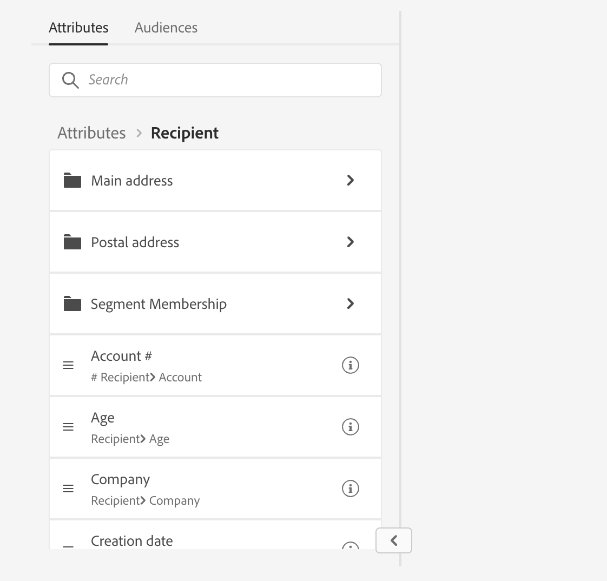

# Werken met de regelbouwer {#segment-builder}

De regelbouwer staat u toe om de bevolking te bepalen die door uw levering wordt gericht door gegevens te filtreren in het gegevensbestand. U kunt het gebruiken om een publiek van een werkschema te bouwen gebruikend een **[!UICONTROL Build audience]** activiteit, of direct wanneer het creëren van een levering om een eenmalig publiek tot stand te brengen.

* [Leer hoe u een publiek kunt maken en opslaan](create-audience.md)
* [Leer hoe u een eenmalig publiek voor een levering kunt maken](one-time-audience.md)

## Het palet

Het palet aan de linkerkant bevat alle elementen waarop u kunt filteren om een publiek te maken. U kunt de zoekbalk gebruiken om snel naar elementen te zoeken. De tegels in het palet moeten naar het middelste canvas worden verplaatst om geconfigureerd en meegenomen te kunnen worden.

{zoomable="yes"}{width="70%" align="left"}

Het palet bestaat uit twee tabbladen:

* **Attributen**: dit lusje staat u toe om tot alle beschikbare gebieden van het schema toegang te hebben. De lijst met velden is afhankelijk van het doelschema dat in de e-mailsjabloon is gedefinieerd.

* **Soorten publiek**: dit lusje staat u toe om het gebruiken van één van het bestaande publiek te filtreren dat in de console van het Campaign Classic of van Adobe Experience Platform wordt bepaald. Leer hoe te om publiek in [ te controleren en te beheren deze sectie ](manage-audience.md)

  >[!NOTE]
  >
  >Om het publiek van Adobe Experience Platform te hefboomwerking, moet u de integratie met Doelen vormen. Verwijs naar de [ documentatie van de Doelen van Adobe Experience Platform ](https://experienceleague.adobe.com/docs/experience-platform/destinations/home.html?lang=nl) {target="_blank"}.

## Het canvas

Het canvas is de centrale zone waarin u regels kunt configureren en combineren op basis van de elementen die vanuit het palet worden toegevoegd. Als u een nieuwe regel wilt toevoegen, sleept u een tegel uit het palet en zet u deze neer op het canvas. Vervolgens kunt u contextspecifieke opties weergeven, afhankelijk van het type gegevens dat wordt toegevoegd.

{zoomable="yes"}{width="70%" align="left"}

## Het deelvenster Eigenschappen van regel

Aan de rechterkant, staat de **eigenschappen van de Regel** ruit u toe om de hieronder vermelde acties uit te voeren.

{zoomable="yes"}{width="70%" align="left"}

* **resultaten van de Mening:** toont de lijst van profielen die door het publiek worden gericht.
* **mening van de Code**: toont een op code-gebaseerde versie van het publiek in SQL.
* **Geavanceerde attributen van de Vertoning**: controleer deze optie als u de volledige lijst van attributen in het linkerpalet wilt bekijken: knopen, groeperingen, 1-1 verbindingen, 1-N verbindingen.
* **berekent**: werkt bij en toont het aantal profielen die door uw vraag worden gericht.
* **Uitgezocht of sparen filter**: gebruik een vooraf bepaald filter om uw vraag te filtreren, of sparen uw vraag als nieuw filter voor toekomstig hergebruik. [ Leer hoe te met vooraf bepaalde filters ](../get-started/predefined-filters.md) te werken

  >[!IMPORTANT]
  >
  >In die versie van het product zijn sommige vooraf gedefinieerde filters niet beschikbaar in de gebruikersinterface. U kunt ze nog steeds gebruiken. [Meer informatie](../get-started/guardrails.md#predefined-filters-filters-guardrails-limitations)

* **Attributen**: toont een beschrijving van het gecreeerde publiek.

## Voorbeeld

In dit voorbeeld bouwen we een publiek dat gericht is op alle klanten die in Atlanta of Seattle wonen en na 1980 geboren zijn.

1. In het **lusje van Attributen** van het palet, onderzoek naar de **Datum van geboorte** gebied. Sleep de tegel naar het canvas.

   {zoomable="yes"}

1. In het canvas, kies **na** exploitant en ga de gewenste datum in.

   {zoomable="yes"}

1. In het palet, onderzoek naar het **gebied van de Stad** en voeg het aan het canvas onder de eerste regel toe.

   {zoomable="yes"}

1. Voer in het tekstveld de naam van de eerste plaats in en druk op Enter.

   {zoomable="yes"}

1. Herhaal deze handeling voor de tweede plaatsnaam.

   {zoomable="yes"}

1. Klik **resultaten van de Mening** om de lijst en het aantal ontvangers te tonen die de vraag aanpassen. U kunt ook kolommen toevoegen om de gegevens te visualiseren en te controleren. In ons voorbeeld, voeg de **kolom van de Stad** toe en zou Atlanta en Seattle moeten zien.

   {zoomable="yes"}

1. Klik **bevestigen**.