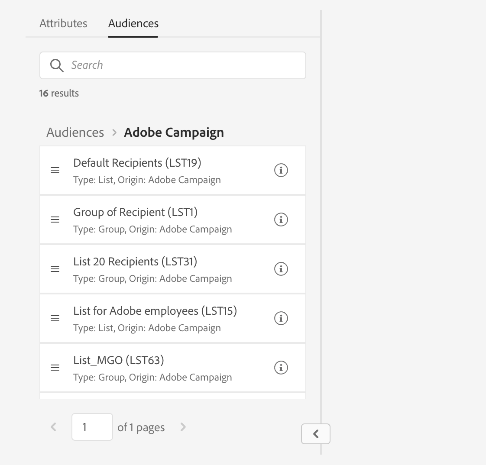

# Bepaal een publiek met de regelbouwer {#segment-builder}

In deze sectie wordt beschreven hoe u een publiek kunt maken tijdens het ontwerpen van een nieuwe e-mail. Het nieuwe publiek kan alleen in deze e-mail worden gebruikt.

De regelbouwer staat u toe om de bevolking te bepalen die door uw bericht wordt gericht door gegevens te filtreren in het gegevensbestand. Als u een bestaand publiek wilt selecteren, raadpleegt u deze [sectie](add-audience.md).

Voor meer informatie over de regelbouwer, verwijs naar [Documentatie voor segmentatieservice](https://experienceleague.adobe.com/docs/experience-platform/segmentation/ui/segment-builder.html).

Voer de volgende stappen uit om een nieuw publiek te maken tijdens het ontwerpen van een e-mail:

1. Van de **Publiek** sectie van de medewerker van de leveringsverwezenlijking, klik **[!UICONTROL Select audience]** knop.

   

1. Selecteren **Maak uw eigen**. De regelbouwer wordt weergegeven.

   

## Het palet

Het palet aan de linkerkant bevat alle elementen waarop u kunt filteren om een publiek te maken. De tegels in het palet moeten naar het middelste canvas worden verplaatst om geconfigureerd en meegenomen te kunnen worden. Het palet bestaat uit twee tabbladen:

* **Attributen**: op dit tabblad hebt u vanuit het schema toegang tot alle beschikbare velden. De lijst met velden is afhankelijk van het doelschema dat in de e-mailsjabloon is gedefinieerd.

   {width="70%" align="left"}

* **Soorten publiek**: op dit tabblad kunt u filteren met een van de bestaande soorten publiek die zijn gedefinieerd in de Campaign Classic-console of vanuit Adobe Experience Platform.

   {width="70%" align="left"}

   >[!NOTE]
   >
   >Om het publiek van Adobe Experience Platform te hefboomwerking, moet u de integratie met Doelen vormen. Zie de [Doelen](https://experienceleague.adobe.com/docs/experience-platform/destinations/home.html?lang=nl){target="_blank"}.

U kunt de zoekbalk gebruiken om snel naar elementen te zoeken.

## Het canvas

Het canvas is de centrale zone waarin u regels kunt configureren en combineren op basis van de elementen die vanuit het palet worden toegevoegd. Als u een nieuwe regel wilt toevoegen, sleept u een tegel uit het palet en zet u de tegel neer op het canvas. Vervolgens krijgt u contextspecifieke opties, afhankelijk van het type gegevens dat u wilt toevoegen.

{width="70%" align="left"}

## Het deelvenster Eigenschappen van regel

Aan de rechterkant **Eigenschappen van Rule** kunt u de volgende handelingen uitvoeren:

{width="70%" align="left"}

* **Resultaten weergeven:** toont de lijst van ontvangers die door het publiek worden gericht
* **Codeweergave**: toont een op code-gebaseerde versie van het publiek in SQL.
* **Geavanceerde kenmerken weergeven**: Schakel deze optie in als u de volledige lijst met kenmerken in het linkerpalet wilt weergeven: knooppunten, groepen, 1-1 koppelingen, 1-N koppelingen.
* **Attributen**: geeft een beschrijving van het gemaakte publiek weer.

## Voorbeeld

In dit voorbeeld bouwen we een publiek dat gericht is op alle klanten die in Atlanta of Seattle wonen en na 1980 geboren zijn.

1. In de **Attributen** tabblad van het palet, zoekt u naar de **Geboortedatum** veld. Sleep de tegel naar het canvas.

   

1. Kies op het canvas de optie **Na** en voert u de gewenste datum in.

   

1. Zoek in het palet naar de **Plaats** en voeg het toe aan het canvas onder de eerste regel.

   

1. Voer in het tekstveld de eerste plaatsnaam in en druk op Enter.

   

1. Herhaal deze handeling voor de tweede plaatsnaam.

   

1. Klikken **Resultaten weergeven** om de lijst en het aantal ontvangers te tonen die de vraag aanpassen. U kunt ook kolommen toevoegen om de gegevens te visualiseren en te controleren. In ons voorbeeld voegt u de opdracht **Plaats** kolom en zie Atlanta en Seattle.

   

1. Klikken **Bevestigen**.

Uw publiek is gedefinieerd en kan in uw e-mail worden gebruikt.