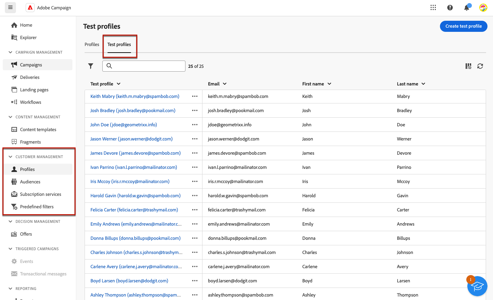

# Testprofielen maken en beheren {#create-test-profiles}

>[!CONTEXTUALHELP]
>id="acw_recipients_testprofiles_menu"
>title="Testprofielen maken"
>abstract="Testprofielen worden gemaakt als beginadressen. Het zijn extra ontvangers in de database die worden gebruikt om fictieve profielen als doel in te stellen die niet voldoen aan de gedefinieerde doelcriteria."

Testprofielen worden gemaakt als beginadressen. Het zijn extra ontvangers in de database die worden gebruikt om fictieve profielen als doel in te stellen die niet voldoen aan de gedefinieerde doelcriteria. Hiermee kunt u de personalisatie en rendering voorvertonen en testen voordat u de levering verzendt, door ze proefdrukken te sturen.

<!--Learn more on test profiles in the [Campaign v8 (client console) documentation](https://experienceleague.adobe.com/docs/campaign/campaign-v8/audience/add-profiles/test-profiles.html){target="_blank"}.-->

De stappen om testberichten naar zaadadressen te verzenden zijn gedetailleerd in [deze sectie](../preview-test/test-deliveries.md#test-profiles).

>[!NOTE]
>
>De profielen van de test worden automatisch uitgesloten van rapporten over de volgende leveringsstatistieken: **[!UICONTROL Clicks]**, **[!UICONTROL Opens]**, **[!UICONTROL Unsubscriptions]**. [Meer informatie over rapporten]

## Testprofielen openen en beheren {#access-test-profiles}

Als u de lijst met testprofielen wilt openen, selecteert u **[!UICONTROL Customer management]** > **[!UICONTROL Profiles]** in het linkermenu en klik op de knop **[!UICONTROL Test profiles]** tab.

* U kunt filteren op een specifieke [map](../get-started/permissions.md#folders) de vervolgkeuzelijst gebruiken of regels toevoegen met de [querymodel](../query/query-modeler-overview.md).

  

* U kunt elk testprofiel dupliceren en zo nodig bijwerken. De stappen om een testprofiel te bewerken zijn gelijk aan wanneer [een testprofiel maken](#create-test-profile).

* Als u een testprofiel wilt verwijderen, selecteert u de bijbehorende optie in het menu **[!UICONTROL More actions]** -menu.

  

* Als u een testprofiel wilt bewerken, klikt u op het gewenste item in de lijst. De stappen om een testprofiel te bewerken zijn gelijk aan wanneer [een testprofiel maken](#create-test-profile).

U kunt testprofielen ook openen via de **[!UICONTROL Explorer]** van de **[!UICONTROL Resources]** > **[!UICONTROL Campaign Management]** > **[!UICONTROL Seed addresses]** knooppunt.

Vervolgens kunt u mappen of submappen bladeren, maken en beheren en de bijbehorende machtigingen controleren. [Leer hoe u mappen maakt](../get-started/permissions.md#folders)

Van de **[!UICONTROL Explorer]** kunt u ook filteren, verwijderen, bewerken en [maken](#create-test-profile) testprofielen.

## Een testprofiel maken {#create-test-profile}

>[!CONTEXTUALHELP]
>id="acw_recipients_testprofiles_additionaldata"
>title="Testprofielen Aanvullende gegevens"
>abstract="Voer de aanpassingsgegevens in die worden gebruikt voor de leveringen die in de gegevensbeheerworkflows zijn gemaakt en waaraan u een specifieke waarde wilt toewijzen."

Voer de onderstaande stappen uit om een testprofiel te maken.

1. Bladeren naar **[!UICONTROL Customer management]** > **[!UICONTROL Profiles]** en selecteert u de **[!UICONTROL Test profiles]** tab.

1. Klik op de knop **[!UICONTROL Create test profile]**.

   

1. Vul zo nodig de gegevens van het testprofiel in. <!--Most of the fields are the same as when creating profiles. [Learn more]-->

   

   >[!NOTE]
   >
   >De **[!UICONTROL Label]** wordt automatisch ingevuld met de voornaam en achternaam die u hebt gedefinieerd.

1. Standaard worden testprofielen opgeslagen in het dialoogvenster **[!UICONTROL Seed addresses]** map. U kunt dit wijzigen door naar de gewenste locatie te bladeren. [Leer hoe u met mappen werkt](../get-started/permissions.md#folders)

   

<!--
You do not need to enter all fields of each tab when creating a seed address. Missing personalization elements are entered randomly during delivery analysis. (Not valid?)
-->

1. In de **[!UICONTROL Contact information]** en voert u het e-mailadres en andere relevante gegevens in. Het e-mailadres wordt tussen haakjes weergegeven na het label voor het testprofiel.

   

1. Als u **[!UICONTROL No longer contact (by any channel)]** Als u dit inschakelt, wordt het testprofiel op lijst van gewezen personen weergegeven. Deze ontvanger is niet langer gericht op enig kanaal (e-mail, SMS, enz.).

1. In de **[!UICONTROL Additional data]** voert u de aanpassingsgegevens in die worden gebruikt voor de leveringen die worden gemaakt in de workflows voor gegevensbeheer en waaraan u een specifieke waarde wilt toewijzen. [Meer informatie over workflows](../workflows/gs-workflows.md)

   

   Zorg ervoor dat aanvullende doelgegevens zijn gedefinieerd met een alias die begint met &#39;@&#39; in het dialoogvenster **[!UICONTROL Enrichment]** workflowactiviteit. Anders, kunt u niet het met uw zaadadressen in de leveringsactiviteit behoorlijk gebruiken. [Meer informatie over verrijkingsactiviteiten](../workflows/activities/enrichment.md)

1. Klik op de knop **[!UICONTROL Save]**.

Het testprofiel dat u zojuist hebt gemaakt, kan nu worden gebruikt om een test te verzenden. [Meer informatie](../preview-test/test-deliveries.md#test-profiles)

<!--Use test profiles in Direct mail? cf v7/v8-->

