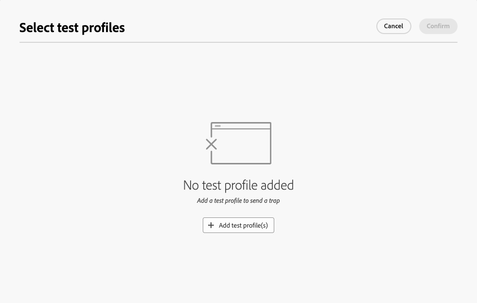

# Een overvulgroep gebruiken {#trap-group}

>[!CONTEXTUALHELP]
>id="acw_homepage_welcome_rn2"
>title="Overvulgroep"
>abstract="U kunt een overvulgroep gebruiken om specifieke adressen in uw leveringen op te nemen om het distributieproces te controleren en te verifiëren door profielen aan te wijzen die niet aan de bepaalde doelcriteria voldoen."
>additional-url="https://experienceleague.adobe.com/docs/campaign-web/v8/release-notes/release-notes.html" text="Zie opmerkingen bij releases"

Een **[!UICONTROL trap group]** (ook wel **[!UICONTROL Seed list]** genoemd) wordt gebruikt om specifieke adressen in uw leveringen op te nemen om het distributieproces te controleren en te verifiëren door zich te richten op profielen die niet aan de gedefinieerde doelcriteria voldoen. Op deze manier kunnen ontvangers die buiten het bereik van de levering vallen, de levering ontvangen, net als elke andere doelontvanger.

Een **[!UICONTROL trap group]** is een groep **[!UICONTROL seed addresses]** met de naam **[!UICONTROL Test profile]** in de gebruikersinterface van het web van Campagne.

## Waarom een overvulgroep gebruiken {#why-trap-group}

U kunt **[!UICONTROL trap group]** gebruiken:

1. **als proef**: elk lid van **[!UICONTROL Trap group]** zal de levering ontvangen alsof zij deel van het publiek uitmaakten.

1. **om uw postingslijst** te beschermen: door te ontvangen wat het publiek zal ontvangen, zal elk **[!UICONTROL test profile]** van **[!UICONTROL Trap group]** worden opgemerkt als de postingslijst door een derde wordt gebruikt.

>[!NOTE]
>
>Naast [ verzendend proeven tijdens de verwezenlijking van de levering ](../email/create-email.md#preview-test) en van [ controlegroep ](control-group.md), is het toevoegen van een valgroep een goede manier om uw publiek te testen.

## Overvulgroepen {#about-trap-group}

De profielen van de test worden automatisch uitgesloten van rapporten over de volgende leveringsstatistieken: **klikt**, **opent**, **Abonnementen**. De verslagen gaan alleen over het echte publiek.

Voor een e-maillevering is alleen een e-mailadres nodig voor de **[!UICONTROL Trap group]** . Andere velden worden willekeurig door Campagne aangepast.

## Een overvulgroep toevoegen in een levering {#trap-group-in-delivery}

Als u een **[!UICONTROL Trap group]** wilt instellen, gaat u naar de **[!UICONTROL Audience]** -instellingen van de levering. U hebt twee opties:

* [Testprofielen selecteren](#select-test-profile)
* [Voorwaarde maken](#create-condition)

{zoomable="yes"}

### Testprofielen selecteren {#select-test-profiles}

Wanneer u **Uitgezochte testprofielen** kiest, kunt u **gebruiken voeg testprofiel(s)** knoop zoals hieronder getoond toe:

{zoomable="yes"}

Wanneer u op de knop klikt, hebt u toegang tot de testprofielen die u aan **[!UICONTROL trap group]** kunt toevoegen. Selecteer de methoden die u wilt gebruiken.

U kunt ook nieuwe testprofielen maken. [Meer informatie](#create-seed)

{zoomable="yes"}

Wanneer u uw testprofielen bevestigt, controleer dat u het correcte aantal onder **[!UICONTROL Trap group]** hebt.

{zoomable="yes"}

### Voorwaarde maken {#create-condition}

Met de optie **[!UICONTROL Create condition]** kunt u een query maken om de testprofielen te definiëren die u wilt gebruiken:

{zoomable="yes"}

Uw query wordt weergegeven onder **[!UICONTROL Trap group]** .

{zoomable="yes"}

## Een nieuw testprofiel maken {#create-seed}

U kunt een nieuwe **[!UICONTROL test profile]** maken in de map **[!UICONTROL Explorer]** > **[!UICONTROL Ressources]** > **[!UICONTROL Campaign Management]** > **[!UICONTROL Seed members]** .

{zoomable="yes"}

Configureer alle instellingen voor uw **[!UICONTROL test profile]** net als voor elk profiel:

{zoomable="yes"}