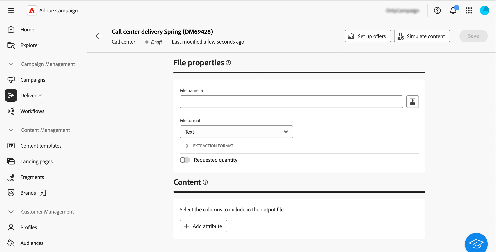

# Creeer en verzend een levering van het vraagcentrum {#create-call-center}

U kunt een standalone levering van het vraagcentrum tot stand brengen, of in de context van een campagnewerkschema creëren. In de onderstaande stappen wordt de procedure voor een zelfstandige (one-shot) levering in detail beschreven. Als u in de context van een campagnewerkschema werkt, zijn de aanmaakstappen gedetailleerd in [ deze sectie ](../workflows/activities/channels.md#create-a-delivery-in-a-campaign-workflow).

Om een nieuwe standalone levering van het vraagcentrum tot stand te brengen en te verzenden, volg deze belangrijkste stappen:

1. Creeer de levering, [ lees meer ](#create-delivery)
1. Bepaal het publiek, [ lees meer ](#select-audience)
1. Bewerk de inhoud, [ lees meer ](#edit-content)
1. De voorproef en verzendt de levering, [ lees meer ](#preview-send)

## De levering maken{#create-delivery}

Voer de volgende stappen uit om de levering te maken en de eigenschappen ervan te configureren:

1. Selecteer het menu **[!UICONTROL Deliveries]** en klik op de knop **[!UICONTROL Create delivery]** .

1. Kies **[!UICONTROL Call center]** als het kanaal en klik op **[!UICONTROL Create delivery]** om te bevestigen.

   {zoomable="yes"}

   >[!NOTE]
   >
   >Als u wenst om een verschillend malplaatje te selecteren, verwijs naar deze [ pagina ](../msg/delivery-template.md).

1. Voer onder **[!UICONTROL Properties]** een **[!UICONTROL Label]** in voor de levering. De extra opties worden gedetailleerd in deze [ sectie ](../email/create-email.md#create-email).

   {zoomable="yes"}

>[!NOTE]
>
>U kunt plannen dat de levering op een bepaalde datum wordt verzonden. Raadpleeg deze [sectie](../msg/gs-deliveries.md#gs-schedule) voor meer informatie.

## De doelgroep definiëren{#select-audience}

Nu moet u het publiek definiëren dat voor het extractiebestand wordt gebruikt.

1. Klik in de sectie **[!UICONTROL Audience]** van de leveringspagina op **[!UICONTROL Select audience]** .

   {zoomable="yes"}

1. Kies een bestaand publiek of maak een eigen publiek.

   * [Leer hoe u een bestaand publiek kunt selecteren](../audience/add-audience.md)
   * [Leer hoe u een nieuw publiek kunt maken](../audience/one-time-audience.md)

   {zoomable="yes"}

>[!NOTE]
>
>Ontvangers van het callcenter moeten ten minste hun naam en telefoonnummer bevatten. Om het even welke ontvangers met onvolledige informatie zullen van de levering van het callcenter worden uitgesloten.
>
>Leren hoe te om controlegroepen te vormen, verwijs naar deze [ pagina ](../audience/control-group.md).

## De inhoud bewerken{#edit-content}

Nu, geven de inhoud van het extractiedossier uit dat door de levering van het vraagcentrum zal worden geproduceerd.

1. Klik op de knop **[!UICONTROL Edit content]** vanaf de leveringspagina.

   {zoomable="yes"}

1. Geef de waarde **[!UICONTROL File name]** op. Leren hoe te om het dossier te personaliseren - naam, verwijs naar deze [ pagina ](../personalization/personalize.md).

1. Selecteer a **[!UICONTROL File format]**: **Tekst**, **Tekst die kolommen met vaste breedte** gebruikt, **CSV (Excel)**, of **XML**.

   {zoomable="yes"}

   >[!NOTE]
   >
   >De opmaakopties van de extractie zijn gedetailleerd in deze [ pagina ](../direct-mail/content-direct-mail.md#properties).

1. Schakel de optie **[!UICONTROL Requested quantity]** in of uit als u het aantal ontvangers voor de levering wilt beperken.

1. Klik in de sectie **[!UICONTROL Content]** op de knop **[!UICONTROL Add Attribute]** om een nieuwe kolom te maken die u wilt weergeven in het extractiebestand.

1. Kies het kenmerk dat u in de kolom wilt weergeven en bevestig het vervolgens. Meer leren op hoe te om attributen te selecteren en hen toe te voegen aan favorieten, verwijs naar deze [ pagina ](../get-started/attributes.md).

   

1. Herhaal deze stappen om zoveel kolommen toe te voegen als u nodig hebt voor het extractiebestand.

   Vervolgens kunt u de kenmerken bewerken, het extractiebestand sorteren of de positie van de kolommen wijzigen. Raadpleeg [deze pagina](../direct-mail/content-direct-mail.md#content) voor meer informatie.

   

## De levering voorvertonen en verzenden{#preview-send}

Als de inhoud klaar is voor levering, kunt u een voorvertoning weergeven met testprofielen en proefdrukken verzenden. U kunt de levering van het vraagcentrum dan verzenden om het extractiedossier te produceren.

De belangrijkste stappen voor het voorvertonen en verzenden van het extractiebestand zijn als volgt. Meer details zijn beschikbaar in [ deze pagina ](../direct-mail/send-direct-mail.md).

1. Klik op de knop **[!UICONTROL Simulate content]** vanaf de pagina met de inhoud voor levering.

   {zoomable="yes"}

1. Selecteer een of meerdere testprofielen om een voorvertoning van de gepersonaliseerde inhoud weer te geven. U kunt ook proefdrukken verzenden. [Meer informatie](../direct-mail/send-direct-mail.md#preview-dm)

   {zoomable="yes"}

1. Klik op **[!UICONTROL Review & send]** vanaf de leveringspagina.

   {zoomable="yes"}

1. Klik op **[!UICONTROL Prepare]** en controleer de voortgang en de statistieken die worden verstrekt. Bevestig vervolgens dat.

   {zoomable="yes"}

1. Klik op **[!UICONTROL Send]** om door te gaan met het uiteindelijke verzendproces en bevestig het vervolgens.

Zodra uw levering wordt verzonden, wordt het extractiedossier automatisch geproduceerd en uitgevoerd naar de plaats die in de **[!UICONTROL Routing]** externe rekening wordt gespecificeerd die in de 1&rbrace; wordt geselecteerd geavanceerde montages van het leveringsmalplaatje [&#128279;](../advanced-settings/delivery-settings.md).  U kunt het dossier ook voorproef door het **dossier van de Voorproef** knoop, in de **Inhoud** sectie van het scherm te klikken.

Houd uw PKIs (Zeer belangrijke Indicator van Prestaties) gegevens van uw leveringspagina en gegevens van het **[!UICONTROL Logs]** menu bij.

Begin het effect van uw bericht met ingebouwde rapporten te meten. [Meer informatie](../reporting/direct-mail.md)
