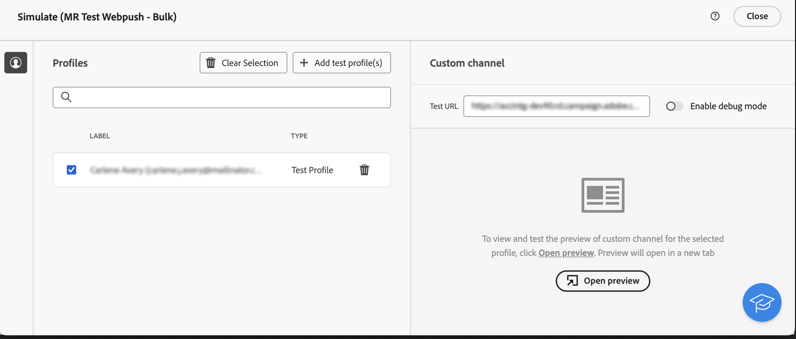

# Aan de slag met aangepaste kanalen {#gs-custom-channel}

U kunt, direct van het Web UI van Adobe Campaign, leveringen organiseren en uitvoeren die op douanekanalen worden gebaseerd met derden worden geïntegreerd. De configuratie van het aangepaste kanaal wordt uitgevoerd in de clientconsole.

Er worden twee typen aangepaste kanalen ondersteund, extern en API. Met externe kanalen genereert de campagne aanpasbare exportbestanden met alle benodigde contact- en personalisatiegegevens. Met API-kanalen worden berichten verzonden naar de doelprofielen via de geconfigureerde API.

U kunt aangepaste kanaalleveringen toevoegen in workflows of deze alleen gebruiken als zelfstandige leveringen.

In de onderstaande stappen wordt de procedure voor een zelfstandige (one-shot) levering in detail beschreven. De meeste stappen zijn gelijkaardig om centrumleveringen te roepen. Voor meer details, verwijs naar deze [ pagina ](../call-center/create-call-center.md).

Ga als volgt te werk om een nieuwe, op zichzelf staande, aangepaste levering te verzenden:

1. Vorm het douanekanaal, [ lees meer ](#create-channel)
1. Creeer de levering, [ lees meer ](#create-delivery)
1. Bepaal het publiek, [ lees meer ](#select-audience)
1. Bewerk de inhoud, [ lees meer ](#edit-content)
1. De voorproef en verzendt de levering, [ lees meer ](#preview-send)

## Het aangepaste kanaal configureren{#create-channel}

Eerst, moet u het douanekanaal vormen. Hier volgen de belangrijkste stappen die in de clientconsole moeten worden uitgevoerd. Deze stappen worden gebruikt voor aangepaste externe en API-kanalen:

1. Vorm het schema om het nieuwe kanaal aan de lijst van beschikbare kanalen toe te voegen. [Meer informatie](https://experienceleague.adobe.com/docs/campaign/campaign-v8/send/custom-channel.html?lang=nl-NL#configure-schema){target="_blank"}
1. Creeer een nieuwe verpletterende externe rekening. [Meer informatie](https://experienceleague.adobe.com/docs/campaign/campaign-v8/send/custom-channel.html?lang=nl-NL#reate-ext-account){target="_blank"}
1. Creeer een nieuw leveringsmalplaatje verbonden aan het nieuwe kanaal. [Meer informatie](https://experienceleague.adobe.com/docs/campaign/campaign-v8/send/custom-channel.html?lang=nl-NL#create-template){target="_blank"}

Aangepaste API-kanalen vereisen een extra configuratie. [Meer informatie](https://experienceleague.adobe.com/docs/campaign/campaign-v8/send/custom-channel.html?lang=nl-NL#api-additional){target="_blank"}

## De levering maken{#create-delivery}

Voer de volgende stappen uit om de levering te maken en de eigenschappen ervan te configureren:

1. Selecteer het menu **[!UICONTROL Deliveries]** en klik op de knop **[!UICONTROL Create delivery]** .

1. Kies het gewenste aangepaste kanaal, selecteer de bijbehorende sjabloon en klik op **[!UICONTROL Create delivery]** om te bevestigen.

   {zoomable="yes"}

1. Voer onder **[!UICONTROL Properties]** een **[!UICONTROL Label]** in voor de levering.

   {zoomable="yes"}

Voor meer details bij leveringsverwezenlijking, verwijs naar het vraagcentrum [ documentatie ](../call-center/create-call-center.md#create-delivery).

## De doelgroep definiëren{#select-audience}

Nu moet u het doelpubliek definiëren.

1. Klik in het gedeelte **[!UICONTROL Audience]** van het dashboard voor levering op **[!UICONTROL Select audience]** .

1. Kies een bestaand publiek of maak een eigen publiek.

   {zoomable="yes"}

Voor meer details op publieksdefinitie, verwijs naar het vraagcentrum [ documentatie ](../call-center/create-call-center.md#select-audience).

## De inhoud bewerken{#edit-content}

Laten we nu de inhoud van de levering bewerken.

>[!BEGINTABS]

>[!TAB  Extern kanaal van de Douane ]

1. Klik op de knop **[!UICONTROL Edit content]** in het dashboard voor levering.

1. Geef een **[!UICONTROL File name]** op, selecteer een **[!UICONTROL File format]** en voeg zoveel kolommen toe als nodig zijn voor het extractiebestand.

   

>[!TAB  het kanaal van Aangepast API ]

1. Klik op de knop **[!UICONTROL Edit content]** in het dashboard voor levering.

1. Vul de velden naar wens in. Leren hoe te opstelling dit scherm, naar deze [ pagina ](https://experienceleague.adobe.com/docs/campaign/campaign-v8/send/custom-channel.html?lang=nl-NL#api-additional-screen){target="_blank"} verwijzen.

   

>[!ENDTABS]

Voor meer details op inhoudsuitgave, verwijs naar het callcenter [ documentatie ](../call-center/create-call-center.md#edit-content).

## De levering voorvertonen en verzenden{#preview-send}

Als de inhoud klaar is voor levering, kunt u er een voorvertoning van weergeven met testprofielen. Vervolgens kunt u de levering verzenden om het extractiebestand te genereren of het bericht via de API te verzenden.

>[!BEGINTABS]

>[!TAB  Extern kanaal van de Douane ]

1. Klik op de knop **[!UICONTROL Edit content]** in het dashboard voor levering.

1. Klik op de pagina met inhoud voor levering op de knop **[!UICONTROL Simulate content]** en selecteer testprofielen.

   {zoomable="yes"}

>[!TAB  het kanaal van Aangepast API ]

1. Klik op de knop **[!UICONTROL Edit content]** in het dashboard voor levering.

1. Klik op de pagina met inhoud voor levering op de knop **[!UICONTROL Simulate content]** en selecteer testprofielen.

1. Op de rechterkant, klik **Open voorproef**. Dit vermogen moet worden gevormd gebruikend JSSP. Verwijs naar deze [ pagina ](https://experienceleague.adobe.com/docs/campaign/campaign-v8/send/custom-channel.html?lang=nl-NL#api-additional-preview){target="_blank"}.

   {zoomable="yes"} tonen

>[!ENDTABS]

Klik op het bezorgdashboard op **[!UICONTROL Review & send]** en klik op **[!UICONTROL Prepare]** . Dan, bevestig. Klik op **[!UICONTROL Send]** om door te gaan met het uiteindelijke verzendproces en bevestig het vervolgens.

{zoomable="yes"}

Voor meer details op voorproef en verzend, verwijs naar het vraagcentrum [ documentatie ](../call-center/create-call-center.md#preview-send).
