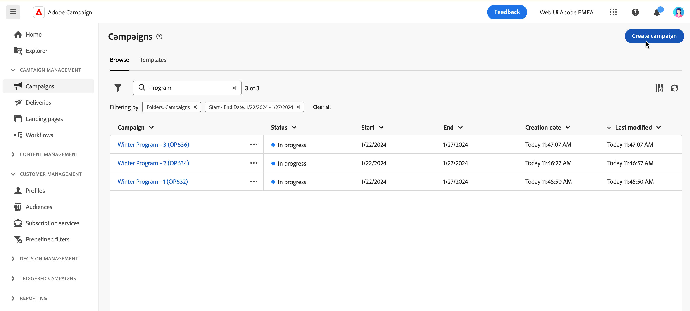

# Uw eerste campagne maken {#create-first-campaigns}

>[!CONTEXTUALHELP]
>id="acw_campaign_creation_properties"
>title="Eigenschappen voor het maken van campagnes"
>abstract="Definieer in dit scherm de instellingen voor uw campagne: selecteer een sjabloon en voer een label voor uw campagne in. Blader naar de aanvullende instellingen om de interne standaardnaam, -map, een beschrijving en -toewijzing te wijzigen."

>[!CONTEXTUALHELP]
>id="acw_campaign_properties"
>title="Campagneigenschappen"
>abstract="In dit scherm kunt u de instellingen van uw campagne controleren en bijwerken: label, interne naam, map en beschrijving. U kunt ook bekijken aan welke gebruiker het wordt toegewezen."

Als u een nieuwe campagne wilt maken, definieert u de instellingen, het programma en de workflows en leveringen.

## Maak de campagne {#campaign-create}

Voer de volgende stappen uit om een nieuwe campagne te maken:

1. Klik op het menu **[!UICONTROL Campaigns]** en klik op de knop **[!UICONTROL Create campaign]** .

    tonen

1. Selecteer het **Malplaatje** te gebruiken, en een etiket voor de campagne te verstrekken. [Meer informatie](manage-campaigns.md#manage-campaign-templates).
1. Indien nodig, verander de volgende **Extra opties**: interne naam, omslag, toegewezen, beschrijving, en aard.
1. Bepaal het **Programma** van uw campagne. Leer hoe te om uw campagneschema in [ te plaatsen deze sectie ](#campaign-schedule).
1. Klik **creëren**.

   

1. Workflows en leveringen toevoegen aan uw campagne:

   * Van het **lusje van de Werkschema&#39;s**, klik **creeer werkschema**. Er wordt automatisch een standaardworkflow toegevoegd wanneer u een campagne maakt. Leer meer over hoe te [ een werkschema ](../workflows/create-workflow.md) creëren.

   * Van het **Leveringen** lusje, klik **creeer levering**. [Meer informatie](../msg/gs-messages.md)

## Uw campagne volgen {#campaign-monitoring}

Campagne-controle is een belangrijke stap om de doeltreffendheid van uw campagne te analyseren. Open uw campagne, en klik de **Logboeken** knoop.

U kunt de specifieke rapporten ook bekijken door de **knoop van Rapporten** te klikken. Zie deze [ sectie ](../reporting/campaign-reports.md).

## Het campagnereschema definiëren {#campaign-schedule}

>[!CONTEXTUALHELP]
>id="acw_campaign_creation_schedule"
>title="Campagne"
>abstract="Selecteer het campagneprogramma. U kunt de campagne maken en deze start wanneer de begindatum is bereikt. Standaard is de startdatum van de campagne de aanmaakdatum en duurt deze vijf dagen. Begin- en einddatums worden weergegeven in de lijst met campagnes en kunnen als filter worden gebruikt."

De campagne begint wanneer de begindatum is bereikt. Zolang de begindatum niet is bereikt, heeft de campagne de **[!UICONTROL Draft]** status. Wanneer de begindatum is bereikt, wordt deze ingesteld op **[!UICONTROL In progress]** . Wanneer de einddatum is bereikt, wordt de campagne ingesteld op **[!UICONTROL Completed]** .

Begin- en einddatums worden weergegeven in de lijst met campagnes en kunnen als filter worden gebruikt. Zie deze [ sectie ](manage-campaigns.md#access-campaigns).

>[!NOTE]
>
>U kunt deze eigenschappen later wijzigen, van **vormen campagnemontages** pictogram naast het campagneetiket. Zie deze [ sectie ](gs-campaigns.md#campaign-dashboard).

Nadat de datum is bereikt, worden de leveringen die in die campagne zijn gemaakt in het kader van een workflow en die klaar zijn om te worden verzonden, daadwerkelijk verzonden. Hiervoor moet de workflow zijn gestart.

<!--
    +++WORKF
++screen
## Create a cross-channel campaign {#cross-channel-campaign}

In a cross-channel campaign, a single marketing communication uses different channels. Data is passed between the channels. The customer receives communication through multiple channels based on, for example, their interaction with the previous communication.
-->
<!--
existing campaign: settings button -> properties like when creation
schedule in header

About plans, programs and campaigns
Adobe Campaign allows you to plan marketing campaigns in which you can create and manage different types of activities: emails, SMS messages, push notifications, workflows, landing pages. These campaigns and their contents can be gathered into programs.

The programs and campaigns allow you to regroup and view the different marketing activities that are linked to them.

A program may contain other programs as well as campaigns, workflows, and landing pages. It appears in the timeline and helps you organize your marketing activities: you can separate them by country, by brand, by unit, and similar criteria.

A campaign enables you to gather all the marketing activities of your choice under a single entity. A campaign may contain emails, SMS, push notifications, direct mails, workflows, and landing pages.

To better organize your marketing plans, Adobe recommends the following hierarchy: Program > Sub-programs > Campaigns > Workflows > Deliveries.

Reports on programs and campaigns allow you to analyze their impact. For example, you can build reports at the campaign level to aggregate data on all deliveries contained in that campaign.

Related topics:

* Timeline
* About dynamic reports
* Creating a campaign

In programs and sub-programs, you can add campaigns. Campaigns can contain marketing activities such as emails, SMS, push notifications, workflows, and landing pages.

From the Adobe Campaign home page, select the Programs & Campaigns card, and access a program or sub-program.

Click on the Create button, and select Campaign.

In the Creation mode screen, select a campaign type.

The campaign types available are based on templates defined in Resources > Templates > Campaign templates. For more on this, refer to the Managing templates section.

In the Properties screen, enter the name and ID of the campaign.

Select a start and end date for your campaign. These dates only apply to the campaign itself.

Click on Create to confirm the creation of the campaign.

The campaign is created and displayed. Use the Create button to add marketing activities to your campaign.

>[!NOTE]
>
>Depending on your license agreement, you may access only some of these activities.

You can also create a campaign from the marketing activity list. You can choose to link the marketing activity to a parent program or sub-program via the properties window of the campaign.

Programs and campaigns icons and statuses:

Each program and each campaign in the list has a visual symbol and an icon whose color indicates the execution status. This status depends on the validity period of the program or the campaign.

* Gray: the program/campaign has not yet started - Editing status.
* Blue: the program/campaign is in progress - In progress status.
* Green: the program/campaign has finished - Finished status.

By default, the current date is automatically shown as the validity start date, and the end date is calculated according to the start date (D+186 days). You can change these dates in the program or campaign properties.

Business.Adobe.com resources
-->