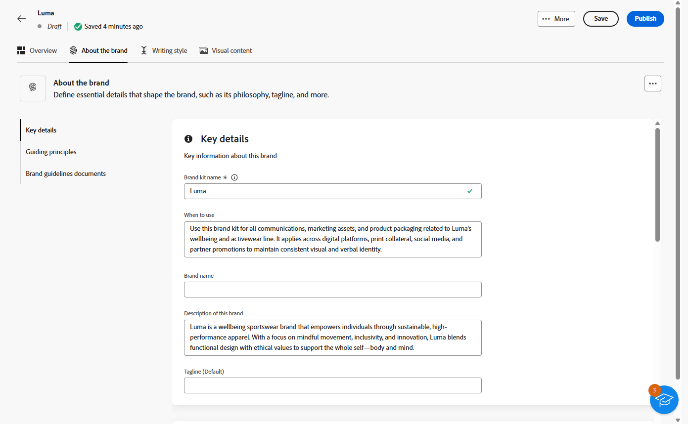

# Uw merk aanpassen {#brands-personalize}

Om een uitvoerige merkkit te creëren die consistentie over al uw inhoud en kanalen verzekert, vorm de volgende vier lusjes, elk die zich op een verschillend aspect van uw merkidentiteit concentreren:

* **[!UICONTROL About the brand]** stelt de belangrijkste identiteit en waarden van uw merk vast.
* **[!UICONTROL Writing style]** definieert taal- en inhoudsstandaarden.
* **[!UICONTROL Visual content]** stelt richtlijnen voor afbeeldingen en ontwerpen in.
* **[!UICONTROL Colors]** beheert het kleursysteem en het gebruik van uw merk.

Zodra gevormd, kunt u uw merkrichtlijnen gebruiken om inhoudskwaliteit en merkgroepering te bevestigen. [&#x200B; leer meer over de bevestiging van de inhoudskwaliteit &#x200B;](brands-score.md#validate-quality)

## Informatie over het merk {#about-brand}

Gebruik het tabblad **[!UICONTROL About the brand]** om de belangrijkste identiteit van uw merk vast te stellen: het doel, de persoonlijkheid, de taglijn en andere definiërende kenmerken.

1. Begin door de basisinformatie voor uw merk in te vullen in de categorie **[!UICONTROL Key details]** :

   * **[!UICONTROL Brand Kit Name]**: voer de naam van de merkkit in.

   * **[!UICONTROL When to Use]**: geef scenario&#39;s of contexten op waarop deze merkkit moet worden toegepast.

   * **[!UICONTROL Brand Name]**: voer de officiële naam van het merk in.

   * **[!UICONTROL Brand Description]**: geef een overzicht van wat dit merk vertegenwoordigt.

   * **[!UICONTROL Default Tagline]**: voeg de primaire coderegel toe die aan het merk is gekoppeld.

     

1. Geef in de categorie **[!UICONTROL Guiding principles]** uitleg over de kernrichting en filosofie van uw merk:

   * **[!UICONTROL Mission]**: Geef het doel van uw merk op.

   * **[!UICONTROL Vision]**: beschrijf uw langetermijndoel of gewenste toekomstige staat.

   * **[!UICONTROL Market Positioning]**: leg uit hoe uw merk zich op de markt bevindt.

   

1. Van de **[!UICONTROL Core brand values]** categorie, klik  toevoegen om de kernwaarden van het merk toe te voegen en de details in te vullen:

   * **[!UICONTROL Value]**: geef een naam op voor een kernmerk.

   * **[!UICONTROL Description]**: leg uit wat deze waarde aan uw merk betekent.

   * **[!UICONTROL Behaviors]**: schets de handelingen of houdingen die deze waarde in de praktijk weerspiegelen.

   * **[!UICONTROL Manifestations]**: geef voorbeelden van hoe deze waarde wordt uitgedrukt in echte branding.

     

1. Indien nodig, klik het  pictogram om één van uw waarde van het kernmerk bij te werken of te schrappen.

    uit

U kunt uw merk verder personaliseren of [&#x200B; uw merk &#x200B;](#create-brand-kit) publiceren.

## Schrijfstijl {#writing-style}

In de sectie **[!UICONTROL Writing style]** worden de standaarden voor het schrijven van inhoud beschreven, met een gedetailleerde beschrijving van de manier waarop taal, opmaak en structuur moeten worden gebruikt voor het behoud van helderheid, coherentie en consistentie in alle materialen.

+++ Beschikbare categorie en voorbeelden

<table>
  <thead>
    <tr>
      <th>Categorie</th>
      <th>Subcategorie</th>
      <th>Voorbeeld van richtlijnen</th>
      <th>Voorbeeld van uitsluitingen</th>
    </tr>
  </thead>
  <tbody>
    <tr>
      <td rowspan="4">Normen voor het maken van inhoud</td>
      <td>Merk Messaging-standaarden</td>
      <td>Benadruk innovatie en klant-eerste overseinen.</td>
      <td>U mag de productmogelijkheden niet overbelasten.</td>
    </tr>
    <tr>
      <td>Taglinegebruik</td>
      <td>Plaats de tag onder het logo op alle digitale marketingmiddelen.</td>
      <td>Wijzig of vertaal de taglijn niet.</td>
    </tr>
    <tr>
      <td>Core Messaging</td>
      <td>Benadruk de belangrijkste voordeel verklaring-zulke als verbeterde productiviteit.</td>
      <td>Gebruik geen ongerelateerde waardevoorstellen.</td>
    </tr>
    <tr>
      <td>Naamgevingsstandaarden</td>
      <td>Gebruik eenvoudige, beschrijvende namen, zoals "ProScheduler".</td>
      <td>Gebruik geen complexe termen of speciale tekens.</td>
    </tr>
    <tr>
      <td rowspan="5">Merk Communication-stijl</td>
      <td>Merk Persoonlijke kenmerken</td>
      <td>Vriendelijk en toegankelijk.</td>
      <td>Wees geen nederlaag.</td>
    </tr>
    <tr>
      <td>Schrijfmiddelen</td>
      <td>Zorgt dat zinnen kort en ondoeltreffend blijven.</td>
      <td>Gebruik geen overdreven jargon.</td>
    </tr>
    <tr>
      <td>Situatietoon</td>
      <td>Houd een professionele toon in crisiscommunicatie.</td>
      <td>Wees niet afwijzend bij het ondersteunen van communicatie.</td>
    </tr>
    <tr>
      <td>Richtlijnen voor woordkeuze</td>
      <td>Gebruik woorden als "innovatief" en "slim".</td>
      <td>Vermijd woorden als "goedkoop" of "hack".</td>
    </tr>
    <tr>
      <td>Taalstandaarden</td>
      <td>Volg de Amerikaanse conventies in het Engels.</td>
      <td>Vermeng Brits en Amerikaans spelletje niet.</td>
    </tr>
    <tr>
      <td rowspan="3">Normen voor juridische naleving</td>
      <td>Handelsmerkstandaarden</td>
      <td>Gebruik altijd het symbool ™ of ®.</td>
      <td>Laat juridische symbolen niet weg wanneer dat nodig is.</td>
    </tr>
    <tr>
      <td>Copyrightstandaarden</td>
      <td>Inclusief copyrightkennisgevingen over marketingmaterialen.</td>
      <td>Gebruik geen inhoud van derden zonder toestemming.</td>
    </tr>
    <tr>
      <td>Disclaimingstandaarden</td>
      <td>Dislaimers leesbaar weergeven op digitale middelen.</td>
      <td>Verberg disclaimers niet in onzichtbare gebieden.</td>
    </tr>
</table>

+++

 

U past de **[!UICONTROL Writing Style]** als volgt aan:

1. Klik op het tabblad **[!UICONTROL Writing Style]** op  om een hulplijn, uitzondering of uitsluiting toe te voegen.

1. Voer uw richtlijn, uitzondering of uitsluiting in. U kunt ook **[!UICONTROL Examples]** opnemen om beter aan te geven hoe deze toepassing moet worden toegepast.

   

1. Geef de **[!UICONTROL Usage context]** op voor uw hulplijn, uitzondering of uitsluiting:

   * **[!UICONTROL Channel type]**: kies waar deze richtlijn, uitzondering of uitsluiting van toepassing moet zijn. U wilt bijvoorbeeld dat een specifieke schrijfstijl alleen wordt weergegeven in e-mail, mobiel, Afdrukken of andere communicatiekanalen.

   * **[!UICONTROL Element type]**: geef op op op welk inhoudselement de regel van toepassing is. Dit kan elementen bevatten zoals koppen, knoppen, koppelingen of andere componenten in de inhoud.

   

1. Klik op **[!UICONTROL Add]** als uw hulplijn, uitzondering of uitsluiting is ingesteld.
1. Selecteer zo nodig een van de hulplijnen of uitsluitingen die u wilt bijwerken of verwijderen.

1. Klik het  om uw voorbeeld of het  pictogram uit te geven om het te schrappen.

   

U kunt uw merk verder personaliseren of [&#x200B; uw merk &#x200B;](#create-brand-kit) publiceren.

## Visuele inhoud {#visual-content}

In de sectie **[!UICONTROL Visual Content]** worden de standaarden voor afbeeldingen en ontwerpen gedefinieerd, waarin de specificaties worden beschreven die nodig zijn om een uniform en consistent merkgebruik te behouden.

+++ Beschikbare categorieën en voorbeelden

<table>
  <thead>
    <tr>
      <th>Categorie</th>
      <th>Voorbeeld van richtlijnen</th>
      <th>Voorbeeld van uitsluitingen</th>
    </tr>
  </thead>
  <tbody>
    <tr>
      <td>Fotostandaarden</td>
      <td>Gebruik natuurlijke belichting voor buitenschoten.</td>
      <td>Vermijd te veel bewerkte of gepixeleerde afbeeldingen.</td>
    </tr>
    <tr>
      <td>Illustratienormen</td>
      <td>Gebruik schone, minimalistische stijlen.</td>
      <td>Vermijd al te complex.</td>
    </tr>
    <tr>
      <td>Pictogramstandaarden</td>
      <td>Gebruik een consistent rastersysteem van 24 px.</td>
      <td>U kunt pictogramafmetingen niet mengen, inconsistente lijndikten gebruiken of van rasterregels afwijken.</td>
    </tr>
    <tr>
      <td>Richtlijnen voor gebruik</td>
      <td>Kies levensstijlafbeeldingen die overeenkomen met echte klanten die het product in professionele omgevingen gebruiken.</td>
      <td>Gebruik geen afbeeldingen die de toon van het merk tegenspreken of die uit de context vallen.</td>
    </tr>
</table>

+++

 

U past de **[!UICONTROL Visual content]** als volgt aan:

1. Klik op het tabblad **[!UICONTROL Visual content]** op  om een hulplijn, uitsluiting of voorbeeld toe te voegen.

1. Voer uw richtlijn, uitsluiting of voorbeeld in.

   

1. Geef de **[!UICONTROL Usage context]** op voor uw hulplijn of uitsluiting:

   * **[!UICONTROL Channel type]**: kies waar deze richtlijn, uitzondering of uitsluiting van toepassing moet zijn. U wilt bijvoorbeeld dat een specifieke schrijfstijl alleen wordt weergegeven in e-mail, mobiel, Afdrukken of andere communicatiekanalen.

   * **[!UICONTROL Element type]**: geef op op op welk inhoudselement de regel van toepassing is. Dit kan elementen bevatten zoals koppen, knoppen, koppelingen of andere componenten in de inhoud.

      toe

1. Klik op **[!UICONTROL Add]** als uw hulplijn, uitzondering of uitsluiting is ingesteld.

1. Als u een afbeelding met het juiste gebruik wilt toevoegen, selecteert u **[!UICONTROL Example]** en klikt u op **[!UICONTROL Select image]** . U kunt ook een afbeelding toevoegen waarin onjuist gebruik wordt getoond als uitsluitingsvoorbeeld.

    toe

1. Selecteer een van de hulplijnen of uitsluitingen die u wilt bijwerken of verwijderen.

1. Selecteer een van uw richtlijnen of uitsluitingen om deze bij te werken. Klik het  pictogram om het te schrappen.

   

U kunt uw merk verder personaliseren of [&#x200B; uw merk &#x200B;](#create-brand-kit) publiceren.

## Kleuren {#colors}

In de sectie **[!UICONTROL Colors]** worden de standaarden voor het kleursysteem van uw merk beschreven, waarin wordt beschreven hoe kleuren worden geselecteerd, geordend en toegepast op verschillende manieren. Het zorgt voor consistent gebruik van primaire, secundaire, accenten en neutrale kleuren om een consistente, toegankelijke en herkenbare merkidentiteit te behouden.

+++ Beschikbare categorieën en voorbeelden

<table>
  <thead>
    <tr>
      <th>Categorie</th>
      <th>Voorbeeld van richtlijnen</th>
      <th>Voorbeeld van uitsluitingen</th>
    </tr>
  </thead>
  <tbody>
    <tr>
      <td>Primaire kleuren</td>
      <td>Gebruik primaire merkkleuren voor logo's, kopteksten en call-to-action-hoofdelementen.</td>
      <td>Vervang of wijzig de primaire merkkleuren niet.</td>
    </tr>
    <tr>
      <td>Secundaire kleuren</td>
      <td>Gebruik secundaire kleuren om lay-outs, illustraties, en UI componenten te steunen.</td>
      <td>Laat secundaire kleuren niet overdrijven op primaire merkkleuren.</td>
    </tr>
    <tr>
      <td>Acceptabele kleuren</td>
      <td>Maak spaarzaam gebruik van accentkleuren voor knoppen, koppelingen en waarschuwingen.</td>
      <td>Gebruik geen accentkleuren voor grote achtergronden.</td>
    </tr>
    <tr>
      <td>Neutrale kleuren</td>
      <td>Gebruik neutrale kleuren voor tekst, scheidingslijnen, randen en subtiele UI-elementen.</td>
      <td>Vermijd het gebruik van neutrale kleuren met een laag contrast of met veel kleurzwemen.</td>
    </tr>
    <tr>
      <td>Achtergrondkleuren</td>
      <td>Gebruik lichte of neutrale achtergronden om leesbaarheid en visuele helderheid te garanderen.</td>
      <td>Plaats geen tekst of logo's op een achtergrond met weinig contrast.</td>
    </tr>
    <tr>
      <td>Aanvullende kleuren</td>
      <td>Gebruik alleen extra kleuren voor gegevensvisualisatie of goedgekeurde campagnes.</td>
      <td>Gebruik geen niet-goedgekeurde of niet-merkkleuren.</td>
    </tr>
    <tr>
      <td>Kleurenschalen</td>
      <td>Gebruik goedgekeurde tinten en schaduwen voor UI-staten zoals aanwijzen, actief en uitgeschakeld.</td>
      <td>Maak geen onofficiële schaduwen of verlopen.</td>
    </tr>
    <tr>
      <td>Richtlijnen voor gebruik</td>
      <td>Houd consistent kleurgebruik en toegankelijk contrast voor alle elementen.</td>
      <td>Meng conflicterende paletten niet en pas kleuren niet consistent toe.</td>
    </tr>
</table>

+++

 

U past de **[!UICONTROL Colors]** als volgt aan:

1. Klik op het tabblad **[!UICONTROL Colors]** op  om een kleur, hulplijn of uitsluiting toe te voegen.

1. Voer de kleurgegevens in om deze nauwkeurig te definiëren:

   * **Naam van de Kleur**: Verstrek een duidelijke, beschrijvende naam om de kleur binnen uw merksysteem te identificeren.

   * **waarde van de Kleur**: Kies uw kleur gebruikend de kleurtoonkiezer of ga nauwkeurige waarden in gebruikend RGB, HEX, of de naam/de code van Pantone om consistentie over digitale en drukactiva te verzekeren.

   

1. Controleer uw selectie om de nauwkeurigheid en visuele consistentie te bevestigen en klik op **[!UICONTROL Add]** om de kleur op te slaan.

1. Voer vervolgens uw richtlijn of uitsluiting in.

1. Geef de context voor het gebruik op voor uw hulplijn of uitsluiting:

   * **[!UICONTROL Channel type]**: kies waar deze richtlijn, uitzondering of uitsluiting van toepassing moet zijn. U wilt bijvoorbeeld dat een specifieke schrijfstijl alleen wordt weergegeven in e-mail, mobiel, Afdrukken of andere communicatiekanalen.

   * **[!UICONTROL Element type]**: geef op op op welk inhoudselement de regel van toepassing is. Dit kan elementen bevatten zoals koppen, knoppen, koppelingen of andere componenten in de inhoud.

     

1. Klik op **[!UICONTROL Add]** als uw hulplijn, uitzondering of uitsluiting is ingesteld.

1. Selecteer zo nodig een van de hulplijnen of uitsluitingen die u wilt bijwerken of verwijderen.

1. Selecteer een van uw richtlijnen of uitsluitingen om deze bij te werken. Klik het  pictogram om het te schrappen.

   

1. Klik op **[!UICONTROL Add group]** om extra kleuren voor uw merk te definiëren of om een kleurschaalgroep toe te voegen.

U kunt uw merk verder personaliseren of [&#x200B; uw merk &#x200B;](brands.md#create-brand-kit) publiceren.

