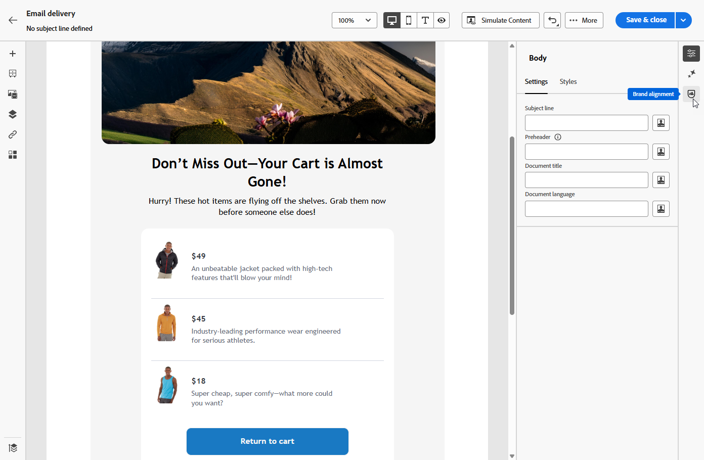
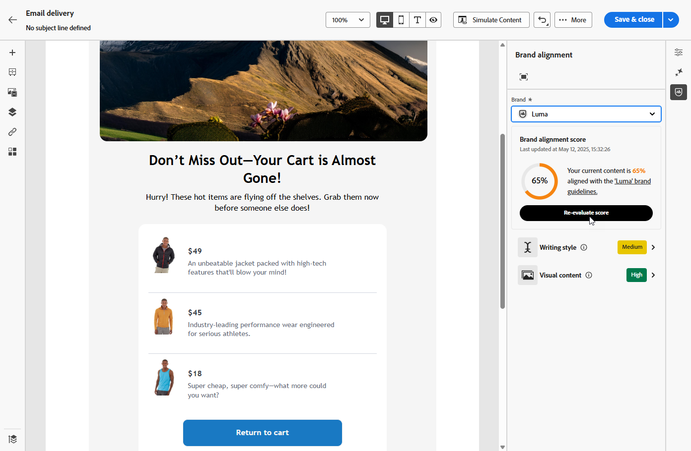

# Uw inhoud evalueren {#brands-score}

>[!AVAILABILITY]
>
>U moet met de [&#x200B; gebruikersovereenkomst &#x200B;](https://www.adobe.com/legal/licenses-terms/adobe-dx-gen-ai-user-guidelines.html){target="_blank"} akkoord gaan alvorens u de Medewerker kunt gebruiken AI. Neem voor meer informatie contact op met uw Adobe-vertegenwoordiger.

De functie van de inhoudsherziening verstrekt uitvoerige evaluatiemiddelen om te meten hoe goed uw campagnes zich aan uw merkrichtlijnen richten en de normen van de inhoudkwaliteit over alle mededelingen handhaven:

* **de Uitlijning van het Merk**: Herzie, en beheer inhoud die aan uw merkrichtlijnen waar blijft. Dit verzekert consistentie in toon, overseinen, en visuele identiteit over uw e-mailcampagnes.
* **Controle van de Kwaliteit**: Valideer uw inhoud alvorens het live gaat om hoge normen en merkintegriteit te handhaven.

## Uw inhoud valideren met uitlijning van het merk {#validate-content}

Zodra [&#x200B; uw merk opstelling en gepubliceerd &#x200B;](brands.md) is, bepaal uw merk groeperingsscore direct binnen uw e-mailcampagne om uw inhoud te verzekeren richt zich op uw merkrichtlijnen:

1. Creeer uw [&#x200B; e-mailcampagne &#x200B;](../email/create-email.md).

1. Open het menu **[!UICONTROL Brand Alignment]** in de e-mailontwerper.

   Uw inhoud wordt automatisch geëvalueerd op basis van uw standaardmerk. [&#x200B; Leer hoe te om een standaardmerk &#x200B;](brands.md) toe te wijzen.

   

1. Als u een ander merk wilt gebruiken, selecteert u het in de vervolgkeuzelijst **[!UICONTROL Brand]** en klikt u op **[!UICONTROL Re-evaluate score]** .

   

1. Doorblader door de **Score van de Groepering van het Merk** (Hoog, Medium, Laag) en overzicht gedetailleerde terugkoppelt.

1. Klik het 

   

1. Selecteer een gemarkeerde hulplijn om specifieke feedback en suggesties weer te geven.

   

1. Bewerk de inhoud op basis van de aanbevelingen om de uitlijning van merken te verbeteren.

1. Controleer de inhoud handmatig opnieuw nadat u wijzigingen hebt aangebracht om de uitlijningsscore te vernieuwen.

## De kwaliteit van uw inhoud valideren {#validate-quality}

>[!NOTE]
>
>De evaluatie van de kwaliteit van de inhoud staat los van de richtlijnen van het merk. Zelfs als een merk is geselecteerd in het keuzemenu, worden de richtlijnen niet toegepast op de kwaliteitscontrole. De merkselectie is alleen van belang voor de merkuitlijningsscoring.

Naast de uitlijning van merken kunt u de algemene kwaliteit van de inhoud beoordelen om mogelijke problemen met leesbaarheid, samenhang van de inhoud en efficiëntie te identificeren, onafhankelijk van uw merkrichtlijnen.

De kwaliteit van uw inhoud evalueren:

1. Creeer uw [&#x200B; e-maillevering &#x200B;](../email/create-email.md).

1. Open het menu **[!UICONTROL Brand Alignment]** in de E-mail-Designer.

   

1. Klik op **[!UICONTROL Evaluate score]** om zowel de uitlijning van het merk als de scores voor de kwaliteit van de inhoud te genereren.

   

1. Navigeer naar het tabblad **[!UICONTROL Overall quality]** om de inzichten en aanbevelingen van de inhoudkwaliteit te bekijken.

   

1. Klik het  pictogram voor een gedetailleerde mening van uw kwaliteitsscore.

   

1. Selecteer een gemarkeerd item om specifieke feedback en activeerbare suggesties voor verbetering weer te geven. Scores zijn gebaseerd op de volgende categorieën:

   * **[!UICONTROL CTA effectiveness]**: evalueert hoe goed je call-to-action lezers motiveert om de gewenste actie te ondernemen.
   * **[!UICONTROL Subject Line]**: beoordeelt de kwaliteit van helderheid, relevantie en aandacht om het openen van e-mail aan te moedigen.
   * **[!UICONTROL Readability]**: geeft aan hoe gemakkelijk en aantrekkelijk uw inhoud is voor lezers.
   * **[!UICONTROL Spam Check]**: Identificeert algemene spamtriggers die invloed kunnen hebben op de leverbaarbaarheid.
   * **[!UICONTROL Content Cohesiveness]**: zorgt ervoor dat uw inhoud vloeiend verloopt en op het onderwerp blijft staan.
   * **[!UICONTROL Proofreading]**: hiermee wordt gecontroleerd op problemen met spelling, grammatica en helderheid.

   

1. Bewerk de inhoud op basis van de aanbevelingen om de leesbaarheid, de samenhang van de inhoud en de algehele kwaliteit te verbeteren.

1. Klik op **[!UICONTROL Re-evaluate score]** nadat u wijzigingen hebt aangebracht om de kwaliteitsscore te vernieuwen.
