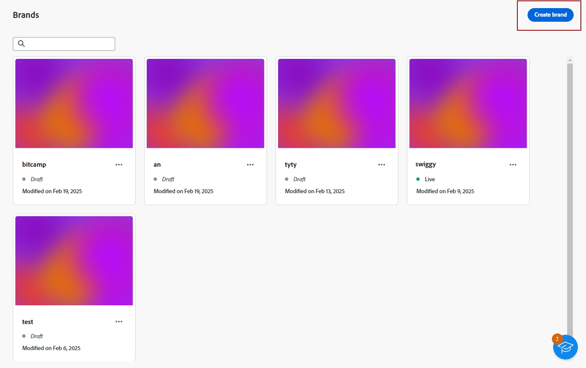
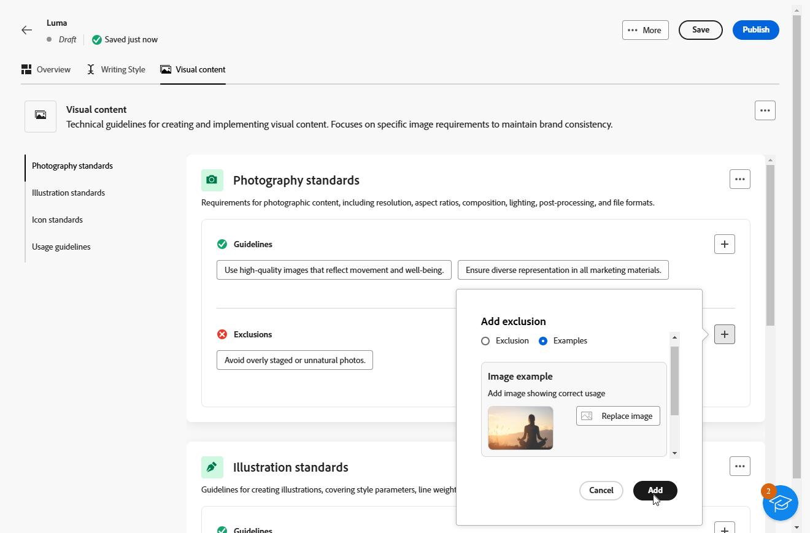

# Uw merken maken en beheren {#brands}

>[!AVAILABILITY]
>
>Dit vermogen wordt vrijgegeven als privé bèta. Het zal geleidelijk beschikbaar worden voor alle klanten in komende versies.

Merkrichtlijnen zijn een uitgebreide reeks regels en normen die de visuele en verbale identiteit van een merk definiëren. Zij dienen als referentie om te zorgen voor een consistente merkweergave op alle marketing- en communicatiekanalen.

In [!DNL Adobe Campaign Web] kunnen gebruikers handmatig merkgegevens invoeren en organiseren of documenten met brandrichtlijnen uploaden voor automatische gegevensextractie.

## Handelsmerken {#generative-access}

Als u het menu **[!UICONTROL Brands]** in [!DNL Adobe Campaign Web] wilt openen, moeten gebruikers de productprofielen **[!UICONTROL Administrator (admin)]** en **[!UICONTROL Brand kit]** krijgen toegewezen om merken te maken en te beheren. Gebruikers hebben het productprofiel [!UICONTROL AI assistant] nodig voor alleen-lezen toegang.

[Meer informatie](https://experienceleague.adobe.com/en/docs/campaign/campaign-v8/admin/permissions/manage-permissions)

+++ Leer hoe u merkgerelateerde machtigingen kunt toewijzen

1. In de [ Admin Console ](https://adminconsole.adobe.com/enterprise) homepage, heb toegang tot uw product van de Campagne.

   

1. Selecteer **[!DNL Product profile]** op basis van het niveau van toestemmingen u uw gebruiker wilt verlenen.

   

1. Klik op **[!DNL Add users]** om het geselecteerde productprofiel toe te wijzen.

    toe

1. Typ de naam, de gebruikersgroep of het e-mailadres van de gebruiker.

1. Klik **sparen** om veranderingen toe te passen.

De rechten van gebruikers die al zijn toegewezen aan deze rol, worden automatisch bijgewerkt.

+++

## Uw merk maken {#create-brand-kit}

Volg onderstaande stappen om uw richtlijnen voor uw merk te maken en te beheren.

Gebruikers kunnen de details handmatig invoeren of een document met brandrichtlijnen uploaden om de informatie automatisch te extraheren:

1. Selecteer **[!UICONTROL Brands]** in het menu **[!UICONTROL Content management]** .

1. Klik in het menu **[!UICONTROL Brands]** op **[!UICONTROL Create brand]** .

   

1. Voer een **[!UICONTROL Name]** in voor uw merk.

1. Sleep of selecteer het bestand om de richtlijnen van uw merk te uploaden en automatisch relevante merkgegevens te extraheren. Klik op **[!UICONTROL Create brand]**.

   Het uitpakken van informatie begint. Het kan enkele minuten duren voordat de bewerking is voltooid.

   

1. De instellingen voor inhoud en visuele ontwerpen worden automatisch ingevuld. Blader door de verschillende tabbladen om de informatie naar wens aan te passen.

1. Van het **[!UICONTROL Writing Style]** lusje, klik  toe om een richtlijn of een uitsluiting, met inbegrip van voorbeelden toe te voegen.

   

1. Van het **[!UICONTROL Visual content]** lusje, klik  toe om een andere richtlijn of uitsluiting toe te voegen.

1. Als u een afbeelding met het juiste gebruik wilt toevoegen, selecteert u **[!UICONTROL Examples]** en klikt u op **[!UICONTROL Select image]** . U kunt ook een afbeelding toevoegen waarin onjuist gebruik wordt getoond als uitsluitingsvoorbeeld.

   

1. Als u deze hebt geconfigureerd, klikt u op **[!UICONTROL Save]** en vervolgens op **[!UICONTROL Publish]** om uw merkenhulplijn beschikbaar te maken in de AI-assistent.

1. Klik op **[!UICONTROL Edit brand]** als u uw gepubliceerde merk wilt wijzigen.

   >[!NOTE]
   >
   >Er wordt dan een tijdelijke kopie gemaakt in de bewerkingsmodus, waarbij de live versie wordt vervangen nadat deze is gepubliceerd.

   

1. Van uw **[!UICONTROL Brands]** dashboard, open het geavanceerde menu door het  te klikken pictogram aan:

   * Merk weergeven
   * Bewerken
   * Dupliceren
   * Publiceren
   * Publiceren ongedaan maken
   * Verwijderen

   

De richtlijnen voor uw merk zijn nu beschikbaar via de vervolgkeuzelijst **[!UICONTROL Brand]** in het menu AI-assistent. Hierdoor kan de AI-assistent inhoud en elementen genereren die zijn uitgelijnd op uw specificaties. [ leer meer op de AI medewerker ](../email/generative-gs.md)

