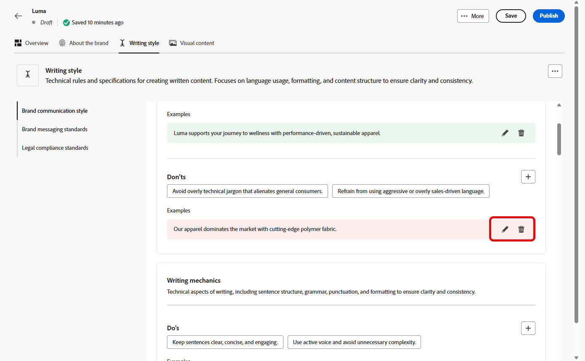

# Uw merken maken en beheren {#brands}

Merkrichtlijnen zijn een uitgebreide reeks regels en normen die de visuele en verbale identiteit van een merk definiëren. Zij dienen als referentie om te zorgen voor een consistente merkweergave op alle marketing- en communicatiekanalen.

In [!DNL Adobe Campaign Web] kunnen gebruikers handmatig merkgegevens invoeren en organiseren of documenten met brandrichtlijnen uploaden voor automatische gegevensextractie.

## Handelsmerken {#generative-access}

Als u het menu **[!UICONTROL Brands]** in [!DNL Adobe Campaign Web] wilt openen, moeten gebruikers de productprofielen **[!UICONTROL Administrator (admin)]** en **[!UICONTROL Brand kit]** krijgen toegewezen om merken te maken en te beheren. Gebruikers hebben het productprofiel [!UICONTROL AI assistant] nodig voor alleen-lezen toegang.

[Meer informatie](https://experienceleague.adobe.com/en/docs/campaign/campaign-v8/admin/permissions/manage-permissions)

+++ Leer hoe u merkgerelateerde machtigingen kunt toewijzen

1. In de [ Admin Console ](https://adminconsole.adobe.com/enterprise) homepage, heb toegang tot uw product van de Campagne.

   

1. Selecteer **[!DNL Product profile]** op basis van het niveau van toestemmingen u uw gebruiker wilt verlenen.

   

1. Klik op **[!DNL Add users]** om het geselecteerde productprofiel toe te wijzen.

    toe

1. Typ de naam, de gebruikersgroep of het e-mailadres van de gebruiker.

1. Klik **sparen** om veranderingen toe te passen.

De rechten van gebruikers die al zijn toegewezen aan deze rol, worden automatisch bijgewerkt.

+++

## Uw merk maken {#create-brand-kit}

Volg onderstaande stappen om uw richtlijnen voor uw merk te maken en te beheren.

Gebruikers kunnen de details handmatig invoeren of een document met brandrichtlijnen uploaden om de informatie automatisch te extraheren:

1. Klik in het menu **[!UICONTROL Brands]** op **[!UICONTROL Create brand]** .

   

1. Voer een **[!UICONTROL Name]** in voor uw merk.

1. Sleep of selecteer het bestand om de richtlijnen van uw merk te uploaden en automatisch relevante merkgegevens te extraheren. Klik op **[!UICONTROL Create brand]**.

   Het uitpakken van informatie begint nu. Het kan enkele minuten duren voordat de bewerking is voltooid.

   

1. Uw standaarden voor het maken van inhoud en visuele weergave worden nu automatisch ingevuld. Blader door de verschillende tabbladen om de informatie naar wens aan te passen. [Meer informatie](#personalize)

1. Vanuit het geavanceerde menu van elke sectie of categorie kunt u automatisch verwijzingen toevoegen om relevante merkgegevens te extraheren.

   Gebruik de opties **[!UICONTROL Clear section]** of **[!UICONTROL Clear category]** om bestaande inhoud te verwijderen.

   

1. Als u de configuratie hebt voltooid, klikt u op **[!UICONTROL Save]** en vervolgens op **[!UICONTROL Publish]** om uw merkenhulplijn beschikbaar te maken in AI Assistant.

1. Klik op **[!UICONTROL Edit brand]** om wijzigingen aan te brengen in uw gepubliceerde merk.

   >[!NOTE]
   >
   >Er wordt dan een tijdelijke kopie gemaakt in de bewerkingsmodus, waarbij de live versie wordt vervangen nadat deze is gepubliceerd.

   

1. Open het geavanceerde menu op het dashboard van **[!UICONTROL Brands]** door op het pictogram  te klikken op:

   * Merk weergeven
   * Bewerken
   * Markeren als standaardmerk
   * Dupliceren
   * Publiceren
   * Publiceren ongedaan maken
   * Verwijderen

   

De richtlijnen voor uw merk zijn nu beschikbaar in het keuzemenu **[!UICONTROL Brand]** in AI Assistant. Zo kan AI Assistant inhoud en elementen genereren die zijn uitgelijnd op uw specificaties. [ Leer meer over Medewerker AI ](../content/generative-gs.md)

### Een standaardmerk instellen {#default-brand}

U kunt een standaardmerk aanwijzen dat automatisch moet worden toegepast bij het genereren van inhoud en het berekenen van uitlijningsscores tijdens het maken van de campagne.

Als u een standaardmerk wilt instellen, gaat u naar het **[!UICONTROL Brands]** -dashboard. Open het geavanceerde menu door op het pictogram  te klikken en **[!UICONTROL Mark as default brand]** te selecteren.

## Uw merk aanpassen {#personalize}

### Informatie over het merk {#about-brand}

Gebruik het tabblad **[!UICONTROL About the brand]** om de belangrijkste identiteit van uw merk vast te stellen: het doel, de persoonlijkheid, de taglijn en andere definiërende kenmerken.

1. Begin door de basisinformatie voor uw merk in te vullen in de categorie **[!UICONTROL Key details]** :

   * **[!UICONTROL Brand Kit Name]**: voer de naam van de merkkit in.

   * **[!UICONTROL When to Use]**: geef scenario&#39;s of contexten op waarop deze merkkit moet worden toegepast.

   * **[!UICONTROL Brand Name]**: voer de officiële naam van het merk in.

   * **[!UICONTROL Brand Description]**: geef een overzicht van wat dit merk vertegenwoordigt.

   * **[!UICONTROL Default Tagline]**: voeg de primaire coderegel toe die aan het merk is gekoppeld.

     

1. Geef in de categorie **[!UICONTROL Guiding principles]** uitleg over de kernrichting en filosofie van uw merk:

   * **[!UICONTROL Mission]**: Geef het doel van uw merk op.

   * **[!UICONTROL Vision]**: beschrijf uw langetermijndoel of gewenste toekomstige staat.

   * **[!UICONTROL Market Positioning]**: leg uit hoe uw merk zich op de markt bevindt.

   

1. Van de **[!UICONTROL Core brand values]** categorie, klik  toevoegen om de kernwaarden van het merk toe te voegen en de details in te vullen:

   * **[!UICONTROL Value]**: geef een naam op voor een kernmerk.

   * **[!UICONTROL Description]**: leg uit wat deze waarde aan uw merk betekent.

   * **[!UICONTROL Behaviors]**: schets de handelingen of houdingen die deze waarde in de praktijk weerspiegelen.

   * **[!UICONTROL Manifestations]**: geef voorbeelden van hoe deze waarde wordt uitgedrukt in echte branding.

     

1. Indien nodig, klik het  pictogram om één van uw waarde van het kernmerk bij te werken of te schrappen.

    uit

U kunt uw merk verder personaliseren of [ uw merk ](#create-brand-kit) publiceren.

### Schrijfstijl {#writing-style}

In de sectie **[!UICONTROL Writing style]** worden de standaarden voor het schrijven van inhoud beschreven, met een gedetailleerde beschrijving van de manier waarop taal, opmaak en structuur moeten worden gebruikt voor het behoud van helderheid, coherentie en consistentie in alle materialen.

+++ Beschikbare categorie en voorbeelden

<table>
  <thead>
    <tr>
      <th>Categorie</th>
      <th>Subcategorie</th>
      <th>Voorbeeld van richtlijnen</th>
      <th>Voorbeeld van uitsluitingen</th>
    </tr>
  </thead>
  <tbody>
    <tr>
      <td rowspan="4">Normen voor het maken van inhoud</td>
      <td>Merk Messaging-standaarden</td>
      <td>Benadruk innovatie en klant-eerste overseinen.</td>
      <td>U mag de productmogelijkheden niet overbelasten.</td>
    </tr>
    <tr>
      <td>Taglinegebruik</td>
      <td>Plaats de tag onder het logo op alle digitale marketingmiddelen.</td>
      <td>Wijzig of vertaal de taglijn niet.</td>
    </tr>
    <tr>
      <td>Core Messaging</td>
      <td>Benadruk de belangrijkste voordeel verklaring-zulke als verbeterde productiviteit.</td>
      <td>Gebruik geen ongerelateerde waardevoorstellen.</td>
    </tr>
    <tr>
      <td>Naamgevingsstandaarden</td>
      <td>Gebruik eenvoudige, beschrijvende namen, zoals "ProScheduler".</td>
      <td>Gebruik geen complexe termen of speciale tekens.</td>
    </tr>
    <tr>
      <td rowspan="5">Merk Communication-stijl</td>
      <td>Merk Persoonlijke kenmerken</td>
      <td>Vriendelijk en toegankelijk.</td>
      <td>Wees geen nederlaag.</td>
    </tr>
    <tr>
      <td>Schrijfmiddelen</td>
      <td>Zorgt dat zinnen kort en ondoeltreffend blijven.</td>
      <td>Gebruik geen overdreven jargon.</td>
    </tr>
    <tr>
      <td>Situatietoon</td>
      <td>Houd een professionele toon in crisiscommunicatie.</td>
      <td>Wees niet afwijzend bij het ondersteunen van communicatie.</td>
    </tr>
    <tr>
      <td>Richtlijnen voor woordkeuze</td>
      <td>Gebruik woorden als "innovatief" en "slim".</td>
      <td>Vermijd woorden als "goedkoop" of "hack".</td>
    </tr>
    <tr>
      <td>Taalstandaarden</td>
      <td>Volg de Amerikaanse conventies in het Engels.</td>
      <td>Vermeng Brits en Amerikaans spelletje niet.</td>
    </tr>
    <tr>
      <td rowspan="3">Normen voor juridische naleving</td>
      <td>Handelsmerkstandaarden</td>
      <td>Gebruik altijd het symbool ™ of ®.</td>
      <td>Laat juridische symbolen niet weg wanneer dat nodig is.</td>
    </tr>
    <tr>
      <td>Copyrightstandaarden</td>
      <td>Inclusief copyrightkennisgevingen over marketingmaterialen.</td>
      <td>Gebruik geen inhoud van derden zonder toestemming.</td>
    </tr>
    <tr>
      <td>Disclaimingstandaarden</td>
      <td>Dislaimers leesbaar weergeven op digitale middelen.</td>
      <td>Verberg disclaimers niet in onzichtbare gebieden.</td>
    </tr>
</table>

+++

 

U past de **[!UICONTROL Writing Style]** als volgt aan:

1. Klik op het tabblad **[!UICONTROL Writing Style]** op  om een hulplijn, uitzondering of uitsluiting toe te voegen.

1. Voer uw richtlijn, uitzondering of uitsluiting in. U kunt ook **[!UICONTROL Examples]** opnemen om beter aan te geven hoe deze toepassing moet worden toegepast.

   

1. Geef de **[!UICONTROL Usage context]** op voor uw hulplijn, uitzondering of uitsluiting:

   * **[!UICONTROL Channel type]**: kies waar deze richtlijn, uitzondering of uitsluiting van toepassing moet zijn. U wilt bijvoorbeeld dat een specifieke schrijfstijl alleen wordt weergegeven in e-mail, mobiel, Afdrukken of andere communicatiekanalen.

   * **[!UICONTROL Element type]**: geef op op op welk inhoudselement de regel van toepassing is. Dit kan elementen bevatten zoals koppen, knoppen, koppelingen of andere componenten in de inhoud.

   

1. Klik op **[!UICONTROL Add]** als uw hulplijn, uitzondering of uitsluiting is ingesteld.
1. Selecteer zo nodig een van de hulplijnen of uitsluitingen die u wilt bijwerken of verwijderen.

1. Klik het  om uw voorbeeld of het  pictogram uit te geven om het te schrappen.

   

U kunt uw merk verder personaliseren of [ uw merk ](#create-brand-kit) publiceren.

### Visuele inhoud {#visual-content}

In de sectie **[!UICONTROL Visual Content]** worden de standaarden voor afbeeldingen en ontwerpen gedefinieerd, waarin de specificaties worden beschreven die nodig zijn om een uniform en consistent merkgebruik te behouden.

+++ Beschikbare categorieën en voorbeelden

<table>
  <thead>
    <tr>
      <th>Categorie</th>
      <th>Voorbeeld van richtlijnen</th>
      <th>Voorbeeld van uitsluitingen</th>
    </tr>
  </thead>
  <tbody>
    <tr>
      <td>Fotostandaarden</td>
      <td>Gebruik natuurlijke belichting voor buitenschoten.</td>
      <td>Vermijd te veel bewerkte of gepixeleerde afbeeldingen.</td>
    </tr>
    <tr>
      <td>Illustratienormen</td>
      <td>Gebruik schone, minimalistische stijlen.</td>
      <td>Vermijd al te complex.</td>
    </tr>
    <tr>
      <td>Pictogramstandaarden</td>
      <td>Gebruik een consistent rastersysteem van 24 px.</td>
      <td>U kunt pictogramafmetingen niet mengen, inconsistente lijndikten gebruiken of van rasterregels afwijken.</td>
    </tr>
    <tr>
      <td>Richtlijnen voor gebruik</td>
      <td>Kies levensstijlafbeeldingen die overeenkomen met echte klanten die het product in professionele omgevingen gebruiken.</td>
      <td>Gebruik geen afbeeldingen die de toon van het merk tegenspreken of die uit de context vallen.</td>
    </tr>
</table>

+++

 

U past de **[!UICONTROL Visual content]** als volgt aan:

1. Klik op het tabblad **[!UICONTROL Visual content]** op  om een hulplijn, uitsluiting of voorbeeld toe te voegen.

1. Voer uw richtlijn, uitsluiting of voorbeeld in.

   

1. Geef de **[!UICONTROL Usage context]** op voor uw hulplijn of uitsluiting:

   * **[!UICONTROL Channel type]**: kies waar deze richtlijn, uitzondering of uitsluiting van toepassing moet zijn. U wilt bijvoorbeeld dat een specifieke schrijfstijl alleen wordt weergegeven in e-mail, mobiel, Afdrukken of andere communicatiekanalen.

   * **[!UICONTROL Element type]**: geef op op op welk inhoudselement de regel van toepassing is. Dit kan elementen bevatten zoals koppen, knoppen, koppelingen of andere componenten in de inhoud.

      toe

1. Klik op **[!UICONTROL Add]** als uw hulplijn, uitzondering of uitsluiting is ingesteld.

1. Als u een afbeelding met het juiste gebruik wilt toevoegen, selecteert u **[!UICONTROL Example]** en klikt u op **[!UICONTROL Select image]** . U kunt ook een afbeelding toevoegen waarin onjuist gebruik wordt getoond als uitsluitingsvoorbeeld.

    toe

1. Selecteer een van de hulplijnen of uitsluitingen die u wilt bijwerken of verwijderen.

1. Selecteer een van uw richtlijnen of uitsluitingen om deze bij te werken. Klik het  pictogram om het te schrappen.

   

U kunt uw merk verder personaliseren of [ uw merk ](#create-brand-kit) publiceren.
