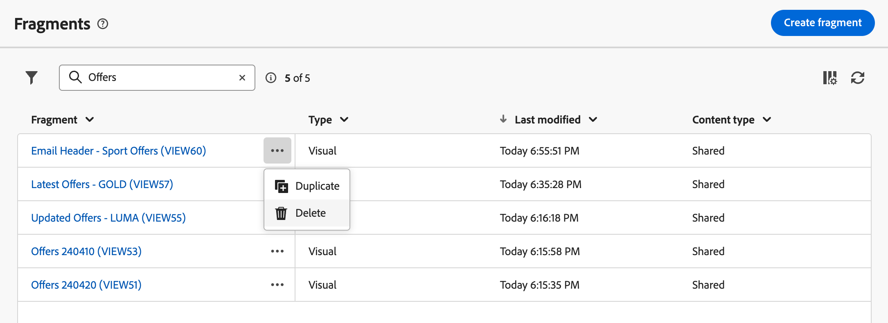

# Inhoudsfragmenten maken {#fragments}

>[!CONTEXTUALHELP]
>id="acw_fragments_create"
>title="Uw eigen inhoudsfragmenten definiëren"
>abstract="Definieer de fragmenteigenschappen en het type fragment dat u wilt maken. U kunt de e-mailontwerper of de uitdrukkingsredacteur dan gebruiken om de inhoud van uw fragment te vormen."

<!-- pas vu dans l'UI-->

>[!CONTEXTUALHELP]
>id="acw_fragments_properties"
>title="Eigenschappen van Fragmenten"
>abstract="Voer het label van het fragment in. Indien nodig kunt u aanvullende opties definiëren, zoals de interne naam van het fragment, de map en een beschrijving."

>[!CONTEXTUALHELP]
>id="acw_fragments_type"
>title="Type inhoudsfragment"
>abstract="Kies het type fragment dat u wilt maken. **Visuele fragmenten** zijn vooraf bepaalde visuele blokken die u over veelvoudige e-mailleveringen of in inhoudsmalplaatjes kunt hergebruiken. **de fragmenten van de Uitdrukking** zijn vooraf bepaalde uitdrukkingen die van een specifieke ingang in de uitdrukkingsredacteur beschikbaar zijn."

U kunt op twee manieren inhoudsfragmenten maken:

* Maak een geheel nieuw fragment met het menu dat u toewijst aan **[!UICONTROL Fragments]** . [ leer hoe ](#create-from-scratch)
* Sla bij het ontwerpen van inhoud een deel van de inhoud op als een fragment. [ leer hoe ](#save-as-fragment)

  >[!NOTE]
  >
  >Deze functie is alleen beschikbaar voor visuele fragmenten. De fragmenten van de uitdrukking worden uitsluitend gecreeerd van het **Fragmenten** menu.

Als het inhoudsfragment eenmaal is opgeslagen, kan het worden gebruikt in elke levering- of inhoudssjabloon.

## Een volledig nieuw inhoudsfragment maken {#create-from-scratch}

Voer de onderstaande stappen uit om een volledig nieuw inhoudsfragment te maken.

1. [ heb toegang tot de fragmentlijst ](#access-manage-fragments) door **[!UICONTROL Content Management]** > **[!UICONTROL Fragments]** linkermenu en selecteer **[!UICONTROL Create fragment]**.

   

1. Voer het label van het fragment in. Definieer zo nodig aanvullende opties, zoals de interne naam van het fragment, de map en een beschrijving.

1. Kies het type van te creëren fragment: **Visueel fragment** of **het fragment van de Uitdrukking**. [ leer de verschillen tussen visuele en uitdrukkingsfragmenten ](fragments.md)

    toont

   >[!AVAILABILITY]
   >
   >Visuele fragmenten moeten worden bijgewerkt naar Campagne v8.6.4. Leer meer in de [ notities van de de consoleversie van de Cliënt van de Campagne v8 ](https://experienceleague.adobe.com/nl/docs/campaign/campaign-v8/releases/release-notes).

1. Klik **creeer** knoop.

   * Voor **visuele fragmenten**, de [ E-mailDesigner ](../email/get-started-email-designer.md) vertoningen. Bewerk de inhoud zoals nodig, de zelfde manier u voor om het even welke e-mail binnen een campagne, dan klik **sparen &amp; sluit** knoop. Afbeeldingen, koppelingen, aanpassingsvelden en dynamische inhoud toevoegen.

     

   * Voor **uitdrukkingsfragmenten**, opent de redacteur van de Uitdrukking. Gebruik zijn verpersoonlijking en auteursmogelijkheden om de inhoud te bouwen, dan klik **bevestigen**. [ Leer hoe te met de uitdrukkingsredacteur ](../personalization/personalize.md) te werken

     

1. Zodra de inhoud klaar is, klik **sparen**.

Het inhoudsfragment is nu klaar om te worden gebruikt wanneer het bouwen van om het even welke levering of [ inhoudsmalplaatje ](../email/use-email-templates.md) binnen Campagne. Leer hoe u visuele fragmenten en expressiefragmenten in deze secties kunt gebruiken:
* [Visuele fragmenten toevoegen aan uw e-mails](use-visual-fragments.md)
* [Expressiefragmenten toevoegen aan de expressie-editor](use-expression-fragments.md)

## Inhoud opslaan als visueel fragment {#save-as-fragment}

>[!CONTEXTUALHELP]
>id="acw_fragments_save"
>title="Opslaan als fragment"
>abstract="Als u inhoud wilt opslaan als een visueel fragment, selecteert u de elementen die u in het fragment wilt opnemen, inclusief personalisatievelden en dynamische inhoud. U kunt alleen aangrenzende secties selecteren. Lege structuren of andere inhoudsfragmenten kunnen niet worden geselecteerd. De inhoud wordt dan een zelfstandig fragment, toegevoegd aan de fragmentlijst en toegankelijk via het speciale menu. Dit fragment kan worden gebruikt bij het maken van een e-mail- of inhoudssjabloon in Campagne."

<!--pas vu dans l'UI-->

Alle e-mailinhoud kan worden opgeslagen als een visueel fragment dat u later opnieuw kunt gebruiken. Wanneer het ontwerpen van a [ inhoudsmalplaatje ](../email/use-email-templates.md) of een [ e-mail ](../email/get-started-email-designer.md) levering, sparen een gedeelte van de inhoud als visueel fragment. Hiervoor voert u de volgende stappen uit:

1. In [ E-mail Designer ](../email/get-started-email-designer.md), klik **Meer** knoop bij het hoogste recht van het scherm.

1. Selecteer **[!UICONTROL Save as fragment]** in de vervolgkeuzelijst.

   

1. Het scherm **[!UICONTROL Save as fragment]** wordt weergegeven. Selecteer de elementen die u in het fragment wilt opnemen, inclusief personalisatievelden en dynamische inhoud.

   >[!CAUTION]
   >
   >U kunt alleen aangrenzende secties selecteren. Lege structuren of andere inhoudsfragmenten kunnen niet worden geselecteerd.

    toont

1. Klik op **[!UICONTROL Create]**. Vul de fragmentnaam in en sla deze op.

   

   Deze inhoud is nu een standalone fragment, dat aan de [ fragmentlijst ](#manage-fragments) wordt toegevoegd, en toegankelijk van het specifieke menu. Gebruik dit fragment wanneer het bouwen van om het even welk [ e-mail ](../email/get-started-email-designer.md) of [ inhoudsmalplaatje ](../email/use-email-templates.md) binnen Campagne. [ leer hoe ](../content/use-visual-fragments.md)

>[!NOTE]
>
>Wijzigingen in het nieuwe fragment worden niet doorgegeven aan de e-mail of sjabloon waaruit het afkomstig is. Op dezelfde manier wordt het nieuwe fragment niet gewijzigd wanneer de oorspronkelijke inhoud wordt bewerkt in de e-mail of sjabloon.

## Beheer uw inhoudsfragmenten {#manage-fragments}

U kunt een inhoudsfragment uit de fragmentlijst bewerken, bijwerken, dupliceren of verwijderen.

### Een inhoudsfragment bewerken en bijwerken {#edit-fragments}

Voer de onderstaande stappen uit om een inhoudsfragment te bewerken.

1. Klik op de naam van het fragment dat u wilt bewerken in de lijst **[!UICONTROL Fragments]** .
1. Klik **uitgeven inhoud** knoop om de inhoud van het fragment te openen.

   

1. Breng de gewenste wijzigingen aan en sla de wijzigingen op.

>[!CAUTION]
>
>Wijzigingen in een fragment worden doorgegeven aan de leveringen of sjablonen met het fragment.

### Een inhoudsfragment verwijderen {#delete-fragments}

Ga als volgt te werk om een inhoudsfragment te verwijderen:

1. Blader naar de fragmentlijst en klik op de knop **[!UICONTROL More actions]** naast het fragment dat u wilt verwijderen.
1. Klik **Schrapping** en bevestig.

   

>[!CAUTION]
>
>Wanneer u een fragment verwijdert, worden de leveringen en sjablonen die dit gebruiken bijgewerkt. Het fragment wordt verwijderd uit de inhoud, maar er wordt nog steeds naar verwezen. Om de fragmentinhoud in die leveringen en malplaatjes te houden, onderbreking erving alvorens het fragment te schrappen, [ zoals die in deze sectie ](use-visual-fragments.md#break-inheritance) wordt gedetaillerd.

### Een inhoudsfragment archiveren {#archive}

U kunt de lijst met fragmenten opruimen door fragmenten te archiveren die niet meer relevant zijn voor uw merk. Klik hiertoe op de knop **[!UICONTROL More actions]** naast het gewenste fragment en selecteer **[!UICONTROL Archive]** . Het fragment wordt verwijderd uit de fragmentlijst en voorkomt dat gebruikers het in toekomstige e-mails of sjablonen gebruiken.

Voor toegang tot gearchiveerde fragmenten gebruikt u het filtervenster om deze weer te geven. Als u het archiveren van een fragment ongedaan wilt maken, klikt u op de knop **[!UICONTROL More actions]** en selecteert u **[!UICONTROL Unarchive]** .

>[!NOTE]
>
>Als u een fragment archiveert dat in een inhoud wordt gebruikt, wordt die inhoud niet beïnvloed.

### Een inhoudsfragment dupliceren {#duplicate-fragments}

U kunt eenvoudig een inhoudsfragment dupliceren om een nieuw fragment te maken. Ga als volgt te werk om een bestaand fragment te dupliceren:

1. Blader naar de fragmentlijst en klik op de knop **[!UICONTROL More actions]** naast het te dupliceren fragment.
1. Klik **Dupliceren** en bevestigen.
1. Voer het label van het nieuwe fragment in en sla de wijzigingen op.

   Het fragment wordt toegevoegd aan de lijst met inhoudsfragmenten. Bewerk het bestand en configureer het zo nodig.