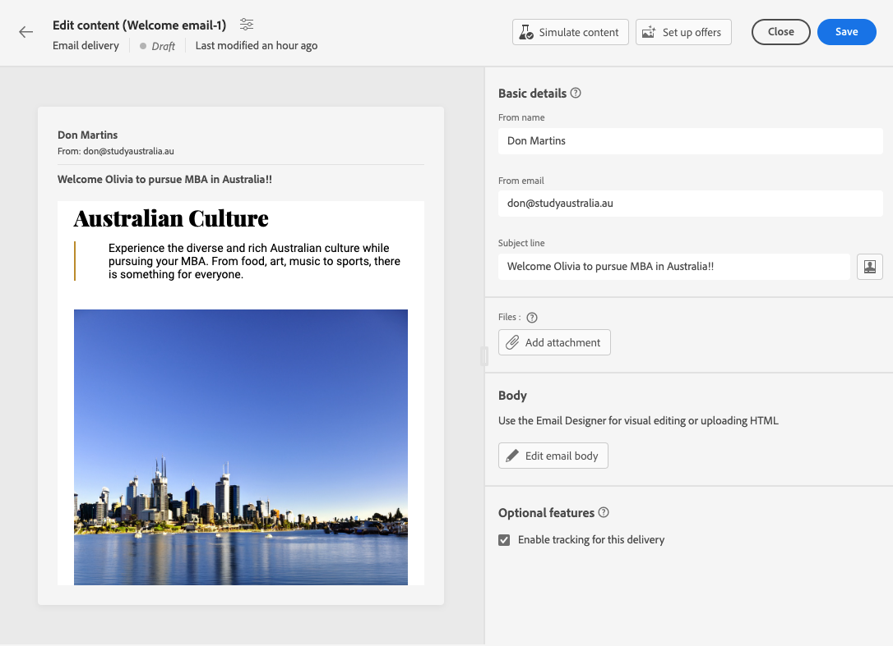

# E-mailinhoud configureren {#edit-content}

>[!CONTEXTUALHELP]
>id="acw_deliveries_email_content"
>title="E-mailinhoud maken"
>abstract="In deze sectie kunt u de inhoud voor uw e-mail maken en de e-mailontwerper gebruiken om deze een gepolijst uiterlijk te geven."

>[!CONTEXTUALHELP]
>id="acw_deliveries_email_header"
>title="E-mailparameters"
>abstract="De waarden voor Van-naam en Van-e-mail worden gedefinieerd in de e-mailsjabloon. De onderwerpregel kan worden gepersonaliseerd gebruikend de Redacteur van de Uitdrukking."

>[!CONTEXTUALHELP]
>id="acw_deliveries_email_attachment"
>title="E-mailbijlage"
>abstract="Selecteer een of meerdere bestanden die u in uw bericht wilt invoegen."

>[!CONTEXTUALHELP]
>id="acw_deliveries_email_options"
>title="Traceeropties"
>abstract="Standaard is het bijhouden van gegevens ingeschakeld voor levering. U kunt deze optie hier uitschakelen."

De e-mail **[!UICONTROL Edit content]** scherm kunt u:
* Definieer basiselementen van uw bericht, zoals het adres van de afzender en de onderwerpregel
* Extra handelingen uitvoeren, zoals bijlagen toevoegen of aanbiedingen instellen
* Toegang krijgen tot [E-mailontwerper](get-started-email-designer.md) om de juiste inhoud van uw e-mail te gaan samenstellen

Volg onderstaande stappen om de inhoud van een e-mail te configureren of te bewerken.

1. Klik op de knop **[!UICONTROL Edit content]** van de knop [dashboard voor e-maillevering](../email/create-email.md) scherm.

   

1. Het e-mailinhoudsopgavescherm wordt geopend. Als u een nieuwe e-mail configureert, **[!UICONTROL From name]** en **[!UICONTROL From email]** velden zijn al ingevuld.

   

1. De **[!UICONTROL From name]** wordt gedefinieerd in de e-mailsjabloon. Als u deze wilt wijzigen, gebruikt u een naam die gemakkelijk kan worden herkend door de ontvangers, zoals de naam van uw merk, om de openingssnelheid van uw leveringen te verhogen.

   >[!NOTE]
   >
   >    Om de ervaring van de ontvanger verder te verbeteren, kunt u de naam van een persoon toevoegen, bijvoorbeeld &quot;Emma van Megastore&quot;.

1. De **[!UICONTROL From email]** Het adresveld wordt ook gedefinieerd in de e-mailsjabloon. Zorg ervoor het adresdomein het zelfde als subdomein is dat u aan Adobe delegeerde.

   >[!NOTE]
   >
   >    U kunt het deel vóór &#39;@&#39; wijzigen, maar niet het domeinadres.

   <!--In the Reply address text fields, the sender's address is used by default for replies. However, Adobe recommends using an existing real address such as your brand's customer care. In this case, if a recipient sends a reply, the customer care will be able to handle it.-->

1. De e-mail definiëren **[!UICONTROL Subject line]**. Typ het onderwerp rechtstreeks in het desbetreffende veld of open de Expressieeditor om personalisatie toe te voegen met behulp van verschillende kenmerken en inhoudsblokken of aanbiedingen. [Leer hoe u inhoud kunt aanpassen](../personalization/personalize.md)

1. Als u een bestand bij de e-mail wilt voegen, klikt u op de knop **[!UICONTROL Add attachment]** Selecteer vervolgens een of meerdere bestanden.

   >[!NOTE]
   >
   >    Om prestatieproblemen te voorkomen, wordt aanbevolen niet meer dan één bijlage per e-mail op te nemen.

   <!--limitation on size + number of files?-->

1. Als u aanbiedingen met uw e-mail wilt verzenden, selecteert u deze met de **[!UICONTROL Set up offers]** knop.

   U kunt ze vervolgens in de e-mail invoegen met behulp van personalisatievelden. [Meer informatie over het verzenden van voorstellen](offers.md)

1. Klik op de knop **[!UICONTROL Edit email body]** om de inhoud van de e-mail te structureren en te ontwerpen met de [E-mailontwerper](#start-authoring). In deze secties vindt u aanvullende informatie over het ontwerpen van e-mailinhoud:

   * [E-mails van auteur helemaal opnieuw](create-email-content.md)
   * [Stijl uw inhoud](get-started-email-style.md)

1. Standaard is het bijhouden van gegevens ingeschakeld voor levering. U kunt deze optie uitschakelen in het dialoogvenster **[!UICONTROL Optional features]** sectie. [Leer hoe u koppelingen kunt toevoegen en bijhouden](message-tracking.md)

1. Als de inhoud van uw e-mail eenmaal is gedefinieerd, gebruikt u de opdracht **[!UICONTROL Simulate content]** om te controleren hoe het toont alvorens het te verzenden. [Leer hoe u uw e-mail kunt bekijken en testen](../preview-test/preview-test.md)

