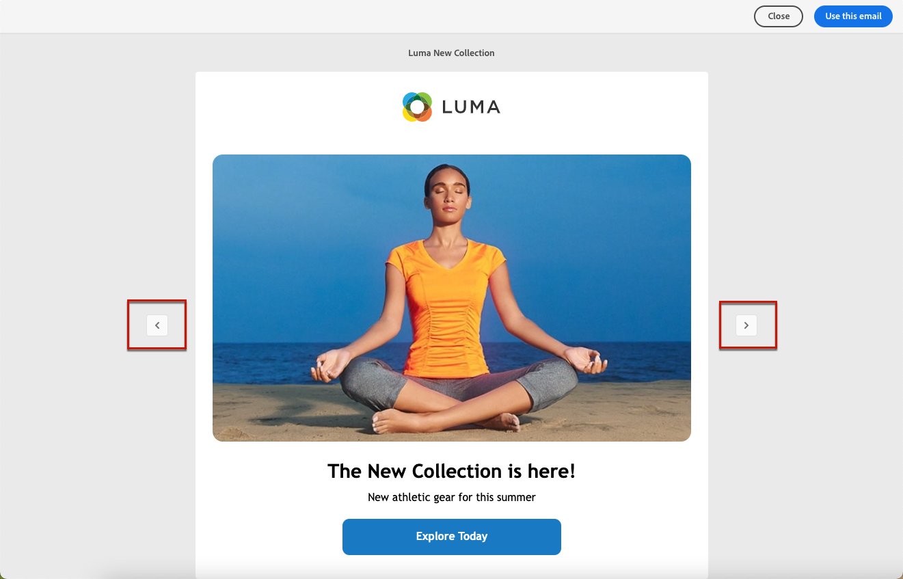

# Werken met sjablonen voor e-mailinhoud {#email-content-templates}

>[!NOTE]
>
>Deze documentatie is in opbouw en wordt regelmatig bijgewerkt. De definitieve versie van deze inhoud zal in Januari 2023 klaar zijn.

Gebruik de **[!UICONTROL Select design template]** om uw inhoud op te bouwen van een sjabloon.

## Opslaan als sjabloon {#save-as-template}

Nadat u de e-mailinhoud hebt ontworpen, kunt u deze opslaan voor toekomstig hergebruik. Volg de onderstaande stappen om dit te doen.

1. Klik op de ellips rechtsboven in het scherm.

1. Selecteren **[!UICONTROL Save design template]** in het keuzemenu.

   

1. Voeg een naam voor deze sjabloon toe.

   

1. Klik op **[!UICONTROL Save]**.

De volgende keer dat u een e-mail maakt, kunt u deze sjabloon gebruiken om uw inhoud samen te stellen. [Meer informatie](#use-saved-template)

## Een opgeslagen sjabloon gebruiken {#use-saved-template}

1. Open de [e-mailontwerper](create-email-content.md).

1. Op de **[!UICONTROL Create your email screen]** de **[!UICONTROL Sample templates]** is standaard geselecteerd. Selecteer het tabblad **[!UICONTROL Saved templates]**. 

   

1. De lijst van alle vorige [opgeslagen sjablonen](#save-as-template) worden weergegeven. U kunt ze sorteren **[!UICONTROL By name]**, **[!UICONTROL Last modified]** en **[!UICONTROL Last created]**.

   

1. Selecteer de gewenste sjabloon in de lijst.

1. Als deze optie is geselecteerd, kunt u met de pijl-rechts en de pijl-links tussen alle opgeslagen sjablonen navigeren.

   

1. Klikken **[!UICONTROL Use this email]** rechtsboven op het scherm.

1. Bewerk de inhoud naar wens met de e-mailontwerper.
