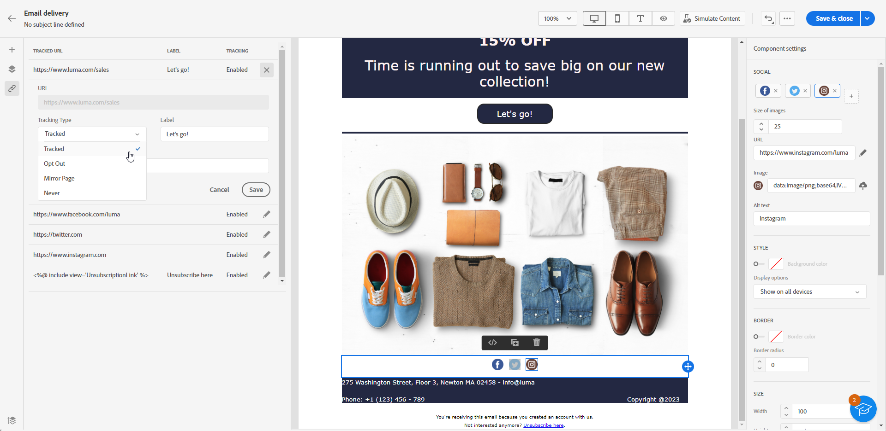

# Koppelingen toevoegen en berichten bijhouden {#tracking}

>[!NOTE]
>
>Deze documentatie is in opbouw en wordt regelmatig bijgewerkt. De definitieve versie van deze inhoud zal in Januari 2023 klaar zijn.

Gebruik de e-mailontwerper om koppelingen naar uw inhoud toe te voegen en de verzonden berichten bij te houden om het gedrag van de ontvangers te controleren.

## Koppelingen invoegen {#insert-links}

Bij het ontwerpen van een bericht kunt u koppelingen naar uw inhoud toevoegen.

>[!NOTE]
>
>Wanneer het volgen wordt toegelaten, worden alle verbindingen inbegrepen in de berichtinhoud gevolgd.

Volg onderstaande stappen om koppelingen in te voegen in uw e-mailinhoud:

1. Selecteer een element en klik op **[!UICONTROL Insert link]** in de contextuele werkbalk.

   

1. Voeg een **[!UICONTROL Label]** en **[!UICONTROL Link]**.

1. Sla uw wijzigingen op.

1. Als de koppeling eenmaal is gemaakt, kunt u deze nog steeds wijzigen in het menu **[!UICONTROL Component settings]** aan de rechterkant.

   * U kunt de koppeling bewerken en de koppeling wijzigen **[!UICONTROL Target]**.
   * U kunt de koppeling onderstrepen of niet door de bijbehorende optie in te schakelen.

   

>[!NOTE]
>
>E-mailberichten van het type Marketing moeten een opt-out-koppeling bevatten, die niet vereist is voor transactiemeldingen. De berichtcategorie (**[!UICONTROL Marketing]** of **[!UICONTROL Transactional]**) wordt gedefinieerd op het niveau van het kanaaloppervlak (d.w.z. de berichtvoorinstelling) en bij het maken van het bericht.

## Koppelen naar een spiegelpagina {#mirror-page}

De spiegelpagina is een HTML-pagina die online toegankelijk is via een webbrowser. De inhoud is identiek aan de inhoud van uw e-mail.

Een koppeling toevoegen aan een spiegel in uw e-mail:

1. Selecteer een element en klik op **[!UICONTROL Insert link]** in de contextuele werkbalk.

   

1. Selecteer **[!UICONTROL Insert link]** pictogram voor toegang tot het verpersoonlijkingsmenu.

   

1. Van de **[!UICONTROL Content block]** menu, selecteert u **[!UICONTROL Mirror page URL]** en klik op **[!UICONTROL Add]**.

   

De spiegelpagina wordt automatisch gemaakt.

>[!IMPORTANT]
>
>Koppelingen naar spiegelpagina&#39;s worden automatisch gegenereerd en kunnen niet worden bewerkt. Ze bevatten alle gecodeerde, gepersonaliseerde gegevens die nodig zijn om de oorspronkelijke e-mail te renderen. Als gevolg hiervan kan het gebruik van gepersonaliseerde kenmerken met grote waarden langdurige spiegel-pagina&#39;s-URL&#39;s genereren, waardoor de koppeling niet kan werken in webbrowsers met een maximale URL-lengte.

Wanneer de e-mail is verzonden en de ontvangers op de koppeling voor de spiegelpagina klikken, wordt de inhoud van de e-mail in hun standaardwebbrowser weergegeven.

>[!NOTE]
>
>In de proefdruk die naar de testprofielen wordt verzonden, is de verbinding aan de spiegelpagina niet actief. Deze wordt alleen geactiveerd in de laatste berichten.

De retentieperiode voor een spiegelpagina is 60 dagen. Na die vertraging is de spiegelpagina niet meer beschikbaar.

## Beheer van bijhouden {#manage-tracking}

De [E-mailontwerper](create-email-content.md) Hiermee kunt u de bijgehouden URL&#39;s beheren, zoals het bewerken van het trackingtype voor elke koppeling.

1. Klik op de knop **[!UICONTROL Links]** in het linkerdeelvenster om de lijst weer te geven met alle URL&#39;s van de inhoud die wordt bijgehouden.

   In deze lijst kunt u een gecentraliseerde weergave gebruiken en elke URL in de e-mailinhoud opzoeken.

1. Als u een koppeling wilt bewerken, klikt u op het bijbehorende potloodpictogram.

   

1. U kunt de **[!UICONTROL Tracking Type]** indien nodig:

   

   Voor elke bijgehouden URL kunt u de modus Tekstspatiëring instellen op een van de volgende waarden:

   * **[!UICONTROL Tracked]**: Hiermee activeert u het bijhouden van wijzigingen op deze URL.
   * **[!UICONTROL Opt out]**: beschouwt deze URL als een opt-out- of niet-abonnements-URL.
   * **[!UICONTROL Mirror page]**: beschouwt deze URL als een URL van een spiegelpagina.
   * **[!UICONTROL Never]**: Hiermee activeert u het bijhouden van deze URL nooit. <!--This information is saved: if the URL appears again in a future message, its tracking is automatically deactivated.-->

1. Voeg een **[!UICONTROL Category]** naar uw koppeling om bijgehouden koppelingen te groeperen en klik op **[!UICONTROL Save]**.

   

1. Na het verzenden van de levering hebt u toegang tot uw leveringsrapport. Onder de **[!UICONTROL Tracking]** in het menu **[!UICONTROL URLs and click streams]** het rapport toont welke URLs van uw levering het meest bezochte is. [Meer informatie](../reporting/reports.md)
