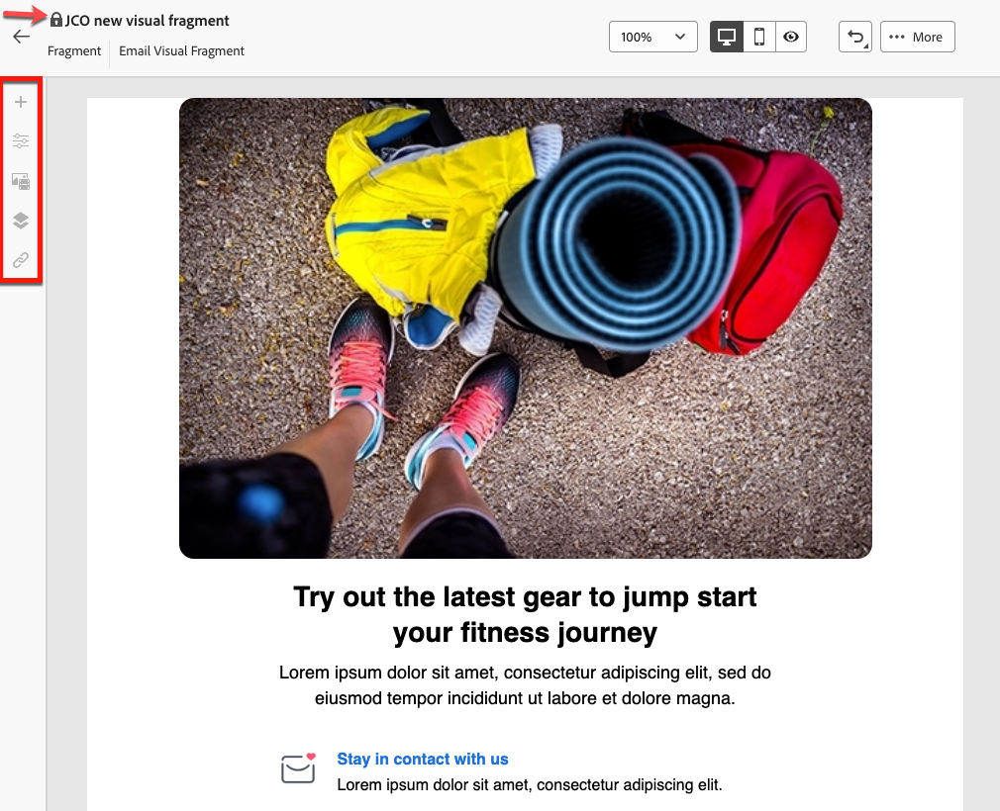

# Visuele fragmenten toevoegen aan uw e-mails {#use-visual-fragments}

>[!AVAILABILITY]
>
>Voor deze functie is een update van Campagne v8.6.4 vereist. Leer meer in de [ notities van de de consoleversie van de Cliënt van de Campagne v8 ](https://experienceleague.adobe.com/en/docs/campaign/campaign-v8/releases/release-notes).

In de het Webinterface van de Campagne, **Visuele fragmenten** zijn vooraf bepaalde visuele blokken die u over veelvoudige [ e-mailleveringen ](../email/get-started-email-designer.md) of in [ inhoudsmalplaatjes ](../content/use-email-templates.md) kunt hergebruiken. Leer hoe te om inhoudsfragmenten in [ tot stand te brengen en te beheren deze sectie ](fragments.md).

## Een visueel fragment gebruiken {#use-fragment}

>[!CONTEXTUALHELP]
>id="acw_fragments_details"
>title="Fragmenten, opties"
>abstract="Dit deelvenster bevat opties voor het geselecteerde fragment. Hiermee kunt u kiezen op welke apparaten het fragment moet worden weergegeven en de inhoud van dit fragment openen. Gebruik het tabblad **[!UICONTROL Styles]** om het fragment verder aan te passen. U kunt de overerving ook verbreken met het originele visuele fragment."

<!-- pas vu dans l'UI-->

Voer de volgende stappen uit om een visueel fragment in te voegen in e-mailinhoud:

1. Open om het even welke e-mail of malplaatjeinhoud gebruikend [ E-mail Designer ](../email/get-started-email-designer.md).

1. Selecteer het pictogram **[!UICONTROL Fragments]** van de linkerspoorstaaf.

   

1. De lijst met alle visuele fragmenten die in de huidige sandbox zijn gemaakt, wordt weergegeven. U kunt:

   * Zoek naar een specifiek fragment door zijn etiket te typen.
   * Sorteer fragmenten in oplopende of aflopende volgorde.
   * De manier wijzigen waarop de fragmenten worden weergegeven (kaarten of lijstweergave).

   >[!NOTE]
   >
   >Fragmenten worden gesorteerd op aanmaakdatum. Onlangs toegevoegde fragmenten worden als eerste in de lijst weergegeven.

   Als de visuele fragmenten worden gewijzigd of toegevoegd terwijl u uw inhoud uitgeeft, klik **verfrissen** pictogram om de lijst met de recentste veranderingen bij te werken.

1. Sleep een visueel fragment uit de lijst naar het gebied waar u het wilt invoegen. Net als bij andere componenten kunt u het fragment in de inhoud verplaatsen.

1. Selecteer het fragment om de opties ervan in het rechterdeelvenster weer te geven.

   

   Via het tabblad **[!UICONTROL Settings]** kunt u:

   * Kies de apparaten waarop het fragment moet worden weergegeven.
   * Klik **uitgeven inhoud** knoop om de inhoud van dit fragment te openen. [Meer informatie](../content/fragments.md#edit-fragments)

     U kunt het fragment verder aanpassen met het tabblad **[!UICONTROL Styles]** .

1. Breek zo nodig de overerving met het oorspronkelijke visuele fragment. [Meer informatie](#break-inheritance)

   U kunt het fragment ook uit de inhoud verwijderen of dupliceren. Voer deze handelingen rechtstreeks uit vanuit het contextmenu dat boven op het fragment wordt weergegeven.

1. Voeg zoveel visuele fragmenten toe als u nodig hebt en **[!UICONTROL Save]** uw wijzigingen.

### Visueel fragment in alleen-lezen modus {#fragment-readonly}

Toegangsrechten kunnen van toepassing zijn op visuele fragmenten.

Als de toestemmingsuitgave niet voor een bepaald visueel fragment wordt verleend, wordt het inhoudsmalplaatje getoond in **read-only wijze**. In dit geval wordt de knop **[!UICONTROL Edit content]** vervangen door de knop **[!UICONTROL View content]** , zodat u het fragment kunt bekijken zonder wijzigingen aan te brengen.

{zoomable="yes"}

Zoals hieronder wordt getoond, worden alle eigenschapspictogrammen gedeactiveerd, die interactie beperken tot het bekijken slechts.

{zoomable="yes"}

## Overerving onderbreken {#break-inheritance}

Wanneer u een visueel fragment bewerkt, worden de wijzigingen gesynchroniseerd en automatisch doorgegeven aan alle e-mailleveringen en inhoudssjablonen die dat fragment bevatten.

Fragmenten worden standaard gesynchroniseerd wanneer ze worden toegevoegd aan een e-mail- of inhoudssjabloon.

U kunt de overerving echter wel verbreken van het oorspronkelijke fragment. In dit geval wordt de inhoud van het fragment naar het huidige ontwerp gekopieerd en worden de wijzigingen niet meer gesynchroniseerd.

Voer de volgende stappen uit om overerving te onderbreken:

1. Selecteer het visuele fragment.

1. Klik op het ontgrendelingspictogram op de contextafhankelijke werkbalk.

   

1. Het fragment wordt een zelfstandig element dat niet meer is gekoppeld aan het oorspronkelijke fragment. Bewerk de inhoud als elke andere inhoudscomponent in de inhoud. [Meer informatie](../email/content-components.md)