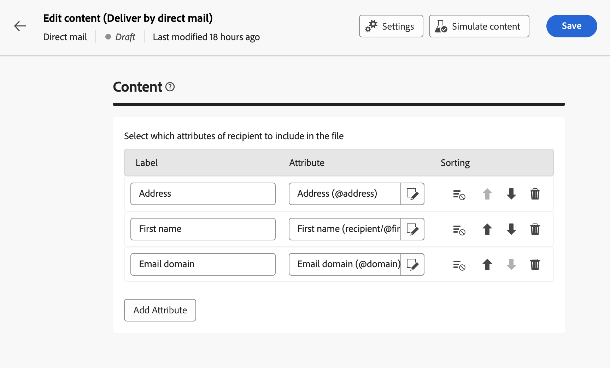

# Het extractiebestand ontwerpen {#design-direct-mail}

>[!CONTEXTUALHELP]
>id="acw_directmail_content"
>title="Inhoud uitpakken"
>abstract="Klik op de knop **Inhoud bewerken** om het extractiebestand te ontwerpen dat uw directe-mailprovider nodig heeft. Op deze manier kunt u de bestandseigenschappen definiëren, zoals het label en de indeling, en de kolommen opgeven die u in het bestand wilt opnemen."

>[!CONTEXTUALHELP]
>id="acw_directmail_properties_file"
>title="Bestandseigenschappen"
>abstract="Configureer de eigenschappen van het extractiebestand, zoals de naam en indeling. U kunt de bestandsnaam personaliseren met kenmerken uit de database met behulp van de expressie-editor."

>[!CONTEXTUALHELP]
>id="acw_directmail_properties_content"
>title="Inhoud"
>abstract="Geef in deze sectie de kolommen op die u wilt weergeven in het extractiebestand. Als u klaar bent, kunt u een voorvertoning van het extractiebestand weergeven met de opdracht **Inhoud simuleren** knop."

Als u de inhoud wilt ontwerpen van het extractiebestand dat is gegenereerd door uw directe e-maillevering, klikt u op de knop **[!UICONTROL Edit content]** vanaf uw leveringspagina en configureer vervolgens de bestandseigenschappen en -inhoud.

## De eigenschappen van het extractiebestand configureren {#properties}

1. In de **[!UICONTROL File name]** geeft u de gewenste naam voor het extractiebestand op. U kunt de bestandsnaam aanpassen met kenmerken uit de database. Om dit te doen, klik **[!UICONTROL Open personalization dialog]** pictogram om de uitdrukkingsredacteur te openen. [Leer hoe u uw inhoud kunt aanpassen](../personalization/personalize.md)

1. In de **[!UICONTROL File format]** in het veld de gewenste indeling voor het extractiebestand kiezen; **Tekst**, **Tekst met vaste waarden met kolommen**, **CSV (Excel)** of **XML**.

1. Breid uit **[!UICONTROL Extraction format]** voor toegang tot specifieke opties met betrekking tot de indeling van het extractiebestand. Welke waarden beschikbaar zijn, is afhankelijk van de geselecteerde indeling.

+++ Beschikbare opties voor de indeling voor uitnemen

   * **[!UICONTROL Use first line as column header]** (Text / CSV (Excel)): Schakel deze optie in als u de eerste kolom als koptekst wilt gebruiken.
   * **[!UICONTROL Column separator]** (Tekstopmaak): geef het teken op dat u als kolomscheidingsteken wilt gebruiken in het extractiebestand.
   * **[!UICONTROL String delimiter]** (Tekstopmaak): geef op hoe tekenreeksen in het extractiebestand moeten worden gescheiden.
   * **[!UICONTROL End of line]** (Tekstopmaak): geef op hoe het einde van regels in het extractiebestand moet worden afgebakend.
   * **[!UICONTROL Encoding]**: Kies de codering van het extractiebestand.
   * **[!UICONTROL Date format and separators]**: Geef op hoe datums moeten worden opgemaakt in het extractiebestand.
   * **[!UICONTROL Number format]**: Geef op hoe getallen moeten worden opgemaakt in het extractiebestand.
   * **[!UICONTROL Export labels instead of internal values of enumerations]**: Schakel deze optie in als u opsommingswaarden exporteert en u de kolomlabels wilt ophalen. Deze zijn eenvoudiger te begrijpen en geen interne id&#39;s.

+++

1. In-/uitschakelen **[!UICONTROL Requested quantity]** om het aantal ontvangers voor uw levering te beperken.

   {zoomable="yes"}

## Kolommen van het extractiebestand configureren {#content}

In de **[!UICONTROL Content]** in, geeft u de kolommen op die u wilt weergeven in het extractiebestand. Ga als volgt te werk om dit te doen:

1. Klik op de knop **[!UICONTROL Add Attribute]** om een nieuwe kolom te maken.
1. Kies het kenmerk dat u in de kolom wilt weergeven en bevestig het vervolgens. U kunt de expressieeditor gebruiken om het te gebruiken kenmerk te selecteren door op de knop **[!UICONTROL Edit expression]** knop.

   

1. Nadat de kolom is toegevoegd, kunt u het label wijzigen en het bijbehorende kenmerk wijzigen met het bewerkingspictogram.
1. Herhaal deze stappen om zoveel kolommen toe te voegen als u nodig hebt voor het extractiebestand.
1. Als u het extractiebestand wilt sorteren met een van de kolommen, klikt u op het pictogram in het dialoogvenster **[!UICONTROL Sorting]** en selecteert u de gewenste sorteermethode.
1. Gebruik de pijlen omhoog en omlaag om de positie van een kolom te wijzigen.

U kunt nu een voorbeeld van het extractiebestand bekijken en de levering verzenden om het extractiebestand te genereren. [Leer hoe u e-mailberichten test en verzendt](send-direct-mail.md)
